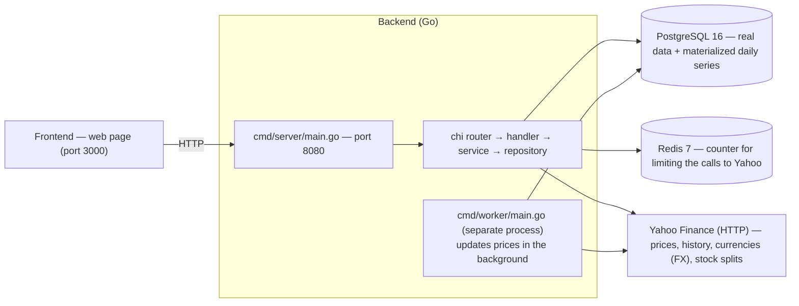

# VaultLab — The backend explained

> This document explains how the VaultLab backend works: the program that
> manages financial data and makes it available to the website.
> No programming knowledge is required: server, database and language concepts
> are explained as we go. If you have never opened a code file, read chapter 2
> ("Basic concepts") and chapter 18 ("Reading Go code") first, then the rest
> will be clear.

---

## 1. What VaultLab does

VaultLab is an application for keeping track of investments: you record what
you buy and what you sell, and the app shows you what your securities are
worth, how much you have gained or lost, and how your portfolio has performed
over time.

To work, it needs two "worlds" that cooperate:

- The **frontend**: the web page you see in the browser (charts, forms,
  buttons).
- The **backend**: the program "behind the scenes" that reads and writes the
  data, performs the financial calculations and answers the frontend's
  requests.

This document is about the backend.

---

## 2. Basic concepts

Before going into details, a small glossary. If you already know these
concepts, feel free to skip this chapter.

- **Server / process**: a running program that waits for requests. The backend
  is a Go program compiled into an executable file.
- **API / endpoint**: a "phone number" that the backend exposes. The frontend
  calls an endpoint (e.g. `POST /auth/login`) and receives a response. In
  jargon we talk about *request* and *response*.
- **HTTP**: the "language" in which the frontend and the backend talk. The
  main verbs are `GET` (ask for data), `POST` (create something),
  `PATCH` (modify), `DELETE` (delete).
- **JSON**: the text format in which data travels inside a request. It is made
  of "name: value" pairs inside curly braces, for example
  `{"email": "mario@example.com", "name": "Mario"}`. You can read it like a
  filled-in form.
- **Database**: a program that stores data in an orderly way on disk. VaultLab
  uses **PostgreSQL**.
- **Table**: inside the database, data is organized into tables (like
  spreadsheets) with rows and columns. The `users` table, for example,
  contains one row per user.
- **SQL**: the language used to query the database
  (`SELECT ... FROM ... WHERE ...`).
- **Primary key (PRIMARY KEY)**: the column that uniquely identifies each row
  (like a personal ID number).
- **Foreign key (FOREIGN KEY)**: a column that "points" to another table to
  link rows together (e.g. a transaction points to the portfolio it belongs
  to).
- **Migration**: a versioned SQL file that builds or changes the database
  schema. Migrations are applied in order.
- **Cache**: a copy of data that has already been computed or downloaded, kept
  aside to avoid repeating the same work.
- **Rate limit / throttle**: limiting the number of calls made to an external
  service in a unit of time, so you don't get blocked.
- **Container**: an isolated environment in which a program runs together with
  everything it needs. VaultLab uses Docker.
- **Redis**: an in-memory database (very fast) that here works as a "shared
  counter" to keep Yahoo calls under control.

An analogy to tie it all together: the **backend is the kitchen of a
restaurant**. The frontend (the waiter) brings the order (the HTTP request),
the kitchen prepares the dish (reads the data and does the calculations) and
delivers it (the JSON response). The database is the pantry with the raw
ingredients.

---

## 3. Big picture



The pieces that run (defined in `docker-compose.yml`):

- **postgres** — the actual database: users, portfolios, transactions, prices,
  exchange rates, daily series.
- **redis** — an in-memory store used as a shared counter to avoid exceeding
  the allowed number of calls to Yahoo.
- **backend** — the REST API that talks to the frontend.
- **worker** — a separate process that updates prices in the background.
- **python-service** — a small FastAPI service (`python-service/`) that fetches
  ETF metadata (countries/regions and GICS sectors) and resolves ISINs from
  tickers. Resolution is **market-aware**: tickers with a recognized exchange
  suffix (e.g. `XMME.MI`) resolve via Morningstar on that specific market
  (ISIN can differ by listing), while bare tickers use JustETF. The Go backend
  calls it through `VAULT_PYTHON_SERVICE_URL`.
- **frontend** — the web page.

The backend is **a single Go program** that, depending on the argument passed
when it is started, does two different things (`cmd/server/main.go`):

- `server migrate` — applies the SQL migrations (builds the tables) and then
  terminates;
- `server` — starts the HTTP API and keeps listening.

Inside the container the command is
`sleep 3 && /server migrate && /server` (`docker-compose.yml`), so migrations
always run before the API starts.

---

## 4. How the backend starts

The server startup sequence is:

1. **Configuration** — `config.Load()` reads the environment variables (with a
   default value if they are missing). Environment variables are configuration
   values passed to the program at startup (for example the database address),
   without having to write them in the code.
2. **Database connection** — `pgxpool.New(ctx, cfg.DSN())`. `pgxpool` is a
   **connection pool**: it keeps a few database connections ready, you take
   one when needed and give it back, so a connection is not opened from
   scratch for every request.
3. **Redis** — it tries to connect to Redis to activate the global counter of
   Yahoo calls. If Redis does not respond, the server uses a "fake" counter
   that never blocks and **keeps working anyway**.
4. **HTTP router** — the list of endpoints is prepared (the restaurant "menu")
   and common behaviors are added to all requests: logging, error recovery,
   an ID to trace every request, a 30-second timeout and CORS handling (the
   rules that allow the frontend to call the API).
5. **Routes** — the endpoints are connected to the functions that handle
   them. Some endpoints are public (`/auth/*`), the others require
   authentication (see the chapter on authentication).
6. **Series backfill** — after startup, a goroutine (a "thread" of execution
   that works in parallel with the rest of the program, so the API can answer
   requests while the calculation continues) rebuilds the daily series of all
   portfolios (chapter 9).

On shutdown the server waits for the `SIGINT`/`SIGTERM` signal and then
closes connections gracefully, without interrupting requests halfway through.

---

## 5. Layered architecture

The backend code is divided into **four layers**, each with a precise job.
The golden rule is that each layer can only use the one below it, never the
one above.

```
HTTP (router)
   │  JSON requests and responses
   ▼
handler   →  receives the HTTP request, understands what the frontend wants
   │           and sends the response. Never touches the database.
   ▼
service   →  business logic: login, average cost calculation,
   │           currency conversion, orchestrating the steps
   ▼
repository →  talks to PostgreSQL with plain, parameterized SQL
```

- **handler** (`internal/handler/`) — the "front door". It knows about HTTP
  requests but nothing about SQL.
- **service** (`internal/service/service.go`) — the "brain". It does the
  calculations and coordinates. It knows nothing about HTTP.
- **repository** (`internal/repository/`) — the "storekeeper". It writes the
  SQL queries and converts database rows into Go objects.

The three layers are **wired by hand** (manual dependency injection): first
the repositories are created, then the services (which receive the
repositories), then the handlers (which receive the services). No magic or
injection frameworks:

```go
repos := repository.New(dbPool)                                   // data layer
fetcher := price.NewYahooFetcher(repos, cfg.PriceFetchInterval,
    price.WithMinInterval(cfg.YahooMinInterval),                  // 400ms queue
    price.WithRateBudget(budget),                                 // Redis counter
)                                                                 // Yahoo client
svc := service.New(repos, jwtAuth, fetcher, cfg.LookupCacheTTL)   // logic
h := handler.New(svc, jwtAuth)                                    // HTTP
```

---

## 6. The database

The migrations (`backend/migrations/`, files numbered from `000001` to
`000016`) build the schema. The main tables:

| Table | Contains | Explanation |
|---|---|---|
| `users` | the users | email, name, password hash, role |
| `assets` | the securities | ticker, name, type (stock, ETF, crypto...), investment class, price source, currency, exchange, sector, industry |
| `portfolios` | the portfolios | a portfolio belongs to a user and has a currency |
| `portfolio_shares` | the sharing | who else can see a portfolio (and with what role) |
| `transactions` | the operations | buy/sell/dividend/split/fee, quantity, price, date |
| `prices` | the daily prices | for each security and each day: open, close, volume |
| `fx_rates` | the exchange rates | how much 1 dollar is worth in every other currency |
| `splits` | the stock splits | e.g. a stock goes from 1 share to 4 shares |
| `asset_region_weights` | the geographic exposure | for each security, the weight of each macro-region |
| `asset_country_weights` | the per-country exposure | for each security, the weight of each ISO-3166 country (from B.13) |
| `asset_sector_weights` | the sector exposure | for each security, the weight of each GICS sector |
| `supported_currencies` | the list of currencies | which currencies can be used (chapter 11) |
| `lookup_cache` | the ticker-search cache | results already downloaded from Yahoo for autocomplete |
| `portfolio_series` | per-portfolio series | portfolio value and cost for each day |
| `asset_series` | per-security series | value and cost of each security for each day |
| `health_events` | the price-health events | records of stale/failed price updates on the health page |

Two fundamental ideas about the database:

1. **Rows are linked together.** A transaction has a foreign key to the
   portfolio and one to the security. So, given a portfolio, you can find all
   of its transactions.
2. **Primary keys are UUIDs.** A UUID is a long random identifier (e.g.
   `a3f2...`). Unlike sequential numbers, a UUID can be generated without
   asking the database, which makes working in parallel easier.

---

## 7. A typical request: the dashboard

Let's take `GET /api/v1/dashboard`, the richest endpoint: it serves the main
page by showing all portfolios, securities, gains and the historical series.

What happens, step by step:

1. **Router**: the request arrives and is routed to the `GetDashboard`
   function.
2. **JWT middleware**: the user's token (chapter 14) is checked and the
   user's data is placed "in the context" of the request.
3. **Handler**: extracts the user's data, calls the service, and sends the
   JSON response.
4. **Service `GetDashboard`**: orchestration — it loads the user's portfolios,
   the detailed holdings (with the average cost, chapter 8), the exchange
   rates for the currencies involved, and the daily series saved in the
   database.
5. **Repository**: runs the SQL queries, for example the query that loads the
   portfolios with a `LEFT JOIN` on the sharing table (so it is already ready
   for future sharing support).

The typical Go pattern for reading multiple rows is:

```go
for rows.Next() {
    rows.Scan(&x, &y)   // reads one row and puts it into variables
}
```

The program goes through the rows one at a time (`for rows.Next()`) and copies
them into variables (`Scan`). Go requires you to **map every column by hand**
into a variable, with no magic shortcuts: for each row, you explicitly decide
which value goes into which variable.

---

## 8. AVCO — average cost

AVCO (Average Cost) is the **logic used to calculate how much a security
position is worth**, just like your broker does. It is the financial heart of
the application, in `internal/position/position.go`.

Imagine buying 10 shares at 100 € and then another 10 at 120 €. How much did
you spend in total? 2,200 €. Your **average cost** is
2,200 / 20 = 110 € per share. AVCO keeps track of this number as operations
happen.

### The `State`

For each security, the engine keeps a "state" of the position:

```go
type State struct {
    Qty      decimal.Decimal  // number of shares you own
    Avg      decimal.Decimal  // average cost
    Cost     decimal.Decimal  // total invested
    Realized decimal.Decimal  // realized gain/loss
}
```

> What is a `struct`? In Go a `struct` is a container that groups several
> named values together: it is like a "card" with several fields. Here the
> "position state" card has four fields: quantity, average cost, total cost
> and realized gain/loss. `decimal.Decimal` is the type of the numbers
> (precise decimal numbers, suitable for money, with no rounding errors).

The idea is simple: operations don't modify data randomly, they update the
card in an orderly way, operation after operation.

### `Apply` — how the state changes with each operation

- **Buy**: add `quantity × price + fees` to the cost, then recompute the
  average cost: `Avg = Cost / newQuantity`.
- **Sell**: the cost of the sold part is `Avg × quantity`. You subtract it
  from the total cost; the difference between that and the proceeds becomes
  `Realized` (the gain or loss already "banked").
- **Split**: the quantity is multiplied by the ratio (e.g. 1 becomes 4), but
  the average cost is **divided** by the same ratio: the total cost does not
  change.
- **Fee**: added to the cost.
- **Dividend**: added to `Realized`.

### `Walk`

`Walk` takes all transactions, groups them by portfolio and by security,
sorts them by date and **injects the splits** into the timeline. A split is a
fact about the security, so it applies to every portfolio that holds that
security.

---

## 9. Materialized daily series

To draw the charts, each portfolio needs a value for every day from the first
operation to today. This series is not recomputed on every request: it is
**saved (materialized)** in the database in the `portfolio_series` and
`asset_series` tables (`internal/series/series.go`).

The calculation logic for a single day is:

```go
for i, d := range dates {
    // apply the transactions that happened up to date d
    // apply the splits that happened up to date d
    // take the last available price ≤ d
    mv := st.Qty.Mul(priceByAsset[aid][priceDates[pricePos-1]]).Mul(rawFactor).Mul(factor)
    agg[i].MarketValue = mv   // added to the portfolio total
}
```

Two details in the market value calculation:

- `rawFactor` — Yahoo historical prices are **adjusted for splits**, and this
  factor brings them back to current reality;
- `factor` — the conversion from the security's currency to the portfolio's.

When the series is recomputed:

- on every change to transactions or the portfolio (`AddTransaction`,
  `UpdateTransaction`, `DeleteTransaction`, `UpdatePortfolio`, import);
- after every price update (both from the worker and from a manual request);
- at server startup (the backfill mentioned in chapter 4).

The rebuild is driven by `Recompute(portfolioID)` (one portfolio) or
`RecomputeAll` (all of them). Reading the charts then becomes a simple read
from the database, without redoing all the calculations every time a page is
opened.

---

## 10. Currencies and exchange rates (FX)

Portfolios and securities can be in different currencies. To add or compare
values, you need to convert.

1. The backend downloads from Yahoo the **exchange rates from the dollar (USD)
   to the other currencies** (e.g. `USDCHF=X` for the franc) and saves them in
   the `fx_rates` table.
2. At calculation time, `series.LoadRates` loads the rates of the currencies
   that appear in the holdings.
3. To convert from currency A to currency B, `series.FxFactor` uses the
   **double step through the dollar**: `(USD→B) / (USD→A)`.

> There is no need for a table with every possible pair: one row per currency
> (the rate against the dollar) is enough, and the rest is computed.

If a rate is missing, the conversion is not available and the application
signals it (the model shows the `fx_missing` field).

---

## 11. The list of supported currencies

Not every currency in the world can be managed. The application keeps a
**whitelist** (an allowed list) in the `supported_currencies` table, which
already contains two base currencies: USD and EUR.

Currencies can be added and removed from `/settings/currencies`
(GET = list, POST = add, DELETE = remove):

- **Adding** a currency: first it checks that Yahoo knows the conversion
  USD → that currency. If it does not, the currency cannot be managed and the
  request is rejected.
- **Removing** a currency: you cannot remove the dollar (it is the basis of
  everything) nor a currency that is still used by some security or
  portfolio.

---

## 12. Prices and the connection to Yahoo

The `internal/price/` package is in charge of talking to **Yahoo Finance** to
fetch prices, history, exchange rates, splits and security search results.

### The Yahoo client (`YahooFetcher`)

It has an HTTP client with a 15-second timeout, two "cooldown maps" per
security (history and splits) and a **`sync.Mutex`** protecting those maps.

> What is a `Mutex`? If several parts of the program (the goroutines) work in
> parallel and share the same "maps" (the lists of what has already been
> updated), they could write at the same moment and corrupt the data. The
> `Mutex` (from "mutual exclusion") ensures that only one goroutine can access
> the maps at a time: it is like a door with a single key. Other programs
> often call it a "lock".

### Smart refresh (`RefreshStale`)

To avoid calling Yahoo unnecessarily, before updating a price it checks three
criteria:

1. there has never been a price → download;
2. the last update is very recent → skip (throttle);
3. the last closing price is already the one of the expected business day →
   skip.

Only assets with `price_source = 'yahoo'` (or empty, for safety) are ever
sent to Yahoo; assets with `price_source = 'manual'` or `'none'` are
skipped entirely and never reported as stale.

When updates are needed, current quotes and exchange rates are fetched **in
batch** using Yahoo's `spark` endpoint: a single call for groups of 50
securities. Securities missing from the response are requested one by one.

### Keeping the calls under control

Yahoo limits the number of calls it accepts. Every Yahoo call therefore passes
through two "brakes":

1. a **FIFO queue** (first in, first out) that guarantees a **minimum
   interval** between one call and the next (default 400ms, configurable with
   `VAULT_YAHOO_MIN_INTERVAL`);
2. a **shared global counter** (`RateBudget`), implemented in Redis: a cap of
   requests per time window (default 8 requests per second, configurable with
   `VAULT_YAHOO_GLOBAL_RATE` and `VAULT_YAHOO_GLOBAL_WINDOW`). The counter is
   shared between the server and the worker, so the two processes together do
   not exceed the limit.

If Redis is unreachable, the counter is disabled and the app proceeds anyway
(it takes more risk, but it does not get stuck).

### Reporting problems

When the user asks for a price update (`POST /prices/refresh`), the response
is not just the list of updated securities: it is a **report** with:

- `refreshed` — the securities updated successfully;
- `issues` — the problems, each with a stable code:
  `rate_limited` (Yahoo refused because of too many calls), `http_<status>`
  (a specific HTTP error) or `error`;
- `rate_limited` — a quick summary: "was there a rate limit block?".

The frontend uses this report to show a non-blocking warning if some update
failed.

### History and splits

- **History (`EnsureHistory`)**: brings the prices back from the first
  operation to today, resuming from where it stopped (downloads everything if
  missing, otherwise only from the last available date). The save is
  idempotent per date: rewriting the same day does not create duplicates.
- **Full history (`HistoryAsset.Full`)**: when an asset has never been
  backfilled (`assets.history_backfilled = FALSE`), the first sync downloads
  the **complete** price history from Yahoo (from 1970) in one pass, then
  flips the flag to `TRUE`. From then on, the sync is incremental. The asset
  detail page exposes this as **"Backfill storico completo"**
  (`POST /assets/{id}/backfill-history`): it forces a full re-download and
  invalidates the cached prices.
- **Splits (`EnsureSplits`)**: downloads the split events from Yahoo and saves
  them (also idempotently on `asset_id, date`).

### Asset profile and exposure

For the asset detail page the backend also talks to Yahoo's `quoteSummary`
endpoint (which requires a short-lived **crumb** + session cookie handshake,
see `meta.go`):

- **Profile (`FetchAssetProfile`)**: the `assetProfile` module gives the GICS
  `sector` and `industry` of a single stock.
- **Sector exposure (`FetchAssetExposure`)**: for an ETF, the `topHoldings`
  module exposes `sectorWeightings` (a fraction per sector key), which the
  backend converts to our canonical 11 GICS sectors (percentage).
- **ETF exposure via JustETF (`FetchETFExposure`)**: since B.5, the backend can
  fetch the **complete** country/region and sector exposure of an ETF from the
  `python-service` microservice (`POST /assets/{id}/fetch-etf-exposure`). The
  python service reads JustETF (full tables via its "Show more" AJAX), and the
  Go `geo` package maps each country to a macro-region and normalizes sectors
  to the GICS set. If the asset has no ISIN, it is **resolved automatically
  from the ticker** (the `.MI/.DE/.L...` suffix is stripped, results are ranked
  by name similarity against the asset) and persisted on the asset. Since B.13
  the raw countries are **kept**: the backend stores them (normalized to
  ISO-3166 alpha-2 codes) in the `asset_country_weights` table, and the
  exposure response carries three dimensions — `countries`, `regions` and
  `sectors`.
- **ETF exposure via Morningstar (`FetchMorningstarExposure`)**: since B.14, a
  second source is available: `POST /assets/{id}/fetch-morningstar-exposure`
  (ETF-only; when the ISIN is missing it is auto-resolved via Morningstar on the
  ticker's market). The python-service
  endpoint `GET /api/v1/etf/{isin}/morningstar-exposure` uses a **custom
  resolver** (`app/morningstar.py`, no mstarpy): the `global.morningstar.com`
  SAL endpoints mstarpy targets are blocked (403), so the resolver runs a
  **headless Chromium bootstrap** (container packages `chromium` + `chromium-driver`
  + `xvfb` via apt) to clear the AWS WAF challenge on `www.morningstar.com` and
  obtain the **Bearer JWT** from `/api/v2/stores/maas/token` (~1h cache); the
  data calls then go through `requests` with bearer+cookies to
  `www.us-api.morningstar.com/sal/sal-service/etf/...` (sectors
  `portfolio/v2/sector/{sid}/data`, countries
  `portfolio/regionalSectorIncludeCountries/{sid}/data`, official **regions**
  `portfolio/regionalSector/{sid}/data`, ISIN→securityId via
  `www.morningstar.com/api/v2/search?q={isin}`). Country weights are kept as
  reported: Morningstar returns the full country list (51 entries, many zero; the 10×6
  paging is only client-side UI), with a residual share not exposed as a
  country, so the weights sum to ~95% (no forced scaling to 100).
  The Morningstar region keys (`northAmerica`, `unitedKingdom`, `japan`,
  `australasia`, ...) are mapped 1:1 onto the canonical VaultLab taxonomy and
  returned as the `regions` dimension. The backend saves countries, sectors and
  the official regions when present; otherwise (or for JustETF) regions are
  re-derived from the countries server-side via `price.AggregateRegions` and
  the residual (100 − country sum) lands in the `Other / Not Classified` region,
  so regions always sum to 100. Since the taxonomy alignment, the canonical
  regions are **10 + `Other`**: North America, Latin America, United Kingdom,
  Europe Developed, Europe Emerging, Africa / Middle East, Japan, Australasia,
  Asia Developed, Asia Emerging, Other / Not Classified (UK/Japan/Australasia
  are standalone; TW/KR are Asia Developed).
- **Asset class (asset-info refresh / `GET /assets/meta`)**: Yahoo no longer
  exposes `assetClass` (the `quote` quoteSummary module does not exist; v7
  `/quote` does not return it). The class is derived in `FetchMeta` via
  `geo.ClassifyAssetClass` (Morningstar-style fund category
  `defaultKeyStatistics.category`/`fundProfile.categoryName` fetched by
  `FetchFundCategory`, plus a name heuristic; type-based default). It is
  coupled to the asset-info refresh (used at creation and by "Aggiorna da
  Yahoo") and **not** to the sector read: `fetch-exposure` does not update it.
  A manual override in the asset editor always wins (only applied when empty or
  `other`).
- **Geographic exposure**: for a single **stock**, the country (from the asset
  profile) is mapped to a macro-region at 100% (`geo.RegionForCountry`).

A note on **ISIN**: Yahoo does **not** expose the ISIN in any module. For ETFs
the value is now resolved automatically from the ticker through the JustETF
service (B.5); the field remains editable by hand on the asset page as a
fallback. The exposure responses (`GET/PUT /assets/{id}/exposure`,
`fetch-exposure`, `fetch-etf-exposure`, `fetch-morningstar-exposure`) include
the persisted `isin` field (`AssetExposure.ISIN`), so the frontend can sync it
after a fetch. Since B.13 the `GET /assets/{id}/exposure` response exposes the
**countries** dimension zero-filled across the full canonical ISO list, and
`PUT /assets/{id}/exposure` accepts an optional `countries` array: it keeps
only canonical ISO codes and **rejects a country sum above 100** (sums below
100 are legitimate — provider coverage is often ~92–95%, and there is no
minimum). When countries are provided the backend re-derives and persists the
regions from those countries (the residual 100 − country sum lands in
`Other / Not Classified`). Users can add/remove countries from the canonical
list and edit their individual weights. A companion endpoint
`POST /assets/{id}/exposure/derive` computes the regions from a `{countries}`
body **without persisting** (used by the "Calcola da paesi" button in the UI).
**Region save validation**: the explicit `regions` array now accepts a total
**≤ 100** (below 100 is valid; above 100 is rejected). The UI never shows or
edits "Other / Not Classified", so when the client sends regions summing below
100 with no Other row, the backend **injects the residual into
`Other / Not Classified` before persisting**, keeping the stored invariant
"regions sum to 100" that portfolio geography aggregation relies on. Sectors
keep the exact 100 ± 0.5 rule.

### Cache invalidation (`bumpRev`)

Every cached read (`cached()`, chapter 7) is keyed by a global **revision**
number. After any write (new prices, a backfill, an exposure update, ...) the
service calls `bumpRev` so the next read bypasses the stale cache. This is
also why `SyncAssetData` and the background sync after creating an asset
invalidate the price cache: otherwise a freshly backfilled asset would keep
showing an old, partial chart until the cache TTL expired.

### Security search (`lookup_cache`)

When the user searches for a security by ticker, the result is saved in the
`lookup_cache` table for a few days. So the next identical search does not
call Yahoo again.

---

## 13. The worker

The worker process (`cmd/worker/main.go`) is separate from the server. Every
interval (`VAULT_PRICE_FETCH_INTERVAL`, default 1 hour) it updates prices:

```go
ticker := time.NewTicker(interval)
// runs once immediately, then a loop that waits for:
//   - the next tick (update the prices)
//   - the shutdown signal (exit)
for { select { case <-ticker.C: FetchAll(); case <-ctx.Done(): return } }
```

Why a separate process and not a goroutine inside the server? **Isolation**:
if Yahoo goes down, you can restart the worker without touching the API. The
frontend does not notice anything.

At startup, the worker waits for the server to have applied the migrations (it
checks that the series tables exist) and only then starts. On every round,
after updating prices, it also recomputes the daily series of all portfolios
(chapter 9), so the data always stays in sync.

---

## 14. Authentication with JWT

Authentication uses **JWT** (JSON Web Token): a signed, "stateless" token,
meaning the server does not have to remember who is logged in, because the
token itself contains the data and a cryptographic signature (HMAC-SHA256)
that guarantees its authenticity. The signing secret lives in the
configuration.

At login, **two tokens** are issued:

- **access** (lasts 15 minutes): contains the user id, the email, the role
  and the type `token_type=access`. It is the ticket the frontend uses to
  call the APIs;
- **refresh** (lasts 72 hours): contains only the user id and the type
  `token_type=refresh`. It is used to obtain a new token pair when the access
  one expires (automatic rotation).

The middleware checks every protected request: if the token is missing,
invalid, or not of type `access`, the request is rejected.

Passwords are stored as **bcrypt hashes** (not in plain text).

> What is a *hash*? It is a "digital fingerprint" of the password: a string
> computed from the password with a one-way formula (you cannot go back from
> the fingerprint to the password). At login, the fingerprint of the entered
> password is recomputed and compared with the stored one. So even if someone
> steals the database, they cannot read the passwords.

---

## 15. Atomic operations — `WithTx`

When an operation involves several database writes, you want it to **either
succeed completely, or change nothing**. This is called an atomic
transaction.

```go
func (r *Repository) WithTx(ctx, fn func(*Repository) error) error {
    tx, _ := r.DB.Begin(ctx)
    defer func() { _ = tx.Rollback(ctx) }()   // if fn fails → undo everything
    rr := &Repository{ User: &userRepo{db: tx}, ... }
    if err := fn(rr); err != nil { return err }
    return tx.Commit(ctx)                      // if all is well → save everything
}
```

Two Go ideas worth noting:

1. **`DBTX` interface**: both the connection pool and a transaction expose the
   same methods (`Exec`, `Query`, `QueryRow`). The repositories therefore work
   identically both on the pool and inside a transaction.
2. The inner function receives a **"cloned" Repository** whose components are
   bound to the transaction. The `defer Rollback` after a successful
   `Commit` is a harmless no-op: if the function fails, however, it undoes
   everything.

An example use: importing a portfolio in "replace" mode deletes and recreates
the portfolio **atomically** — if a step fails, the old portfolio remains
intact.

---

## 16. The complete data flow

Putting all the pieces together:

```
The user creates a security ──► POST /assets ──► CreateAsset
                                in background: downloads splits and history from Yahoo

The worker, every hour: FetchAll (quotes + currencies in batch) ──► RecomputeAll (series)

The user edits a transaction ──► Recompute(portfolio) → series updated

The administrator adds a currency ──► POST /settings/currencies
                                → verifies conversion on Yahoo → whitelist

The user opens the dashboard ──► GET /dashboard:
    holdings (AVCO) + exchange rates + series from the database → JSON to the frontend

The user opens the asset detail page ──► GET /assets/{id}/quote (+ /prices?...&full=1):
    quote ranges + price history from the database → JSON to the frontend

The user edits the exposure ──► PUT /assets/{id}/exposure
    → saves asset_country_weights / asset_region_weights / asset_sector_weights
      (regions re-derived when countries are given; country sum not enforced) → bumpRev

The user clicks "Calcola da paesi" ──► POST /assets/{id}/exposure/derive
    → {countries} → {regions} derived via AggregateRegions (no persistence) → fills the regions table

The user clicks "Aggiorna da Yahoo" ──► POST /assets/{id}/fetch-profile
    → quoteSummary (crumb) → sector/industry (+ sectorWeightings) → saved via PATCH/fetch-exposure

The user prefills from Morningstar ──► POST /assets/{id}/fetch-morningstar-exposure
    → python-service GET /api/v1/etf/{isin}/morningstar-exposure (custom resolver, headless Chromium bootstrap)
    → countries + sectors + official regions saved → bumpRev
```

---

## 17. File map

```
backend/
├── cmd/
│   ├── server/main.go      # API startup, routing, migrations, series backfill
│   └── worker/main.go      # background price updates
├── internal/
│   ├── auth/jwt.go         # JWT: generation, validation, middleware
│   ├── config/config.go    # environment variables + connection DSN
│   ├── geo/geo.go          # macro-regions, GICS sectors, canonical ISO countries, country→region mapping
│   ├── handler/            # HTTP layer (auth.go, portfolio.go, settings.go, ...)
│   ├── model/              # data structures with JSON tags
│   ├── position/           # AVCO engine (State, Apply, Walk)
│   ├── price/              # Yahoo client (yahoo.go, spark.go, meta.go, throttle.go, report.go, ...) + JustETF/Morningstar fetchers
│   ├── repository/         # SQL queries (repository.go = "hub" + asset.go + exposure.go + WithTx + DBTX)
│   ├── series/             # materialized daily series (Recompute, LoadRates, FxFactor)
│   └── service/            # business logic (service.go)
├── migrations/             # versioned SQL (000001..000016)
└── go.mod
```

---

## 18. Reading Go code

The document contains fragments of Go code. Here are the basics for reading
them without ever having programmed.

- **Statements end at the end of the line.** Each line is an instruction: no
  parentheses or semicolons to hunt for. `//` marks a **comment**: the text
  after `//` is not code, it is a note for the reader.
- **`func` defines a function**: a block of code with a name, ready to be
  called. E.g. `func (s *Service) GetDashboard(...) { ... }`. The name before
  `(` indicates *which object it belongs to* (in this case the service).
- **The `{ }` braces delimit the body** of the function: everything between
  the braces is what the function does.
- **`:=` creates a variable** and assigns it a value in one step. E.g.
  `x := 5` means "create a slot called x and put 5 in it".
- **`struct` groups values**: a card with several named fields (like the
  "position state" card in chapter 8).
- **`package` and `import`**: `package` declares the "group" a file belongs
  to; `import` loads code already written by others (the libraries).
- **`context.Context`**: a "luggage carrier" that accompanies every request
  and carries background information (who the user is, when to stop). When
  the user closes the page, the context communicates it and the work in
  progress stops.
- **Functions return multiple values**, and the second one is almost always
  `err` (error). The Go rule: **errors are values to be checked**.
  `if err != nil { return err }` reads as: "if there was an error, stop and
  return the error". It is how Go signals problems: it does not crash the
  program suddenly, it lets the code author decide, line by line.

With these few rules, the code fragments in this document read like
sentences: "create the connection, if something goes wrong stop and signal it,
otherwise continue".

---

## 19. Notes and open points

- **Redis has a single job**: the global counter to limit Yahoo calls. If
  Redis is down, the app still works (without the counter). The security
  search cache, instead, lives in PostgreSQL (`lookup_cache`).
- **The defenses against Yahoo's rate limit** are: only refresh stale data,
  batch requests (spark), FIFO queue with a minimum interval, global counter
  on Redis, and a browser User-Agent. The `/prices/refresh` report signals
  when a block has happened.
- **Materialized series**: they are recomputed on every data change. Before
  answering, the portfolio history endpoint downloads any missing data and
  recomputes the portfolio series, so the chart is always fresh.
- **`canAccessPortfolio`** only checks the portfolio owner: the
  `portfolio_shares` table (sharing with other users) exists but is not used
  yet.
- The asset detail page and the exposure endpoints store **per-asset weights**
  in `asset_country_weights` (from B.13), `asset_region_weights` and
  `asset_sector_weights`; the weighted-sum
  allocation endpoints at portfolio level are implemented:
  `GET /portfolios/{id}/allocation/class`, `/allocation/geography` (EPIC B.6,
  10 macro-regions + `Other` (Morningstar-aligned since B.14), zero-filled) and `/allocation/sector` (EPIC B.7,
  11 GICS sectors + `Other`). The dashboard/portfolio chart widgets ship in
  B.8 (frontend). Since the B.8 follow-up, the geography/sector allocations are
  computed over the **equity-only universe** (`exposureEligible`: stocks
  always; ETFs/mutual funds only when `asset_class` is `equity` or
  `real_estate`); bonds, crypto, commodities, currencies and unclassified
  funds are excluded and never flow into `Other`. The three allocation
  responses (`/allocation/geography`, `/allocation/sector` and
  `/dashboard/allocation`) expose `covered_value`/`excluded_value` (decimal
  strings) with the value of the eligible vs excluded holdings.
- The `python-service` microservice (B.5) fetches ETF exposure and resolves
  ISINs from tickers via JustETF; since B.14 it also exposes Morningstar
  exposure via `GET /api/v1/etf/{isin}/morningstar-exposure` (custom resolver:
  **headless Chromium** in the container clears the AWS WAF and provides the
  Bearer JWT, then SAL service calls go over `requests`). It is exercised only
  through the backend
  (`POST /assets/{id}/fetch-etf-exposure` and
  `POST /assets/{id}/fetch-morningstar-exposure`) and its `GET /api/v1/etf/search`
  endpoint (tickers with an exchange suffix are normalized before querying).
- Assets can have `price_source` set to `'yahoo'` (default), `'manual'` or
  `'none'`. Only Yahoo-priced assets are fetched by the worker and
  `RefreshStale`; manual/none assets are skipped entirely (no Yahoo request,
  no health errors).
- There are alternative SQL methods for summaries and allocations
  (`GetSummary`, `GetAllocation`, `GetROI`) that are not used by the service
  layer: the financial calculation lives in the AVCO engine (chapter 8), not
  in SQL. They are candidates for removal.
