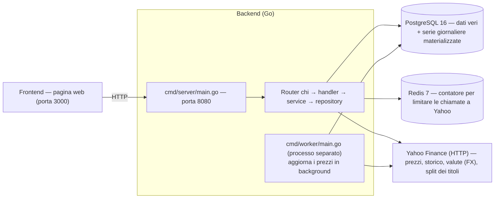

# VaultLab — Il backend spiegato

> Questo documento spiega come funziona il backend di VaultLab: il programma
> che gestisce i dati finanziari e li mette a disposizione del sito web.
> Non richiede conoscenze di programmazione: i concetti di server, database e
> linguaggi vengono spiegati man mano. Se non hai mai aperto un file di codice,
> leggi prima il capitolo 2 ("Concetti di base") e il capitolo 18 ("Leggere il
> codice"), poi il resto ti sarà chiaro.

---

## 1. Cosa fa VaultLab

VaultLab è un'applicazione per tenere traccia degli investimenti: registri cosa
compri e cosa vendi, e l'app ti mostra quanto valgono i tuoi titoli, quanto hai
guadagnato o perso, e come è andato il portafoglio nel tempo.

Per funzionare servono due "mondi" che collaborano:

- Il **frontend**: la pagina web che vedi nel browser (grafici, form, pulsanti).
- Il **backend**: il programma "dietro le quinte" che legge e scrive i dati,
  fa i calcoli finanziari e risponde alle richieste del frontend.

Questo documento parla del backend.

---

## 2. Concetti di base

Prima di entrare nei dettagli, un piccolo glossario. Se già conosci questi
concetti, puoi saltare il capitolo.

- **Server / processo**: un programma in esecuzione che resta in attesa di
  richieste. Il backend è un programma Go compilato in un file eseguibile.
- **API / endpoint**: un "numero di telefono" che il backend espone. Il
  frontend chiama un endpoint (es. `POST /auth/login`) e riceve una risposta.
  In gergo si parla di *richiesta* (request) e *risposta* (response).
- **HTTP**: il "linguaggio" con cui frontend e backend si parlano. I verbi
  principali sono `GET` (chiedere dati), `POST` (creare qualcosa),
  `PATCH` (modificare), `DELETE` (cancellare).
- **JSON**: il formato testuale in cui viaggiano i dati dentro una richiesta.
  È fatto di coppie "nome: valore" tra parentesi graffe, ad esempio
  `{"email": "mario@example.com", "nome": "Mario"}`. Si legge come una scheda
  compilata.
- **Database**: un programma che conserva i dati in modo ordinato su disco.
  VaultLab usa **PostgreSQL**.
- **Tabella**: dentro al database i dati sono organizzati in tabelle (come
  fogli di calcolo) con righe e colonne. La tabella `users`, per esempio,
  contiene una riga per ogni utente.
- **SQL**: il linguaggio con cui si interroga il database
  (`SELECT ... FROM ... WHERE ...`).
- **Chiave primaria (PRIMARY KEY)**: la colonna che identifica in modo univoco
  ogni riga (come un codice fiscale).
- **Chiave esterna (FOREIGN KEY)**: una colonna che "punta" a un'altra tabella
  per collegare le righe tra loro (es. una transazione punta al portafoglio a
  cui appartiene).
- **Migrazione**: un file SQL versionato che costruisce o modifica lo schema
  del database. Le migrazioni si applicano in ordine.
- **Cache**: una copia di dati già calcolati o scaricati, tenuta da parte per
  non ripetere lo stesso lavoro.
- **Rate limit / throttle**: limitare il numero di chiamate verso un servizio
  esterno nell'unità di tempo, per non essere bloccati.
- **Container**: un ambiente isolato in cui un programma gira con tutto ciò che
  gli serve. VaultLab usa Docker.
- **Redis**: un database in memoria (molto veloce) che qui funziona da
  "contatore condiviso" per tenere sotto controllo le chiamate verso Yahoo.

Un'analogia per tenere tutto insieme: il **backend è la cucina di un
ristorante**. Il frontend (il cameriere) porta l'ordine (la richiesta HTTP), la
cucina prepara il piatto (legge i dati e fa i calcoli) e lo consegna (la
risposta JSON). Il database è la dispensa con le materie prime.

---

## 3. Visione globale



I pezzi che girano (definiti in `docker-compose.yml`):

- **postgres** — il database vero e proprio: utenti, portafogli, transazioni,
  prezzi, tassi di cambio, serie giornaliere.
- **redis** — un magazzino in memoria usato come contatore condiviso per
  non superare il numero di chiamate consentito verso Yahoo.
- **backend** — l'API REST che parla con il frontend.
- **worker** — un processo separato che aggiorna i prezzi in background.
- **frontend** — la pagina web.

Il backend è **un unico programma Go** che, a seconda dell'argomento passato
quando viene avviato, fa due cose diverse (`cmd/server/main.go`):

- `server migrate` — applica le migrazioni SQL (costruisce le tabelle) e poi
  termina;
- `server` — avvia l'API HTTP e resta in ascolto.

Nel container il comando è
`sleep 3 && /server migrate && /server` (`docker-compose.yml`), quindi le
migrazioni girano sempre prima dell'avvio dell'API.

---

## 4. Come si avvia il backend

La sequenza di avvio del server è:

1. **Configurazione** — `config.Load()` legge le variabili d'ambiente (con un
   valore di default se mancano). Le variabili d'ambiente sono valori di
   configurazione che si passano al programma all'avvio (ad esempio l'indirizzo
   del database), senza doverle scrivere dentro al codice.
2. **Connessione al database** — `pgxpool.New(ctx, cfg.DSN())`. `pgxpool` è un
   **pool di connessioni**: tiene pronte alcune connessioni al database, le si
   prende quando serve e le si restituisce, così non si riapre una connessione
   da zero per ogni richiesta.
3. **Redis** — si prova a collegarsi a Redis per attivare il contatore globale
   delle chiamate a Yahoo. Se Redis non risponde, il server usa un contatore
   "finto" che non blocca mai e **continua comunque** a funzionare.
4. **Router HTTP** — si prepara la lista degli endpoint (il "menù" del
   ristorante) e si aggiungono dei comportamenti comuni a tutte le richieste:
   log, recupero dagli errori, un ID per tracciare ogni richiesta, un timeout
   di 30 secondi e la gestione CORS (le regole che permettono al frontend di
   chiamare l'API).
5. **Routes** — si collegano gli endpoint alle funzioni che li gestiscono.
   Alcuni endpoint sono pubblici (`/auth/*`), gli altri richiedono di essere
   autenticati (controlla il capitolo sull'autenticazione).
6. **Backfill delle serie** — dopo l'avvio, una goroutine (un "filo" di
   esecuzione che lavora in parallelo al resto del programma, così l'API può
   rispondere alle richieste mentre il calcolo prosegue) ricostruisce le serie
   giornaliere di tutti i portafogli (capitolo 9).

Allo spegnimento il server aspetta il segnale `SIGINT`/`SIGTERM` e poi chiude
le connessioni in modo ordinato, senza interrompere le richieste a metà.

---

## 5. Architettura a strati

Il codice del backend è diviso in **quattro strati**, ognuno con un compito
preciso. La regola d'oro è che ogni strato può usare solo quello sotto di sé,
mai quello sopra.

```
HTTP (router)
   │  richieste e risposte JSON
   ▼
handler   →  riceve la richiesta HTTP, capisce cosa vuole il frontend
   │           e invia la risposta. Non tocca il database.
   ▼
service   →  la logica di business: login, calcolo del prezzo medio,
   │           conversione delle valute, orchestrazione dei passaggi
   ▼
repository →  parla con PostgreSQL con SQL puro e parametrizzato
```

- **handler** (`internal/handler/`) — la "porta d'ingresso". Conosce le
  richieste HTTP ma non sa nulla di SQL.
- **service** (`internal/service/service.go`) — il "cervello". Fa i conti e
  coordina. Non sa nulla di HTTP.
- **repository** (`internal/repository/`) — il "magazziniere". Scrive le query
  SQL e converte le righe del database in oggetti Go.

I tre strati vengono **collegati a mano** (dependency injection manuale): si
creano prima i repository, poi i service (che ricevono i repository), poi gli
handler (che ricevono i service). Niente magie o framework di iniezione:

```go
repos := repository.New(dbPool)                                   // strato dati
fetcher := price.NewYahooFetcher(repos, cfg.PriceFetchInterval,
    price.WithMinInterval(cfg.YahooMinInterval),                  // coda 400ms
    price.WithRateBudget(budget),                                 // contatore Redis
)                                                                 // client Yahoo
svc := service.New(repos, jwtAuth, fetcher, cfg.LookupCacheTTL)   // logica
h := handler.New(svc, jwtAuth)                                    // HTTP
```

---

## 6. Il database

Le migrazioni (`backend/migrations/`, file numerati da `000001` a `000013`)
costruiscono lo schema. Le tabelle principali:

| Tabella | Contiene | Spiegazione |
|---|---|---|
| `users` | gli utenti | email, nome, hash della password, ruolo |
| `assets` | i titoli | ticker, nome, tipo (azione, ETF, crypto...), classe di investimento, valuta, exchange, settore, industria |
| `portfolios` | i portafogli | un portafoglio appartiene a un utente e ha una valuta |
| `portfolio_shares` | la condivisione | chi altro può vedere un portafoglio (con che ruolo) |
| `transactions` | le operazioni | compra/vendita/dividendo/split/commissione, quantità, prezzo, data |
| `prices` | i prezzi giornalieri | per ogni titolo e per ogni giorno: apertura, chiusura, volume |
| `fx_rates` | i tassi di cambio | quanto vale 1 dollaro in ogni altra valuta |
| `splits` | gli split azionari | es. un titolo da 1 azione diventa 4 azioni |
| `asset_region_weights` | l'esposizione geografica | per ogni titolo, il peso di ogni macro-regione |
| `asset_sector_weights` | l'esposizione settoriale | per ogni titolo, il peso di ogni settore GICS |
| `supported_currencies` | la lista delle valute | quali valute si possono usare (capitolo 11) |
| `lookup_cache` | la cache del cerca-titolo | risultati già scaricati da Yahoo per la ricerca automatica |
| `portfolio_series` | serie per portafoglio | valore e costo del portafoglio per ogni giorno |
| `asset_series` | serie per titolo | valore e costo di ogni titolo per ogni giorno |
| `health_events` | gli eventi di health dei prezzi | registrazioni di aggiornamenti prezzi vecchi/falliti nella pagina health |

Due idee fondamentali del database:

1. **Le righe si collegano tra loro.** Una transazione ha una chiave esterna
   verso il portafoglio e una verso il titolo. Così, dato un portafoglio,
   si trovano tutte le sue transazioni.
2. **Le chiavi primarie sono UUID.** Un UUID è un identificatore casuale lungo
   (es. `a3f2...`). A differenza dei numeri progressivi, un UUID si può
   generare senza chiedere al database, il che rende più semplice il lavoro in
   parallelo.

---

## 7. Una richiesta tipica: la dashboard

Prendiamo `GET /api/v1/dashboard`, l'endpoint più ricco: serve alla pagina
principale per mostrare tutti i portafogli, i titoli, i guadagni e la serie
storica.

Cosa succede, passo passo:

1. **Router**: la richiesta arriva e viene indirizzata alla funzione
   `GetDashboard`.
2. **Middleware JWT**: il token dell'utente (capitolo 14) viene controllato e
   i dati dell'utente vengono messi "nel contesto" della richiesta.
3. **Handler**: estrae i dati dell'utente, chiama il service, e invia la
   risposta JSON.
4. **Service `GetDashboard`**: orchestrazione — carica i portafogli
   dell'utente, le posizioni dettagliate (con il prezzo medio di carico,
   capitolo 8), i tassi di cambio per le valute coinvolte, e le serie
   giornaliere salvate nel database.
5. **Repository**: esegue le query SQL, per esempio la query che carica i
   portafogli con un `LEFT JOIN` sulla tabella di condivisione (in modo da
   essere già pronta per un futuro supporto alla condivisione).

Nel codice Go il pattern tipico per leggere più righe è:

```go
for rows.Next() {
    rows.Scan(&x, &y)   // legge una riga e la mette in variabili
}
```

Il programma scorre le righe una alla volta (`for rows.Next()`) e le copia
nelle variabili (`Scan`). Go richiede di **mappare a mano** ogni colonna in una
variabile, senza scorciatoie magiche: per ogni riga, si decide esplicitamente
quale valore va in quale variabile.

---

## 8. L'AVCO — prezzo medio di carico

L'AVCO (Average Cost) è la **logica con cui si calcola quanto vale la
posizione di un titolo**, come fa il tuo broker. È il cuore finanziario
dell'applicazione, in `internal/position/position.go`.

Immagina di comprare 10 azioni a 100 € e poi altre 10 a 120 €. Quanto hai
speso in totale? 2.200 €. Il tuo **prezzo medio di carico** è
2.200 / 20 = 110 € per azione. L'AVCO tiene traccia di questo numero mentre
avvengono le operazioni.

### Lo `State`

Per ogni titolo il motore tiene uno "stato" della posizione:

```go
type State struct {
    Qty      decimal.Decimal  // quantità di azioni che possiedi
    Avg      decimal.Decimal  // prezzo medio di carico
    Cost     decimal.Decimal  // totale investito
    Realized decimal.Decimal  // plus/minusvalenza già realizzata
}
```

> Cos'è `struct`? In Go una `struct` è un contenitore che raggruppa più valori
> con un nome: è come una "scheda" con più caselle. Qui la scheda "stato della
> posizione" ha quattro caselle: quantità, prezzo medio, costo totale e
> guadagno/perdita realizzata. `decimal.Decimal` è il tipo dei numeri (numeri
> con virgola precisi, adatti al denaro, senza errori di arrotondamento).

L'idea è semplice: le operazioni non modificano i dati alla rinfusa, ma
aggiornano la scheda in modo ordinato, operazione dopo operazione.

### `Apply` — come cambia lo stato con ogni operazione

- **Buy (comprato)**: aggiungi al costo `quantità × prezzo + commissione`,
  poi ricalcoli il prezzo medio: `Avg = Cost / nuovaQuantità`.
- **Sell (venduto)**: il costo della parte venduta è `Avg × quantità`. Lo
  sottrai dal costo totale; la differenza tra quello e l'incasso diventa
  `Realized` (guadagno o perdita già "incassato").
- **Split**: la quantità viene moltiplicata per il rapporto (es. 1 diventa 4),
  ma il prezzo medio viene **diviso** per lo stesso rapporto: il costo totale
  non cambia.
- **Fee (commissione)**: si somma al costo.
- **Dividend (dividendo)**: si somma a `Realized`.

### `Walk`

`Walk` prende tutte le transazioni, le raggruppa per portafoglio e per titolo,
le ordina per data e **inietta gli split** nella linea del tempo. Uno split è
un fatto del titolo, quindi si applica a tutti i portafogli che possiedono quel
titolo.

---

## 9. Le serie giornaliere materializzate

Per disegnare i grafici serve, per ogni portafoglio, un valore per ogni giorno
dalla prima operazione a oggi. Questa serie non viene ricalcolata a ogni
richiesta: viene **salvata (materializzata)** nel database nelle tabelle
`portfolio_series` e `asset_series` (`internal/series/series.go`).

La logica di calcolo di un singolo giorno è:

```go
for i, d := range dates {
    // applica le transazioni avvenute fino alla data d
    // applica gli split avvenuti fino alla data d
    // prende l'ultimo prezzo disponibile ≤ d
    mv := st.Qty.Mul(priceByAsset[aid][priceDates[pricePos-1]]).Mul(rawFactor).Mul(factor)
    agg[i].MarketValue = mv   // sommato al totale del portafoglio
}
```

Due dettagli nel calcolo del valore di mercato:

- `rawFactor` — i prezzi storici di Yahoo sono **aggiustati per gli split**, e
  questo fattore li riporta alla realtà attuale;
- `factor` — la conversione dalla valuta del titolo a quella del portafoglio.

Quando la serie viene ricalcolata:

- a ogni modifica di transazioni o portafoglio (`AddTransaction`,
  `UpdateTransaction`, `DeleteTransaction`, `UpdatePortfolio`, import);
- dopo ogni aggiornamento dei prezzi (sia dal worker che da una richiesta
  manuale);
- all'avvio del server (il backfill di cui al capitolo 4).

La ricostruzione è guidata da `Recompute(portfolioID)` (un portafoglio) o
`RecomputeAll` (tutti). Leggere i grafici diventa quindi una semplice lettura
dal database, senza rifare tutti i calcoli a ogni apertura di pagina.

---

## 10. Valute e tassi di cambio (FX)

I portafogli e i titoli possono essere in valute diverse. Per sommare o
confrontare i valori serve convertire.

1. Il backend scarica da Yahoo i **tassi di cambio da dollaro (USD) verso le
   altre valute** (es. `USDCHF=X` per il franco) e li salva nella tabella
   `fx_rates`.
2. Al momento del calcolo, `series.LoadRates` carica i tassi delle valute che
   compaiono nelle posizioni.
3. Per convertire da una valuta A a una valuta B, `series.FxFactor` usa il
   **doppio passaggio attraverso il dollaro**:
   `(USD→B) / (USD→A)`.

> Non serve una tabella con tutte le coppie possibili: basta una riga per
> valuta (il tasso rispetto al dollaro) e il resto si calcola.

Se un tasso manca, la conversione non è disponibile e l'applicazione lo segnala
(nel modello compare il campo `fx_missing`).

---

## 11. La lista delle valute disponibili

Non tutte le valute del mondo sono gestibili. L'applicazione tiene una
**whitelist** (una lista consentita) nella tabella `supported_currencies`, dove
sono già presenti due valute di base: USD e EUR.

Le valute si possono aggiungere e togliere da `/settings/currencies`
(GET = elenca, POST = aggiunge, DELETE = rimuove):

- **Aggiungere** una valuta: prima si controlla che Yahoo conosca la
  conversione USD → quella valuta. Se non la conosce, la valuta non può essere
  gestita e la richiesta viene rifiutata.
- **Rimuovere** una valuta: non si può rimuovere il dollaro (è la base di
  tutto) né una valuta che è ancora usata da qualche titolo o portafoglio.

---

## 12. I prezzi e il collegamento con Yahoo

Il pacchetto `internal/price/` si occupa di parlare con **Yahoo Finance** per
recuperare prezzi, storico, tassi di cambio, split e risultati della ricerca
dei titoli.

### Il client Yahoo (`YahooFetcher`)

Ha un client HTTP con timeout di 15 secondi, due "mappe di raffreddamento" per
titolo (storico e split) e un **`sync.Mutex`** che protegge quelle mappe.

> Cos'è un `Mutex`? Se più parti del programma (le goroutine) lavorano in
> parallelo e condividono le stesse "mappe" (le liste di chi è stato già
> aggiornato), potrebbero scrivere nello stesso momento e corrompere i dati.
> Il `Mutex` (da "mutual exclusion", esclusione reciproca) fa sì che solo una
> goroutine alla volta possa accedere alle mappe: è come una porta con una sola
> chiave. Gli altri programmi la definiscono spesso "lock" (serratura).

### Refresh intelligente (`RefreshStale`)

Per non chiamare Yahoo inutilmente, prima di aggiornare un prezzo controlla
tre criteri:

1. non c'è mai stato un prezzo → scarica;
2. l'ultimo aggiornamento è molto recente → salta (throttle);
3. l'ultimo prezzo di chiusura è già quello del giorno lavorativo atteso →
   salta.

Quando bisogna aggiornare, le quotazioni correnti e i tassi di cambio vengono
presi **in batch** tramite l'endpoint `spark` di Yahoo: una sola chiamata per
gruppi di 50 titoli. I titoli che mancano dalla risposta vengono richiesti uno
a uno.

### Tenere sotto controllo le chiamate

Yahoo limita il numero di chiamate che accetta. Ogni chiamata a Yahoo passa
quindi attraverso due "freni":

1. una **coda FIFO** (primo arrivato, primo servito) che garantisce un
   **intervallo minimo** tra una chiamata e l'altra (default 400ms,
   configurabile con `VAULT_YAHOO_MIN_INTERVAL`);
2. un **contatore globale condiviso** (`RateBudget`), implementato in Redis:
   un tetto di richieste per finestra di tempo (default 8 richieste al
   secondo, configurabile con `VAULT_YAHOO_GLOBAL_RATE` e
   `VAULT_YAHOO_GLOBAL_WINDOW`). Il contatore è condiviso tra server e worker,
   così i due processi insieme non sforano il limite.

Se Redis non è raggiungibile, il contatore viene disattivato e si procede
comunque (si rischia di più, ma l'app non si blocca).

### Riportare i problemi

Quando l'utente chiede un aggiornamento prezzi (`POST /prices/refresh`), la
risposta non è solo la lista dei titoli aggiornati: è un **report** con:

- `refreshed` — i titoli aggiornati con successo;
- `issues` — i problemi, ognuno con un codice stabile:
  `rate_limited` (Yahoo ha rifiutato per troppe chiamate), `http_<status>`
  (un errore HTTP specifico) o `error`;
- `rate_limited` — un riepilogo rapido: "c'è stato un blocco da rate limit?".

Il frontend usa questo report per mostrare un avviso non bloccante se qualche
aggiornamento è fallito.

### Storico e split

- **Storico (`EnsureHistory`)**: riporta i prezzi dalla prima operazione a
  oggi, riprendendo da dove si era rimasti (scarica tutto se manca, altrimenti
  solo dall'ultima data disponibile). Il salvataggio è idempotente per data:
  riscrivere lo stesso giorno non crea duplicati.
- **Storico completo (`HistoryAsset.Full`)**: quando un titolo non è mai stato
  backfillato (`assets.history_backfilled = FALSE`), il primo sync scarica lo
  **storico completo** dei prezzi da Yahoo (dal 1970) in una passata, poi porta
  la flag a `TRUE`. Da lì in poi il sync è incrementale. La pagina asset
  espone questo comando come **"Backfill storico completo"**
  (`POST /assets/{id}/backfill-history`): forza il re-download completo e
  invalida i prezzi in cache.
- **Split (`EnsureSplits`)**: scarica gli eventi di split da Yahoo e li
  salva (anche qui in modo idempotente su `asset_id, date`).

### Profilo ed esposizione dell'asset

Per la pagina di dettaglio asset il backend dialoga anche con l'endpoint
`quoteSummary` di Yahoo (che richiede l'handshake con **crumb** + cookie di
sessione a vita breve, vedi `meta.go`):

- **Profilo (`FetchAssetProfile`)**: il modulo `assetProfile` fornisce il
  `sector` GICS e l'`industry` di una singola azione.
- **Esposizione settoriale (`FetchAssetExposure`)**: per un ETF, il modulo
  `topHoldings` espone `sectorWeightings` (una frazione per chiave di settore),
  che il backend converte nei nostri 11 settori GICS canonici (in percentuale).
  L'esposizione geografica (paesi → macro-regioni) di un ETF non viene ancora
  scaricata automaticamente: si inserisce a mano nell'editor o tramite il
  futuro servizio Python (B.5).
- **Asset class (`FetchAssetExposure`)**: Yahoo non espone più `assetClass`
  (il modulo `quote` di quoteSummary non esiste, il v7 `/quote` non lo
  restituisce). Il rilevamento automatico usa quindi la categoria fondo
  Morningstar (`defaultKeyStatistics.category` oppure `fundProfile.categoryName`)
  combinata con un'euristica sulla denominazione del fondo
  (`geo.ClassifyAssetClass`). L'override manuale nell'editor asset vince sempre.
- **Esposizione geografica**: per una singola **azione**, il paese (dal profilo
  asset) viene mappato a una macro-regione al 100% (`geo.RegionForCountry`).

Nota sull'**ISIN**: Yahoo non espone l'ISIN in nessun modulo, quindi il campo
resta modificabile a mano nella pagina asset.

### Invalidation della cache (`bumpRev`)

Ogni lettura in cache (`cached()`, capitolo 7) è chiavata su un **numero di
revisione** globale. Dopo ogni scrittura (nuovi prezzi, un backfill, un
aggiornamento dell'esposizione, ...) il service chiama `bumpRev` così la
lettura successiva salta la cache obsoleta. È anche per questo che
`SyncAssetData` e il sync in background dopo la creazione di un asset
invalidano la cache dei prezzi: altrimenti un asset appena backfillato
continuerebbe a mostrare un grafico vecchio e parziale fino alla scadenza
della TTL di cache.

### La ricerca dei titoli (`lookup_cache`)

Quando l'utente cerca un titolo per ticker, il risultato viene salvato nella
tabella `lookup_cache` per un po' di giorni. Così la prossima ricerca uguale
non rifà la chiamata a Yahoo.

---

## 13. Il worker

Il processo worker (`cmd/worker/main.go`) è separato dal server. Ogni intervallo
(`VAULT_PRICE_FETCH_INTERVAL`, default 1 ora) aggiorna i prezzi:

```go
ticker := time.NewTicker(interval)
// esegue subito una volta, poi un ciclo che aspetta:
//   - il prossimo tick (aggiorna i prezzi)
//   - il segnale di chiusura (si spegne)
for { select { case <-ticker.C: FetchAll(); case <-ctx.Done(): return } }
```

Perché un processo separato e non una goroutine dentro il server? **Isolamento**:
se Yahoo va giù, si riavvia il worker senza toccare l'API. Il frontend non si
accorge di nulla.

Il worker, all'avvio, aspetta che il server abbia applicato le migrazioni
(controlla che le tabelle delle serie esistano) e solo dopo parte. A ogni giro,
dopo l'aggiornamento dei prezzi, ricalcola anche le serie giornaliere di tutti
i portafogli (capitolo 9), così i dati restano sempre allineati.

---

## 14. Autenticazione con JWT

L'autenticazione usa **JWT** (JSON Web Token): un token firmato e
"senza stato", cioè il server non deve ricordarsi chi è collegato, perché il
token stesso contiene i dati e una firma crittografica (HMAC-SHA256) che ne
garantisce l'autenticità. Il segreto della firma sta nella configurazione.

Al login vengono emessi **due token**:

- **access** (dura 15 minuti): contiene l'id utente, l'email, il ruolo e il
  tipo `token_type=access`. È il biglietto con cui il frontend chiama le API;
- **refresh** (dura 72 ore): contiene solo l'id utente e il tipo
  `token_type=refresh`. Serve a ottenere una nuova coppia di token quando
  quello di accesso scade (rotazione automatica).

Il middleware controlla ogni richiesta protetta: se il token non c'è, non è
valido, o non è del tipo `access`, la richiesta viene rifiutata.

Le password sono salvate come **hash bcrypt** (non in chiaro).

> Cos'è un *hash*? È una "impronta digitale" della password: una stringa
> calcolata dalla password con una formula a senso unico (non si può tornare
> indietro dalla stampa alla password). Al momento del login si ricalcola
> l'impronta della password inserita e la si confronta con quella salvata.
> Così, anche se qualcuno ruba il database, non può leggere le password.

---

## 15. Operazioni atomiche — `WithTx`

Quando un'operazione coinvolge più scritture sul database, si vuole che
**o riesca tutta, o non cambi nulla**. Questo si chiama transazione atomica.

```go
func (r *Repository) WithTx(ctx, fn func(*Repository) error) error {
    tx, _ := r.DB.Begin(ctx)
    defer func() { _ = tx.Rollback(ctx) }()   // se fn fallisce → annulla tutto
    rr := &Repository{ User: &userRepo{db: tx}, ... }
    if err := fn(rr); err != nil { return err }
    return tx.Commit(ctx)                      // se va tutto bene → salva tutto
}
```

Due idee Go da notare:

1. **`DBTX` interface**: sia il pool di connessioni sia una transazione
   espongono gli stessi metodi (`Exec`, `Query`, `QueryRow`). I repository
   quindi funzionano identici sia sul pool che dentro una transazione.
2. La funzione interna riceve un **Repository "clonato"** i cui componenti
   sono legati alla transazione. Il `defer Rollback` dopo un `Commit`
   riuscito è una no-op innocua: se la funzione fallisce, invece, annulla
   tutto.

Un esempio di uso: l'importazione di un portafoglio in modalità "sostituisci"
cancella e ricrea il portafoglio **atomicamente** — se un passaggio fallisce,
il vecchio portafoglio resta intatto.

---

## 16. Il ciclo dei dati completo

Mettere insieme tutti i pezzi:

```
L'utente crea un titolo ──► POST /assets ──► CreateAsset
                            in background: scarica split e storico da Yahoo

Il worker, ogni ora: FetchAll (quote + valute in batch) ──► RecomputeAll (serie)

L'utente modifica una transazione ──► Recompute(portafoglio) → serie aggiornate

L'amministratore aggiunge una valuta ──► POST /settings/currencies
                            → verifica conversione su Yahoo → whitelist

L'utente apre la dashboard ──► GET /dashboard:
    posizioni (AVCO) + tassi di cambio + serie dal database → JSON al frontend

L'utente apre la pagina asset ──► GET /assets/{id}/quote (+ /prices?...&full=1):
    range di quota + storico prezzi dal database → JSON al frontend

L'utente modifica l'esposizione ──► PUT /assets/{id}/exposure
    → valida somma=100% → salva asset_region_weights / asset_sector_weights → bumpRev

L'utente clicca "Aggiorna da Yahoo" ──► POST /assets/{id}/fetch-profile
    → quoteSummary (crumb) → settore/industria (+ sectorWeightings) → salvati via PATCH/fetch-exposure
```

---

## 17. Mappa dei file

```
backend/
├── cmd/
│   ├── server/main.go      # avvio API, routing, migrazioni, backfill serie
│   └── worker/main.go      # aggiornamento prezzi in background
├── internal/
│   ├── auth/jwt.go         # JWT: generazione, validazione, middleware
│   ├── config/config.go    # variabili d'ambiente + DSN di connessione
│   ├── geo/geo.go          # macro-regioni, settori GICS, mappatura paese→regione
│   ├── handler/            # livello HTTP (auth.go, portfolio.go, settings.go, ...)
│   ├── model/              # strutture dati con tag JSON
│   ├── position/           # motore AVCO (State, Apply, Walk)
│   ├── price/              # client Yahoo (yahoo.go, spark.go, meta.go, throttle.go, report.go, ...)
│   ├── repository/         # query SQL (repository.go = "hub" + asset.go + exposure.go + WithTx + DBTX)
│   ├── series/             # serie giornaliere materializzate (Recompute, LoadRates, FxFactor)
│   └── service/            # logica di business (service.go)
├── migrations/             # SQL versionato (000001..000011)
└── go.mod
```

---

## 18. Leggere il codice Go

Nel documento compaiono frammenti di codice Go. Ecco le basi per leggerli
senza aver mai programmato.

- **Le istruzioni finiscono alla riga.** Ogni riga è un'istruzione: niente
  parentesi o punti e virgola da cercare. I `//` indicano un **commento**: il
  testo dopo `//` non è codice, è una nota per chi legge.
- **`func` definisce una funzione**: un blocco di codice con un nome, pronto a
  essere richiamato. Es. `func (s *Service) GetDashboard(...) { ... }`. Il nome
  prima di `(` indica *a quale oggetto appartiene* (in questo caso al service).
- **Le parentesi `{ }` delimitano il corpo** della funzione: tutto quello che
  sta tra le graffe è ciò che la funzione fa.
- **`:=` crea una variabile** e le assegna un valore in una volta sola.
  Es. `x := 5` significa "crea una casella chiamata x e mettici 5".
- **`struct` raggruppa valori**: una scheda con più caselle con nome (come
  nella "scheda dello stato" del capitolo 8).
- **`package` e `import`**: `package` dichiara il "gruppo" a cui appartiene un
  file; `import` carica codice già scritto da altri (le librerie).
- **`context.Context`**: un "portabagagli" che accompagna ogni richiesta e
  contiene informazioni di contorno (chi è l'utente, quando fermarsi). Quando
  l'utente chiude la pagina, il contesto lo comunica e i lavori in corso si
  fermano.
- **Le funzioni restituiscono più valori**, e il secondo è quasi sempre
  `err` (errore). La regola Go: **gli errori sono valori da controllare**.
  `if err != nil { return err }` si legge così: "se c'è stato un errore,
  fermati e restituisci l'errore". È il modo in cui Go segnala i problemi:
  non interrompe il programma all'improvviso, lo fa decidere a chi scrive il
  codice, riga per riga.

Con queste poche regole, i frammenti di codice nel documento si leggono come
frasi: "crea la connessione, se va male fermati e segnala, altrimenti continua".

---

## 19. Note e punti aperti

- **Redis ha un solo compito**: il contatore globale per limitare le chiamate
  a Yahoo. Se Redis è giù, l'app funziona comunque (senza il contatore). La
  cache della ricerca titoli, invece, vive in PostgreSQL (`lookup_cache`).
- **Le difese contro il rate limit di Yahoo** sono: aggiorna solo i dati
  vecchi, richieste in batch (spark), coda FIFO con intervallo minimo,
  contatore globale su Redis, e User-Agent da browser. Il report di
  `/prices/refresh` segnala quando un blocco è avvenuto.
- **Serie materializzate**: vengono ricalcolate a ogni modifica dei dati.
  L'endpoint della storia di un portafoglio, prima di rispondere, scarica
  comunque eventuali dati mancanti e ricalcola la serie del portafoglio, così
  il grafico è sempre fresco.
- **`canAccessPortfolio`** controlla solo il proprietario del portafoglio:
  la tabella `portfolio_shares` (la condivisione con altri utenti) esiste ma
  non è ancora usata.
- La pagina asset e gli endpoint di esposizione salvano i **pesi per-asset**
  in `asset_region_weights` e `asset_sector_weights`; gli endpoint di
  allocazione pesata a livello portafoglio (EPIC B.6/B.7) e i widget
  dashboard/portfolio (B.8) non sono ancora implementati.
- Esistono metodi SQL alternativi per riepiloghi e allocazioni
  (`GetSummary`, `GetAllocation`, `GetROI`) che non vengono usati dal livello
  service: il calcolo finanziario vive nel motore AVCO (capitolo 8), non in
  SQL. Sono candidati alla rimozione.
