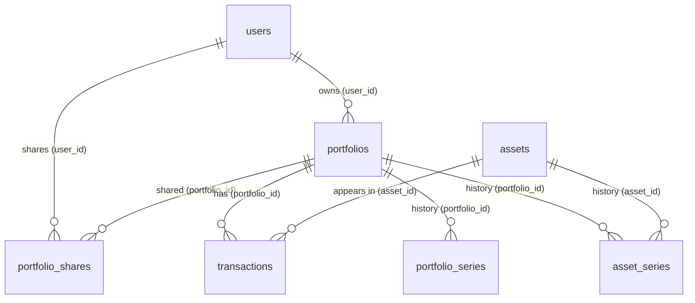
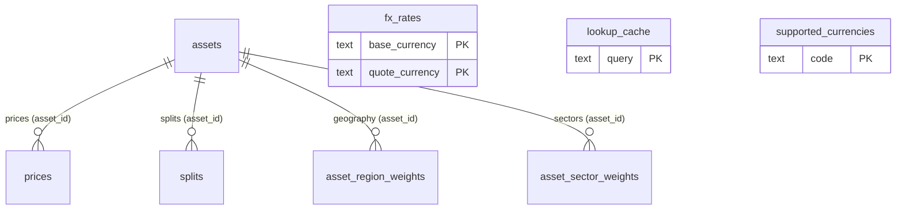

# VaultLab — The database explained

> This document explains how the VaultLab database is structured: which tables
> exist, what they contain and how they are connected to each other.
> It is the companion to the backend guide (`docs/BACKEND-GUIDE.en.md`) and
> requires no programming knowledge: concepts such as keys and relationships
> are explained with plain words and analogies.
>
> For Italian readers there is the version `docs/DATABASE-GUIDE.it.md`.

---

## 1. The basics, in ten minutes

A database is a program that stores data in an orderly way on disk, organized
into **tables** (like spreadsheets) with **rows** (one record, one "card") and
**columns** (one field of the card).

Every column has a **data type**, that is, what it can contain:

| Type | Meaning |
|---|---|
| `TEXT` | text (any string) |
| `UUID` | long random identifier, e.g. `a3f2...` |
| `NUMERIC(18, 6)` | exact decimal number: up to 18 digits, 6 of them decimals |
| `NUMERIC(18, 8)` | as above, but with 8 decimals (used for quantities and rates) |
| `DATE` | a date (without time) |
| `TIMESTAMPTZ` | date and time, with timezone |
| `BOOLEAN` | true/false |
| `BIGINT` | large integer (e.g. trading volumes) |
| `JSONB` | structured data in JSON format |

Some keywords you will meet often:

- **PRIMARY KEY (PK)**: the column that uniquely identifies each row (like a
  personal ID number). Two rows cannot have the same key.
- **FOREIGN KEY (FK)**: a column that "points" to the primary key of another
  table, to link rows together. This is the mechanism that builds
  relationships.
- **NOT NULL**: the column must always have a value (it cannot be empty).
- **DEFAULT**: the value the column takes automatically if none is specified
  (e.g. the creation date).
- **UNIQUE**: two rows cannot have the same value in that column.
- **CHECK**: a rule on the allowed values (e.g. the operation type can only be
  `buy`, `sell`, etc.).
- **ON DELETE CASCADE**: "if the parent is deleted, delete the children too".
  For example, if you delete a portfolio, its transactions are deleted too.
  Without CASCADE, deleting the parent is rejected if children exist.
- **Index**: a "shortcut" that makes searches on a column fast (like the index
  at the back of a book).

The restaurant analogy (from the guide): the database is the pantry. The
tables are the shelves, the rows are the boxes on the shelves, and the foreign
keys are the labels saying "this box belongs to that one".

---

## 2. The big picture

There are fourteen tables, which can be grouped by topic:

| Area | Tables | What they represent |
|---|---|---|
| **Identity and access** | `users`, `portfolio_shares` | who the users are and who can see portfolios |
| **Securities** | `assets` | the securities (stocks, ETFs...) with type, class and sector |
| **Portfolios and operations** | `portfolios`, `transactions` | the portfolios and the buy/sell operations |
| **History** | `portfolio_series`, `asset_series` | value and cost day by day |
| **Market data** | `prices`, `splits`, `fx_rates` | prices, stock splits and exchange rates |
| **Exposure** | `asset_region_weights`, `asset_sector_weights` | the geographic and sector distribution of a security |
| **Configuration and cache** | `supported_currencies`, `lookup_cache` | the allowed currencies and the search cache |

---

## 3. The relationship diagram

The diagram uses the Mermaid notation (rendered automatically by GitHub). On
each line end: `||` means "exactly one", `o{` means "zero or more". So
`portfolios ||--o{ transactions` reads "one portfolio has many transactions".
The label on the line indicates the **foreign key** that creates the
connection.

### The core (users, portfolios, securities, transactions)

### Market data and independent tables

### The relationships, listed

| Child | Column | Parent | Cardinality | If the parent is deleted |
|---|---|---|---|---|
| `transactions` | `portfolio_id` | `portfolios` | 1 portfolio → N transactions | CASCADE (transactions are deleted) |
| `transactions` | `asset_id` | `assets` | 1 security → N transactions | rejected (a security with transactions cannot be deleted) |
| `portfolios` | `user_id` | `users` | 1 user → N portfolios | CASCADE |
| `portfolio_shares` | `portfolio_id` | `portfolios` | N portfolios ⇄ N users | CASCADE |
| `portfolio_shares` | `user_id` | `users` | N portfolios ⇄ N users | CASCADE |
| `prices` | `asset_id` | `assets` | 1 security → N prices | CASCADE |
| `splits` | `asset_id` | `assets` | 1 security → N splits | CASCADE |
| `portfolio_series` | `portfolio_id` | `portfolios` | 1 portfolio → N days | CASCADE |
| `asset_series` | `portfolio_id` | `portfolios` | 1 portfolio → N rows | CASCADE |
| `asset_series` | `asset_id` | `assets` | 1 security → N rows | CASCADE |
| `asset_region_weights` | `asset_id` | `assets` | 1 security → N regions | CASCADE |
| `asset_sector_weights` | `asset_id` | `assets` | 1 security → N sectors | CASCADE |

---

## 4. The tables, one by one

### `users` — the users

Each row is an account. The password is not stored in plain text, but as a
**hash** (see the guide, chapter 14).

| Column | Type | Explanation |
|---|---|---|
| `id` | UUID (PK) | user identifier |
| `email` | TEXT (UNIQUE) | the login email, unique |
| `name` | TEXT | the visible name |
| `password_hash` | TEXT | the encrypted fingerprint of the password |
| `role` | TEXT | role: `owner`, `admin`, `editor` or `viewer` |
| `created_at` / `updated_at` | TIMESTAMPTZ | when the account was created/modified |

### `assets` — the securities

The "catalog" of securities (stocks, ETFs, crypto...). The `ticker` is unique:
no two securities can have the same symbol. `price_fetched_at` remembers when
the last price was downloaded, to avoid useless Yahoo calls. `exchange`,
`sector`, `industry` and `asset_class` are descriptive metadata edited on the
asset page; `history_backfilled` tells whether the full price history has been
downloaded (see below).

| Column | Type | Explanation |
|---|---|---|
| `id` | UUID (PK) | identifier |
| `ticker` | TEXT (UNIQUE) | symbol, e.g. `AAPL` |
| `isin` | TEXT | international ISIN code (may be missing) |
| `name` | TEXT | name of the security |
| `type` | TEXT (CHECK) | `stock`, `etf`, `bond`, `mutual_fund`, `crypto`, `commodity`, `cash` |
| `asset_class` | TEXT (CHECK) | investment class: `equity`, `bond`, `commodity`, `currency`, `crypto`, `real_estate`, `mixed`, `other` (default `other`) |
| `country` | TEXT | country of origin |
| `currency` | TEXT | currency it is quoted in (default `USD`) |
| `exchange` | TEXT | stock exchange / venue (may be empty) |
| `sector` | TEXT | economic sector (may be empty) |
| `industry` | TEXT | specific industry (may be empty) |
| `history_backfilled` | BOOLEAN | whether the full price history has been downloaded (default `FALSE`) |
| `price_fetched_at` | TIMESTAMPTZ | when the last price was updated |
| `created_at` | TIMESTAMPTZ | when it was added |

> **On the full history (`history_backfilled`)**: a security with
> `history_backfilled = FALSE` gets its **complete** price history downloaded
> from Yahoo on the first sync (from 1970), after which the flag becomes
> `TRUE` and the sync is incremental. The asset page can force a full
> re-download at any time ("Backfill storico completo").

### `portfolios` — the portfolios

A portfolio belongs to a user and has a reference currency (e.g. investments
in euros or dollars).

| Column | Type | Explanation |
|---|---|---|
| `id` | UUID (PK) | identifier |
| `user_id` | UUID (FK) | the owner (→ `users.id`) |
| `name` | TEXT | portfolio name |
| `description` | TEXT | description (may be empty) |
| `currency` | TEXT | portfolio currency (default `USD`) |
| `created_at` / `updated_at` | TIMESTAMPTZ | when it was created/modified |

### `portfolio_shares` — portfolio sharing

It links two tables together (a "many to many" relationship): it says **which
users can see which portfolios** and with what role. The primary key is
composed of both columns: the same pair cannot be repeated.

| Column | Type | Explanation |
|---|---|---|
| `portfolio_id` | UUID (FK, part of the PK) | the shared portfolio |
| `user_id` | UUID (FK, part of the PK) | the user who has access |
| `role` | TEXT (CHECK) | `admin`, `editor` or `viewer` |
| `created_at` | TIMESTAMPTZ | when it was shared |

### `transactions` — the operations

The heart of the financial data: each row is an operation inside a portfolio
(buy, sell, dividend, split, fee). It points both to the portfolio and to the
security. The price is expressed in the security's currency.

| Column | Type | Explanation |
|---|---|---|
| `id` | UUID (PK) | identifier |
| `portfolio_id` | UUID (FK) | the portfolio (→ `portfolios.id`) |
| `asset_id` | UUID (FK) | the security (→ `assets.id`) |
| `type` | TEXT (CHECK) | `buy`, `sell`, `dividend`, `split` or `fee` |
| `quantity` | NUMERIC(18, 8) | quantity (e.g. 10 shares) |
| `price` | NUMERIC(18, 6) | unit price |
| `fees` | NUMERIC(18, 6) | fees paid |
| `date` | TIMESTAMPTZ | when it happened |
| `notes` | TEXT | free notes (optional) |
| `created_at` | TIMESTAMPTZ | when it was recorded |

### `prices` — the daily prices

One price for each security and each day. The combination `asset_id + date` is
unique: a security has one price per day. The `open/high/low/close` fields are
the opening, highest, lowest and closing prices; `volume` is the number of
shares traded. `source` remembers where the data comes from (`yahoo`).

| Column | Type | Explanation |
|---|---|---|
| `id` | UUID (PK) | identifier |
| `asset_id` | UUID (FK) | the security (→ `assets.id`) |
| `date` | DATE | the day of the price |
| `open` / `high` / `low` / `close` | NUMERIC(18, 6) | the four prices of the day |
| `volume` | BIGINT | shares traded |
| `source` | TEXT | origin of the data |
| `created_at` | TIMESTAMPTZ | when it was saved |

### `splits` — the stock splits

A split is an event in which a security changes the number of shares in
circulation (e.g. 1 share becomes 4). The `numerator` and `denominator`
columns are the ratio: `numerator/denominator`. The key is `asset_id + date`:
a security can have only one split per day.

| Column | Type | Explanation |
|---|---|---|
| `asset_id` | UUID (FK, part of the PK) | the security |
| `date` | DATE (part of the PK) | the day the split takes effect |
| `numerator` | NUMERIC(18, 8) | numerator of the ratio |
| `denominator` | NUMERIC(18, 8) | denominator of the ratio |
| `source` | TEXT | origin of the data |
| `created_at` | TIMESTAMPTZ | when it was saved |

### `asset_region_weights` — the geographic exposure

For each security, how much of its value is distributed among the **macro-regions**
(North America, Europe, Asia...). One row per `asset_id + region`; the weights
of the same security should ideally sum to 100%. For a single stock this is a
single row (the country mapped to its region at 100%); for an ETF it is a mix
entered by hand, fetched from Yahoo, or — since B.5 — downloaded completely
from JustETF (`POST /assets/{id}/fetch-etf-exposure`).

| Column | Type | Explanation |
|---|---|---|
| `asset_id` | UUID (FK, part of the PK) | the security (→ `assets.id`) |
| `region` | TEXT (part of the PK) | the macro-region, e.g. `North America` |
| `weight` | NUMERIC(10, 4) | the percentage weight (e.g. `0.6500`) |

### `asset_sector_weights` — the sector exposure

For each security, how much of its value belongs to each **GICS sector**.
One row per `asset_id + sector`; the weights of the same security should sum to
100%. For a single stock this is a single row (its sector at 100%); for an ETF
it is the mix of `sectorWeightings` fetched from Yahoo.

| Column | Type | Explanation |
|---|---|---|
| `asset_id` | UUID (FK, part of the PK) | the security (→ `assets.id`) |
| `sector` | TEXT (part of the PK) | the GICS sector, e.g. `Technology` |
| `weight` | NUMERIC(10, 4) | the percentage weight (e.g. `0.2340`) |

### `fx_rates` — the exchange rates

How much **1 dollar (USD)** is worth in another currency. The key is the pair
`base_currency + quote_currency`. There is no need for a table with every
possible currency pair: the conversion between any two currencies goes through
the dollar (see the guide, chapter 10).

| Column | Type | Explanation |
|---|---|---|
| `base_currency` | TEXT (part of the PK) | the base currency (default `USD`) |
| `quote_currency` | TEXT (part of the PK) | the quoted currency |
| `rate` | NUMERIC(18, 8) | the rate |
| `source` | TEXT | origin of the data |
| `fetched_at` | TIMESTAMPTZ | when it was downloaded |
| `created_at` | TIMESTAMPTZ | when it was saved |

### `portfolio_series` — the portfolio series

The value and cost of the portfolio **for each day**, from the first operation
to today. These data are "materialized" (precomputed and stored): the AVCO
engine rebuilds them when the data changes (see the guide, chapter 9). One row
per `portfolio_id + date`.

| Column | Type | Explanation |
|---|---|---|
| `portfolio_id` | UUID (FK, part of the PK) | the portfolio |
| `date` | DATE (part of the PK) | the day |
| `qty` | NUMERIC | total quantity |
| `cost_basis` | NUMERIC | total invested |
| `market_value` | NUMERIC | market value |
| `realized` | NUMERIC | realized gain/loss |

### `asset_series` — the series of a single security

Like `portfolio_series`, but for a single security inside a portfolio. The key
is `portfolio_id + asset_id + date`. An index on the pair
`portfolio_id + date` speeds up reading all the securities of a portfolio on a
given day.

| Column | Type | Explanation |
|---|---|---|
| `portfolio_id` | UUID (FK, part of the PK) | the portfolio |
| `asset_id` | UUID (FK, part of the PK) | the security |
| `date` | DATE (part of the PK) | the day |
| `qty` | NUMERIC | quantity |
| `cost_basis` | NUMERIC | total invested |
| `market_value` | NUMERIC | market value |
| `realized` | NUMERIC | realized gain/loss |

### `supported_currencies` — the allowed currencies

The **whitelist** of currencies that can be used (see the guide, chapter 11).
It already contains USD and EUR as base currencies. The `enabled` column
allows a currency to be deactivated without deleting it.

| Column | Type | Explanation |
|---|---|---|
| `code` | TEXT (PK) | code, e.g. `USD`, `EUR` |
| `name` | TEXT | currency name |
| `symbol` | TEXT | symbol, e.g. `$` |
| `enabled` | BOOLEAN | whether it is active (default `TRUE`) |
| `sort` | INT | display order |
| `created_at` | TIMESTAMPTZ | when it was added |

### `lookup_cache` — the search cache

When the user searches for a security by typing the ticker, the result is
saved here for a few days, so the same search does not call Yahoo again.
`results` contains the list of results in JSON format.

| Column | Type | Explanation |
|---|---|---|
| `query` | TEXT (PK) | the searched text |
| `results` | JSONB | the search results |
| `created_at` | TIMESTAMPTZ | when it was saved |

---

## 5. Constraints and indexes at a glance

**Uniqueness constraints** (prevent duplicates):

- `users.email` — each email only once
- `assets.ticker` — each symbol only once
- `prices (asset_id, date)` — only one price per security and day

**CHECK constraints** (rules on values):

- `users.role` — only `owner`, `admin`, `editor`, `viewer`
- `assets.type` — only the allowed security types
- `transactions.type` — only `buy`, `sell`, `dividend`, `split`, `fee`
- `portfolio_shares.role` — only `admin`, `editor`, `viewer`

**Indexes** (to speed up searches):

- on `assets`: ticker and type
- on `portfolios`: the owner
- on `transactions`: portfolio, security and date
- on `prices`: security and date
- on `asset_series`: portfolio + date
- on `asset_region_weights`: the security
- on `asset_sector_weights`: the security

---

## 6. The rules common to the whole schema

- **Primary keys are UUIDs** generated automatically, not sequential numbers.
  This way there is no need to ask the database for a new number and it is
  easy to work in parallel.
- **Every table has a `created_at`** (and, where useful, an `updated_at`): you
  always know when a row was born or changed.
- **Money uses `NUMERIC`**, not single-precision floating point numbers: no
  rounding errors.
- **Dates with time use `TIMESTAMPTZ`**: they store the timezone, avoiding
  ambiguity when data comes from different sources.
- **The market data tables have a `source` column**: you always know where
  prices, rates and splits come from.

---

## 7. How data moves

In short, who writes and who reads:

- **Prices, splits and exchange rates** are downloaded by the worker from
  Yahoo and saved in `prices`, `splits`, `fx_rates` (guided by chapters 12 and
  13 of the guide). The first sync downloads the **complete** history for
  assets not yet backfilled (`history_backfilled`).
- **The series** (`portfolio_series`, `asset_series`) are rebuilt by the AVCO
  engine when transactions or prices change, and you read them to draw the
  charts (chapter 9 of the guide).
- **The operations** are written by the user from the page (via the API), into
  `transactions`.
- **The exposure** (`asset_region_weights`, `asset_sector_weights`) is edited
  from the asset detail page, or fetched from Yahoo for the sector weights of
  an ETF when the user clicks "Aggiorna da Yahoo". Since B.5, the **complete**
  country/region and sector exposure of an ETF can be downloaded automatically
  from JustETF through the `python-service`
  (`POST /assets/{id}/fetch-etf-exposure`).
- **The currency whitelist** is managed by the administrator via the API in
  `supported_currencies` (chapter 11 of the guide).

---

## 8. Notes and open points

- **`portfolio_shares` is ready but not used yet**: the sharing table exists,
  but today the application only checks the portfolio owner.
- **`supported_currencies` starts with USD and EUR**: the other currencies are
  added via the API, and only if Yahoo knows the conversion from the dollar.
- **`asset_series` and `portfolio_series` contain precomputed data**: they are
  derived from transactions and prices, not an independent data source.
- **`fx_rates` has only USD as its base**: the conversion between any two
  currencies always goes through the dollar.
- **The exposure tables are per-asset only**: the per-asset weights exist and
  the weighted-sum allocation **by investment class** at portfolio level is
  implemented (`GET /portfolios/{id}/allocation/class`); the weighted geo/sector
  allocation at portfolio level (B.6/B.7) is not implemented yet.
- **`assets.isin`**: Yahoo does not expose the ISIN in any module, but since
  B.5 the value for ETFs is **resolved automatically from the ticker** through
  the JustETF service (`POST /assets/{id}/fetch-etf-exposure` / its search
  endpoint) and persisted on the asset; it remains manually editable as a
  fallback.
