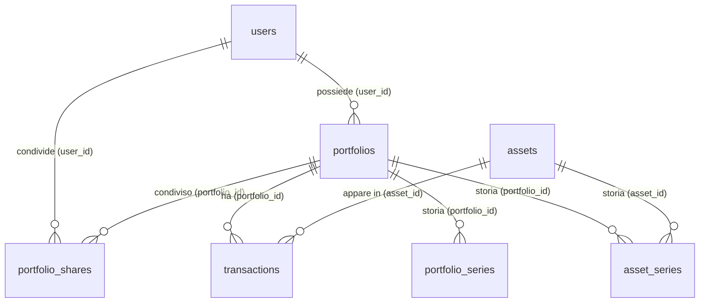
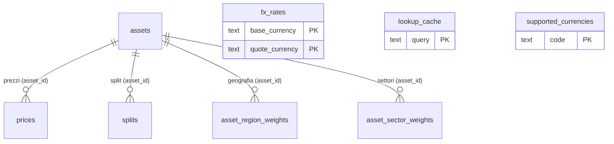

# VaultLab — Il database spiegato

> Questo documento spiega com'è fatto il database di VaultLab: quali tabelle
> esistono, cosa contengono e come sono collegate tra loro.
> È il compagno della guida al backend (`docs/BACKEND-GUIDE.it.md`) e non
> richiede conoscenze di programmazione: i concetti come chiavi e relazioni
> vengono spiegati con parole semplici e analogie.
>
> Per chi legge l'inglese esiste la versione `docs/DATABASE-GUIDE.en.md`.

---

## 1. Le basi, in dieci minuti

Il database è un programma che conserva i dati in modo ordinato su disco,
organizzati in **tabelle** (come fogli di calcolo) con **righe** (un record,
una "scheda") e **colonne** (un campo della scheda).

Ogni colonna ha un **tipo di dato**, cioè cosa può contenere:

| Tipo | Significato |
|---|---|
| `TEXT` | testo (qualsiasi stringa) |
| `UUID` | identificatore casuale lungo, es. `a3f2...` |
| `NUMERIC(18, 6)` | numero decimale esatto: fino a 18 cifre, di cui 6 decimali |
| `NUMERIC(18, 8)` | come sopra, ma con 8 decimali (usato per quantità e tassi) |
| `DATE` | una data (senza ora) |
| `TIMESTAMPTZ` | data e ora, con il fuso orario |
| `BOOLEAN` | vero/falso |
| `BIGINT` | numero intero grande (es. i volumi degli scambi) |
| `JSONB` | dati strutturati in formato JSON |

Alcune parole chiave che troverai spesso:

- **PRIMARY KEY (PK)**: la colonna che identifica in modo univoco ogni riga
  (come un codice fiscale). Non ci possono essere due righe con la stessa
  chiave.
- **FOREIGN KEY (FK)**: una colonna che "punta" alla chiave primaria di
  un'altra tabella, per collegare le righe tra loro. È il meccanismo con cui
  si costruiscono le relazioni.
- **NOT NULL**: la colonna deve avere sempre un valore (non può essere vuota).
- **DEFAULT**: il valore che la colonna prende automaticamente se non viene
  specificato (es. la data di creazione).
- **UNIQUE**: due righe non possono avere lo stesso valore in quella colonna.
- **CHECK**: una regola sui valori ammessi (es. il tipo di operazione può
  essere solo `buy`, `sell`, ecc.).
- **ON DELETE CASCADE**: "se il padre viene cancellato, cancella anche i
  figli". Esempio: se cancelli un portafoglio, si cancellano anche le sue
  transazioni. Senza CASCADE, la cancellazione del padre viene rifiutata se
  esistono figli.
- **Indice**: una "scorciatoia" che rende veloci le ricerche su una colonna
  (come l'indice analitico di un libro).

L'analogia del ristorante (dalla guida): il database è la dispensa. Le tabelle
sono gli scaffali, le righe sono le scatole sugli scaffali, e le chiavi
esterne sono le etichette che dicono "questa scatola appartiene a quest'altra".

---

## 2. Il quadro d'insieme

Ci sono quattordici tabelle, raggruppabili per argomento:

| Ambito | Tabelle | Cosa rappresentano |
|---|---|---|
| **Identità e accesso** | `users`, `portfolio_shares` | chi sono gli utenti e chi può vedere i portafogli |
| **Titoli** | `assets` | i titoli (azioni, ETF...) con tipo, classe e settore |
| **Portafogli e operazioni** | `portfolios`, `transactions` | i portafogli e le operazioni comprate/vendute |
| **Storia** | `portfolio_series`, `asset_series` | il valore e il costo giorno per giorno |
| **Dati di mercato** | `prices`, `splits`, `fx_rates` | prezzi, split azionari e tassi di cambio |
| **Esposizione** | `asset_region_weights`, `asset_sector_weights` | la distribuzione geografica e settoriale di un titolo |
| **Configurazione e cache** | `supported_currencies`, `lookup_cache` | le valute consentite e la cache della ricerca |

---

## 3. Il diagramma delle relazioni

Il diagramma usa la notazione di Mermaid (renderizzato automaticamente da
GitHub). Sull'estremità di ogni linea: `||` significa "esattamente uno",
`o{` significa "zero o più". Così `portfolios ||--o{ transactions` si legge
"un portafoglio ha molte transazioni". L'etichetta sulla linea indica la
**chiave esterna** che crea il collegamento.

### Il cuore (utenti, portafogli, titoli, operazioni)

### I dati di mercato e le tabelle indipendenti

### Le relazioni, elencate

| Figlia | Colonna | Padre | Cardinalità | Se il padre viene cancellato |
|---|---|---|---|---|
| `transactions` | `portfolio_id` | `portfolios` | 1 portafoglio → N operazioni | CASCADE (si cancellano le operazioni) |
| `transactions` | `asset_id` | `assets` | 1 titolo → N operazioni | rifiutato (non si può cancellare un titolo con operazioni) |
| `portfolios` | `user_id` | `users` | 1 utente → N portafogli | CASCADE |
| `portfolio_shares` | `portfolio_id` | `portfolios` | N portafogli ⇄ N utenti | CASCADE |
| `portfolio_shares` | `user_id` | `users` | N portafogli ⇄ N utenti | CASCADE |
| `prices` | `asset_id` | `assets` | 1 titolo → N prezzi | CASCADE |
| `splits` | `asset_id` | `assets` | 1 titolo → N split | CASCADE |
| `portfolio_series` | `portfolio_id` | `portfolios` | 1 portafoglio → N giorni | CASCADE |
| `asset_series` | `portfolio_id` | `portfolios` | 1 portafoglio → N righe | CASCADE |
| `asset_series` | `asset_id` | `assets` | 1 titolo → N righe | CASCADE |
| `asset_region_weights` | `asset_id` | `assets` | 1 titolo → N regioni | CASCADE |
| `asset_sector_weights` | `asset_id` | `assets` | 1 titolo → N settori | CASCADE |

---

## 4. Le tabelle, una per una

### `users` — gli utenti

Ogni riga è un account. La password non è salvata in chiaro, ma come **hash**
(vedi la guida, capitolo 14).

| Colonna | Tipo | Spiegazione |
|---|---|---|
| `id` | UUID (PK) | identificatore dell'utente |
| `email` | TEXT (UNIQUE) | l'email di accesso, unica |
| `name` | TEXT | il nome visibile |
| `password_hash` | TEXT | l'impronta cifrata della password |
| `role` | TEXT | ruolo: `owner`, `admin`, `editor` o `viewer` |
| `created_at` / `updated_at` | TIMESTAMPTZ | quando l'account è stato creato/modificato |

### `assets` — i titoli

Il "catalogo" dei titoli (azioni, ETF, crypto...). Il `ticker` è unico: non
esistono due titoli con lo stesso simbolo. `price_fetched_at` ricorda quando è
stato scaricato l'ultimo prezzo, per evitare chiamate inutili a Yahoo.
`exchange`, `sector`, `industry` e `asset_class` sono metadati descrittivi
modificabili sulla pagina asset; `history_backfilled` indica se lo storico
prezzi completo è già stato scaricato (vedi sotto).

| Colonna | Tipo | Spiegazione |
|---|---|---|
| `id` | UUID (PK) | identificatore |
| `ticker` | TEXT (UNIQUE) | simbolo, es. `AAPL` |
| `isin` | TEXT | codice ISIN internazionale (può mancare) |
| `name` | TEXT | nome del titolo |
| `type` | TEXT (CHECK) | `stock`, `etf`, `bond`, `mutual_fund`, `crypto`, `commodity`, `cash` |
| `asset_class` | TEXT (CHECK) | classe di investimento: `equity`, `bond`, `commodity`, `currency`, `crypto`, `real_estate`, `mixed`, `other` (default `other`) |
| `country` | TEXT | paese di origine |
| `currency` | TEXT | valuta in cui è quotato (default `USD`) |
| `exchange` | TEXT | borsa / mercato di quotazione (può essere vuoto) |
| `sector` | TEXT | settore economico (può essere vuoto) |
| `industry` | TEXT | industria specifica (può essere vuota) |
| `history_backfilled` | BOOLEAN | se lo storico prezzi completo è stato scaricato (default `FALSE`) |
| `price_fetched_at` | TIMESTAMPTZ | quando è stato aggiornato l'ultimo prezzo |
| `created_at` | TIMESTAMPTZ | quando è stato aggiunto |

> **Sullo storico completo (`history_backfilled`)**: un titolo con
> `history_backfilled = FALSE` riceve al primo sync lo **storico completo** dei
> prezzi da Yahoo (dal 1970), dopodiché la flag diventa `TRUE` e il sync è
> incrementale. La pagina asset può forzare in ogni momento un re-download
> completo ("Backfill storico completo").

### `portfolios` — i portafogli

Un portafoglio appartiene a un utente e ha una valuta di riferimento (es. gli
investimenti in euro o in dollari).

| Colonna | Tipo | Spiegazione |
|---|---|---|
| `id` | UUID (PK) | identificatore |
| `user_id` | UUID (FK) | il proprietario (→ `users.id`) |
| `name` | TEXT | nome del portafoglio |
| `description` | TEXT | descrizione (può essere vuota) |
| `currency` | TEXT | valuta del portafoglio (default `USD`) |
| `created_at` / `updated_at` | TIMESTAMPTZ | quando è stato creato/modificato |

### `portfolio_shares` — la condivisione dei portafogli

Collega due tabelle tra loro (relazione "molti a molti"): dice **quali utenti
possono vedere quali portafogli** e con che ruolo. La chiave primaria è
composta da entrambe le colonne: la stessa coppia non può ripetersi.

| Colonna | Tipo | Spiegazione |
|---|---|---|
| `portfolio_id` | UUID (FK, parte della PK) | il portafoglio condiviso |
| `user_id` | UUID (FK, parte della PK) | l'utente che ci ha accesso |
| `role` | TEXT (CHECK) | `admin`, `editor` o `viewer` |
| `created_at` | TIMESTAMPTZ | quando è stata condivisa |

### `transactions` — le operazioni

Il cuore dei dati finanziari: ogni riga è una operazione dentro un portafoglio
(comprare, vendere, dividendo, split, commissione). Punta sia al portafoglio
sia al titolo. Il prezzo è espresso nella valuta del titolo.

| Colonna | Tipo | Spiegazione |
|---|---|---|
| `id` | UUID (PK) | identificatore |
| `portfolio_id` | UUID (FK) | il portafoglio (→ `portfolios.id`) |
| `asset_id` | UUID (FK) | il titolo (→ `assets.id`) |
| `type` | TEXT (CHECK) | `buy`, `sell`, `dividend`, `split` o `fee` |
| `quantity` | NUMERIC(18, 8) | quantità (per i titoli, es. 10 azioni) |
| `price` | NUMERIC(18, 6) | prezzo unitario |
| `fees` | NUMERIC(18, 6) | commissioni pagate |
| `date` | TIMESTAMPTZ | quando è avvenuta |
| `notes` | TEXT | note libere (facoltative) |
| `created_at` | TIMESTAMPTZ | quando è stata registrata |

### `prices` — i prezzi giornalieri

Un prezzo per ogni titolo e per ogni giorno. La combinazione `asset_id + date`
è unica: un titolo ha un solo prezzo al giorno. I campi `open/high/low/close`
sono i prezzi di apertura, massimo, minimo e chiusura; `volume` è il numero di
azioni scambiate. `source` ricorda da dove arrivano i dati (`yahoo`).

| Colonna | Tipo | Spiegazione |
|---|---|---|
| `id` | UUID (PK) | identificatore |
| `asset_id` | UUID (FK) | il titolo (→ `assets.id`) |
| `date` | DATE | il giorno del prezzo |
| `open` / `high` / `low` / `close` | NUMERIC(18, 6) | i quattro prezzi del giorno |
| `volume` | BIGINT | azioni scambiate |
| `source` | TEXT | origine del dato |
| `created_at` | TIMESTAMPTZ | quando è stato salvato |

### `splits` — gli split azionari

Uno split è un evento in cui un titolo cambia il numero di azioni in circolazione
(es. 1 azione diventa 4). Le colonne `numerator` e `denominator` sono il
rapporto: `numerator/denominator`. La chiave è `asset_id + date`: un titolo
può avere un solo split per giorno.

| Colonna | Tipo | Spiegazione |
|---|---|---|
| `asset_id` | UUID (FK, parte della PK) | il titolo |
| `date` | DATE (parte della PK) | il giorno in cui lo split ha effetto |
| `numerator` | NUMERIC(18, 8) | numeratore del rapporto |
| `denominator` | NUMERIC(18, 8) | denominatore del rapporto |
| `source` | TEXT | origine del dato |
| `created_at` | TIMESTAMPTZ | quando è stato salvato |

### `asset_region_weights` — l'esposizione geografica

Per ogni titolo, quanto del suo valore è distribuito tra le **macro-regioni**
(Nord America, Europa, Asia...). Una riga per ogni `asset_id + region`; i pesi
dello stesso titolo dovrebbero idealmente sommare a 100%. Per una singola
azione c'è una sola riga (il paese mappato alla sua regione al 100%); per un
ETF è un mix inserito a mano, scaricato da Yahoo o — da B.5 — scaricato
completamente da JustETF (`POST /assets/{id}/fetch-etf-exposure`).

| Colonna | Tipo | Spiegazione |
|---|---|---|
| `asset_id` | UUID (FK, parte della PK) | il titolo (→ `assets.id`) |
| `region` | TEXT (parte della PK) | la macro-regione, es. `North America` |
| `weight` | NUMERIC(10, 4) | il peso percentuale (es. `0.6500`) |

### `asset_sector_weights` — l'esposizione settoriale

Per ogni titolo, quanto del suo valore appartiene a ogni **settore GICS**.
Una riga per ogni `asset_id + sector`; i pesi dello stesso titolo dovrebbero
sommare a 100%. Per una singola azione c'è una sola riga (il suo settore al
100%); per un ETF è il mix dei `sectorWeightings` scaricati da Yahoo.

| Colonna | Tipo | Spiegazione |
|---|---|---|
| `asset_id` | UUID (FK, parte della PK) | il titolo (→ `assets.id`) |
| `sector` | TEXT (parte della PK) | il settore GICS, es. `Technology` |
| `weight` | NUMERIC(10, 4) | il peso percentuale (es. `0.2340`) |

### `fx_rates` — i tassi di cambio

Quanto vale **1 dollaro (USD)** in un'altra valuta. La chiave è la coppia
`base_currency + quote_currency`. Non serve una tabella con tutte le coppie di
valute possibili: la conversione tra due valute qualsiasi passa attraverso il
dollaro (vedi la guida, capitolo 10).

| Colonna | Tipo | Spiegazione |
|---|---|---|
| `base_currency` | TEXT (parte della PK) | la valuta di base (default `USD`) |
| `quote_currency` | TEXT (parte della PK) | la valuta quotata |
| `rate` | NUMERIC(18, 8) | il tasso |
| `source` | TEXT | origine del dato |
| `fetched_at` | TIMESTAMPTZ | quando è stato scaricato |
| `created_at` | TIMESTAMPTZ | quando è stato salvato |

### `portfolio_series` — la serie del portafoglio

Il valore e il costo del portafoglio **per ogni giorno**, dalla prima
operazione a oggi. Questi dati sono "materializzati" (precalcolati e salvati):
il motore AVCO li ricostruisce quando i dati cambiano (vedi la guida, capitolo
9). Una riga per `portfolio_id + date`.

| Colonna | Tipo | Spiegazione |
|---|---|---|
| `portfolio_id` | UUID (FK, parte della PK) | il portafoglio |
| `date` | DATE (parte della PK) | il giorno |
| `qty` | NUMERIC | quantità totale |
| `cost_basis` | NUMERIC | totale investito |
| `market_value` | NUMERIC | valore di mercato |
| `realized` | NUMERIC | guadagno/perdita realizzata |

### `asset_series` — la serie di un singolo titolo

Come `portfolio_series`, ma per singolo titolo dentro un portafoglio. La
chiave è `portfolio_id + asset_id + date`. Un indice sulla coppia
`portfolio_id + date` accelera la lettura di tutti i titoli di un portafoglio
in un giorno.

| Colonna | Tipo | Spiegazione |
|---|---|---|
| `portfolio_id` | UUID (FK, parte della PK) | il portafoglio |
| `asset_id` | UUID (FK, parte della PK) | il titolo |
| `date` | DATE (parte della PK) | il giorno |
| `qty` | NUMERIC | quantità |
| `cost_basis` | NUMERIC | totale investito |
| `market_value` | NUMERIC | valore di mercato |
| `realized` | NUMERIC | guadagno/perdita realizzata |

### `supported_currencies` — le valute consentite

La **whitelist** delle valute che si possono usare (vedi la guida, capitolo
11). Contiene già USD ed EUR come valute di base. La colonna `enabled` permette
di disattivare una valuta senza cancellarla.

| Colonna | Tipo | Spiegazione |
|---|---|---|
| `code` | TEXT (PK) | codice, es. `USD`, `EUR` |
| `name` | TEXT | nome della valuta |
| `symbol` | TEXT | simbolo, es. `$` |
| `enabled` | BOOLEAN | se è attiva (default `TRUE`) |
| `sort` | INT | ordine di visualizzazione |
| `created_at` | TIMESTAMPTZ | quando è stata aggiunta |

### `lookup_cache` — la cache della ricerca

Quando l'utente cerca un titolo scrivendo il ticker, il risultato viene salvato
qui per qualche giorno, così la stessa ricerca non rifà la chiamata a Yahoo.
`results` contiene l'elenco dei risultati in formato JSON.

| Colonna | Tipo | Spiegazione |
|---|---|---|
| `query` | TEXT (PK) | il testo cercato |
| `results` | JSONB | i risultati della ricerca |
| `created_at` | TIMESTAMPTZ | quando è stata salvata |

---

## 5. Vincoli e indici in sintesi

**Vincoli di unicità** (impediscono duplicati):

- `users.email` — ogni email una sola volta
- `assets.ticker` — ogni simbolo una sola volta
- `prices (asset_id, date)` — un solo prezzo per titolo e giorno

**Vincoli CHECK** (regole sui valori):

- `users.role` — solo `owner`, `admin`, `editor`, `viewer`
- `assets.type` — solo i tipi di titolo ammessi
- `transactions.type` — solo `buy`, `sell`, `dividend`, `split`, `fee`
- `portfolio_shares.role` — solo `admin`, `editor`, `viewer`

**Indici** (per velocizzare le ricerche):

- su `assets`: ticker e tipo
- su `portfolios`: il proprietario
- su `transactions`: portafoglio, titolo e data
- su `prices`: titolo e data
- su `asset_series`: portafoglio + data
- su `asset_region_weights`: il titolo
- su `asset_sector_weights`: il titolo

---

## 6. Le regole comuni a tutto lo schema

- **Le chiavi primarie sono UUID** generati automaticamente, non numeri
  progressivi. Così non serve chiedere al database un nuovo numero e si lavora
  bene in parallelo.
- **Ogni tabella ha un `created_at`** (e dove serve un `updated_at`): si sa
  sempre quando una riga è nata o è cambiata.
- **Il denaro usa `NUMERIC`**, non numeri con la virgola "a singola
  precisione": così non ci sono errori di arrotondamento.
- **Le date con ora usano `TIMESTAMPTZ`**: salvano il fuso, evitando
  ambiguità quando i dati arrivano da fonti diverse.
- **Le tabelle di dati di mercato hanno una colonna `source`**: si sa sempre
  da dove arrivano i prezzi, i tassi e gli split.

---

## 7. Come si muovono i dati

In sintesi, chi scrive e chi legge:

- **Prezzi, split e tassi di cambio** li scarica il worker da Yahoo e li salva
  in `prices`, `splits`, `fx_rates` (guidato dal capitolo 12 e 13 della guida).
  Il primo sync scarica lo **storico completo** per i titoli non ancora
  backfillati (`history_backfilled`).
- **Le serie** (`portfolio_series`, `asset_series`) le ricostruisce il motore
  AVCO quando cambiano transazioni o prezzi, e le leggi per disegnare i grafici
  (capitolo 9 della guida).
- **Le operazioni** le scrive l'utente dalla pagina (via API), dentro
  `transactions`.
- **L'esposizione** (`asset_region_weights`, `asset_sector_weights`) la si
  modifica dalla pagina asset, oppure la si scarica da Yahoo per i pesi
  settoriali di un ETF quando l'utente clicca "Aggiorna da Yahoo". Da B.5
  l'esposizione **completa** paesi/regioni e settori di un ETF si scarica
  automaticamente da JustETF tramite il `python-service`
  (`POST /assets/{id}/fetch-etf-exposure`).
- **La whitelist delle valute** la gestisce l'amministratore via API in
  `supported_currencies` (capitolo 11 della guida).

---

## 8. Note e punti aperti

- **`portfolio_shares` è pronta ma non ancora usata**: la tabella della
  condivisione esiste, ma oggi l'applicazione controlla solo il proprietario
  del portafoglio.
- **`supported_currencies` parte con USD ed EUR**: le altre valute si
  aggiungono via API, e solo se Yahoo conosce la conversione dal dollaro.
- **`asset_series` e `portfolio_series` contengono dati precalcolati**:
  sono derivate dalle transazioni e dai prezzi, non sono un'origine dati
  indipendente.
- **`fx_rates` ha solo USD come base**: la conversione tra due valute
  qualsiasi passa sempre dal dollaro.
- **Le tabelle di esposizione sono solo per-asset**: esistono i pesi per-asset
  e l'allocazione pesata **per classi** a livello portafoglio
  (`GET /portfolios/{id}/allocation/class`); l'allocazione pesata geo/settore
  a livello portafoglio è implementata da EPIC B.6/B.7
  (`GET /portfolios/{id}/allocation/geography` e `/allocation/sector`,
  8 macro-regioni / 11 settori GICS + `Other`, zero-filled).
- **`assets.isin`**: Yahoo non espone l'ISIN in nessun modulo, ma da B.5 per gli
  ETF il valore viene **risolto automaticamente dal ticker** tramite il servizio
  JustETF (`POST /assets/{id}/fetch-etf-exposure` / il suo endpoint di search) e
  persistito sull'asset; resta comunque modificabile a mano come fallback.
