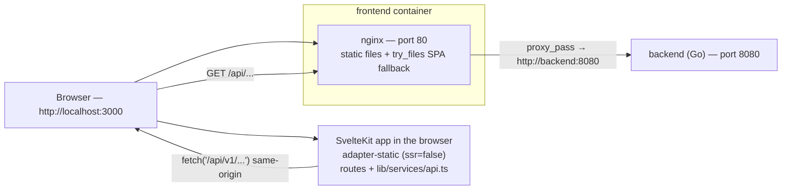

# VaultLab — The frontend explained

> This document explains how the VaultLab frontend works: the web page you see
> in the browser (charts, forms, buttons). It is the companion to the backend
> guide (`docs/BACKEND-GUIDE.en.md`) and the database guide
> (`docs/DATABASE-GUIDE.en.md`) and requires no programming knowledge: concepts
> such as components, routes and API calls are explained as we go.
>
> For Italian readers there is the version `docs/FRONTEND-GUIDE.it.md`.

---

## 1. What the frontend is

The frontend is the VaultLab web application: the user signs in, creates
portfolios, records transactions, adds securities and looks at charts
(performance, allocation, prices).

A few facts about the current state:

- **Technology**: SvelteKit 5 (Svelte 5 "runes"), TypeScript, Tailwind CSS and
  **ECharts** for the charts.
- **Runtime model**: a **client-side SPA** ("single page application"): the
  server sends a static shell and all rendering happens in the browser, which
  fetches data from the backend API with `fetch`.
- **History**: up to the first release the frontend was a **React 19 + Vite**
  application (react-router, axios, TanStack Query, Recharts). That app has
  been **fully replaced** by the SvelteKit app described here; the React code
  and its dependencies are no longer part of the repository.
- **Where it runs**: the built files are served by **nginx** inside the
  `frontend` container, published by docker-compose on host port **3000**
  (http://localhost:3000). nginx also acts as a **reverse proxy**: browser
  requests to `/api/...` are forwarded to the Go backend on port 8080.

The frontend is "dumb on purpose": it draws pages and charts, but every number
(portfolio value, gain/loss, ROI, allocations) is computed by the **backend**
(see the backend guide, chapters 8 and 9) and arrives in the browser as JSON.

---

## 2. Basic concepts

A small glossary, in the same spirit as the backend guide. If you already know
these terms, skip to chapter 3.

- **SPA (single page application)**: an application made of a single HTML page;
  when you navigate, the content changes "in place" without reloading the page.
- **Component**: a building block of the interface (a card, a table, a chart).
  In Svelte a component is a `.svelte` file that contains HTML, CSS and logic.
- **Route / page**: a URL the app can show (`/portfolios`, `/assets/123`, ...).
  In SvelteKit every folder under `src/routes/` with a `+page.svelte` file is a
  page.
- **Rune**: a Svelte 5 special symbol that makes state "reactive" (the
  interface updates automatically when data changes). The three most common
  are `$state` (a reactive variable), `$derived` (a value computed from others)
  and `$effect` (code that re-runs when its dependencies change).
- **API / endpoint**: a "phone number" of the backend (see the backend guide,
  chapter 2).
- **JSON**: the text format used to exchange data with the backend (see the
  backend guide, chapter 2).
- **JWT / token**: the credential that proves you are logged in. The backend
  issues two tokens (access and refresh); the frontend keeps them in the
  browser's `localStorage` (see chapter 9).
- **localStorage**: a small storage area of the browser that survives page
  reloads. VaultLab stores the two tokens there.
- **Chart library / ECharts**: a ready-made library for drawing charts
  (line, pie, ...). VaultLab uses ECharts through the `svelte-echarts` wrapper.
- **Proxy / reverse proxy**: a server (here nginx) that receives requests and
  forwards them elsewhere. The browser thinks it is talking to "its own"
  server, but `/api/...` is forwarded to the Go backend.
- **CORS**: a browser security rule about calling a server that lives on a
  *different* origin (e.g. localhost:3000 → localhost:8080). In the standard
  setup the browser only calls its own origin (the nginx proxy), so CORS is
  not involved.

An analogy: the **frontend is the restaurant dining room**. The pages are the
tables, the components are the plates, and the API client is the waiter who
brings the orders to the kitchen (the backend).

---

## 3. How it runs



The pieces that run (defined in `docker-compose.yml`):

- **frontend** — the web page. The image is built by `frontend/Dockerfile` in
  two stages:
  1. `node:22-alpine` installs the dependencies (`npm ci`) and runs
     `npm run build` (in `package.json` that is `vite build`);
  2. `nginx:alpine` copies the build result (`/app/build`) into
     `/usr/share/nginx/html` together with `frontend/nginx.conf`, and listens
     on port 80. docker-compose publishes it as **3000:80**.
- **backend** — the Go API on port 8080 (see the backend guide). The frontend
  container depends on it.

### How the SvelteKit build works

- `frontend/svelte.config.js` uses **`@sveltejs/adapter-static`** with
  `fallback: 'index.html'`: a "static" build, suitable for a server that only
  serves files (nginx). The `fallback` makes it a flash-less SPA: any unknown
  URL returns the shell `index.html`, which then loads the right page.
- `frontend/src/routes/+layout.ts` sets `export const ssr = false` and
  `export const prerender = false`: no server-side rendering, no prebuilt
  pages. The browser receives `index.html` + the JS/CSS assets, and the app
  renders everything client-side.
- The build output goes to `frontend/build/` (already committed in the repo).

### nginx

`frontend/nginx.conf` does two things:

- `location /api/` → `proxy_pass http://backend:8080;` (plus `Host` and
  `X-Real-IP` headers). Every API call therefore leaves the browser
  same-origin (`/api/v1/...`) and reaches the Go backend.
- `location /` → `try_files $uri $uri/ /index.html;` — serves the static files
  and falls back to the SPA shell for client-side routes.

### Dev mode

`make frontend-dev` runs `cd frontend && npm run dev`: the Vite dev server on
**port 5173** with hot-reload. `vite.config.ts` defines a proxy for anything
under `/api` → `http://backend:8080`, so the pages can call the running backend
as if it were same-origin. (The proxy target is the docker-compose service
name, so it only resolves where `backend` is a known hostname, e.g. in the
container network.)

### CORS

The backend sets CORS headers (backend guide, chapter 4), but in the standard
setup they are never exercised: the browser always calls `http://localhost:3000`
and nginx forwards to the backend, so there is no cross-origin request. CORS
matters only if the API is called directly from a page served elsewhere.

---

## 4. Directory structure

```
frontend/
├── svelte.config.js        # adapter-static + fallback index.html
├── vite.config.ts          # dev port 5173 + /api proxy
├── tailwind.config.js      # Tailwind content: ./src/**/*.{html,js,svelte,ts}
├── postcss.config.js       # tailwindcss + autoprefixer
├── Dockerfile              # node build → nginx serve (port 80)
├── nginx.conf              # static files + /api/ proxy to backend:8080
├── static/vault.svg        # favicon
└── src/
    ├── app.html            # root HTML (body classes, favicon, title)
    ├── app.css             # @tailwind base/components/utilities
    ├── app.d.ts            # SvelteKit App namespace (placeholders)
    ├── lib/                # shared code (the "meat")
    │   ├── components/     # Layout, Toaster + the 4 ECharts wrappers
    │   ├── services/api.ts # the single API client (chapter 5)
    │   ├── stores/         # auth.svelte.ts, toast.svelte.ts (Svelte 5 runes)
    │   └── format.ts       # formatters + asset-class labels (chapter 6)
    └── routes/             # the pages
        ├── +layout.ts      # ssr=false, prerender=false
        ├── +layout.svelte  # auth guard, app shell, Toaster
        ├── +page.svelte    # Dashboard (/)
        ├── login/          # login + register (one page, a toggle)
        ├── assets/         # securities list + creation (autocomplete)
        ├── assets/[id]/    # asset detail (B.10)
        ├── portfolios/     # portfolios list + CRUD + import
        ├── portfolios/[id]/ # portfolio detail (transactions, charts)
        ├── settings/       # profile, password, currency whitelist
        └── settings/health/ # price-sync health dashboard
```

> There is **no separate `/register` page**: the login page contains a
> "Sign in / Register" toggle and both forms are handled there (chapter 10).

---

## 5. The API layer

Everything lives in one file: `frontend/src/lib/services/api.ts`. It wraps the
backend HTTP API under `/api/v1`, adds authentication and a small GET cache,
and exports the TypeScript types of all responses.

### The base and the `request` function

- `const BASE_URL = '/api/v1'`. `buildUrl(path, params)` builds
  `window.location.origin + '/api/v1' + path` adding query parameters, so the
  request is always **same-origin** (nginx proxies it, chapter 3).
- `request<T>(path, {method, body, params})` is the single entry point:
  1. it builds the URL and reads the in-memory cache (chapter below);
  2. it adds `Content-Type: application/json` and, if a token exists in
     `localStorage` (`access_token`), the header
     `Authorization: Bearer <token>`;
  3. it calls `fetch`;
  4. on **401** (and only for non-`/auth/` paths) it tries to **refresh the
     session** (see below) and retries the request once;
  5. on non-OK responses it reads `{error}` from the body and throws
     `new Error(message)` with the HTTP `status` attached (pages use `status`
     to detect e.g. 404 or 409/422);
  6. a `204` returns `undefined`.

### The refresh flow (token handling)

The backend issues short-lived **access** tokens (15 min) and long-lived
**refresh** tokens (72 h) (backend guide, chapter 14). The frontend keeps both
in `localStorage` under the keys `access_token` and `refresh_token`.

When a request comes back **401**:

1. the frontend reads `refresh_token` from `localStorage`;
2. it calls `POST /auth/refresh` with `{refresh_token}`;
3. on success it saves the **new pair** in `localStorage`, updates the
   `Authorization` header and **retries the original request once**;
4. on failure (or network error) it clears both tokens and hard-redirects to
   `/login` with `window.location.replace('/login')` (deliberately bypassing
   the SvelteKit router).

### The GET cache

`api.ts` keeps a module-level `Map` of GET responses with a TTL of **60
seconds** (`CACHE_TTL_MS`). Why: the SPA navigates without reloading, so
mounting the same page again would refetch heavy endpoints (dashboard,
summaries, history) unless a cache exists. The rules:

- **any non-GET request clears the whole cache** — intentionally coarse:
  almost every mutation can change aggregated endpoints, and clearing
  everything is safer than tracking dependencies;
- cached data is deep-copied before being returned
  (`structuredClone`, falling back to JSON round-trip, never failing the
  request), so callers can never "poison" the cache by mutating a response;
- **failures (4xx/5xx) are never cached**: the normal throw/retry flow applies.

### The API groups and their endpoints

The client exposes typed objects per domain. Every endpoint below has been
verified against the backend routes (`backend/cmd/server/main.go`).

| Group | Methods | Endpoints |
|---|---|---|
| `authApi` | login, register, me, updateProfile, changePassword | `POST /auth/login`, `POST /auth/register`, `GET /users/me`, `PATCH /users/me`, `POST /users/me/password` |
| `portfolioApi` | list, create, get, update, delete | `GET /portfolios`, `POST /portfolios`, `GET/PATCH/DELETE /portfolios/{id}` |
| | summary, allocation, classAllocation, geographyAllocation, sectorAllocation, performance, roi, history | `GET /portfolios/{id}/summary`, `GET /portfolios/{id}/allocation`, `GET /portfolios/{id}/allocation/class`, `GET /portfolios/{id}/allocation/geography`, `GET /portfolios/{id}/allocation/sector`, `GET /portfolios/{id}/performance`, `GET /portfolios/{id}/roi`, `GET /portfolios/{id}/history` |
| | dashboard, dashboardAllocation | `GET /dashboard`, `GET /dashboard/allocation` |
| | exportDoc, importDoc | `GET /portfolios/{id}/export`, `POST /portfolios/import` |
| `assetApi` | list, search, lookup, meta | `GET /assets`, `GET /assets/search?q=`, `GET /assets/lookup?q=`, `GET /assets/meta?ticker=` |
| | get, create, update, remove | `GET /assets/{id}`, `POST /assets`, `PATCH /assets/{id}`, `DELETE /assets/{id}` |
| | quote, fetchProfile | `GET /assets/{id}/quote`, `POST /assets/{id}/fetch-profile` |
| | exposure, saveExposure, fetchExposure, fetchETFExposure | `GET /assets/{id}/exposure`, `PUT /assets/{id}/exposure`, `POST /assets/{id}/fetch-exposure`, `POST /assets/{id}/fetch-etf-exposure` |
| | backfillHistory, sync | `POST /assets/{id}/backfill-history`, `POST /assets/sync` |
| `transactionApi` | list, create | `GET/POST /portfolios/{id}/transactions` |
| | update, remove | `PATCH/DELETE /transactions/{id}` |
| `pricesApi` | refresh | `POST /prices/refresh` (optional query `portfolio_id`, returns the `RefreshReport`) |
| | byAsset | `GET /prices/{assetId}?full=1` |
| `settingsApi` | listCurrencies, addCurrency, deleteCurrency | `GET/POST /settings/currencies`, `DELETE /settings/currencies/{code}` |
| `api` (generic) | get/post/put/patch/delete | the raw client, used by the health page for `GET /health/prices` |

The types exported alongside (`User`, `Portfolio`, `Asset`, `Transaction`,
`PortfolioSummary`, `AssetHolding`, `Dashboard`, `RefreshReport`, `AssetQuote`,
`AssetExposure`, `PortfolioHistory`, `AssetPositionSeries`,
`PortfolioExportDocument`, ...) mirror the backend models. Note that monetary
values arrive as **strings** (e.g. `"1234.56"`) to avoid floating-point
rounding errors; the pages convert them with `Number()` where needed.

> **Note**: `portfolioApi` exposes the geography and sector allocation methods
> (`geographyAllocation(id)`, `sectorAllocation(id)` — served by the backend
> since EPIC B.6/B.7) plus the B.8 dashboard aggregate (`dashboardAllocation()`)
> — see the B.8 paragraph in chapter 11.

---

## 6. Utils and formatting resources

### `lib/format.ts`

The single formatting module, shared by all pages (there is no `utils/` or
`metrics/` directory — see below):

| Export | What it does |
|---|---|
| `currencySymbol(code)` | returns the symbol of a currency from a small table (`USD → $`, `EUR → €`, `GBP → £`, `CHF → CHF`, `JPY → ¥`, ...), falling back to the code itself for unknown ones |
| `formatCurrency(amount, currency='USD')` | `symbol + toLocaleString(...)` with exactly 2 decimals, e.g. `$1,234.56`. Accepts `number` or `string` |
| `formatPercent(value)` | `toFixed(2) + '%'`, e.g. `12.34%`. Accepts `number` or `string` |
| `ASSET_CLASS_LABELS` | map of the 8 backend asset classes to **Italian** UI labels: `equity → Azioni`, `bond → Obbligazioni`, `commodity → Materie prime`, `currency → Valute`, `crypto → Crypto`, `real_estate → Immobiliare`, `mixed → Misto`, `other → Altro` |

The label map is used wherever a class/sector name must be shown: the
portfolio "Allocazione per classi" table and donut, and the asset detail
"Classe" selector.

### Value and metric computations

There is no dedicated metrics module: each page computes its derived values
inline with Svelte 5 **`$derived`** runes. The main ones:

- **Dashboard** (`routes/+page.svelte`): `chartData` merges the per-portfolio
  historical series into a single date-keyed table for `PortfolioLineChart`;
  `hasMultipleCurrencies` decides whether the "Performance by Currency" table
  is shown; `glClass` picks the green/red text class for a gain/loss.
- **Portfolio detail** (`routes/portfolios/[id]/+page.svelte`):
  `classAllocRows` maps the backend class keys to the Italian labels for the
  donut; `gainLossClass` / `realizedClass` / `pnlClass` color the numbers.
- **Asset detail** (`routes/assets/[id]/+page.svelte`): `chartSeries` filters
  the price rows by the selected range (`RANGES`: `1M` 30 days, `3M` 90 days,
  `1Y` 365 days, `MAX` unlimited) and sorts them by date; `METRICS` maps the
  quote fields `change_1d/1w/1m/1y/ytd` to the labels `1G/1S/1M/1Y/YTD`;
  `sumRegions` / `sumSectors` validate that exposure weights sum to
  100 (±0.5, `regionsValid` / `sectorsValid`).

---

## 7. The ECharts components

All charts live in `frontend/src/lib/components/` and use **ECharts 5** via
the `svelte-echarts` wrapper (`echarts` and `svelte-echarts` dependencies in
`package.json`).

### The import pattern (tree-shaking)

Every chart component follows the same pattern:

```svelte
<script lang="ts">
  import type { EChartsOption } from 'echarts'
  import { Chart } from 'svelte-echarts'
  import { init, use } from 'echarts/core'
  import { LineChart } from 'echarts/charts'          // only what is needed
  import { GridComponent, TooltipComponent, DataZoomComponent } from 'echarts/components'
  import { CanvasRenderer } from 'echarts/renderers'

  use([LineChart, GridComponent, TooltipComponent, DataZoomComponent, CanvasRenderer])

  let { series = [], currency = 'USD' } = $props()

  const options = $derived.by((): EChartsOption => ({ ... }))
</script>

<div class="h-[340px] w-full">
  <Chart {init} {options} />
</div>
```

The `use(...)` call registers only the modules the chart needs (smaller
bundle); `init` (from `echarts/core`) is passed to the `<Chart>` wrapper, which
initialises the instance on mount. Options are declared as `EChartsOption` and
recomputed with `$derived.by`, so the chart reacts to `$props` changes.

### The chart wrappers

| Component | Chart | Used for |
|---|---|---|
| `PriceChart.svelte` | single **line** (close prices), time x-axis, `inside` + `slider` dataZoom | the **asset detail** page (B.10): historical price with the 1M/3M/1Y/YTD/MAX selector. Always loads the full history: the selectors apply an **in-place zoom** (a `start`/`end` percentage pair, `end`=100) without re-fetching; a manual zoom/pan **deselects** the active button and preserves the view. **Splits** are drawn as a dashed purple `markLine` labelled with the ratio (`Split 4:1`), like in `PositionChart`. Empty state → "Nessun dato prezzi disponibile" |
| `PositionChart.svelte` | **three lines**: cost basis (gray, stepped), market value (green, smooth), realized (amber) + dashed split markers | the **portfolio detail** "Performance history": a dropdown switches between the whole portfolio and a single asset. Split events are drawn as a vertical dashed `markLine` on the market-value line labelled with the ratio (`7:1`, `4:1`) |
| `PortfolioLineChart.svelte` | **multi-series line** (one per portfolio), category x-axis of dates | the **dashboard** "Portfolio History" card. The tooltip formats each series in its own currency (the currency comes from the `DashboardHistory` payload) |
| `ExposurePie.svelte` | **donut** (radius 45%–70%), 12-colour palette, legend shown only when there are ≤ 6 rows, zero-weight rows filtered out | **three places**: asset detail "Distribuzione geografica" and "Distribuzione settoriale", and the portfolio **class-allocation donut** (B.12). Accepts `ExposureRow[]` (`{name, weight}`) |
| `GeographyChart.svelte` (`lib/components/domain/`) | **donut** (same radius/palette as `ExposurePie`) + full-row table alongside; tooltip shows the value in the portfolio currency and the weight; the `Other` slice is muted in gray | the **portfolio detail** geography card and the **dashboard** "Allocazione complessiva" (B.8). Accepts `RegionAllocation[]` (`{region, value, weight}`); rows with zero weight stay in the table but are not drawn. Optional `covered`/`excluded` props (decimal strings) drive a coverage note ("Copre il X% del portafoglio…") shown when the excluded value is > 0 |
| `SectorChart.svelte` (`lib/components/domain/`) | identical structure over sectors | the **portfolio detail** sector card and the **dashboard** "Allocazione complessiva" (B.8). Accepts `SectorAllocation[]` (`{sector, value, weight}`), plus the same optional `covered`/`excluded` coverage note as `GeographyChart` |

Tooltips format monetary values with `formatCurrency` (chapter 6), dates with
`new Date(...).toLocaleDateString()`.

### Where they are used

- **Asset detail (B.10)** — `PriceChart` for the price history (in-place
  zoom + split markers); `ExposurePie` twice for the geo/sector distribution.
  Since EPIC F.10 (#64) the **editing** of the exposure happens in a **modal**
  (`ExposureModal`): the page shows only the two pie charts; the "Modifica"
  button (pencil icon, with `aria-label`) opens the modal with the weight
  grids, the sum=100 validation and the independent region/sector saves.
- **Portfolio detail (B.12)** — `ExposurePie` for the "Allocazione per classi"
  donut. The class rows are the `AssetClassSlice[]` returned by
  `portfolioApi.classAllocation`, mapped through `ASSET_CLASS_LABELS`.
- **Portfolio detail and dashboard (B.8)** — `GeographyChart` + `SectorChart`
  for the geo/sector allocation (per-portfolio endpoints and the
  `GET /dashboard/allocation` aggregate). Allocations are computed over the
  **equity-only universe** (stocks always, ETFs/mutual funds only when
  `asset_class` is `equity` or `real_estate`); bonds, crypto, commodities and
  unclassified funds are excluded and reported as `covered_value` /
  `excluded_value`, which the charts turn into a coverage note.
- **Dashboard** — `PortfolioLineChart` with the merged `chartData`, plus the
  B.8 "Allocazione complessiva" widgets.

---

## 8. Styling and UX

- **Tailwind CSS 3.4**: configured in `tailwind.config.js` (content = all
  `.svelte`/`.ts` under `src`, no custom theme), loaded through `app.css`
  (the three `@tailwind` directives) and PostCSS (`postcss.config.js`:
  `tailwindcss` + `autoprefixer`).
- **Utility classes, no component library**: cards are the recurring pattern
  `rounded-xl bg-white p-4 shadow`; the main accent color is blue-600
  (`bg-blue-600`, `text-blue-600`); errors/gains are green-600, losses
  red-600, warnings amber-500.
- **Icons**: `lucide-svelte`. Examples: `LayoutDashboard`, `Briefcase`,
  `Banknote`, `Settings`, `LogOut`, `ChevronUp` (app shell); `Plus`, `Trash2`,
  `Pencil`, `Download`, `Upload`, `Search`, `Loader2`, `EllipsisVertical`,
  `X`, `ExternalLink`, `Activity` (pages); `CheckCircle2`, `XCircle`,
  `AlertTriangle` (toasts).
- **Toasts** (replaces `react-hot-toast` of the old app): a tiny rune-based
  store in `lib/stores/toast.svelte.ts` (`toast.success/error/warning`) pushes
  items that auto-dismiss after 3.5 s (4.5 s for warnings);
  `lib/components/Toaster.svelte` renders the fixed top-right stack with
  colored cards (green/amber/red) and icons. `<Toaster />` is mounted once in
  `routes/+layout.svelte`, so every page can toast.
- **Responsive / mobile-first**: flex/grid classes adapt by breakpoint
  (`flex flex-col gap-4 md:flex-row`, `grid grid-cols-2 md:grid-cols-4`,
  `sm:grid-cols-2 lg:grid-cols-3`, `md:grid-cols-3 lg:grid-cols-6`), long
  tables are wrapped in `overflow-x-auto`, and the app shell
  (`lib/components/Layout.svelte`) is a fixed sidebar (`w-64`) + scrollable
  main area that stays usable on narrow screens.
- **App-wide**: `app.html` sets the body to `bg-gray-50 text-gray-900
  antialiased`, the lang to `en` and the favicon to `/vault.svg`.
- **Language note**: the UI is intentionally mixed English/Italian — most
  headings are English, while several labels, empty states and toast messages
  are Italian ("cambio mancante", "Nessuna allocazione per classi", "Aggiorna
  da Yahoo", "Salva modifiche", ...). This reflects the current product
  language; the formatters in chapter 6 follow the same mix.

---

## 9. Authentication and session

### `lib/stores/auth.svelte.ts`

A rune-based store that holds `auth.user` and `auth.isLoading`:

- `initAuth()` — reads `access_token` from `localStorage` and, if present,
  validates it with `GET /users/me` (filling `auth.user`). On failure it
  clears both tokens. Called once from the root layout on mount.
- `login(email, password)` — `POST /auth/login`, saves the **pair** in
  `localStorage`, sets `auth.user`, then
  `window.location.replace('/')` (a full reload, deliberate).
- `register(...)` — `POST /auth/register`. It does **not** log the user in:
  the login page shows "Registered! You can now log in." and switches back to
  the sign-in form.
- `logout()` — clears both tokens, `auth.user = null` and
  `window.location.replace('/login')`.
- `updateProfile(name, email)` — `PATCH /users/me` and refreshes `auth.user`.

### The root layout (`routes/+layout.svelte`)

- while `auth.isLoading` it renders a spinner;
- when the state is ready: unauthenticated users on any page except `/login`
  are redirected with `goto('/login', { replaceState: true })`; authenticated
  users on `/login` are sent to `/`;
- for authenticated users it renders the app shell (`Layout.svelte`) around
  the page content;
- it mounts `<Toaster />`;
- once per page load (`synced` flag) it calls `assetApi.sync()`
  (`POST /assets/sync`) — the backend background task that backfills history
  and splits for assets that lack them. Failures are swallowed: individual
  pages backfill what they need.

### Token storage and refresh

- Keys: `localStorage.access_token` and `localStorage.refresh_token`.
- The Bearer header and the 401 → refresh → retry logic live in
  `api.ts` (chapter 5).
- On refresh failure the app never stays in a half-logged-in state: it clears
  the tokens and hard-redirects to `/login`.

### The session price refresh

The dashboard, the portfolio detail and the asset detail pages use a
module-level flag (`sessionRefreshed`) so that, **once per session**, they call
`pricesApi.refresh()` and then refetch the data. The returned `RefreshReport`
drives toast warnings:

- `rate_limited` → "Yahoo Finance ha limitato le richieste: alcuni prezzi non
  aggiornati";
- otherwise `issues.length > 0` → "N aggiornamenti prezzi non riusciti
  (Yahoo)".

This keeps the UI working when it is opened as a deep link without passing
through the dashboard.

---

## 10. The pages, one by one

### `/` — Dashboard (`routes/+page.svelte`)

Called endpoints: `portfolioApi.dashboard()`, then the session
`pricesApi.refresh()` + a fresh dashboard.

- **Portfolio History** card: `PortfolioLineChart` (one line per portfolio).
- **Allocazione complessiva** card: `GeographyChart` + `SectorChart` side by
  side from `dashboardAllocation()` (`GET /dashboard/allocation`, aggregated
  in USD across all portfolios); when the endpoint fails the card shows
  "Allocazione non disponibile" (the call is isolated, it does not block the
  page). Both charts receive the `covered_value`/`excluded_value` coverage
  metadata and show a note when non-equity holdings are excluded.
- **Performance by Currency** table, only when more than one currency is used
  (`hasMultipleCurrencies`).
- **Portfolios** table (name, currency, assets, invested, value, realized,
  gain/loss, return).
- Expandable per-portfolio sections with the asset table (ticker link to
  `/assets/{id}`, quantity, invested, value, gain/loss, realized, ROI — with
  a "cambio mancante" badge when the FX rate is missing).
- Empty state: "Create your first portfolio" → `/portfolios`.

### `/login` — Sign in / Register (`routes/login/+page.svelte`)

A single centered card toggling between **Sign in** and **Register**
(`isRegister`). Register asks for name + email + password and, on success,
shows a toast and switches back to Sign in; login calls `store.login()` which
hard-redirects to `/`.

### `/portfolios` — Portfolios (`routes/portfolios/+page.svelte`)

Called endpoints: `portfolioApi.list()`, `settingsApi.listCurrencies()`.

- Grid of portfolio cards (name, currency, description, delete).
- **Create Portfolio** form (name, description, currency chosen from the
  whitelist).
- **Import**: hidden file input → parses a JSON export document (requires
  `version === 1`), previews its name/currency/transaction count/date range,
  and imports it in mode **"new"** (with a chosen name) or **"overwrite"**
  (over an existing portfolio); after a successful import it calls
  `assetApi.sync()` so the imported assets get their history backfilled.
- **Export** lives on the detail page (below).

### `/portfolios/[id]` — Portfolio detail (`routes/portfolios/[id]/+page.svelte`)

Called endpoints: `portfolioApi.get`, `.summary`, `.history`,
`.classAllocation`, `.geographyAllocation`, `.sectorAllocation`,
`transactionApi.list`, `assetApi.list`, then the session
`pricesApi.refresh(id)` + fresh summary.

- KPI cards: Value, Realized, Gain/Loss (open, with %), Assets.
- **Positions** table (`summary.holdings`, ticker linking to `/assets/{id}`,
  closed positions shown with a "Closed" badge and `-`).
- **Performance history**: `PositionChart` with a dropdown to switch between
  the portfolio and each asset (splits drawn on the chart).
- **Allocazione per classi**: donut (`ExposurePie`) + table from
  `classAllocation()`; class keys are mapped through `ASSET_CLASS_LABELS`.
  If the endpoint fails, the page shows "non disponibile" without blocking the
  rest (the call is isolated in its own try/catch).
- **Allocazione geografica e settoriale**: two cards side by side
  (`md:flex-row`, one per chart) with `GeographyChart` /
  `SectorChart` from `geographyAllocation()` / `sectorAllocation()`; each
  endpoint is isolated in its own try/catch ("non disponibile" on failure,
  never blocking the page). Charts receive the `covered_value`/`excluded_value`
  coverage metadata and show a note when non-equity holdings are excluded.
- **Transactions**: table (date, asset, type badge, quantity, price, total),
  add/edit form for **buy / sell / dividend** (dividend asks the total amount
  instead of quantity × price; quantity is sent as `1`), delete with confirm.
  After each mutation the list, the summary and the history are refetched.
- **Export**: `portfolioApi.exportDoc(id)` → JSON file download
  (`vault-lab-<name>.json`).

### `/assets` — Assets (`routes/assets/+page.svelte`)

Called endpoints: `assetApi.list()`, `settingsApi.listCurrencies()`.

- Table of securities (ticker → detail link, name, type, currency, country,
  delete).
- **Add Asset**: ticker field with **autocomplete** — as you type (from 2
  characters, debounced 350 ms) it calls `assetApi.lookup(q)`
  (`GET /assets/lookup?q=`) and shows a suggestion dropdown; selecting one
  enriches the form with `assetApi.meta(ticker)` (`GET /assets/meta?ticker=`).
  Create → `assetApi.create()`.

### `/assets/[id]` — Asset detail (`routes/assets/[id]/+page.svelte`)

Called endpoints: `assetApi.get`, `.quote`, `pricesApi.byAsset(id)`,
`assetApi.exposure(id)`, then the session `pricesApi.refresh()` + fresh
quote/prices.

- **Caratteristiche**: editable Ticker, ISIN, Name, Type, Currency, Exchange
  and Classe (`ASSET_CLASS_LABELS`). `hasChanges` enables "Salva modifiche"
  (`PATCH /assets/{id}`; `asset_class` manual override always wins — the
  Yahoo refresh never overwrites a non-`other` class).
- The "⋮" menu has two actions:
  - **Aggiorna da Yahoo** — `assetApi.meta(ticker)` to refresh name/type/
    currency/exchange (and class only when currently empty/`other`);
  - **Backfill storico completo** — `assetApi.backfillHistory(id)`, then a
    fresh `pricesApi.byAsset(id)` (the client GET cache was already cleared by
    the POST).
- **Metriche quote**: "Ultima chiusura" + the 5 change percentages
  (1G/1S/1M/1Y/YTD) from `AssetQuote`, green/gray/red coloring; a 404 on load
  redirects to `/assets`.
- **Storico prezzo**: `PriceChart` with the 1M/3M/1Y/YTD/MAX selector (in-place zoom).
- **Distribuzione geografica** and **Distribuzione settoriale**: the page
  keeps only the "Distribuzione" header with the "Modifica" button (pencil
  icon) and the two `ExposurePie` donuts; all editing happens inside an
  `ExposureModal`. The modal is **split into two side-by-side parts** (region
  on the left, sector on the right), each with its editable weight table, the
  live sum validated to 100 ± 0.5 (else the save is disabled) and its own
  donut. The **prefill buttons live only inside the modal**, next to each
  part's title, and fill **only the respective dimension**:
  - region: a single **"Prefill JustETF"** button (`fetchETFExposure`, applies
    `regions` only);
  - sector: **"Prefill JustETF"** (`fetchETFExposure`, applies `sectors`
    only) and **"Prefill Yahoo"** (`fetchExposure`, Yahoo `topHoldings`,
    applies `sectors` only).
  At the bottom of the modal the two **legends** are gathered in a **single
  two-column box** (region on the left, sectors on the right) with a palette
  matching the pie charts, so all entries (e.g. the 11 GICS sectors) are
  always visible even when the pie chart cannot render an inline legend.
  Saving sends **only the edited dimension**
  (`PUT /assets/{id}/exposure` with `{regions}` or `{sectors}` — omitting a
  key leaves the other untouched), then reloads the canonical response. The
  exposure section is rendered only when the asset is actionable for the
  equity universe (`exposureApplicable`: stock, or etf/mutual_fund with
  `asset_class`
  `equity`/`real_estate`); otherwise a hint banner explains that the
  distribution only applies to equity assets.
- **Prefill da Yahoo** — `assetApi.fetchExposure(id)`
  (`POST /assets/{id}/fetch-exposure`, the Yahoo `topHoldings` sector weights)
  pre-fills the sector table.
- **Carica da JustETF** — `assetApi.fetchETFExposure(id)`
  (`POST /assets/{id}/fetch-etf-exposure`): fetches from the JustETF
  microservice and saves both the geographic distribution (countries →
  canonical macro-regions) and the GICS sectors; only visible for ETF assets
  (`asset.type !== 'etf'` ⇒ button disabled). It also syncs the ISIN resolved
  by the backend into the form's ISIN field.

### `/settings` — Settings (`routes/settings/+page.svelte`)

Called endpoints: `settingsApi.listCurrencies()`, `updateProfile()`,
`authApi.changePassword()`.

- **Profile** (name/email) and **Change password**
  (`POST /users/me/password` with `current_password` + `new_password`,
  frontend check that the two new ones match).
- **Infrastruttura** card with a link to the health dashboard
  (`/settings/health`).
- **Valute gestite**: the currency whitelist CRUD — add a 3-letter code (a
  422 from the backend means Yahoo has no USD→code conversion and the frontend
  shows a specific message; 409 means already present), delete with confirm
  (409 = in use or protected). Symbols rendered with `currencySymbol()`.

### `/settings/health` — Price Sync Health (`routes/settings/health/+page.svelte`)

The only page that uses the **generic client**: `api.get('/health/prices')`
(same-origin `/api/v1/health/prices`). It shows 4 summary cards (Success Rate,
Total Successes, Total Failures, Rate Limited) and a table of the recent
events (timestamp, type, status badge, code, message, duration), with a
"Refresh Now" button.

---

## 11. Notes and open points

- **B.8 is implemented (issue #14)** — the geography and sector allocation
  widgets ship in this release:
  - `portfolioApi` exposes `geographyAllocation(id)` /
    `sectorAllocation(id)` (`GET /portfolios/{id}/allocation/geography` and
    `/allocation/sector`: weighted sums, zero-filled, over the 8
    macro-regions and the 11 GICS sectors, both + `Other`) and
    `dashboardAllocation()` (`GET /dashboard/allocation`, the same rows
    aggregated across all portfolios in USD). The response interfaces live
    next to `PortfolioClassAllocation` in `api.ts`
    (`RegionAllocation`, `SectorAllocation`,
    `PortfolioGeographyAllocation`, `PortfolioSectorAllocation`,
    `DashboardAllocation`);
  - `GeographyChart` / `SectorChart` (`lib/components/domain/`) render a
    12-color donut (`radius: ['45%','70%']`, legend when ≤ 6 non-empty rows)
    with the full-row table alongside (zero-weight rows stay in the table but
    are not drawn); the tooltip shows the value formatted in the portfolio
    currency and the weight, and the `Other` slice is muted in gray;
  - the portfolio detail page shows the two donuts side by side below
    "Allocazione per classi" (`md:flex-row`, one card each), and the dashboard
    adds an "Allocazione complessiva" card (a `md:grid-cols-2` grid) fed by
    `GET /dashboard/allocation`;
- **Equity-only universe (B.8 follow-up)** — the geo/sector allocations cover
  only equity holdings (stocks always; ETFs/mutual funds only when
  `asset_class` is `equity` or `real_estate`). Bonds, crypto, commodities and
  unclassified funds are excluded and surfaced as `covered_value` /
  `excluded_value` on the geography, sector and dashboard responses; the charts
  show a "Copre il X% del portafoglio…" note when the excluded value is
  positive, and the asset detail page renders the distribution cards only for
  actionable equity assets (hint banner otherwise);
- **No separate `/register` page**: registration is a toggle inside `/login`.
- **No manual price entry in the UI**: prices only come from Yahoo (the
  session refresh, the worker, or the "Backfill storico completo" action).
- **JSON export/import exists** (document version 1, modes new/overwrite);
  CSV import does not.
- **The transaction form offers buy/sell/dividend**: the API and the
  `Transaction` type also include `split` and `fee`, but the UI can only
  create those three types (it can still display/edit the others).
- **UI strings are mixed English/Italian** — see chapter 8.
- **The GET cache is coarse by design** (60 s TTL, full invalidation on any
  mutation): after saving something, the next read refetches. Never cache
  errors.
- **CORS is configured on the backend but not exercised** in the standard
  setup, because the browser only talks to nginx (same origin).
- **The pages described in this guide are the current state**: the dashboard
  now ships the B.8 allocation widgets ("Allocazione complessiva" card, see the
  B.8 paragraph above), and the old React-era description of the frontend
  (React 19 / axios / Recharts) is obsolete.