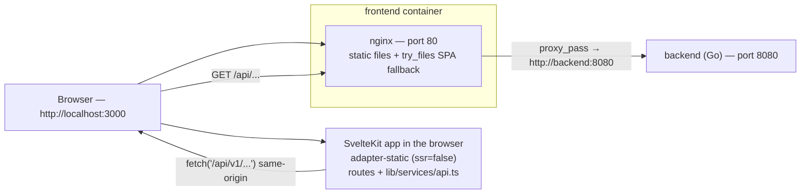

# Peculium — The frontend explained

> This document explains how the Peculium frontend works: the web page you see
> in the browser (charts, forms, buttons). It is the companion to the backend
> guide (`docs/BACKEND-GUIDE.en.md`) and the database guide
> (`docs/DATABASE-GUIDE.en.md`) and requires no programming knowledge: concepts
> such as components, routes and API calls are explained as we go.
>
> For Italian readers there is the version `docs/FRONTEND-GUIDE.it.md`.

---

## 1. What the frontend is

The frontend is the Peculium web application: the user signs in, creates
portfolios, records transactions, adds securities and looks at charts
(performance, allocation, prices).

A few facts about the current state:

- **Technology**: SvelteKit 5 (Svelte 5 "runes"), TypeScript, Tailwind CSS and
  **ECharts** for the charts.
- **Runtime model**: a **client-side SPA** ("single page application"): the
  server sends a static shell and all rendering happens in the browser, which
  fetches data from the backend API with `fetch`.
- **Where it runs**: the built files are served by **nginx** inside the
  `frontend` container, published by docker-compose on host port **3000**
  (http://localhost:3000). nginx also acts as a **reverse proxy**: browser
  requests to `/api/...` are forwarded to the Go backend on port 8080.

The frontend is "dumb on purpose": it draws pages and charts, but every number
(portfolio value, gain/loss, ROI, allocations) is computed by the **backend**
(see the backend guide, chapters 8 and 9) and arrives in the browser as JSON.

---

## 2. Basic concepts

A small glossary, in the same spirit as the backend guide. If you already know
these terms, skip to chapter 3.

- **SPA (single page application)**: an application made of a single HTML page;
  when you navigate, the content changes "in place" without reloading the page.
- **Component**: a building block of the interface (a card, a table, a chart).
  In Svelte a component is a `.svelte` file that contains HTML, CSS and logic.
- **Route / page**: a URL the app can show (`/portfolios`, `/assets/123`, ...).
  In SvelteKit every folder under `src/routes/` with a `+page.svelte` file is a
  page.
- **Rune**: a Svelte 5 special symbol that makes state "reactive" (the
  interface updates automatically when data changes). The three most common
  are `$state` (a reactive variable), `$derived` (a value computed from others)
  and `$effect` (code that re-runs when its dependencies change).
- **API / endpoint**: a "phone number" of the backend (see the backend guide,
  chapter 2).
- **JSON**: the text format the app uses to exchange data with the backend (see the
  backend guide, chapter 2).
- **JWT / token**: the credential that proves you are logged in. The backend
  issues two tokens (access and refresh); the frontend keeps them in the
  browser's `localStorage` (see chapter 9).
- **localStorage**: a small storage area of the browser that survives page
  reloads. Peculium stores the two tokens there.
- **Chart library / ECharts**: a ready-made library for drawing charts
  (line, pie, ...). Peculium uses ECharts through the `svelte-echarts` wrapper.
- **Proxy / reverse proxy**: a server (here nginx) that receives requests and
  forwards them elsewhere. The browser thinks it is talking to "its own"
  server, but `/api/...` is forwarded to the Go backend.
- **CORS**: a browser security rule about calling a server that lives on a
  *different* origin (e.g. localhost:3000 → localhost:8080). In the standard
  setup the browser only calls its own origin (the nginx proxy), so CORS is
  not involved.

An analogy: the **frontend is the restaurant dining room**. The pages are the
tables, the components are the plates, and the API client is the waiter who
brings the orders to the kitchen (the backend).

---

## 3. How it runs



The pieces that run (defined in `docker-compose.yml`):

- **frontend** — the web page. The image is built by `frontend/Dockerfile` in
  two stages:
  1. `node:22-alpine` installs the dependencies (`npm ci`) and runs
     `npm run build` (in `package.json` that is `vite build`);
  2. `nginx:alpine` copies the build result (`/app/build`) into
     `/usr/share/nginx/html` together with `frontend/nginx.conf`, and listens
     on port 80. docker-compose publishes it as **3000:80**.
- **backend** — the Go API on port 8080 (see the backend guide). The frontend
  container depends on it.

### How the SvelteKit build works

- `frontend/svelte.config.js` uses **`@sveltejs/adapter-static`** with
  `fallback: 'index.html'`: a "static" build, suitable for a server that only
  serves files (nginx). The `fallback` makes it a flash-less SPA: any unknown
  URL returns the shell `index.html`, which then loads the right page.
- `frontend/src/routes/+layout.ts` sets `export const ssr = false` and
  `export const prerender = false`: no server-side rendering, no prebuilt
  pages. The browser receives `index.html` + the JS/CSS assets, and the app
  renders everything client-side.
- The build output goes to `frontend/build/` (already committed in the repo).

### nginx

`frontend/nginx.conf` does two things:

- `location /api/` → `proxy_pass http://backend:8080;` (plus `Host` and
  `X-Real-IP` headers). Every API call therefore leaves the browser
  same-origin (`/api/v1/...`) and reaches the Go backend.
- `location /` → `try_files $uri $uri/ /index.html;` — serves the static files
  and falls back to the SPA shell for client-side routes.

### Dev mode

`make frontend-dev` runs `cd frontend && npm run dev`: the Vite dev server on
**port 5173** with hot-reload. `vite.config.ts` defines a proxy for anything
under `/api` → `http://backend:8080`, so the pages can call the running backend
as if it were same-origin. (The proxy target is the docker-compose service
name, so it only resolves where `backend` is a known hostname, e.g. in the
container network.)

### CORS

The backend sets CORS headers (backend guide, chapter 4), but in the standard
setup they are never exercised: the browser always calls `http://localhost:3000`
and nginx forwards to the backend, so there is no cross-origin request. CORS
matters only if the API is called directly from a page served elsewhere.

---

## 4. Directory structure

```
frontend/
├── svelte.config.js        # adapter-static + fallback index.html
├── vite.config.ts          # dev port 5173 + /api proxy
├── tailwind.config.js      # Tailwind content: ./src/**/*.{html,js,svelte,ts}
├── postcss.config.js       # tailwindcss + autoprefixer
├── Dockerfile              # node build → nginx serve (port 80)
├── nginx.conf              # static files + /api/ proxy to backend:8080
├── static/peculium.svg     # favicon
└── src/
    ├── app.html            # root HTML (theme bootstrap, meta theme-color, favicon, title)
    ├── app.css             # @tailwind + semantic tokens (:root / .dark) + base layer
    ├── app.d.ts            # SvelteKit App namespace (placeholders)
    ├── lib/                # shared code (the "meat")
    │   ├── components/     # ui/ primitives, layout/ (AppShell + adaptive chrome), Toaster + the ECharts wrappers
    │   ├── services/api.ts # the single API client (chapter 5)
    │   ├── stores/         # auth.svelte.ts, toast.svelte.ts, theme.svelte.ts, viewport.svelte.ts (Svelte 5 runes)
    │   ├── i18n/           # en.ts/it.ts dictionaries + reactive locale store
    │   ├── chartPalette.ts # series palette + runtime token resolution (dark-aware)
    │   ├── chartTheme.ts   # registered ECharts themes for light/dark
    │   └── format.ts       # formatters + asset-class labels (chapter 6)
    └── routes/             # the pages
        ├── +layout.ts      # ssr=false, prerender=false
        ├── +layout.svelte  # auth guard, AppShell, Toaster
        ├── +page.svelte    # Dashboard (/)
        ├── login/          # login + register (one page, a toggle)
        ├── assets/         # securities list + creation (autocomplete)
        ├── assets/[id]/    # asset detail shell: sticky header
        │   │               #   (identity, quote chips), tabs;
        │   │               #   all data loading + context
        │   ├── +page.svelte        #   Overview tab (index): price chart,
        │   │                        #   "Where held", quick facts
        │   ├── exposure/           #   Exposure tab (countries/regions/sectors)
        │   └── data/               #   Data tab (metadata form, danger zone)
        ├── portfolios/     # portfolios list + CRUD + import
        ├── portfolios/[id]/ # portfolio detail shell: sticky header,
        │                    # KPI strip, tabs; all data loading + context
        │   ├── +page.svelte        #   Overview tab (index)
        │   ├── positions/          #   Positions tab
        │   ├── activity/           #   Activity tab (paginated transactions
        │   │                       #   + URL-persisted filters)
        │   ├── tx-filters.ts       #   Activity filter model + URL query codec
        │   └── allocation/         #   Allocation tab
        ├── settings/       # profile, password, currency whitelist
        └── admin/health/   # price-sync health dashboard — "Data & Sync"
```

> There is **no separate `/register` page**: the login page contains a
> "Sign in / Register" toggle and both forms are handled there (chapter 10).

---

## 5. The API layer

Everything lives in one file: `frontend/src/lib/services/api.ts`. It wraps the
backend HTTP API under `/api/v1`, adds authentication and a small GET cache,
and exports the TypeScript types of all responses.

### The base and the `request` function

- `const BASE_URL = '/api/v1'`. `buildUrl(path, params)` builds
  `window.location.origin + '/api/v1' + path` adding query parameters, so the
  request is always **same-origin** (nginx proxies it, chapter 3).
- `request<T>(path, {method, body, params})` is the single entry point:
  1. it builds the URL and reads the in-memory cache (chapter below);
  2. it adds `Content-Type: application/json` and, if a token exists in
     `localStorage` (`access_token`), the header
     `Authorization: Bearer <token>`;
  3. it calls `fetch`;
  4. on **401** (and only for non-`/auth/` paths) it tries to **refresh the
     session** (see below) and retries the request once;
  5. on non-OK responses it reads `{error}` from the body and throws
     `new Error(message)` with the HTTP `status` attached (pages use `status`
     to detect e.g. 404 or 409/422);
  6. a `204` returns `undefined`.

### The refresh flow (token handling)

The backend issues short-lived **access** tokens (15 min) and long-lived
**refresh** tokens (72 h) (backend guide, chapter 14). The frontend keeps both
in `localStorage` under the keys `access_token` and `refresh_token`.

When a request comes back **401**:

1. the frontend reads `refresh_token` from `localStorage`;
2. it calls `POST /auth/refresh` with `{refresh_token}`;
3. on success it saves the **new pair** in `localStorage`, updates the
   `Authorization` header and **retries the original request once**;
4. on failure (or network error) it clears both tokens and hard-redirects to
   `/login` with `window.location.replace('/login')` (deliberately bypassing
   the SvelteKit router).

### The GET cache

`api.ts` keeps a module-level `Map` of GET responses with a TTL of **60
seconds** (`CACHE_TTL_MS`). Why: the SPA navigates without reloading, so
mounting the same page again would refetch heavy endpoints (dashboard,
summaries, history) unless a cache exists. The rules:

- **any non-GET request clears the whole cache** — intentionally coarse:
  almost every mutation can change aggregated endpoints, and clearing
  everything is safer than tracking dependencies;
- cached data is deep-copied before being returned
  (`structuredClone`, falling back to JSON round-trip, never failing the
  request), so callers can never "poison" the cache by mutating a response;
- **failures (4xx/5xx) are never cached**: the normal throw/retry flow applies.

### The API groups and their endpoints

The client exposes typed objects per domain. Every endpoint below is verified
against the backend routes (`backend/cmd/server/main.go`).

| Group | Methods | Endpoints |
|---|---|---|
| `authApi` | login, register, me, updateProfile, changePassword | `POST /auth/login`, `POST /auth/register`, `GET /users/me`, `PATCH /users/me`, `POST /users/me/password` |
| `portfolioApi` | list, create, get, update, delete | `GET /portfolios`, `POST /portfolios`, `GET/PATCH/DELETE /portfolios/{id}` |
| | summary, allocation, classAllocation, geographyAllocation, sectorAllocation, allocationDrill, performance, performanceBuckets, roi, history | `GET /portfolios/{id}/summary`, `GET /portfolios/{id}/allocation`, `GET /portfolios/{id}/allocation/class`, `GET /portfolios/{id}/allocation/geography`, `GET /portfolios/{id}/allocation/sector`, `GET /portfolios/{id}/allocation/drill?dim=class\|country\|region\|sector&key=<bucket>`, `GET /portfolios/{id}/performance`, `GET /portfolios/{id}/performance/buckets?granularity=month|year`, `GET /portfolios/{id}/roi`, `GET /portfolios/{id}/history` |
| | dashboard, dashboardAllocation, dashboardAllocationDrill, dashboardPerformance | `GET /dashboard`, `GET /dashboard/allocation`, `GET /dashboard/allocation/drill?dim=&key=`, `GET /dashboard/performance?granularity=month|year` |
| | exportDoc, importDoc | `GET /portfolios/{id}/export`, `POST /portfolios/import` |
| `assetApi` | list, search, lookup, meta | `GET /assets`, `GET /assets/search?q=`, `GET /assets/lookup?q=`, `GET /assets/meta?ticker=` |
| | get, create, update, remove | `GET /assets/{id}`, `POST /assets`, `PATCH /assets/{id}`, `DELETE /assets/{id}` |
| | quote, fetchProfile | `GET /assets/{id}/quote`, `POST /assets/{id}/fetch-profile` |
| | exposure, saveExposure, fetchExposure, fetchETFExposure, fetchMorningstarExposure | `GET /assets/{id}/exposure`, `PUT /assets/{id}/exposure`, `POST /assets/{id}/fetch-exposure`, `POST /assets/{id}/fetch-etf-exposure`, `POST /assets/{id}/fetch-morningstar-exposure` |
| | backfillHistory, sync | `POST /assets/{id}/backfill-history`, `POST /assets/sync` |
| `transactionApi` | list, create | `GET /portfolios/{id}/transactions?limit=&offset=&type=&asset_id=&from=&to=` (returns the `TransactionPage` envelope — `transactions`, `total`, applied `limit`/`offset`; default limit 20, max 100, order date desc; the optional combinable filters `type` (buy/sell/dividend/split/fee), `asset_id` (uuid) and the inclusive `from`/`to` `YYYY-MM-DD` bounds narrow the rows **and** the returned `total`), `POST /portfolios/{id}/transactions` |
| | update, remove | `PATCH/DELETE /transactions/{id}` |
| `pricesApi` | refresh | `POST /prices/refresh` (optional query `portfolio_id`, returns the `RefreshReport`) |
| | byAsset | `GET /prices/{assetId}?full=1` |
| `settingsApi` | listCurrencies, addCurrency, deleteCurrency | `GET/POST /settings/currencies`, `DELETE /settings/currencies/{code}` |
| `api` (generic) | get/post/put/patch/delete | the raw client, used by the health page for `GET /health/prices` |

The types exported alongside (`User`, `Portfolio`, `Asset`, `Transaction`,
`TransactionPage`, `PortfolioSummary`, `AssetHolding`, `Dashboard`,
`DashboardSummary`, `ActiveBreakdown`, `ClosedBreakdown`, `RefreshReport`,
`AssetQuote`,
`AssetExposure`, `PortfolioHistory`, `AssetPositionSeries`,
`PortfolioExportDocument`, ...) mirror the backend models. Monetary values
arrive as **strings** (e.g. `"1234.56"`) to avoid floating-point rounding
errors; the pages convert them with `Number()` where needed. `User` carries the
`base_currency` preference (`"EUR"` by default) and `Dashboard` carries
`base_currency` plus the optional `summary` (`DashboardSummary`) with the
consolidated totals in that currency. The summary and each `portfolios` entry
(`PortfolioPerformanceSummary`) split those totals into the nested `active`
(`ActiveBreakdown`: invested, value, gain/loss, gain/loss % and dividends of
the lots still held) and `closed` (`ClosedBreakdown`: invested = cost of the
sold lots, proceeds = net sale proceeds + dividends of fully-closed positions,
realized = proceeds − invested, realized %) objects; the totals live only in
these nested objects. The `Dashboard` payload does not carry a per-portfolio
`history` series: the `DashboardPerformance` / `PerformanceBucket` types feed
the dashboard "Performance" chart and the hero value-vs-invested chart through
`dashboardPerformance(granularity)`
(`GET /dashboard/performance?granularity=month|year`, buckets `YYYY-MM` or
`YYYY` in the user's base currency). The **same** `DashboardPerformance` shape
also feeds the portfolio detail "Performance" card through
`performanceBuckets(id, granularity)`
(`GET /portfolios/{id}/performance/buckets?granularity=month|year`), in the
**portfolio's own** currency rather than the base currency. Each bucket carries
`return` (the bucket's true TWR return %, bars), `twr` (the cumulative
time-weighted return %, line), `invested` (net invested capital at the
bucket's end) and `value` (market value at the bucket's end) — the two
amounts in the payload's `currency`. `Dashboard` also carries `invested_assets`
(`InvestedAsset[]`): the open positions aggregated across all portfolios in the
base currency (`ticker`, `name`, `invested`, `value`, `gain_loss`,
`gain_loss_pct`, `has_price`), sorted by descending value — rows with
`has_price: false` carry their value at cost, so their P/L is 0.
`transactionApi.list(id, { limit, offset })` returns the `TransactionPage`
envelope (`transactions`, `total`, applied `limit`/`offset`; default limit 20,
max 100, order date desc) rather than a bare array, which the portfolio detail
paginates; it also accepts the optional list filters `type`, `asset_id`, `from`
and `to` (each omitted when unset), in which case `total` is the *filtered*
count.

---

## 6. Utils and formatting resources

### `lib/format.ts`

The single formatting module, shared by all pages (there is no `utils/` or
`metrics/` directory — see below):

| Export | What it does |
|---|---|
| `currencySymbol(code)` | returns the symbol of a currency from a small table (`USD → $`, `EUR → €`, `GBP → £`, `CHF → CHF`, `JPY → ¥`, ...), falling back to the code itself for unknown ones |
| `formatCurrency(amount, currency='USD')` | `symbol + toLocaleString(...)` with exactly 2 decimals, e.g. `$1,234.56`. Accepts `number` or `string` |
| `formatPercent(value)` | `toFixed(2) + '%'`, e.g. `12.34%`. Accepts `number` or `string` |
| `formatSignedPercent(value)` | like `formatPercent` but forces an explicit `+` on positive values, e.g. `+3.42%` / `-1.20%`. Used by the Performance chart tooltip (both the per-bucket `return` and the cumulative `twr` are percentages where the sign carries the meaning). Accepts `number` or `string` |
| `ASSET_TYPES` / `ASSET_CLASSES` | read-only value lists offered by the Type / Class selects: `stock, etf, bond, mutual_fund, crypto, commodity` / `equity, bond, commodity, currency, crypto, real_estate, mixed, other` |
| `assetTypeLabel(type)` / `assetClassLabel(cls)` / `priceSourceLabel(source)` | localized labels for the raw backend values, resolved through the i18n `t()` so they follow the interface language (asset types `asset.typeStock` … `asset.typeCash`, classes `asset.classEquity` … `asset.classOther`, sources `asset.priceSourceYahoo` / `priceSourceManual` / `priceSourceNone`); values outside the tables fall back to the raw string; reactive — they re-render when the locale changes |

The label helpers are used wherever these values must be shown:
`assetClassLabel` inside `ClassDonut` (the asset-class donuts of the dashboard
"Allocazione complessiva" card and of the portfolio detail allocation section,
which label the backend class keys themselves) and in the allocation drill
titles of both pages, and on the asset detail (identity chip, quick fact,
Class select); `assetTypeLabel` and `priceSourceLabel` likewise back the
Type/Price-source surfaces of the asset detail and the create-asset modal.

### Value and metric computations

There is no dedicated metrics module: each page computes its derived values
inline with Svelte 5 **`$derived`** runes. The main ones:

- **Dashboard** (`routes/+page.svelte`): the Performance card + hero capital
  chart state is a `granularity` `$state` ('month'
  by default) plus a single `perf` `$state` (one `dashboardPerformance(granularity)`
  fetch feeds **both** charts) refetched by a `$effect` on every toggle change
  (a monotonic request id discards stale responses); the hero chart is then
  windowed client-side by a bucket-driven `heroPeriod` `$state` (1Y =
  last 12 / 3Y = last 36 / ALL monthly buckets, persisted in
  `localStorage['vaultlab-hero-period']`); `hasMultipleCurrencies` drives the
  "Allocation by portfolio" donut (raw values are hidden and a mixed-currency
  note is shown when portfolios use different currencies);
  `glClass` picks the green/red text class for a gain/loss.
- **Portfolio detail** (`routes/portfolios/[id]/+page.svelte`):
  the "Performance" card state mirrors the dashboard's: a
  `granularity` `$state` ('month' by default) plus a `perf` `$state` refetched
  by a `$effect` on every toggle change (a monotonic request id discards stale
  responses), fed by `performanceBuckets(id, granularity)`;
  `regionBarRows` / `sectorBarRows` / `countryBarRows` map the allocation
  payloads onto the `ExposureBarRow` shape consumed by `ExposureBarChart`;
  `geoUniverseNote` / `sectorUniverseNote` build the
  "Universo azionario" coverage captions from each payload's
  `covered_value`/`excluded_value`.
- **Asset detail**: `chartSeries` in the Overview tab (`routes/assets/[id]/
  +page.svelte`) sorts the price rows and `zoomStart` maps the selected range
  (`RANGES`: `1M` 30 days, `3M` 90 days, `1Y` 365 days, `YTD`, `MAX` unlimited)
  to an in-place zoom; the quote fields `change_1d/1w/1m/1y/ytd` render as
  header delta chips (labels `1G/1S/1M/1Y/YTD` ↔ `1D/1W/1M/1Y/YTD`
  through `t()`); `sumRegions` / `sumSectors` / `sumCountries` and their
  validity guards (`regionsValid` / `sectorsValid` / `countriesValid`) live
  in the asset shell (`+layout.svelte`) beside the data they validate.

---

## 7. The ECharts components

All charts live in `frontend/src/lib/components/` and use **ECharts 5** via
the `svelte-echarts` wrapper (`echarts` and `svelte-echarts` dependencies in
`package.json`).

### The import pattern (tree-shaking)

Every chart component follows the same pattern:

```svelte
<script lang="ts">
  import type { EChartsOption } from 'echarts'
  import { Chart } from 'svelte-echarts'
  import { init, use } from 'echarts/core'
  import { LineChart } from 'echarts/charts'          // only what is needed
  import { GridComponent, TooltipComponent, DataZoomComponent } from 'echarts/components'
  import { CanvasRenderer } from 'echarts/renderers'

  use([LineChart, GridComponent, TooltipComponent, DataZoomComponent, CanvasRenderer])

  let { series = [], currency = 'USD' } = $props()

  const options = $derived.by((): EChartsOption => ({ ... }))
</script>

<div class="h-[340px] w-full">
  {#key resolved()}
    <Chart {init} {options} theme={VAULTLAB_CHART_THEMES[resolved()]} />
  {/key}
</div>
```

The `use(...)` call registers only the modules the chart needs (smaller
bundle); `init` (from `echarts/core`) is passed to the `<Chart>` wrapper, which
initialises the instance on mount. Options are declared as `EChartsOption` and
recomputed with `$derived.by`, so the chart reacts to `$props` changes.

### Dark-aware charts

Charts also follow the theme (chapter 8). The `resolved()` helper from the
theme store tells whether the app is currently painting light or dark; the
`{#key resolved()}` block forces the chart wrapper to **re-initialise** when the
theme flips, because `svelte-echarts` reads the `theme` prop only once at mount.
Two helpers make this possible:

- `lib/chartTheme.ts` registers two ECharts themes (`vaultlab-light`,
  `vaultlab-dark`) built from the same tokens as the CSS (axis/legend/tooltip
  colors) and exports them as `VAULTLAB_CHART_THEMES`;
- `lib/chartPalette.ts` exposes `resolvePalette()` (the `--chart-1..12` series
  colors, read from the DOM and cached per theme), plus `chartSemanticColors()`
  for the special lines (cost basis, realized, split markers, the "Other"
  slice).

Pie labels need an explicit color: unlike axis/legend text, ECharts's pie
labels do **not** inherit the theme `textStyle`, so each donut sets
`label.color` from the theme foreground and disables the default white text
border (otherwise, in dark mode, the labels would show up as dark text outlined
in white).

### The chart wrappers

| Component | Chart | Used for |
|---|---|---|
| `PriceChart.svelte` | single **line** (close prices), time x-axis, `inside` + `slider` dataZoom | the **asset detail** page: historical price with the 1M/3M/1Y/YTD/MAX selector. Always loads the full history: the selectors apply an **in-place zoom** (a `start`/`end` percentage pair, `end`=100) without re-fetching; a manual zoom/pan **deselects** the active button and preserves the view. **Splits** are drawn as a dashed purple `markLine` labelled with the ratio (`Split 4:1`), like in `PositionChart`. Empty state → "Nessun dato prezzi disponibile" |
| `PositionChart.svelte` | **three lines**: cost basis (gray, stepped), market value (green, smooth), realized (amber) + dashed split markers | the **portfolio detail** "Performance history" card, as the **secondary view** below the percentage "Performance" card: a dropdown switches between the whole portfolio and a single asset. Split events are drawn as a vertical dashed `markLine` on the market-value line labelled with the ratio (`7:1`, `4:1`) |
| `PerformanceChart.svelte` (`lib/components/domain/`) | **percentage bar + line combo** on a **category** x-axis: one green/red `return` bar per bucket (per-bucket true TWR return %, colored by sign via semantic `positive`/`negative` per-bar `itemStyle`), a `twr` cumulative time-weighted-return line in the semantic amber, `%`-formatted y-axis and `+3.42%`-style tooltip (`formatSignedPercent` — no currency), period labels formatted per granularity (`Jun 2025` / `2025`), `inside` + `slider` dataZoom, legend `Gain/Loss` / `Cumulative`, "No data" empty state | the **dashboard** "Performance" card, fed by `dashboardPerformance(granularity)` (`GET /dashboard/performance`, monthly/annual toggle via the card's `SegmentedControl`), and the **portfolio detail** "Performance" card, fed by `performanceBuckets(id, granularity)` (`GET /portfolios/{id}/performance/buckets`, its own monthly/annual toggle, in the portfolio currency). Bars show the return generated inside each month/year, the line the cumulative TWR — both pure percentages, so the chart does not take a base `currency` prop |
| `CapitalChart.svelte` (`lib/components/domain/`) | **two-line** chart on the **same** category buckets: `invested` (net invested capital, stepped `end` line in the semantic grey `costBasis`) and `value` (market value, smooth line in the semantic green `marketValue`), currency tooltip via `formatCurrency(value, currency)`, `inside` + `slider` dataZoom (or inside-only zoom and a 240px canvas with the `compact` prop), legend `Invested` / `Value`, theme-aware re-init (`{#key}`), "No data" empty state | the **dashboard hero** value-vs-invested chart, fed by the **same** `dashboardPerformance(granularity)` fetch and buckets as `PerformanceChart` (amounts in the user's **base currency**, `currency` from the payload) and following the same monthly/annual toggle; the hero passes `compact` and windows the buckets client-side with the bucket-driven period chips |
| `Sparkline.svelte` (`lib/components/domain/`) | tiny **axis-less line**: no legend/tooltip/zoom, zeroed grid gutters; accepts flat numbers (hidden index axis) or `{date, value}[]` points (`SparklinePoint`, hidden **time** axis so calendar gaps stay truthful — don't mix the forms), the semantic `marketValue` green by default with an optional `color` override, an optional subtle 10%-opacity area fill (`area`), `smooth` + `sampling: 'lttb'`, no hover (`silent`), a fixed-height strip via `heightClass` (default `h-10`); renders **nothing** below 2 points; the wrapper is `role="img"` with an `aria-label` (caller-provided, else `sparkline.trend`); theme-aware re-init (`{#key}`) | the **portfolio cards** on the **dashboard**: a bottom strip with the portfolio's market-value history, fed by `portfolioApi.history(id)` (the series' `market_value` strings mapped to `{date, value}` points) fetched in the background after the main dashboard load; a failed history silently leaves the card without a sparkline |
| `ExposurePie.svelte` | **donut** (radius 45%–70%), 12-colour palette, legend shown only when there are ≤ 6 rows, zero-weight rows filtered out; `complete={false}` renders the donut **open** when the rows sum to < 100 (a transparent residual slice keeps the angles truthful — no gray "Other" slice) | asset detail page (regions donut with `complete={false}` and the sectors donut) and the two exposure modals (`mute` mode: regions in `ExposureGeoModal`, sectors in `ExposureSectorModal`). Countries are shown as bar lists (page card and geo modal), never as a pie. Accepts `ExposureRow[]` (`{name, weight}`). |
| `ClassDonut.svelte` (`lib/components/domain/`) | **donut** of the asset classes (same radius/palette/label style as `ExposurePie`): rows are `AssetClassSlice[]` (`{class, value, weight}`) mapped through `assetClassLabel` for localized slice names, tooltip shows the amount (`formatCurrency`) and the weight (`formatPercent`), the aggregated `other` slice is muted grey, zero-weight rows dropped, "Nessuna allocazione per classi" empty state; optional `label` heading rendered above; the optional `onDrill?: (classKey) => void` makes slices clickable — clicking one fires it with the **raw** class key (the `{#key}`-re-inited chart binds the click through the svelte-echarts wrapper's `onclick` ECharts-event prop) and the slices get a pointer cursor | the **dashboard** "Allocazione complessiva" class panel, fed by `dashboardAllocation().classes` (whole wealth, base currency), and the **portfolio detail** class panel, fed by `classAllocation(id).classes` (portfolio currency); both call sites pass `onDrill` and open the shared `AllocationDrillPanel` |
| `ExposureBarChart.svelte` (`lib/components/domain/`) | reusable **horizontal bar chart** over generic `{name, value, weight}[]` rows (`ExposureBarRow`): bars sorted **descending by value** (defensively re-sorted and non-positive rows dropped in the component; the category axis is `inverse`d so the biggest bar sits on top), weight % printed at the bar end, tooltip with amount (`formatCurrency(value, currency)`) and weight (`formatPercent`), hidden value axis (the bars only need to be comparable), canvas height grows with the row count, `colorFor?: (name) => string` per-row colour override (else the resolved `resolvePalette` palette by index), `labelFor?: (name) => string` axis-label mapping (the axis shows the friendly name — e.g. ISO code → full country name via `countryDisplayName` — and the tooltip appends the raw name in parentheses when it differs, "United States (US)"; the axis label column also widens to 140px for mapped labels), `maxVisibleRows?: number` collapses the chart to that many bars by default with a "Show all" control that expands in place (no inner scroll viewport — the page is the only scroll container), optional `label` heading and muted `note` caption, "No data" empty state, theme-aware re-init (`{#key}`); the optional `onDrill?: (rawName) => void` makes bars clickable — clicking one fires it with the row's **raw** name (the bucket key, e.g. `US` / `North America` / `Financials`, even when `labelFor` maps the axis label) through the wrapper's `onclick` ECharts-event prop, and drilled bars get a pointer cursor | the region, sector and country panels of the **dashboard** "Allocazione complessiva" card, fed by `dashboardAllocation().regions` / `.sectors` / `.countries`, and of the **portfolio detail** "Allocazione" section, fed by `geographyAllocation(id).regions` / `sectorAllocation(id).sectors` / `geographyAllocation(id).countries` (in the portfolio currency); callers map `RegionAllocation`/`SectorAllocation`/`CountryAllocation` onto `ExposureBarRow`; countries carry ISO alpha-2 codes rendered with `labelFor={countryDisplayName}` and `maxVisibleRows={10}` on both pages — the ~10 biggest bars are visible by default and a "Show all" control reveals the rest; the region and sector panels pass neither, so their labels stay verbatim and all rows stay visible — the ~10 macro-regions never need the cap; both call sites pass `onDrill` and open the shared `AllocationDrillPanel` |
| `AllocationDrillPanel.svelte` (`lib/components/domain/`) | read-only **allocation drill-down panel**: the contributing assets behind one allocation bucket, rendered as `ui/Drawer` at ≥ `lg` and `ui/Sheet` below it (via the `viewport` store — the same drawer/sheet split as the transaction form). Controlled like both primitives (`open`/`onClose` props, caller owns the state together with `title`/`dim`/`key`); `fetcher: (dim, key) => Promise<AllocationDrill>` is injected per scope (dashboard: `dashboardAllocationDrill`, portfolio tab: `allocationDrill(id, …)`) and called on open and whenever `dim`/`key` change while open, with a monotonic request id discarding stale responses (the four states follow the `ui/AsyncCard` conventions: skeleton / one-line error + Retry / empty "no assets in this slice" / data). The data table reuses `ui/Table`/`Th`/`Td` with an sr-only caption and, below `sm`, collapses to stacked key–value rows — Asset (ticker linking to `/assets/{id}` + muted name on a second line), Value (`formatCurrency` in the payload's currency), Weight (`formatPercent`, the asset's share of the bucket), Contribution (value × weight/100 in the bucket) and Share of slice (contribution ÷ `total`, guarded to an em dash for empty buckets); rows keep the backend's contribution-descending order and the panel adds no nested scroll area (the drawer/sheet body scrolls) | mounted **once per page** by the dashboard ("Allocazione complessiva" card) and by the portfolio Allocation tab: every `ClassDonut`/`ExposureBarChart` there passes `onDrill` opening this panel with the clicked bucket; the drill `title` is the label the chart displays (`assetClassLabel` class name, `countryDisplayName` full country name, region/sector name verbatim) |
| `InvestmentsTable.svelte` (`lib/components/domain/`) | shared **active/closed** table (`active: ActiveBreakdown`, `closed: ClosedBreakdown`, `currency`, optional `title`): columns Invested / Value-Proceeds / Gain-Loss / % / Dividends, rows Active and Closed, signed P/L colored with `pnlColorClass`, amounts via `formatCurrency` | the **dashboard** hero "Breakdown" disclosure (base currency, inside a `<details>` under the hero number) and the **portfolio detail** KPI card (portfolio currency) |
| `PositionTable.svelte` (`lib/components/domain/`) | generic positions table over the `PositionRow` type (`{assetId?, ticker, name?, qty?, cost?, value?, realized?, unrealized?, roi?, closed?, price?, priceCurrency?}`); `showCost`/`showRealized`/`showUnrealized` toggle the optional columns, `showPrice` adds a Price column (before Qty, formatted with `priceCurrency`, shown even for closed rows), `linkAssets` links the ticker to the asset page; closed rows dash out every cell except realized | the **portfolio detail** Positions table |
| `AllocationDonut.svelte` (`lib/components/domain/`) | theme-aware donut of `{name, value}[]` shares (weights recomputed on the positive total); `showValue={false}` hides the value in the tooltip (mixed-currency donut) | the **dashboard** "Allocation by portfolio" |
| `AssetCombobox.svelte` (`lib/components/domain/`) | filterable combobox over the already-registered assets (ticker/name, max 8 rows); emits the selected asset id | the transaction modal. The Yahoo ticker lookup for creating assets lives in `AssetSearchAutocomplete` |
| `TransactionTable.svelte` (`lib/components/domain/`) | transactions table (Date/Asset/Type badge/Qty/Price/Total/Actions) with a right-aligned edit action | the **portfolio detail** Transactions card; the page feeds it one 20-row page at a time and renders the Previous/Next footer under it |
| `AddTransactionModal.svelte` (`lib/components/domain/`) | add/edit/delete transaction form: asset combobox, type (buy/sell/dividend), quantity/price or amount, date, fees, notes; inline validation and a live total; owns the API calls and toasts. It renders as the `ui/Modal` at ≥ `sm` and as a `ui/Sheet` (bottom sheet) on phones (via the `viewport` store), sharing one form/footer snippet pair; Delete removes the row immediately and shows a 5 s **undo** toast instead of a `ConfirmDialog` — the undo re-POSTs the captured payload, which yields a new id | the **portfolio detail** page, opened by "Add Transaction" and by the transaction table edit action |
| `SettingsTabs.svelte` (`lib/components/domain/`) | link-based tab bar for the Settings subroutes (Profile / Password / Preferences / Currencies), active tab marked with `aria-current="page"`; the pill container is `max-w-full flex-wrap` so all four tabs stay reachable at phone widths | all four **Settings** pages |
| `ChartTableToggle.svelte` (`lib/components/ui/`) | shared **Chart ⇄ Table** segmented disclosure: a thin wrapper over `SegmentedControl` bound to the owning chart's internal `view` state (`'chart' \| 'table'`, `$bindable`), labeled `Chart`/`Table` through `chartView.*`; the tablist accessible name interpolates the chart's own heading when it has one (`chartView.ariaNamed`, generic `chartView.aria` otherwise) | embedded by `ExposureBarChart`, `ClassDonut`, `ExposurePie`, `PerformanceChart`, `CapitalChart` and `AllocationDonut` (see the "View as table" note below); callers hide it with `showTableToggle={false}` where a list of the same rows already sits directly under the chart |

Tooltips format monetary values with `formatCurrency` (chapter 6), dates with
`new Date(...).toLocaleDateString()`.

#### The "View as table" toggle

Every data-bearing chart wrapper embeds the shared `ui/ChartTableToggle`:
the card can switch to an accessible **`<table>` of the very same shaped
rows the canvas plots** — the WCAG "chart offers a table equivalent"
requirement, which doubles as the phone data experience and
the screen-reader path. The pattern is uniform across the six wrappers:

- the toggle lives **inside the component**, so every call site gets it
  for free; `showTableToggle={false}` opts out (used by the asset detail
  Exposure tab, whose pies already list every row in the legend under the
  chart, and by the two muted preview donuts inside the exposure modals,
  whose editable weight grid *is* that table);
- **chart first**: the default rendering is unchanged; the empty states
  win over the table branch, so a switch never renders an empty table
  and the toggle itself is not offered when there is nothing to list;
- in table view the canvas is **unmounted** (it leaves the accessibility
  tree and repaints from scratch when you switch back);
- the tables reuse the `ui/Table`/`THead`/`TBody`/`Tr`/`Th`/`Td`
  primitives with an `sr-only` `<caption>` (`chartView.caption`),
  `scope="col"` headers, right-aligned `tabular-nums` numeric cells and
  the same formatters as the tooltips (`formatCurrency`, `formatPercent`,
  `formatSignedPercent`; the return column keeps `pnlColorClass` like the
  green/red bars). Row labels follow the chart treatment: `ExposureBarChart`
  shows the friendly `labelFor` name with the raw code in parentheses
  ("United States (US)"), `ClassDonut` the `assetClassLabel` name, and
  `AllocationDonut` drops the amount column under `showValue={false}`
  (mixed-currency donut), mirroring its tooltip. Columns per chart:
  name/value/weight (bars, class donut), name/weight (`ExposurePie`),
  period/return/cumulative TWR (`PerformanceChart`), period/invested/value
  (`CapitalChart`), name/value/weight (`AllocationDonut`).
- on `ExposureBarChart` the `maxVisibleRows` country cap is a **collapse**
  control, not a scroll viewport: the chart shows the first
  `maxVisibleRows` bars plus a "Show all" button that expands in place, so the
  page stays the only scroll container; table mode always lists every row.
  Below `sm` all six tables collapse each row into a stacked key–value grid
  (the table parts are blockified, the name spans full width, the numeric
  cells share the second line) so they never introduce a horizontal scrollbar
  at 393px; ≥ `sm` the classic table is `table-fixed w-full` (content wraps
  inside the cells) so the table can never exceed the card on any browser.

`PriceChart`, `PositionChart` and the card `Sparkline`s do not carry the table
toggle: the first two are the price-history tool (its own 1M–MAX selector) and
the secondary view under the percentage card, and a sparkline is by design a
shape-only affordance whose figures the card already shows as text.

### Where they are used

- **Asset detail** — `PriceChart` on the Overview
  tab for the price history (in-place zoom + split markers); `ExposurePie`
  on the Exposure tab for the geo/sector distribution.
  The **editing** of the exposure happens in **two modals**
  (`ExposureGeoModal` for countries + regions, `ExposureSectorModal` for
  sectors): the tab shows only the charts; each card's "Modifica"
  button (pencil icon, with `aria-label`) opens its modal — mounted once
  in the asset shell — with the weight
  grids, the sum=100 validation (regions/sectors) and the independent saves.
- **Portfolio detail "Allocazione"** — a `lg:grid-cols-2` grid of panels mirroring the
  dashboard card, in the **portfolio currency**: `ClassDonut` over the
  `AssetClassSlice[]` returned by `portfolioApi.classAllocation` (class keys
  mapped through `assetClassLabel` by the component), plus
  `ExposureBarChart` region, sector and country panels fed by
  `geographyAllocation(id)` (`regions` + `countries`) and
  `sectorAllocation(id)` (`sectors`) with the same equity-universe `note`s
  and `maxVisibleRows={10}` country treatment as the dashboard.
- **Dashboard "Allocazione complessiva"** — fed by
  `GET /dashboard/allocation`, which exposes four dimensions: `classes`
  (`ClassDonut`), `regions`, `sectors` and `countries` (all three
  `ExposureBarChart`), arranged in a `lg:grid-cols-2` grid
  inside the card. Class shares cover the whole wealth; regions, sectors and
  countries are computed over the **equity-only universe** (stocks always,
  ETFs/mutual funds only when `asset_class` is `equity` or `real_estate`);
  bonds, crypto, commodities and unclassified funds are excluded and reported
  as `covered_value` / `excluded_value`, which the dashboard bar charts turn
  into a muted "Universo azionario: X% del
  portafoglio" caption (`note` prop, shown only when something was excluded).
- **Dashboard** — `PerformanceChart` (percentage return: bars + cumulative
  TWR line) on the zone-B card and `CapitalChart` (invested vs value, compact
  hero variant) in the hero, both fed by a **single**
  `dashboardPerformance(granularity)` fetch (monthly/annual toggle;
  the hero additionally windows the buckets client-side),
  plus the "Allocazione complessiva" widgets (class donut, region/sector/
  country bars) and a `Sparkline` strip at the bottom of
  each portfolio card, fed by a background `portfolioApi.history(id)` call
  per portfolio issued after the dashboard payload lands.
- **Portfolio detail** — the same shared `PerformanceChart` in the
  "Performance" card, fed by
  `performanceBuckets(id, granularity)` with its own monthly/annual toggle
  (buckets in the portfolio currency), rendered above the
  `PositionChart` "Performance history" secondary view.

---

## 8. Styling, design system and dark mode

The UI is built on a small internal design system.

### Semantic tokens

Colors are not hardcoded in the pages. `tailwind.config.js` defines a set
of **semantic** color tokens — `background`, `foreground`, the **surface
ladder** `surface-0..3` (+ the legacy aliases `surface` = `surface-1` and
`surface-raised` = `surface-2`), `muted`, `muted-foreground`, `border`,
`input`, `ring`, `accent` (+ `accent-hover`/`accent-foreground`/`accent-text`),
`positive`, `negative`, `warning`, `info` (+ `info-foreground`, used for
price-freshness/informational affordances), `overlay`, `chart-1..12`,
`chart-muted`, `chart-grid` — mapped to CSS custom properties defined in
`app.css` (`:root` and `.dark`). Because the values are HSL triples composed
through `hsl(var(--token) / <alpha-value>)`, opacity modifiers work
(`bg-accent/10`).

- **Elevation ladder**: four semantic surfaces — `surface-0` (app
  background), `surface-1` (cards), `surface-2` (raised/drawers), `surface-3`
  (popovers/tooltips). Dark mode separates them with a lightness ladder of
  ~6–8 points per step;
  light mode keeps steps 1–3 white and lets the shadow ramp do the work.
- Radii: `rounded-card` / `rounded-control`; elevation: `shadow-card` /
  `shadow-raised` / `shadow-popover`; consistent focus outline: the
  `.focus-ring` class.
- **Motion tokens**: durations `duration-fast` (120 ms),
  `duration-base` (200 ms), `duration-slow` (320 ms) and a single ease-out
  curve `ease-standard`; `app.css` neutralises all transitions/animations
  under `prefers-reduced-motion: reduce`.
- **Type scale**: Tailwind defaults plus the named steps `text-hero`
  (40 px semibold, for overview KPIs) and `text-micro` (11 px labels).
- **Fonts**: **Inter** (UI) and **JetBrains Mono** (tickers,
  ISINs, codes) are **self-hosted** via `@fontsource/inter` (400/500/600/700)
  and `@fontsource/jetbrains-mono` (400/500), imported in
  `routes/+layout.svelte` — no CDN, `font-display: swap`. `fontFamily.sans`
  leads with Inter and `fontFamily.mono` with JetBrains Mono (system
  fallbacks kept), so `font-mono` applies everywhere the mono stack is used.
- Tailwind is loaded through `app.css` (the three `@tailwind` directives) and
  PostCSS (`postcss.config.js`: `tailwindcss` + `autoprefixer`).
- `lib/chartTheme.ts` mirrors the tokens for the canvas (ECharts cannot
  resolve CSS variables), including `--chart-grid`: axis split lines are
  painted with that ink at ~8% opacity so data stays the brightest element.
- `lib/ui-colors.ts` centralizes the P&L text colors (`pnlColorClass`,
  `totalColorClass`). Because every P/L
  surface consumes the `positive`/`negative` tokens, the optional CVD palette
  below re-skins text and charts without touching a single component.
- **CVD palette**: an opt-in colour-vision-deficient
  swap of the P/L pair from green/red to a blue/orange one (Okabe–Ito-derived;
  light `#0072b2`/`#c2410c`, dark `#56b4e9`/`#fb923c`, all ≥ 4.5:1 text
  contrast in their theme). `app.css` adds `html.cvd` / `html.cvd.dark`
  overrides of `--positive`/`--negative` (specificity chosen to beat both
  `:root` and `.dark`); the class is painted before first paint by the
  `app.html` bootstrap and kept in sync by `lib/stores/palette.svelte.ts`
  (`palette` state with `cvd`, `setCvd()`, storage key `vaultlab-cvd`,
  cross-tab listener — same pattern as the theme store). Charts get it via
  `lib/chartPalette.ts` (`CHART_SEMANTIC_COLORS_CVD` + a reactive
  `chartSemanticColors()`), and the only component that paints
  positive/negative bars — `PerformanceChart` — extends its `{#key}` with the
  palette so a flip re-inits it. Signs and ▲▼ glyphs stay either way (they
  are the colour-independence guarantee).

### Dark mode

- **The default is System (follow the OS)**; light
  and dark are first-class, equally-designed themes. The user can override
  with **Light**, **Dark** or **System** from the theme selector in the
  header.
- The choice is stored in `localStorage` (`vaultlab-theme`) and handled by
  `lib/stores/theme.svelte.ts` (`theme`, `resolved()`, `setThemeMode()`,
  `DEFAULT_MODE = 'system'`); it is also synced across tabs and follows OS
  changes while in `system` mode.
- An inline script in `app.html` sets the `.dark` class **before the first
  paint**, resolving the OS `prefers-color-scheme` when nothing valid is
  stored, so a reload never flashes the wrong theme (no FOUC). `darkMode:
  'class'` in the Tailwind config makes a single class flip every token.
  A second inline script applies the optional `cvd` class the same way from
  `localStorage['vaultlab-cvd']`, so the CVD palette (above) never flashes
  green/red either; `html.cvd` deliberately does not care which theme is
  painted — the pair ships light and dark variants.

### UI primitives

Reusable components live in `src/lib/components/ui/`: `Button` (variants
primary/secondary/outline/ghost/danger/link, sizes, loading), `Input`,
`Textarea`, `Select`, `Field`, `Card` (+ `CardHeader`/`CardContent`), `Badge`,
`Modal`, `ConfirmDialog`, `Spinner`, `Skeleton`, `EmptyState`, the `Table`
primitives (`Table`/`THead`/`TBody`/`Tr`/`Th`/`Td`), `SegmentedControl` and
`StatCard`. Pages and the shell reuse them instead of duplicating markup.
`SegmentedControl` is overflow-safe by design: its pill row is
`max-w-full flex-wrap` with content-based `flex-auto` segments, so long labels
wrap inside the container at phone widths instead of pushing a horizontal
scroll, while at `sm`+ the inline-flex row still shrink-wraps to the labels on
a single line (the desktop pill look is unchanged).
Irreducible destructive actions use `ConfirmDialog` instead of the browser's
native `confirm()` (transaction deletes are exempt: reversible
actions go undo-toast-first — see chapter 10).

Six primitives build on the same tokens: `PnlValue`
(the canonical gain/loss renderer — explicit sign + ▲▼ glyph + semantic color,
neutral zero, sr-only "positive/negative"), `AsyncCard` (per-card
loading/error/empty/data states with a shape-matched skeleton and an isolated
one-line error + Retry), `PeriodChips` (compact radiogroup period selector
with arrow-key navigation, meant to sit on the chart), `Drawer` (right-side
inspection drawer, focus-trap + Esc/backdrop + restore; used at ≥ `lg`), `Sheet`
(bottom sheet with drag-handle affordance, same API; used at < `lg`) and `Tabs`
(route-linked `<a>`-based ARIA tablist with roving focus, for the entity
detail sub-pages). The overlay trap and the motion-token transitions they share are
extracted as `ui/focus-trap.ts` and `ui/transitions.ts` (`Modal` and
`MobileDrawer` use their own inline recipes).

### The app shell

`src/lib/components/layout/` holds the **adaptive shell**. The three device classes are driven
by `lib/stores/viewport.svelte.ts`, a tiny reactive `matchMedia` store exposing
`isPhone` (< 640), `isTablet` (640–1023) and `isDesktop` (≥ 1024); the shell's
CSS classes use Tailwind's own `sm`/`lg` boundaries (the same 640/1024px), so
JS state and CSS never disagree.

- **Desktop (≥ `lg`)** — `AppShell` (root, `h-dvh` + skip-link)
  renders the expandable `Sidebar` (240px ⇄ 64px icon rail, state persisted in
  `localStorage['vaultlab-sidebar']`), the sticky `AppHeader` with the collapse
  toggle and the global price-freshness control, and the `UserMenu` in the
  sidebar footer.
- **Tablet (`sm`–`lg`)** — the same sidebar forced to the **64px icon rail**
  (`AppShell` passes `collapsed={true}` there; the persisted expand preference
  applies at `lg`+ only). No hamburger and no bottom bar: navigation (main,
  Data & Sync, Settings) and the rail-footer user menu stay reachable through
  the rail; the header keeps the price-freshness control, the command-palette
  trigger and the theme toggle.
- **Phone (< `sm`)** — no sidebar: a fixed `BottomNav` (Overview · Portfolios ·
  Assets · More) plus a `Fab` anchored above it that opens the
  `QuickActionSheet` (Add transaction → the single portfolio when unambiguous
  else `/portfolios`; Add asset → `/assets`; Refresh prices →
  `POST /prices/refresh` with toast feedback; a disabled *Enter price* item
  showing "Coming soon"). The "More" item opens the
  `MobileDrawer` (focus trap + Esc/backdrop + close-on-navigation),
  which renders the `Sidebar` navigation; the price-freshness control, theme
  and account stay in the header. `<main>` carries an extra bottom clearance and the bar
  respects `env(safe-area-inset-bottom)`; every tap target is ≥ 44px.
- **Condensing header** (all sizes): the shell measures scroll on the main
  scroll container and flips `condensed` past a 16px threshold; it then
  publishes the live bar height as the `--app-header-h` custom property on its
  scroll column (expanded `3.5rem` = 56px, condensed `2.75rem` = 44px).
  `AppHeader` sizes itself `h-[var(--app-header-h)]` (a CSS height transition
  the global `prefers-reduced-motion` rule neutralises), and the entity sticky
  headers on the portfolio/asset detail shells stack at
  `top-[var(--app-header-h)]` (with a matched `transition-[top]`) so they stay
  flush with the bar while it condenses. The default lives in `app.css` `:root`.
- The Admin entry is labelled **"Data & Sync"** (`nav.dataSync`).
  It lives in a single `adminItems` config point in `SidebarNav` (route
  `/admin/health`).
- **Command palette** — `layout/CommandPalette.svelte`
  mounts once in `AppShell` on the modal tier (z-40, under the z-50 toasts).
  The ⌘K/Ctrl+K chord is a `<svelte:window>` handler inside the component
  (registered only inside the auth gate, so Login is unaffected);
  `AppHeader` carries the trigger at every size — icon-only below `lg` (the
  phone search affordance: no 5th bottom-nav item) and a labelled pill with
  the platform chord hint (`⌘K`/`Ctrl K`) from `lg`. The shell owns the
  `$bindable` open state; Esc, backdrop clicks and route changes close it,
  and the shared `ui/focus-trap.ts` always returns focus to the trigger.
  Dialog → single `role="combobox"` input (`aria-expanded`/`aria-controls`/
  `aria-activedescendant`, the input is the only Tab stop; options are
  deliberately non-focusable APG `role="option"` rows) over a grouped
  `role="listbox"` with three `role="group"` sections rendered only when
  non-empty: **Go to** (Overview, Portfolios, Assets, Data & Sync, Settings +
  its four sub-sections, then every portfolio from `portfolioApi.list()`),
  **Assets** (registered assets from `assetApi.list()` — name plus ticker
  hint — followed by a live "Search Yahoo for …" row fed by a 300 ms-debounced
  `assetApi.lookup()` from 2 characters; selecting it just navigates to
  `/assets`, creation stays out of scope) and **Actions** (Add transaction —
  the same single-portfolio shortcut the `Fab` uses —, Refresh prices —
  the shared `refreshPrices()` store path + the `quickActions.*` toasts —,
  Toggle theme —
  cycles light → dark → system on the theme store —, Toggle CVD palette —
  `setCvd` —, and Toggle sidebar, desktop-only, driving the shell's
  `collapsed` state). Matching is a dependency-free local matcher
  (prefix > substring > subsequence over a lower-cased `label + hint +
  keywords` haystack); a "No results" row covers the empty state. Lists load
  lazily on open only (capped at 8 per dynamic section while the query is
  empty) — the 60 s GET cache in `services/api.ts` absorbs rapid re-opens and
  every mutation clears it, so the palette self-refreshes without an extra
  invalidation hook; failures stay silent and the static sections remain
  useful. Keyboard: ↑/↓ wrap, Home/End, Enter (IME-guarded) runs the active
  row, Esc closes; the active row follows the scroll with
  `scrollIntoView({ block: 'nearest' })`. Motion is a single backdrop fade
  (`backdropFade()`, 0 ms under `prefers-reduced-motion`). All copy goes
  through the `commandPalette.*` dictionary group; destinations and actions
  reuse the existing `nav.*`, `settingsTabs.*`, `quickActions.*`, `theme.*`
  and `preferences.palette*` keys, and the dynamic sections preview their
  toggles' target state (next theme, palette variant).

`ScopeSwitcher` is a `domain/`
component (it consumes the dashboard payload, not shell state). The
price-freshness control and the `DataQualityStrip`
live in the shell/header (`PriceRefreshButton`, `DataQualityStrip`) so they are
visible on every page.

### Icons, toasts and language

- **Icons**: `lucide-svelte`. Examples: `LayoutDashboard`, `Briefcase`,
  `Banknote`, `Settings`, `LogOut`, `PanelLeft` (app shell); `Plus`, `Trash2`,
  `Pencil`, `Download`, `Upload`, `Search`, `Loader2`, `EllipsisVertical`,
  `X`, `ExternalLink`, `Activity` (pages); `CheckCircle2`, `XCircle`,
  `AlertTriangle` (toasts).
- **Toasts**: a tiny rune-based store in `lib/stores/toast.svelte.ts`
  (`toast.success/error/warning`, plus `toast.dismiss`) pushes items that
  auto-dismiss after 3.5 s (4.5 s for warnings); `lib/components/Toaster.svelte`
  renders a fixed top-right stack of **theme-aware** cards (`surface-raised`)
  with semantically colored icons, a close button and `aria-live`
  (`role="alert"` for errors). Each call also accepts an
  options object `{ duration?, action? }`; an `action` (`{ label, onclick }`)
  renders an inline, keyboard-reachable button in the card that runs its
  handler and dismisses the toast — the mechanism behind the transaction
  delete **undo**. `<Toaster />` is mounted once in
  `routes/+layout.svelte`, so every page can toast.
- **Responsive / mobile-first**: flex/grid classes adapt by breakpoint
  (`flex flex-col gap-4 md:flex-row`, `grid grid-cols-2 md:grid-cols-4`,
  `sm:grid-cols-2 lg:grid-cols-3`, `md:grid-cols-3 lg:grid-cols-6`), long
  tables are wrapped in `overflow-x-auto`, and the shell is adaptive: icon
  rail on tablets, bottom nav + quick-actions Fab on phones (see "The app
  shell" above).
- **App-wide**: `app.html` ships `lang="it"` (the i18n default — see the
  language note below — and updated at runtime from the persisted locale),
  the favicon `/peculium.svg`, the light/dark `theme-color` metas, and the
  pre-paint theme bootstrap; the body background/foreground come from
  the tokens via `app.css`.
- **Language note (i18n)**: translations run on
  a tiny dependency-free layer in `src/lib/i18n/`. The rune store
  `index.svelte.ts` exports `SUPPORTED_LOCALES` (`['it', 'en']`),
  `DEFAULT_LOCALE = 'it'`, the reactive `locale` (`locale.current`),
  `setLocale()` (validates, persists to `localStorage['vaultlab-locale']`,
  syncs `<html lang>`, cross-tab listener — mirroring the theme store) and
  `t(key, params)` which reads the reactive locale so components re-render
  on change; `{name}` placeholders are interpolated from `params`. The
  dictionaries are two-level nested objects — `en.ts` is the canonical shape
  (`Dictionary`), `it.ts` is checked with `satisfies Dictionary` so any
  missing/extra key fails the build; keys are flattened to dot-joined
  lookups (`nav.dashboard`) and typed as the `MessageKey` union, so `t()`
  call sites are typo-checked too. Lookup order: active locale → English
  (fallback) → the key itself, with a console warning only in dev (never a
  throw). **The interface copy is on `t()` across the app**: the shell chrome
  (`SidebarNav`, `AppHeader`/`UserMenu`/`ThemeToggle` labels, `SettingsTabs`,
  `MobileDrawer`, the skip link), the dashboard, the portfolio detail
  (Overview/Positions/Activity and their tables), the portfolios and assets
  lists, the asset detail tabs, every modal (create portfolio/asset, import
  portfolio, add transaction, exposure editing), the Settings pages, the Price
  Sync Health page and the allocation/exposure surfaces (`allocation.*`,
  `exposure.*`, the drill-down `drill.*`, the chart series and empty states
  `chartView.*`, the `ProvenanceBadge` `provenance.*`) — plus the asset
  type/class/price-source labels, which `lib/format.ts` exposes as localized
  functions (`assetTypeLabel`/`assetClassLabel`/`priceSourceLabel`) so the
  identity chips, quick facts, selects and the class donut follow the locale.
  Every key is shape-identical in `en.ts`/`it.ts`. What stays in its original
  language: the **sector/region/country data values** (e.g. "Financials",
  "North America", "United States") and standard finance terms (`Ticker`,
  `ISIN`, `ETF`, `ROI`, `P/L`, `TWR`, `Yahoo Finance`).

---

## 9. Authentication and session

### `lib/stores/auth.svelte.ts`

A rune-based store that holds `auth.user` and `auth.isLoading`:

- `initAuth()` — reads `access_token` from `localStorage` and, if present,
  validates it with `GET /users/me` (filling `auth.user`). On failure it
  clears both tokens. Called once from the root layout on mount.
- `login(email, password)` — `POST /auth/login`, saves the **pair** in
  `localStorage`, sets `auth.user`, then
  `window.location.replace('/')` (a full reload, deliberate).
- `register(...)` — `POST /auth/register`. It does **not** log the user in:
  the login page shows "Registered! You can now log in." and switches back to
  the sign-in form.
- `logout()` — clears both tokens, `auth.user = null` and
  `window.location.replace('/login')`.
- `updateProfile(name, email, baseCurrency?)` — `PATCH /users/me` and
  refreshes `auth.user`. `base_currency` is added to the body only when the
  caller passes it; omitted means "keep the stored value".

### The root layout (`routes/+layout.svelte`)

- while `auth.isLoading` it renders a spinner;
- when the state is ready: unauthenticated users on any page except `/login`
  are redirected with `goto('/login', { replaceState: true })`; authenticated
  users on `/login` are sent to `/`;
- for authenticated users it renders the responsive app shell
  (`lib/components/layout/AppShell.svelte`, chapter 8) around the page content;
- it mounts `<Toaster />`;
- once per page load (`synced` flag) it calls `assetApi.sync()`
  (`POST /assets/sync`) — the backend background task that backfills history
  and splits for assets that lack them. Failures are swallowed: individual
  pages backfill what they need.

### Token storage and refresh

- Keys: `localStorage.access_token` and `localStorage.refresh_token`.
- The Bearer header and the 401 → refresh → retry logic live in
  `api.ts` (chapter 5).
- On refresh failure the app never stays in a half-logged-in state: it clears
  the tokens and hard-redirects to `/login`.

### The session price refresh

The **shell** (`AppShell.svelte`) owns the once-per-session price refresh: on
mount — on any landing page, including deep links — it calls `refreshPrices()`
from the shared `$lib/stores/priceRefresh.svelte` store. That store is the
**single refresh path** for the whole app (the shell's automatic trigger, the
header control, the Fab and the command palette all go through it), so
concurrent triggers de-duplicate into one POST and a shared `revision` counter
lets price-derived pages refetch on completion. The returned `RefreshReport`
drives the store and the toast warnings:

- `rate_limited` → "Yahoo Finance ha limitato le richieste: alcuni prezzi non
  aggiornati";
- otherwise `issues.length > 0` → "N aggiornamenti prezzi non riusciti
  (Yahoo)";
- the plain success toast fires only on manual triggers, and a failed POST
  tints the header control and surfaces in the quality strip instead of a
  toast on the automatic run.

The outcome is reactive and module-scoped, so it survives SPA navigation:
`finished_at` drives the always-visible **`PriceRefreshButton`** in the app
header ("Prices as of HH:MM", clickable to refresh quotes on demand), while
the rate-limit / issues / failure outcome and the dashboard's `fx_missing_*`
counters (mirrored in the `vaultStatus` store, seeded by the shell so they are
available on non-dashboard pages too) feed the **`DataQualityStrip`**,
rendered globally as a thin sticky band under the header and shown only when
something is actionable.

---

## 10. The pages, one by one

### `/` — Dashboard (`routes/+page.svelte`)

Called endpoints: `portfolioApi.dashboard()` and
`portfolioApi.dashboardPerformance(granularity)`. The session price refresh
itself lives in the shell; this page only watches the store's `revision`
counter and, when a refresh completes, refetches the dashboard payload plus the
performance buckets (one fetch feeding both the hero value-vs-invested chart
and the Performance card). The only other calls are the sparkline
histories: once the dashboard payload lands, one background
`portfolioApi.history(id)` GET per portfolio fires in parallel (non-blocking,
silent on failure — see the portfolio cards below). The scope switcher and the
first-run checklist are both built from data already carried by the
`dashboard()` payload.

The page leads with the **hero** card. The remaining zones (portfolio cards,
overall allocation, invested assets) keep their structure and data, and each
portfolio card carries a value-history sparkline strip.

- **Header**: the "Dashboard" title plus the **`ScopeSwitcher`**
  (`domain/ScopeSwitcher.svelte`): a native `<select>` built on
  the `ui/Select` recipe listing "All portfolios (Wealth)" (empty value, the
  current page) followed by one option per portfolio from the payload.
  Choosing a portfolio **navigates** — `goto()` to `/portfolios/{id}`, the
  same analytics at portfolio scope — it is tier-2 scope navigation, not a
  data filter on this page. Rendered only when the wealth has portfolios.
  (The **`DataQualityStrip`** and the price-freshness control are not
  page-local: they live in the shell/header and are visible on every page —
  see "The session price refresh" above.)
- **Zone A — hero card**: when the
  response carries `summary`, the page opens with **one hero number** —
  `summary.active.value` (net market value of the open positions) via
  `formatCurrency` in the user's **base currency**, rendered with the
  `text-hero` type token and `tabular-nums` — over it a muted "Net value"
  label, under it the signed P/L line built from two `PnlValue`s
  (`summary.active.gain_loss` as currency + `gain_loss_pct` as percent;
  sign + ▲▼ + colour) with an "all-time" caption. A muted secondary
  chip row follows: **Realized** (`summary.closed.realized`, via
  `PnlValue`), **Dividends** (`summary.active.dividends`) and **Invested**
  (`summary.active.invested`). Finally the shared
  **`InvestmentsTable`** (Active/Closed rows
  in the base currency) sits inside a progressive-disclosure **Breakdown
  `<details>`** under the chips, so the roll-up stays reachable without
  dominating the fold.
- **Hero chart** (right column on desktop, stacked under the number on
  phones): the **value vs invested** series — `CapitalChart` fed by the
  **same** `dashboardPerformance` buckets as the Performance card, using the
  opt-in `compact` variant (240px canvas, wheel/drag zoom without the
  slider; the standalone card geometry is untouched when `compact` is
  off). A `PeriodChips` row **windows the buckets client-side**:
  with monthly buckets it offers `1Y` (last 12 buckets) /
  `3Y` (last 36) / `ALL`; with annual buckets only `ALL` applies and the
  chip row hides itself. The options derive from the payload's actual
  `granularity` (never from the toggle state), and the last-used period
  persists in `localStorage['vaultlab-hero-period']`.
- **Zone B — Performance** card: a header row with the
  title and a `SegmentedControl` ("Monthly" / "Annual") bound to the
  `granularity` state, and a `PerformanceChart` fed by
  `dashboardPerformance(granularity)`: one green/red `return` bar per bucket
  (period TWR %) plus the cumulative `twr` line, both formatted as
  percentages (`+3.42%`). The data fetch is isolated (a failed endpoint just
  shows the charts' "No data" empty state), is refetched on every toggle
  change, and **also drives the hero chart** — one `dashboardPerformance`
  request feeds both. A `Spinner` shows while loading. The card pairs
  with the "Allocation by portfolio" donut in the `lg` 2-column grid.
- **Allocazione complessiva** card: a `lg:grid-cols-2` grid
  of four panels fed by `dashboardAllocation()`
  (`GET /dashboard/allocation`, aggregated in the user's base currency across
  all portfolios): **Classi di attività**
  (`ClassDonut` over `classes`, whole wealth) and the equity-only **Regioni**,
  **Settori** and **Paesi** horizontal bars (`ExposureBarChart`
   over `regions` / `sectors` / `countries`; region rows carry the macro-region name verbatim;
  country rows carry ISO alpha-2 codes but are
  labelled with the **full country name** via `labelFor={countryDisplayName}`
  — unknown codes fall back to the raw code — and the tooltip adds the code
  in parentheses, e.g. "United States (US)"; the country panel also passes
  `maxVisibleRows={10}`, so only the ~10 biggest bars are visible by default
  with a "Show all" control revealing the rest, while the region and sector
  panels stay uncapped
  with verbatim names — the ~10 macro-regions and the GICS sectors always
  fit). The region,
  sector and country panels pass a `colorFor` that mutes the aggregated `Other`
  bucket grey, like the donut slices. All three equity bar panels
  receive the `covered_value`/`excluded_value` coverage metadata through the
  shared "Universo azionario: X% del
  portafoglio" caption (`note` prop, only when non-equity holdings are
  excluded); when the endpoint fails the card shows
  "Allocazione non disponibile" (the call is isolated, it does not block the
   page). Every panel is also a **drill-down entry point**: the `ClassDonut` passes `onDrill` with the raw
  class key and the three `ExposureBarChart`s pass it with the raw region,
  sector and country names, each opening the ONE page-level
  `AllocationDrillPanel` (right-side drawer ≥ `lg`, bottom sheet below) —
  titled with the label the chart displays (`assetClassLabel` for classes,
  `countryDisplayName` for countries) and fed lazily by
  `portfolioApi.dashboardAllocationDrill(dim, key)`, listing the
  contributing assets (ticker linking to the asset page, value, bucket
  weight, contribution and share of the slice) in the base currency.
- **Allocation by portfolio** donut (`AllocationDonut`), labelled in the base
  currency when available; it shares zone B's 2-column grid with
  the Performance card.
- **Portfolios** cards (name, currency, active value + gain/loss colored with
  `pnlColorClass`, asset count) from `portfolios[].active`; a
  compact secondary line shows the per-portfolio closed breakdown ("Closed:
  invested · proceeds · realized", the proceeds already including the
  dividends of fully-closed positions), rendered only when the portfolio
  actually sold lots (`hasClosedActivity`, i.e. `closed.invested ≠ 0`) and
  muted with the realized value colored via `pnlColorClass`. Each card
  ends with a **`Sparkline`** bottom strip of
  the portfolio's market-value history: once the dashboard payload lands,
  the page fires `portfolioApi.history(id)` for every portfolio **in
  parallel and in the background** — cards render immediately and the
  sparklines drop in as responses arrive (the series' `market_value` decimal
  strings become `{date, value}` points on a hidden time axis). A monotonic
  round counter (last-write-wins) keeps a stale response from landing after
  a newer dashboard round, and the per-id keyed store means a response can
  never attach to the wrong card; a failed fetch silently leaves the card
  without its strip (decorative data — no toast, no reserved space). At
  family scale N parallel history GETs are acceptable (the 60s GET cache
  also dedupes the post-refresh round).
- **Invested assets** card: a single `Card` with a
  table over `dashboard().invested_assets`, one row per **open** asset merged
  across all portfolios in the user's **base currency**. Columns: **Asset**
  (ticker linked to `/assets/{id}` with the name on a second muted line),
  **Invested**, **Value**, **Gain/Loss**, **P/L %**; numeric columns are
  right-aligned `tabular-nums` (`Th`/`Td align="right"`, same primitives and
  style as the Investments table), signed P/L cells are colored with
  `pnlColorClass`, and rows keep the backend order (descending value, no
  client re-sort). Assets without a price (`has_price: false`) carry their
  value at cost — they show a small muted **no price** `Badge` next to the
  ticker whose tooltip explains that the P/L is 0 because no price is
  available. An empty payload renders a dashed `EmptyState` ("No invested
  assets yet").
- **Empty wealth**: an empty wealth shows the guided **first-run checklist**
  (`domain/FirstRunChecklist.svelte`): a single `Card` whose accessible
  **ordered list** walks ① create a portfolio → ② add an asset → ③ record a
  transaction, each step linking to the page where the action happens
  (`/portfolios`, `/assets`, `/portfolios` — transactions live inside a
  portfolio; the mobile FAB sheet covers the ≤2-tap path). Steps carry
  done/current/pending states (accent badge, ✓ badge, sr-only status text),
  derived **only** from the dashboard payload (portfolio / invested-asset /
  per-portfolio invested amounts — no extra call). The card auto-hides as
  soon as the wealth has portfolios, because the normal dashboard branch
  requires them.

### `/login` — Sign in / Register (`routes/login/+page.svelte`)

A single centered card toggling between **Sign in** and **Register**
(`isRegister`). Register asks for name + email + password and, on success,
shows a toast and switches back to Sign in; login calls `store.login()` which
hard-redirects to `/`.

### `/portfolios` — Portfolios (`routes/portfolios/+page.svelte`)

Called endpoints: `portfolioApi.list()`, `settingsApi.listCurrencies()`.

- Grid of portfolio cards (name, currency, description, delete).
- **Create Portfolio** form (name, description, currency chosen from the
  whitelist).
- **Import**: hidden file input → parses a JSON export document (requires
  `version === 1`), previews its name/currency/transaction count/date range,
  and imports it in mode **"new"** (with a chosen name) or **"overwrite"**
  (over an existing portfolio); after a successful import it calls
  `assetApi.sync()` so the imported assets get their history backfilled.
- **Export** lives on the detail page (in its `⋯` header menu, below).

### `/portfolios/[id]` — Portfolio detail (nested tab routes)

Structure: the detail page is a shared shell
`routes/portfolios/[id]/+layout.svelte` + four deep-linkable
tab pages, each its own route — **Overview** `+page.svelte` (index),
**Positions** `positions/+page.svelte`, **Activity** `activity/+page.svelte`
and **Allocation** `allocation/+page.svelte`. Tabs are real URLs, not local
state: they are shareable/bookmarkable, the back button behaves, and opening
`/portfolios/7/activity` directly loads the shell data and renders the
Activity tab in its active state. Portfolio-level actions (export, import,
delete) live in the `⋯` menu of the header, not in a fifth tab.

Data sharing: the **layout owns every fetch** and exposes the reactive
state + actions (pagination, add/edit transaction) to the tab pages through
a typed Svelte 5 **context** (`context.ts`: `createContext` +
`PortfolioPageContext`). The state members are getters proxying the layout's
`$state`, so tabs track them like their own; tabs never fetch, they only
re-derive view data (position rows, exposure bar rows, coverage notes) from
the shared payloads. The layout stays mounted across tab switches, so the
header, the data and the transactions page survive navigation.

Called endpoints: `portfolioApi.get`, `.summary`,
`.performanceBuckets`, `.history`, `.classAllocation`, `.geographyAllocation`,
`.sectorAllocation`, `transactionApi.list(id, { limit, offset, type?, asset_id?,
from?, to? })`, `transactionApi.create` (undo), `assetApi.list`; the shell's
session price refresh is watched via `priceRefresh.revision`, and on completion
this page refetches the summary plus the performance buckets; the header adds
`portfolioApi.exportDoc`,
`.delete` (⋯ menu) and reuses `ImportPortfolioModal` (import → full shell
reload, transactions reset to the first page).

The sticky shell header (stacked at `top-[var(--app-header-h)]`, its negative
margins/padding mirroring `<main>`'s responsive `px-4 lg:px-6` / `pt-4 lg:pt-6`):

- Identity row: back link to `/portfolios`, portfolio name + currency (and
  description when present), the `[+ Transaction]` primary action (opens the
  modal, available on every tab) and the `⋯` actions menu: **Export**
  (`portfolioApi.exportDoc(id)` → JSON file download, `peculium-<name>.json`),
  **Import** and **Delete** (confirm dialog → API → toast →
  back to the list). The import modal is given *this* portfolio as its only
  overwrite target (the all-portfolios picker stays on the list page) and
  also offers "create as new".
- KPI strip ("value + P/L always visible"): headline
  `summary.active.value` in the portfolio currency, signed P/L via two
  `PnlValue`s and muted invested / realized / dividends chips — the
  same composition as the wealth hero, portfolio-scoped.
- `ui/Tabs` bar: Overview / Positions / Activity / Allocation,
  route-derived active state, horizontally scrollable on phones; labels and
  the header/menu copy go through `t()` (`portfolio.*`).

TAB **Overview**:

- KPI card: the shared `InvestmentsTable` (Active/Closed roll-ups from
  `summary.active` / `summary.closed`, in the portfolio currency) plus a
  muted asset-count line.
- **Performance** card: the portfolio's own percentage
  performance, reusing the shared `PerformanceChart` (green/red `return`
  bars + the cumulative `twr` line, both pure percentages). A header row holds
  the title and a `SegmentedControl` ("Monthly" / "Annual") whose
  getter/setter pair drives the layout-owned `granularity` `$state`; the
  buckets come from `performanceBuckets(id, granularity)`
  (`GET /portfolios/{id}/performance/buckets`, in the **portfolio
  currency**). It mirrors the dashboard card's lifecycle: fetched on mount
  (default `month`), refetched on every toggle change guarded by a monotonic
  request id (stale responses discarded), a `Spinner` while loading and the
  chart's "No data" empty state on failure. The fetch lives in the layout
  because the shell's session price refresh (watched via
   `priceRefresh.revision`) and any transaction mutation refetch the buckets
   from whichever tab is open.
- **Performance history** (secondary view, below the percentage chart):
  `PositionChart` with a dropdown to switch between the
   portfolio and each asset (splits drawn on the chart); the selection is
   local state of this tab.
- **Allocation digest**: the `ClassDonut` over the shared
  class-allocation payload (same "non disponibile" fallback when that
  endpoint fails) plus a link to the full Allocation tab.

TAB **Positions**: the full holdings table (`summary.holdings`, ticker
linking to `/assets/{id}`, closed positions shown with a "Closed" badge and
`-`) with its columns/props, and the "No positions" line when
empty.

TAB **Activity**: paginated table (date, asset, type badge, quantity, price,
total), 20 rows per page (`txPage`/`txLimit`/`txOffset`/`txTotal`,
layout-owned, so the current window survives tab switches): the
window is fetched with `transactionApi.list(id, { limit, offset, ...filters })`
and the footer under the table — same Previous/Next + "1–20 of 137" range layout as
the admin health page — only refetches the transactions, never the whole
portfolio. **Filters**: the filter row above the
table — `ui/PeriodChips` for the type (All / Buy / Sell / Dividend / Split /
Fee), a `ui/Select` over the portfolio's registered assets (from
`summary.holdings`, closed included) and native `From`/`To` date inputs — is
**URL state**: the query is the single source of truth, the layout parses it
(`tx-filters.ts`) and every transaction fetch honours it, so `total` and the
range label are the *filtered* count. Changing a filter (`ctx.setTxFilters`
→ `goto(..., { replaceState, keepFocus, noScroll })`, mirroring the
`ui/Tabs` keyboard nav) resets the window to the first filtered page and
refetches only that; the view is shareable, survives reload/deep links
(`/portfolios/7/activity?type=sell&asset=<id>&from=YYYY-MM-DD&to=YYYY-MM-DD`)
and back/forward, and leaving the tab (plain tab hrefs, no query) clears it.
A ghost **Clear filters** button appears while any filter is active, and a
server-confirmed empty filtered result swaps table and footer for an
`EmptyState` with the same action. Filter labels and the clear/empty copy go
through `t()` (`activity.*`). Add/edit form for **buy / sell / dividend**
(dividend asks the total amount instead of quantity × price; quantity is sent
as `1`) — the form opens as the classic `ui/Modal` at ≥ `sm`
and as a `ui/Sheet` bottom sheet on phones (`viewport` store;
same fields/validation/live total), delete is **undo-based**:
Delete removes the row at once and the success toast carries a 5 s "Undo"
action that recreates the transaction via `transactionApi.create` with the
captured payload (new id — accepted at family scale); `ConfirmDialog`
is used for portfolio/asset deletes. The modal is
mounted once in the layout. After each mutation (including undo) the CURRENT
transactions page **under the active filters** (plus the total; if deleting
the last row of the last page empties the window the page steps back to the
previous one, clamped to the fresh total), the summary, the history, the
Performance card buckets and the allocations are refetched (the shared
`reloadAfterMutation` path in the layout).

TAB **Allocation** (mirrors the dashboard "Allocazione
complessiva" card): a `lg:grid-cols-2` grid of panels in the **portfolio
currency** — **Classi di attività** (`ClassDonut` over `classAllocation()`,
class keys mapped through `assetClassLabel` by the component) and the
equity-only **Settori**, **Regioni** and **Paesi** horizontal bars
(`ExposureBarChart` over `sectorAllocation()`'s `sectors` and
`geographyAllocation()`'s `regions` + `countries` — the country panel uses
`labelFor={countryDisplayName}` and `maxVisibleRows={10}`, exactly like the
dashboard). The equity panels receive the
`covered_value`/`excluded_value` coverage metadata and show the
"Universo azionario: X% del portafoglio" note when non-equity holdings are
excluded. Each endpoint is isolated in its own try/catch: on failure its
panels show "non disponibile" without blocking the section or the rest of
the page. Every panel also drills: the class donut and the
three bar charts pass `onDrill` (raw class key / region / sector / ISO
country code) into ONE page-level `AllocationDrillPanel` (drawer ≥ `lg`,
sheet below) whose fetcher calls
`portfolioApi.allocationDrill(id, dim, key)`; the panel lists the
contributing assets in the portfolio currency — ticker (linking to the
asset page) + name, value, bucket weight, contribution and share of the
slice — sorted by contribution, exactly like the dashboard card's drill.

### `/assets` — Assets (`routes/assets/+page.svelte`)

Called endpoints: `assetApi.list()`, `settingsApi.listCurrencies()`.

- Table of securities (ticker → detail link, name, type, currency, country,
  delete).
- **Add Asset**: ticker field with **autocomplete** — as you type (from 2
  characters, debounced 350 ms) it calls `assetApi.lookup(q)`
  (`GET /assets/lookup?q=`) and shows a suggestion dropdown; selecting one
  enriches the form with `assetApi.meta(ticker)` (`GET /assets/meta?ticker=`).
  Create → `assetApi.create()`.

### `/assets/[id]` — Asset detail (nested tab routes)

Structure: the detail page is a shared shell
`routes/assets/[id]/+layout.svelte` + three
deep-linkable tab pages, each its own route — **Overview** `+page.svelte`
(index), **Exposure** `exposure/+page.svelte` and **Data**
`data/+page.svelte`. Tabs are real URLs, not local state: shareable and
bookmarkable, the back button behaves, and opening `/assets/7/exposure`
directly loads the shell data and renders Exposure active.

Data sharing: the **layout owns every fetch and mutation** and exposes the
reactive state + actions (metadata PATCH, Yahoo refresh, backfill, delete,
open the edit modals) to the tab pages through a typed Svelte 5 **context**
(`context.ts`: `createContext` + `AssetPageContext`). The state members are
getters proxying the layout's `$state`, so tabs track them like their own;
tabs never fetch, they only re-derive view data (chart series, display
exposure lists, the "Where held" table). The
`ExposureGeoModal`/`ExposureSectorModal` edit modals and the delete
`ConfirmDialog` are mounted **once in the shell** (same contract as the
transaction modal) so their working-copy `$bindable` edit lists stay native
layout `$state`; the Exposure tab opens them through
`openGeoModal`/`openSectorModal`, which re-hydrate the lists and the
provenance badges from the saved `exposure` before every open. The pure
list-normalisation helpers (`positiveCountries`/`withoutOther`/
`sectorsList`/`capAtHundred`/`roundWeight`) live in
`exposure-utils.ts` next to the routes, shared by the shell and the tab.

Called endpoints: `assetApi.get`, `.quote`, `pricesApi.byAsset(id)`,
`assetApi.exposure(id)`, `assetApi.splits(id)`; the shell's session price
refresh is watched via `priceRefresh.revision` and refetches the quote/prices.
The isolated, non-blocking, silent-on-error `portfolioApi.dashboard()` fetch
behind "Where held" (below) is a separate call. The tabs introduce no further
endpoint: `assetApi.update`/`.meta`/`.backfillHistory`/`.remove` (also used for
delete) and the exposure PUT/prefill/derive set live in the shell.

The sticky shell header (stacked at `top-[var(--app-header-h)]`, its negative
margins/padding mirroring `<main>`'s responsive `px-4 lg:px-6` / `pt-4 lg:pt-6`):

- Identity row: back link to `/assets`, ticker (mono font) + name, the
  identity chips **type · class · currency · exchange** (`assetTypeLabel`
  and `assetClassLabel` from `lib/format.ts`) and the
  "nessun sync automatico" warning chip for non-Yahoo price sources. The
  row carries no actions menu: the three shell-owned actions —
  **Aggiorna da Yahoo** (`assetApi.meta(ticker)` to refresh
  name/type/currency/exchange; `asset_class` manual override always wins —
  the refresh never overwrites a non-`other` class), **Backfill storico
  completo** (`assetApi.backfillHistory(id)` then a fresh
  `pricesApi.byAsset(id)` — the client GET cache is already cleared by the
  POST) and **Elimina asset** (confirm dialog → API → toast → back to
  `/assets`) — live only in the Data tab's danger zone (executed by
  this layout through the context, busy spinners included).
- Quote strip: the "Metriche quote" block, shown in the
  always-visible header — headline last close in the **asset** currency,
  the 1D/1W/1M/1Y/YTD deltas as compact signed chips (`PnlValue`), and
  the last-price date ("Aggiornato il {date}"); "Nessun dato prezzo" when
  the quote has no data. A 404 on load redirects to `/assets`.
- `ui/Tabs` bar: Overview / Exposure / Data, route-derived active
  state, horizontally scrollable on phones; the tab labels, back link and
  block copy go through `t()` (`asset.*`). Card copy not routed through
  `t()` keeps its wording.

TAB **Overview**:

- **Storico prezzo**: `PriceChart` with the 1M/3M/1Y/YTD/MAX selector
  (in-place zoom + split markers); the range selection
  is card-level local state of this tab (the prices and splits come from
  the context, so the session refresh and any backfill update the chart in
  place).
- **Where held**: one row per portfolio that
  currently holds this asset — portfolio name linking to
  `/portfolios/{id}`, quantity, cost, value and the signed gain/loss + ROI
  in the asset's own currency — derived client-side from the per-portfolio
  `assets` of `GET /dashboard` (`portfolioApi.dashboard()`,
  `PortfolioAssets[] → AssetPerformance[]` filtered to this asset id,
  fully-closed holdings skipped), so no additional endpoint is needed. The fetch is
  isolated and never blocks the page: while pending the block renders
  nothing; a failure degrades it to a muted "unavailable" note; an empty
  result shows the "Non è detenuto in nessun portafoglio" line.
- **Quick facts**: read-only identity grid (ISIN in mono, type, class,
  currency, exchange, price source); editing lives in the Data tab.

TAB **Data**: the metadata form — same
fields (Ticker, ISIN, Name, Type, Currency, Exchange, Classe, **Fonte
prezzo** `price_source` selector), same dirty-save (`hasChanges` enables
"Salva modifiche"; the PATCH, the shared `form` `$state` and the
`form.isin` prefill sync all live in the layout, so unsaved edits survive
tab switches); the **danger zone** with the asset's three shell-owned
actions (update from Yahoo / backfill / delete); and
two muted placeholder items — manual price
entry and fixed-income attributes — shown as "Coming soon"
(`quickActions.comingSoon`) disabled buttons.

TAB **Exposure** — the geo/sector distribution widgets:

- **Distribuzione geografica** and **Distribuzione settoriale** are **two
  separate cards**. Editing
  happens **only inside the modals**; the tab keeps the presentation. The
  cards always render the **stored exposure** (`displayCountries` /
  `displayRegions` / `displaySectors`, derived from the shell's `exposure`
  state loaded/saved via the API) — unsaved modal edits and prefill previews never
  appear on the cards, and they do not survive a modal close either: each
  **Modifica** button re-hydrates its modal's edit lists and provenance
  badges from the saved `exposure` before opening (`openGeoModal` /
  `openSectorModal`), so reopening always shows the persisted data and any
  changes left unsaved on the previous session are discarded:
  - The **geographic card** groups two side-by-side boxes: **Paesi** — a
    horizontal **bar list of the top 15 countries** (weight > 0, sorted desc,
    bar width scaled against the largest weight, friendly names from
    `lib/countryNames.ts`) — and **Regioni** — an `ExposurePie` donut (rendered
    **open**, `complete={false}`, so a <100% total leaves a real gap; the
    "Other / Not Classified" residual is filtered out) with its legend below.
    Its "Modifica" button opens **`ExposureGeoModal`**.
  - The **sector card** shows the sectors `ExposurePie` donut with its legend
    below; its "Modifica" button opens **`ExposureSectorModal`**.
  - **`ExposureGeoModal`** (countries-first) has **two columns**
    (`lg:grid-cols-2`): **Paesi on the left**, **Regioni on the right**
    (stacked countries-first on mobile).
    - **Paesi box**: starts as an **empty list** (not the full ~89-row
      zero-filled table). Each row is `ISO code · friendly name · horizontal
      bar · weight input · delete`, sorted by weight **desc** (re-sorted on
      add/remove/blur, never while typing — the bar animates live so rows do
      not jump). The bar colour matches the page-card palette by rank, so the
      modal previews the card. An `add-country` native select + "Aggiungi"
      button lets the user add any canonical code not already present (focus
      then moves to its weight input). The list is **flexible**
      (`min-h-0 flex-1 overflow-y-auto`): it grows to fill the box so the
      "Totale" footer and the Save button sit at the bottom, aligned with the
      regions box, and long lists scroll inside the list area instead of
      growing the modal. A totals footer shows "Totale X%" plus a
      progress meter; **save is disabled when the sum exceeds 100** (a sum
      below 100 is allowed). An info line reports the unattributed residual
      and reminds that regions are **not** re-derived on save — they update
      only via the regions box's "Calcola da paesi" button. **No donut** in
      this box.
    - **Regioni box**: a **fixed table of the 10 canonical regions** (no
      add/remove, no "Other / Not Classified" row — Other is filtered out at
      the page so it never enters `regionsEdit`), each row with a colour
      square, name and weight input, beside a **mute, OPEN donut**
      (`mute complete={false}`: the <100% total leaves a real gap instead of a
      gray Other slice). Totals footer as in countries; **save is disabled when
       the sum exceeds 100** (a sum below 100 is valid).
    - **Provenance badges**: each box header shows a `ProvenanceBadge` pill
      (a coloured dot + label, plus the last-update date once the dimension is
      persisted — e.g. "da Morningstar (2026-09-05)") with the source of its
      current data — `manuale`, `da JustETF`, `da Morningstar` / `da Morningstar
      (regioni ufficiali)`, `calcolato dai paesi`, `da JustETF via paesi`. A
       prefill or derive sets the badge; **any manual edit flips it to
       "manuale"**. Provenance is **persisted per dimension** by the backend
      (`GET/PUT /assets/{id}/exposure` answer with `provenance.{countries,
      regions, sectors}` = `{source, updated_at}` for persisted dimensions
      only), so badges — with their date — survive a reload. Fetch/prefill
      responses carry no provenance (previews are not persisted): right after
      a prefill or a manual edit the badge shows the **label only**, and the
      date appears once the dimension is saved again.
  - **`ExposureSectorModal`** has the sector table, validated to 100 ± 0.5
     (sectors require an exact total). Its header shows the
    same `ProvenanceBadge` pill as the geo boxes, driven by the shell-owned
    `sectorsSource` + `sectorsUpdatedAt` (`da JustETF`, `da Yahoo`,
    `da Morningstar`, `manuale`): each sector prefill sets the badge (label
    only, no date — the preview is not persisted), the first manual weight
    edit flips it to "manuale" (via `onSectorsDirty`, also clearing the date),
    and saving persists the source with a fresh `updated_at` that the badge
    then shows on every reload. Prefilled/loaded sector weights are
    rounded to 2 decimals and slightly-over-100 totals are shaved at import
    through `sectorsList` (which wraps `roundWeight` + `capAtHundred`, see the
    import-normalisation note below), so provider float noise (e.g. Yahoo
    `21.26815…`) never floods the table or the totals.
  - The **prefill buttons live only inside the modals**, next to each part's
    title (boxed favicon icons with tooltip), placed where the data comes from.
    They are **non-persisted previews**: each one writes only into the modal's
    edit lists (`countriesEdit` / `regionsEdit` / `sectorsEdit`) — `exposure`
    (and therefore the cards) keeps showing the stored data until you press
    the matching **Save** button:
    - **countries** (`ExposureGeoModal`): **"Prefill JustETF"**
      (`fetchETFExposure`, applies `countries` only — JustETF provides the
      country list) and **"Prefill Morningstar"** (`fetchMorningstarExposure`,
      populates `countries` and, in the current implementation, refreshes
      `sectors` too);
    - **regions** (`ExposureGeoModal`): **"Calcola da paesi"** (`assetApi.deriveRegions`
      → `POST /assets/{id}/exposure/derive`, computes regions from the current
      countries without saving) and **"Prefill Morningstar"**
      (`fetchMorningstarExposure`, applies the **official Morningstar regions**
       only — regions are the official set, not derived);
    - sectors (`ExposureSectorModal`): **"Prefill JustETF"**
      (`fetchETFExposure`, applies `sectors` only), **"Prefill Yahoo"**
      (`fetchExposure`, Yahoo `topHoldings`, applies `sectors` only) and
      **"Prefill Morningstar"** (`fetchMorningstarExposure`, applies `sectors`
      only, ETF-only like JustETF; the endpoint is cached per ISIN, so when
      countries/regions were already fetched the call is immediate).
  The **colour palette is shared** (`$lib/chartPalette.ts`): the coloured
  squares before each name use `colorForRow`, which returns exactly the slice
  colour in the chart, so square and chart always match. The charts inside the
  modals are **mute** (`mute` on `ExposurePie`: no value labels and no tooltip
  on the slices).
  Saving sends **only the edited dimension together with its provenance
  source** (`PUT /assets/{id}/exposure` with `{countries, countries_source}`
  or `{regions, regions_source}` — omitting a key leaves the other untouched;
  a dimension sent without a source defaults to `manual` server-side), then
  reloads the canonical response, which refreshes `exposure` (the cards),
  re-syncs the modal's edit lists and updates the saved dimension's
  provenance badge with the persisted `updated_at`, so after a save card and
  modal are consistent again. Saving
  countries **does not re-derive the regions server-side**: the stored
  regions are left as they are and the regions provenance badge is
  untouched — regions are recomputed only when the user clicks
  **"Calcola da paesi"** in the regions box. The
  shared `withoutOther` helper (`exposure-utils.ts`) strips any
  "Other / Not Classified" row from the regions response
  before feeding the UI; the server keeps re-adding the residual internally so
  stored regions still sum to 100 for portfolio aggregation. The
  tab renders the exposure cards only when the asset is actionable for the
  equity universe (`exposureApplicable`: stock, or etf/mutual_fund with
  `asset_class`
  `equity`/`real_estate`); otherwise the tab shows the hint banner that the
  distribution only applies to equity assets.
- **Prefill da Yahoo** — `assetApi.fetchExposure(id)`
  (`POST /assets/{id}/fetch-exposure`, the Yahoo `topHoldings` sector weights)
  pre-fills the sector table **inside the modal**: a non-persisted preview,
  the sector card keeps showing the stored data until you press Save.
- **Prefill da Morningstar** — `assetApi.fetchMorningstarExposure(id)`
  (`POST /assets/{id}/fetch-morningstar-exposure`): fetches country and sector
  exposure from Morningstar (via the python-service, custom resolver with
  headless Chromium bootstrap) and **previews** it in the geo modal's countries
  edit list and the sector modal's edit list; **nothing is persisted** — each
  dimension is stored only when you press its own Save button. Only visible
  for ETF assets (same rule as "Carica da JustETF").
- **Carica da JustETF** — `assetApi.fetchETFExposure(id)`
  (`POST /assets/{id}/fetch-etf-exposure`): fetches from the JustETF
  microservice and **previews** the geographic distribution (countries →
  canonical macro-regions, and the raw countries) and the GICS
  sectors **in the modal edit lists without saving them** (persisting happens
  only via the Save buttons); only visible for ETF assets
  (`asset.type !== 'etf'` ⇒ button disabled). It also syncs the ISIN resolved
  by the backend into the form's ISIN field (the ISIN itself is persisted
  server-side by the fetch).
- **Import normalisation (slightly-over-100 totals)** — some providers (e.g.
  JustETF on LYSX.DE) publish weights already rounded to 2 decimals whose sum
  is 100.01: the backend accepts up to **100.5** (`weightSumMax100`), but the
  UI save guard blocks anything above 100, which would make such imports
  unsavable. Instead of raising the threshold, the shell **normalises at
  import**: `capAtHundred` (applied at the bottom of `positiveCountries` /
  `withoutOther`, hence on every prefill, region derivation and canonical
  reload) takes a total in **(100, 100.5]** and subtracts the excess from the
  **heaviest row**, so the list sums to exactly 100 (first row wins ties;
  weights stay 2-decimal strings). Totals ≤ 100 are a no-op (load/save/display
  unchanged); totals > 100.5 are treated as a genuine provider anomaly and
  left untouched so the guard keeps surfacing them. **Manual edits that
   exceed 100 do NOT pass through these helpers and stay blocked** by the
   guard. Sectors get the same import-time fix: every sector assignment
   (page load, provider prefill and the canonical reload after a save) runs
   through `sectorsList`, which first rounds each weight to 2 decimals and
   then applies `capAtHundred`; manual sector edits bypass it and stay
   governed by the sector guard (100 ± 0.5).

### `/settings` — Settings (`routes/settings/+page.svelte`)

Called endpoints: `settingsApi.listCurrencies()`, `updateProfile()`,
`authApi.changePassword()`. The `SettingsTabs` bar navigates the four
sections (Profile · Password · **Preferences** · Currencies) and its labels
are translated through the i18n layer (chapter 8).

- **Profile** (name/email/**base currency**) and **Change password**
  (`POST /users/me/password` with `current_password` + `new_password`,
   frontend check that the two new ones match). The base-currency selector
   is a `CurrencySelect` dropdown fed by `settingsApi
   .listCurrencies()` (the enabled whitelist), initialized from
   `auth.user.base_currency` (fallback `EUR`) and saved through
   `updateProfile(name, email, baseCurrency)`; it drives the dashboard
   summary/history conversion (chapter 10).
- **Preferences** (`routes/settings/preferences/+page.svelte`):
   a fully translated page. Theme **Light/Dark/System** via a
   `SegmentedControl` bound to the theme store (default System),
   gain/loss **palette Verde/Rosso (green/red) / Blu/Arancione (blue/orange)**
   — short `preferences.palette*` labels so the control can't overflow its card
   at phone widths; the command palette reuses them as the
   toggle's target-state hint and `preferences.paletteHint` carries the full
   explanation — via a second `SegmentedControl` bound to the palette store
   (`setCvd`/`palette.cvd` — applies immediately,
   persists in `localStorage['vaultlab-cvd']`, charts re-init on flip), and
   interface **language** (Italiano/English, default Italian) via
   a `Select` bound to `setLocale` in `lib/i18n/`. All apply immediately and
   persist in `localStorage` (no save button); switching the language
   re-renders the shell navigation in place. The tab sits between Password (=
   Security) and Currencies.
- **Valute gestite**: the currency whitelist CRUD — add a 3-letter code (a
  422 from the backend means Yahoo has no USD→code conversion and the frontend
  shows a specific message; 409 means already present), delete with confirm
  (409 = in use or protected). Symbols rendered with `currencySymbol()`.

### `/admin/health` — Price Sync Health (`routes/admin/health/+page.svelte`)

The only page that uses the **generic client**: `api.get('/health/prices?period=today|24h|100')`
(same-origin `/api/v1/health/prices`). A period selector (Today / Last 24h /
Last 100) scopes the summary, which the backend computes from the
`health_events` table over the selected window (it does not reset on
restart). It shows 4 summary cards (Success Rate, Total Successes, Total
Failures, Rate Limited) and a paginated table of the recent events (timestamp,
type, status badge, code, message, duration; page size 50 with Previous/Next
and a range label), with a "Refresh Now" button.