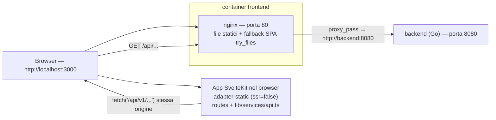

# VaultLab — Il frontend spiegato

> Questo documento spiega come funziona il frontend di VaultLab: la pagina web
> che vedi nel browser (grafici, form, pulsanti). È il compagno della guida al
> backend (`docs/BACKEND-GUIDE.it.md`) e della guida al database
> (`docs/DATABASE-GUIDE.it.md`) e non richiede conoscenze di programmazione: i
> concetti di componente, rotta e chiamata API vengono spiegati man mano.
>
> Per i lettori di lingua inglese esiste la versione
> `docs/FRONTEND-GUIDE.en.md`.

---

## 1. Cos'è il frontend

Il frontend è l'applicazione web di VaultLab: l'utente accede, crea portafogli,
registra transazioni, aggiunge titoli e guarda i grafici (performance,
allocazione, prezzi).

Alcuni fatti sullo stato attuale:

- **Tecnologia**: SvelteKit 5 (Svelte 5 "rune"), TypeScript, Tailwind CSS e
  **ECharts** per i grafici.
- **Modello di esecuzione**: una **SPA lato client** ("single page
  application"): il server invia un guscio statico e tutto il rendering avviene
  nel browser, che recupera i dati dal backend con `fetch`.
- **Storia**: fino alla prima release il frontend era un'applicazione
  **React 19 + Vite** (react-router, axios, TanStack Query, Recharts). Quella
  app è stata **completamente sostituita** dall'app SvelteKit descritta qui; il
  codice React e le sue dipendenze non fanno più parte del repository.
- **Dove gira**: i file compilati sono serviti da **nginx** dentro il container
  `frontend`, pubblicato da docker-compose sulla porta host **3000**
  (http://localhost:3000). nginx funziona anche da **reverse proxy**: le
  richieste del browser a `/api/...` vengono inoltrate al backend Go sulla
  porta 8080.

Il frontend è "stupido di proposito": disegna pagine e grafici, ma ogni numero
(valore del portafoglio, gain/loss, ROI, allocazioni) viene calcolato dal
**backend** (vedi la guida al backend, capitoli 8 e 9) e arriva nel browser come
JSON.

---

## 2. Concetti di base

Un piccolo glossario, nello stesso spirito della guida al backend. Se conosci
già questi termini, salta al capitolo 3.

- **SPA (single page application)**: un'applicazione fatta di una sola pagina
  HTML; quando navighi, il contenuto cambia "sul posto" senza ricaricare la
  pagina.
- **Componente**: un mattoncino dell'interfaccia (una card, una tabella, un
  grafico). In Svelte un componente è un file `.svelte` che contiene HTML, CSS
  e logica.
- **Rotta / pagina**: un URL che l'app può mostrare (`/portfolios`,
  `/assets/123`, ...). In SvelteKit ogni cartella sotto `src/routes/` con un
  file `+page.svelte` è una pagina.
- **Runa**: un simbolo speciale di Svelte 5 che rende lo stato "reattivo" (l'
  interfaccia si aggiorna da sola quando i dati cambiano). Le tre più comuni
  sono `$state` (una variabile reattiva), `$derived` (un valore calcolato da
  altri) e `$effect` (codice che viene rieseguito quando cambiano le sue
  dipendenze).
- **API / endpoint**: un "numero di telefono" del backend (guida al backend,
  capitolo 2).
- **JSON**: il formato testuale usato per scambiare i dati con il backend
  (guida al backend, capitolo 2).
- **JWT / token**: la credenziale che dimostra che hai effettuato l'accesso. Il
  backend emette due token (access e refresh); il frontend li conserva nel
  `localStorage` del browser (capitolo 9).
- **localStorage**: una piccola area di memoria del browser che sopravvive ai
  ricaricamenti della pagina. VaultLab ci salva i due token.
- **Libreria grafici / ECharts**: una libreria pronta per disegnare grafici
  (a linee, a torta, ...). VaultLab usa ECharts tramite il wrapper
  `svelte-echarts`.
- **Proxy / reverse proxy**: un server (qui nginx) che riceve le richieste e le
  inoltra altrove. Il browser pensa di parlare con "il suo" server, ma `/api/...`
  viene inoltrato al backend Go.
- **CORS**: una regola di sicurezza del browser sulle chiamate a un server che
  vive su un'origine *diversa* (es. localhost:3000 → localhost:8080). Nella
  configurazione standard il browser chiama solo la propria origine (il proxy
  nginx), quindi il CORS non viene coinvolto.

Un'analogia: il **frontend è la sala di un ristorante**. Le pagine sono i
tavoli, i componenti sono i piatti e il client API è il cameriere che porta gli
ordini in cucina (il backend).

---

## 3. Come gira



I pezzi che girano (definiti in `docker-compose.yml`):

- **frontend** — la pagina web. L'immagine è costruita da `frontend/Dockerfile`
  in due fasi:
  1. `node:22-alpine` installa le dipendenze (`npm ci`) ed esegue
     `npm run build` (in `package.json` è `vite build`);
  2. `nginx:alpine` copia il risultato (`/app/build`) in
     `/usr/share/nginx/html` insieme a `frontend/nginx.conf`, in ascolto sulla
     porta 80. docker-compose la pubblica come **3000:80**.
- **backend** — l'API Go sulla porta 8080 (guida al backend). Il container
  frontend dipende da esso.

### Come funziona il build SvelteKit

- `frontend/svelte.config.js` usa **`@sveltejs/adapter-static`** con
  `fallback: 'index.html'`: un build "statico", adatto a un server che serve
  solo file (nginx). Il `fallback` lo rende una SPA senza flash: ogni URL
  sconosciuto restituisce il guscio `index.html`, che poi carica la pagina
  giusta.
- `frontend/src/routes/+layout.ts` imposta `export const ssr = false` e
  `export const prerender = false`: niente rendering lato server, niente pagine
  precompilate. Il browser riceve `index.html` + gli asset JS/CSS e l'app
  disegna tutto lato client.
- L'output del build va in `frontend/build/` (già presente nel repo).

### nginx

`frontend/nginx.conf` fa due cose:

- `location /api/` → `proxy_pass http://backend:8080;` (più gli header `Host`
  e `X-Real-IP`). Ogni chiamata API quindi esce dal browser sulla stessa
  origine (`/api/v1/...`) e raggiunge il backend Go.
- `location /` → `try_files $uri $uri/ /index.html;` — serve i file statici e
  ripiega sul guscio SPA per le rotte client-side.

### Modalità sviluppo

`make frontend-dev` esegue `cd frontend && npm run dev`: il dev server Vite
sulla **porta 5173** con hot-reload. `vite.config.ts` definisce un proxy per
tutto ciò che sta sotto `/api` → `http://backend:8080`, così le pagine possono
chiamare il backend in esecuzione come se fosse sulla stessa origine. (Il
target del proxy è il nome del servizio docker-compose, quindi funziona solo
dove `backend` è un hostname risolvibile, es. nella rete dei container.)

### CORS

Il backend imposta gli header CORS (guida al backend, capitolo 4), ma nella
configurazione standard non vengono mai usati: il browser chiama sempre
`http://localhost:3000` e nginx inoltra al backend, quindi non c'è nessuna
richiesta cross-origin. Il CORS conta solo se l'API viene chiamata direttamente
da una pagina servita altrove.

---

## 4. Struttura delle cartelle

```
frontend/
├── svelte.config.js        # adapter-static + fallback index.html
├── vite.config.ts          # porta dev 5173 + proxy /api
├── tailwind.config.js      # contenuto Tailwind: ./src/**/*.{html,js,svelte,ts}
├── postcss.config.js       # tailwindcss + autoprefixer
├── Dockerfile              # build node → serve nginx (porta 80)
├── nginx.conf              # file statici + proxy /api/ verso backend:8080
├── static/vault.svg        # favicon
└── src/
    ├── app.html            # HTML radice (classi body, favicon, titolo)
    ├── app.css             # @tailwind base/components/utilities
    ├── app.d.ts            # namespace App di SvelteKit (segnaposto)
    ├── lib/                # codice condiviso (la "parte interessante")
    │   ├── components/     # Layout, Toaster + i 4 wrapper ECharts
    │   ├── services/api.ts # l'unico client API (capitolo 5)
    │   ├── stores/         # auth.svelte.ts, toast.svelte.ts (rune Svelte 5)
    │   └── format.ts       # formattatori + etichette classi (capitolo 6)
    └── routes/             # le pagine
        ├── +layout.ts      # ssr=false, prerender=false
        ├── +layout.svelte  # guardia auth, guscio app, Toaster
        ├── +page.svelte    # Dashboard (/)
        ├── login/          # login + registrazione (una pagina, un toggle)
        ├── assets/         # elenco titoli + creazione (autocomplete)
        ├── assets/[id]/    # dettaglio asset (B.10)
        ├── portfolios/     # elenco portafogli + CRUD + import
        ├── portfolios/[id]/ # dettaglio portafoglio (transazioni, grafici)
        ├── settings/       # profilo, password, whitelist valute
        └── settings/health/ # health dashboard dei prezzi
```

> **Non esiste una pagina `/register` separata**: la pagina di login contiene un
> toggle "Sign in / Register" ed entrambi i form sono gestiti lì (capitolo 10).

---

## 5. Il livello API

Tutto vive in un unico file: `frontend/src/lib/services/api.ts`. Incapsula
l'API HTTP del backend sotto `/api/v1`, aggiunge autenticazione e una piccola
cache GET, ed esporta i tipi TypeScript di tutte le risposte.

### La base e la funzione `request`

- `const BASE_URL = '/api/v1'`. `buildUrl(path, params)` costruisce
  `window.location.origin + '/api/v1' + path` aggiungendo i parametri query,
  quindi la richiesta è sempre **stessa origine** (nginx la inoltra, capitolo
  3).
- `request<T>(path, {method, body, params})` è l'unico punto d'ingresso:
  1. costruisce l'URL e legge la cache in memoria (capitolo sotto);
  2. aggiunge `Content-Type: application/json` e, se esiste un token in
     `localStorage` (`access_token`), l'header
     `Authorization: Bearer <token>`;
  3. chiama `fetch`;
  4. su **401** (e solo per i percorsi non-`/auth/`) prova a **rinnovare la
     sessione** (vedi sotto) e ritenta la richiesta una volta;
  5. su risposte non-OK legge `{error}` dal corpo e lancia
     `new Error(message)` con `status` HTTP allegato (le pagine usano `status`
     per riconoscere es. 404 o 409/422);
  6. un `204` restituisce `undefined`.

### Il flusso di refresh (gestione token)

Il backend emette token **access** di breve durata (15 min) e token **refresh**
di lunga durata (72 h) (guida al backend, capitolo 14). Il frontend li salva
entrambi in `localStorage` con le chiavi `access_token` e `refresh_token`.

Quando una richiesta torna con **401**:

1. il frontend legge `refresh_token` da `localStorage`;
2. chiama `POST /auth/refresh` con `{refresh_token}`;
3. se ha successo salva la **nuova coppia** in `localStorage`, aggiorna
   l'header `Authorization` e **ritenta la richiesta originale una volta**;
4. se fallisce (o c'è un errore di rete) cancella entrambi i token e fa un
   redirect "duro" a `/login` con `window.location.replace('/login')`
   (bypassando volutamente il router di SvelteKit).

### La cache GET

`api.ts` tiene una `Map` a livello di modulo delle risposte GET con TTL di
**60 secondi** (`CACHE_TTL_MS`). Perché: la SPA naviga senza ricaricare, quindi
rimontare la stessa pagina rifarebbe il fetch di endpoint pesanti (dashboard,
summary, storico) senza una cache. Le regole:

- **ogni richiesta non-GET svuota l'intera cache** — volutamente rozzo: quasi
  ogni mutazione può cambiare endpoint aggregati, e svuotare tutto è più
  sicuro che tenere traccia delle dipendenze;
- i dati in cache vengono **deep-copy** prima di essere restituiti
  (`structuredClone`, con ripiego sul round-trip JSON — che non deve mai
  rompere la richiesta), così i chiamanti non possono "avvelenare" la cache
  mutando una risposta;
- **gli errori (4xx/5xx) non vengono mai messi in cache**: vale il normale
  flusso throw/retry.

### I gruppi API e i loro endpoint

Il client esporta oggetti tipizzati per dominio. Ogni endpoint sotto è stato
verificato contro le rotte del backend (`backend/cmd/server/main.go`).

| Gruppo | Metodi | Endpoint |
|---|---|---|
| `authApi` | login, register, me, updateProfile, changePassword | `POST /auth/login`, `POST /auth/register`, `GET /users/me`, `PATCH /users/me`, `POST /users/me/password` |
| `portfolioApi` | list, create, get, update, delete | `GET /portfolios`, `POST /portfolios`, `GET/PATCH/DELETE /portfolios/{id}` |
| | summary, allocation, classAllocation, geographyAllocation, sectorAllocation, performance, roi, history | `GET /portfolios/{id}/summary`, `GET /portfolios/{id}/allocation`, `GET /portfolios/{id}/allocation/class`, `GET /portfolios/{id}/allocation/geography`, `GET /portfolios/{id}/allocation/sector`, `GET /portfolios/{id}/performance`, `GET /portfolios/{id}/roi`, `GET /portfolios/{id}/history` |
| | dashboard, dashboardAllocation | `GET /dashboard`, `GET /dashboard/allocation` |
| | exportDoc, importDoc | `GET /portfolios/{id}/export`, `POST /portfolios/import` |
| `assetApi` | list, search, lookup, meta | `GET /assets`, `GET /assets/search?q=`, `GET /assets/lookup?q=`, `GET /assets/meta?ticker=` |
| | get, create, update, remove | `GET /assets/{id}`, `POST /assets`, `PATCH /assets/{id}`, `DELETE /assets/{id}` |
| | quote, fetchProfile | `GET /assets/{id}/quote`, `POST /assets/{id}/fetch-profile` |
| | exposure, saveExposure, fetchExposure, fetchETFExposure | `GET /assets/{id}/exposure`, `PUT /assets/{id}/exposure`, `POST /assets/{id}/fetch-exposure`, `POST /assets/{id}/fetch-etf-exposure` |
| | backfillHistory, sync | `POST /assets/{id}/backfill-history`, `POST /assets/sync` |
| `transactionApi` | list, create | `GET/POST /portfolios/{id}/transactions` |
| | update, remove | `PATCH/DELETE /transactions/{id}` |
| `pricesApi` | refresh | `POST /prices/refresh` (query opzionale `portfolio_id`, restituisce il `RefreshReport`) |
| | byAsset | `GET /prices/{assetId}?full=1` |
| `settingsApi` | listCurrencies, addCurrency, deleteCurrency | `GET/POST /settings/currencies`, `DELETE /settings/currencies/{code}` |
| `api` (generico) | get/post/put/patch/delete | il client grezzo, usato dalla pagina health per `GET /health/prices` |

I tipi esportati accanto (`User`, `Portfolio`, `Asset`, `Transaction`,
`PortfolioSummary`, `AssetHolding`, `Dashboard`, `RefreshReport`, `AssetQuote`,
`AssetExposure`, `PortfolioHistory`, `AssetPositionSeries`,
`PortfolioExportDocument`, ...) rispecchiano i modelli del backend. Nota: i
valori monetari arrivano come **stringhe** (es. `"1234.56"`) per evitare errori
di arrotondamento in virgola mobile; le pagine li convertono con `Number()`
dove serve.

> **Nota**: `portfolioApi` espone i metodi di allocazione geografica e
> settoriale (`geographyAllocation(id)`, `sectorAllocation(id)` — serviti dal
> backend da EPIC B.6/B.7) più l'aggregato dashboard di B.8
> (`dashboardAllocation()`) — vedi il paragrafo B.8 nel capitolo 11.

---

## 6. Utility e risorse di formattazione

### `lib/format.ts`

Il modulo di formattazione unico, condiviso da tutte le pagine (non esiste una
cartella `utils/` o `metrics/` — vedi sotto):

| Export | Cosa fa |
|---|---|
| `currencySymbol(code)` | restituisce il simbolo di una valuta da una piccola tabella (`USD → $`, `EUR → €`, `GBP → £`, `CHF → CHF`, `JPY → ¥`, ...), ripiegando sul codice stesso per quelle sconosciute |
| `formatCurrency(amount, currency='USD')` | `simbolo + toLocaleString(...)` con esattamente 2 decimali, es. `$1.234,56`. Accetta `number` o `string` |
| `formatPercent(value)` | `toFixed(2) + '%'`, es. `12,34%`. Accetta `number` o `string` |
| `ASSET_CLASS_LABELS` | mappa delle 8 classi di asset del backend su etichette UI **italiane**: `equity → Azioni`, `bond → Obbligazioni`, `commodity → Materie prime`, `currency → Valute`, `crypto → Crypto`, `real_estate → Immobiliare`, `mixed → Misto`, `other → Altro` |

La mappa delle etichette è usata ovunque serva mostrare una classe: la tabella
e il donut "Allocazione per classi" del portafoglio, e il selettore "Classe"
nel dettaglio asset.

### Calcoli di valore e metriche

Non esiste un modulo dedicato alle metriche: ogni pagina calcola i propri
valori derivati inline con le rune **`$derived`** di Svelte 5. I principali:

- **Dashboard** (`routes/+page.svelte`): `chartData` unisce le serie storiche
  dei portafogli in un'unica tabella per data per `PortfolioLineChart`;
  `hasMultipleCurrencies` decide se mostrare la tabella "Performance by
  Currency"; `glClass` sceglie la classe testo verde/rosso per un guadagno o
  una perdita.
- **Dettaglio portafoglio** (`routes/portfolios/[id]/+page.svelte`):
  `classAllocRows` mappa le chiavi delle classi del backend sulle etichette
  italiane per il donut; `gainLossClass` / `realizedClass` / `pnlClass`
  colorano i numeri.
- **Dettaglio asset** (`routes/assets/[id]/+page.svelte`): `chartSeries`
  filtra le righe prezzo in base all'intervallo selezionato (`RANGES`: `1M`
  30 giorni, `3M` 90 giorni, `1Y` 365 giorni, `MAX` illimitato) e le ordina per
  data; `METRICS` mappa i campi quote `change_1d/1w/1m/1y/ytd` sulle etichette
  `1G/1S/1M/1Y/YTD`; `sumRegions` / `sumSectors` validano che i pesi
  dell'esposizione sommino a 100 (±0,5, `regionsValid` / `sectorsValid`).

---

## 7. I componenti ECharts

Tutti i grafici vivono in `frontend/src/lib/components/` e usano **ECharts 5**
tramite il wrapper `svelte-echarts` (dipendenze `echarts` e `svelte-echarts`
in `package.json`).

### Il pattern di import (tree-shaking)

Ogni componente grafico segue lo stesso schema:

```svelte
<script lang="ts">
  import type { EChartsOption } from 'echarts'
  import { Chart } from 'svelte-echarts'
  import { init, use } from 'echarts/core'
  import { LineChart } from 'echarts/charts'          // solo ciò che serve
  import { GridComponent, TooltipComponent, DataZoomComponent } from 'echarts/components'
  import { CanvasRenderer } from 'echarts/renderers'

  use([LineChart, GridComponent, TooltipComponent, DataZoomComponent, CanvasRenderer])

  let { series = [], currency = 'USD' } = $props()

  const options = $derived.by((): EChartsOption => ({ ... }))
</script>

<div class="h-[340px] w-full">
  <Chart {init} {options} />
</div>
```

La chiamata `use(...)` registra solo i moduli di cui il grafico ha bisogno
(bundle più piccolo); `init` (da `echarts/core`) viene passato al wrapper
`<Chart>`, che inizializza l'istanza al mount. Le opzioni sono dichiarate come
`EChartsOption` e ricalcolate con `$derived.by`, così il grafico reagisce ai
cambiamenti di `$props`.

### I wrapper dei grafici

| Componente | Grafico | Usato per |
|---|---|---|
| `PriceChart.svelte` | **line** singola (prezzi di chiusura), asse x temporale, dataZoom `inside` + `slider` | la pagina **dettaglio asset** (B.10): storico prezzi con selettore 1M/3M/1Y/YTD/MAX. Carica sempre tutto lo storico: i selettori fanno uno **zoom in-place** (coppia `start`/`end` percentuali, `end`=100) senza ricaricare dati; uno zoom/spostamento manuale **deseleziona** il pulsante attivo e preserva la vista. Gli **split** sono disegnati come `markLine` tratteggiata viola etichettata con il rapporto (`Split 4:1`), come in `PositionChart`. Stato vuoto → "Nessun dato prezzi disponibile" |
| `PositionChart.svelte` | **tre linee**: cost basis (grigia, a scalini), market value (verde, liscia), realized (ambra) + marcatori viola per gli split | la **storico performance** del dettaglio portafoglio: un menu a tendina passa dal portafoglio al singolo asset. Gli split sono disegnati come `markLine` tratteggiata verticale sulla linea del valore di mercato, etichettata con il rapporto (`7:1`, `4:1`) |
| `PortfolioLineChart.svelte` | **line multi-serie** (una per portafoglio), asse x a categorie di date | la card "Portfolio History" della **dashboard**. Il tooltip formatta ogni serie nella propria valuta (la valuta arriva dal payload `DashboardHistory`) |
| `ExposurePie.svelte` | **ciambella** (raggio 45%–70%), palette a 12 colori, legenda mostrata solo con ≤ 6 righe, righe a peso zero filtrate | in **tre punti**: "Distribuzione geografica" e "Distribuzione settoriale" del dettaglio asset, e il donut **"Allocazione per classi"** del portafoglio (B.12). Accetta `ExposureRow[]` (`{name, weight}`) |
| `GeographyChart.svelte` (`lib/components/domain/`) | **ciambella** (stessi raggio/palette di `ExposurePie`) + tabella delle righe complete accanto; il tooltip mostra il valore nella valuta del portafoglio e il peso; la fetta `Other` è in grigio spento | la card **geografia** del dettaglio portafoglio e la "Allocazione complessiva" della **dashboard** (B.8). Accetta `RegionAllocation[]` (`{region, value, weight}`); le righe a peso zero restano in tabella ma non vengono disegnate. Le prop opzionali `covered`/`excluded` (stringhe decimali) alimentano una nota di copertura ("Copre il X% del portafoglio…") mostrata quando il valore escluso è > 0 |
| `SectorChart.svelte` (`lib/components/domain/`) | struttura identica, sui settori | la card **settore** del dettaglio portafoglio e la "Allocazione complessiva" della **dashboard** (B.8). Accetta `SectorAllocation[]` (`{sector, value, weight}`), più la stessa nota di copertura opzionale `covered`/`excluded` di `GeographyChart` |

I tooltip formattano i valori monetari con `formatCurrency` (capitolo 6), le
date con `new Date(...).toLocaleDateString()`.

### Dove vengono usati

- **Dettaglio asset (B.10)** — `PriceChart` per lo storico prezzi (con
  zoom in-place e marcatori {@code split}); `ExposurePie` due volte per la
  distribuzione geo/settoriale. Dall'EPIC F.10 (#64) la **modifica**
  dell'esposizione avviene in una **modale** (`ExposureModal`): sulla pagina
  restano solo i due pie chart; il pulsante "Modifica" (icona matita, opz.
  → il controllo di editing) apre la modale con le griglie dei pesi, la
  validazione somma=100 e i salvataggi indipendenti per regione/settore.
- **Dettaglio portafoglio (B.12)** — `ExposurePie` per il donut "Allocazione
  per classi". Le righe sono gli `AssetClassSlice[]` restituiti da
  `portfolioApi.classAllocation`, mappati con `ASSET_CLASS_LABELS`.
- **Dettaglio portafoglio e dashboard (B.8)** — `GeographyChart` +
  `SectorChart` per l'allocazione geo/settoriale (endpoint per-portafoglio e
  aggregato `GET /dashboard/allocation`). Le allocazioni sono calcolate
  sull'universo **equity-only** (azioni sempre; ETF/fondi solo quando
  `asset_class` è `equity` o `real_estate`); bond, crypto, commodity e fondi
  non classificati sono esclusi e riportati come `covered_value` /
  `excluded_value`, che i grafici trasformano in una nota di copertura.
- **Dashboard** — `PortfolioLineChart` con il `chartData` unificato, più i
  widget B.8 "Allocazione complessiva".

---

## 8. Stile e UX

- **Tailwind CSS 3.4**: configurato in `tailwind.config.js` (contenuto = tutti
  i `.svelte`/`.ts` sotto `src`, nessun tema custom), caricato tramite
  `app.css` (le tre direttive `@tailwind`) e PostCSS (`postcss.config.js`:
  `tailwindcss` + `autoprefixer`).
- **Classi utility, nessuna libreria di componenti**: le card sono il pattern
  ricorrente `rounded-xl bg-white p-4 shadow`; il colore principale è il
  blue-600 (`bg-blue-600`, `text-blue-600`); guadagni/verdi con green-600,
  perdite con red-600, avvisi con amber-500.
- **Icone**: `lucide-svelte`. Esempi: `LayoutDashboard`, `Briefcase`,
  `Banknote`, `Settings`, `LogOut`, `ChevronUp` (shell app); `Plus`, `Trash2`,
  `Pencil`, `Download`, `Upload`, `Search`, `Loader2`, `EllipsisVertical`,
  `X`, `ExternalLink`, `Activity` (pagine); `CheckCircle2`, `XCircle`,
  `AlertTriangle` (toast).
- **Toast** (sostituiscono `react-hot-toast` della vecchia app): un piccolo
  store a rune in `lib/stores/toast.svelte.ts` (`toast.success/error/warning`)
  aggiunge elementi che si chiudono da soli dopo 3,5 s (4,5 s per i warning);
  `lib/components/Toaster.svelte` mostra la pila fissa in alto a destra con
  card colorate (verde/ambra/rossa) e icone. `<Toaster />` è montato una volta
  in `routes/+layout.svelte`, quindi ogni pagina può fare toast.
- **Responsive / mobile-first**: flex e grid si adattano per breakpoint
  (`flex flex-col gap-4 md:flex-row`, `grid grid-cols-2 md:grid-cols-4`,
  `sm:grid-cols-2 lg:grid-cols-3`, `md:grid-cols-3 lg:grid-cols-6`), le tabelle
  lunghe sono avvolte in `overflow-x-auto`, e la shell
  (`lib/components/Layout.svelte`) è una sidebar fissa (`w-64`) + area
  principale scrollabile, usabile anche su schermi stretti.
- **App-wide**: `app.html` imposta il body a `bg-gray-50 text-gray-900
  antialiased`, la lingua `en` e la favicon `/vault.svg`.
- **Nota sulla lingua**: la UI è volutamente mista inglese/italiano — la
  maggior parte dei titoli è in inglese, mentre diverse etichette, stati vuoti
  e messaggi di toast sono in italiano ("cambio mancante", "Nessuna allocazione
  per classi", "Aggiorna da Yahoo", "Salva modifiche", ...). Riflette la lingua
  attuale del prodotto; anche i formattatori del capitolo 6 seguono lo stesso
  mix.

---

## 9. Autenticazione e sessione

### `lib/stores/auth.svelte.ts`

Uno store a rune che contiene `auth.user` e `auth.isLoading`:

- `initAuth()` — legge `access_token` da `localStorage` e, se presente, lo
  valida con `GET /users/me` (riempiendo `auth.user`). Al fallimento cancella
  entrambi i token. Chiamato una volta dal layout radice al mount.
- `login(email, password)` — `POST /auth/login`, salva la **coppia** in
  `localStorage`, imposta `auth.user`, poi
  `window.location.replace('/')` (un reload completo, voluto).
- `register(...)` — `POST /auth/register`. **Non** effettua il login: la pagina
  di login mostra "Registered! You can now log in." e torna al form di
  accesso.
- `logout()` — cancella entrambi i token, `auth.user = null` e
  `window.location.replace('/login')`.
- `updateProfile(name, email)` — `PATCH /users/me` e aggiorna `auth.user`.

### Il layout radice (`routes/+layout.svelte`)

- finché `auth.isLoading` mostra uno spinner;
- quando lo stato è pronto: gli utenti non autenticati su qualsiasi pagina
  tranne `/login` vengono reindirizzati con `goto('/login', { replaceState:
  true })`; gli utenti autenticati su `/login` vengono mandati a `/`;
- per gli utenti autenticati disegna la shell (`Layout.svelte`) attorno al
  contenuto della pagina;
- monta `<Toaster />`;
- una volta per caricamento di pagina (flag `synced`) chiama
  `assetApi.sync()` (`POST /assets/sync`) — la task in background del backend
  che fa il backfill di storico e split per gli asset che ne sono privi. Gli
  errori vengono ignorati: le singole pagine fanno il backfill di ciò che
  serve.

### Archiviazione dei token e refresh

- Chiavi: `localStorage.access_token` e `localStorage.refresh_token`.
- L'header Bearer e la logica 401 → refresh → retry vivono in `api.ts`
  (capitolo 5).
- Al fallimento del refresh l'app non resta mai in uno stato "a metà login":
  cancella i token e reindirizza "duro" a `/login`.

### Il refresh prezzi di sessione

La dashboard, il dettaglio portafoglio e il dettaglio asset usano un flag a
livello di modulo (`sessionRefreshed`) così da chiamare, **una volta per
sessione**, `pricesApi.refresh()` e poi rifare il fetch dei dati. Il
`RefreshReport` restituito guida i toast di avviso:

- `rate_limited` → "Yahoo Finance ha limitato le richieste: alcuni prezzi non
  aggiornati";
- altrimenti, se `issues.length > 0` → "N aggiornamenti prezzi non riusciti
  (Yahoo)".

Questo mantiene l'UI funzionante quando viene aperta come deep-link senza
passare dalla dashboard.

---

## 10. Le pagine, una per una

### `/` — Dashboard (`routes/+page.svelte`)

Endpoint chiamati: `portfolioApi.dashboard()`, poi il `pricesApi.refresh()` di
sessione + una dashboard fresca.

- Card **Portfolio History**: `PortfolioLineChart` (una linea per portafoglio).
- Card **Allocazione complessiva**: `GeographyChart` + `SectorChart` affiancati
  da `dashboardAllocation()` (`GET /dashboard/allocation`, aggregato in USD su
  tutti i portafogli); se l'endpoint fallisce la card mostra "Allocazione non
  disponibile" (la chiamata è isolata, non blocca la pagina). Entrambi i
  grafici ricevono i metadati di copertura `covered_value`/`excluded_value` e
  mostrano una nota quando ci sono holding non azionarie escluse.
- Tabella **Performance by Currency**, solo quando si usano più valute
  (`hasMultipleCurrencies`).
- Tabella **Portfolios** (nome, valuta, asset, investito, valore, realizzato,
  gain/loss, rendimento).
- Sezioni espandibili per portafoglio con la tabella asset (link del ticker a
  `/assets/{id}`, quantità, investito, valore, gain/loss, realizzato, ROI — con
  badge "cambio mancante" quando il tasso FX non è disponibile).
- Stato vuoto: "Create your first portfolio" → `/portfolios`.

### `/login` — Sign in / Register (`routes/login/+page.svelte`)

Una sola card centrata con un toggle tra **Sign in** e **Register**
(`isRegister`). La registrazione chiede nome + email + password e, al
successo, mostra un toast e torna al Sign in; il login chiama `store.login()`
che fa un redirect "duro" a `/`.

### `/portfolios` — Portafogli (`routes/portfolios/+page.svelte`)

Endpoint chiamati: `portfolioApi.list()`, `settingsApi.listCurrencies()`.

- Griglia di card dei portafogli (nome, valuta, descrizione, elimina).
- Form **Create Portfolio** (nome, descrizione, valuta scelta dalla whitelist).
- **Import**: input file nascosto → analizza un documento di export JSON
  (richiede `version === 1`), mostra un'anteprima (nome/valuta/numero di
  transazioni/range date) e importa in modalità **"new"** (con un nome scelto)
  o **"overwrite"** (su un portafoglio esistente); dopo un import riuscito
  chiama `assetApi.sync()` così gli asset importati ricevono il backfill dello
  storico.
- **Export** vive nella pagina di dettaglio (sotto).

### `/portfolios/[id]` — Dettaglio portafoglio (`routes/portfolios/[id]/+page.svelte`)

Endpoint chiamati: `portfolioApi.get`, `.summary`, `.history`,
`.classAllocation`, `.geographyAllocation`, `.sectorAllocation`,
`transactionApi.list`, `assetApi.list`, poi il
`pricesApi.refresh(id)` di sessione + summary fresco.

- Card KPI: Valore, Realizzato, Gain/Loss (aperto, con %), Asset.
- Tabella **Positions** (`summary.holdings`, ticker che linka a
  `/assets/{id}`, posizioni chiuse con badge "Closed" e `-`).
- **Performance history**: `PositionChart` con un menu a tendina per passare dal
  portafoglio al singolo asset (gli split sono disegnati sul grafico).
- **Allocazione per classi**: ciambella (`ExposurePie`) + tabella da
  `classAllocation()`; le chiavi delle classi sono mappate con
  `ASSET_CLASS_LABELS`. Se l'endpoint fallisce, la pagina mostra "non
  disponibile" senza bloccare il resto (la chiamata è isolata nel suo
  try/catch).
- **Allocazione geografica e settoriale**: due card affiancate
  (`md:flex-row`, una per grafico) con `GeographyChart` / `SectorChart` da
  `geographyAllocation()` / `sectorAllocation()`; ogni endpoint è isolato nel
  suo try/catch ("non disponibile" in caso di errore, senza mai bloccare la
  pagina). I grafici ricevono i metadati di copertura `covered_value`/
  `excluded_value` e mostrano una nota quando ci sono holding non azionarie
  escluse.
- **Transazioni**: tabella (data, asset, badge del tipo, quantità, prezzo,
  totale), form di aggiunta/modifica per **buy / sell / dividend** (il
  dividendo chiede l'importo totale invece di quantità × prezzo; la quantità
  viene inviata come `1`), eliminazione con conferma. Dopo ogni mutazione
  vengono rifetchati lista, summary e storico.
- **Export**: `portfolioApi.exportDoc(id)` → download del file JSON
  (`vault-lab-<nome>.json`).

### `/assets` — Asset (`routes/assets/+page.svelte`)

Endpoint chiamati: `assetApi.list()`, `settingsApi.listCurrencies()`.

- Tabella dei titoli (ticker → link al dettaglio, nome, tipo, valuta, paese,
  elimina).
- **Add Asset**: campo ticker con **autocomplete** — mentre digiti (da 2
  caratteri, debounce 350 ms) chiama `assetApi.lookup(q)`
  (`GET /assets/lookup?q=`) e mostra un menu di suggerimenti; selezionandone
  uno, il form viene arricchito con `assetApi.meta(ticker)`
  (`GET /assets/meta?ticker=`). Creazione → `assetApi.create()`.

### `/assets/[id]` — Dettaglio asset (`routes/assets/[id]/+page.svelte`)

Endpoint chiamati: `assetApi.get`, `.quote`, `pricesApi.byAsset(id)`,
`assetApi.exposure(id)`, poi il `pricesApi.refresh()` di sessione + quote/prezzi
freschi.

- **Caratteristiche**: Ticker, ISIN, Nome, Tipo, Valuta, Exchange e Classe
  (`ASSET_CLASS_LABELS`) modificabili. `hasChanges` abilita "Salva modifiche"
  (`PATCH /assets/{id}`; l'override manuale di `asset_class` vince sempre — il
  refresh da Yahoo non sovrascrive mai una classe diversa da `other`/vuota).
- Il menu "⋮" ha due azioni:
  - **Aggiorna da Yahoo** — `assetApi.meta(ticker)` per aggiornare
    nome/tipo/valuta/exchange (e la classe solo se attualmente vuota/`other`);
  - **Backfill storico completo** — `assetApi.backfillHistory(id)`, poi un
    `pricesApi.byAsset(id)` fresco (la cache GET del client è già stata
    svuotata dalla POST).
- **Metriche quote**: "Ultima chiusura" + le 5 variazioni percentuali
  (1G/1S/1M/1Y/YTD) da `AssetQuote`, colorate verde/grigio/rosso; un 404 in
  caricamento reindirizza a `/assets`.
- **Storico prezzo**: `PriceChart` con il selettore 1M/3M/1Y/YTD/MAX (zoom in-place).
- **Distribuzione geografica** e **Distribuzione settoriale**: sulla pagina
  resta solo l'header "Distribuzione" con il pulsante "Modifica" (icona
  matita) e i due donut `ExposurePie`; tutto l'editing avviene in una modale
  `ExposureModal`. La modale è **divisa in due parti affiancate**: a sinistra
  la geografica, a destra la settoriale, ognuna con le tabelle dei pesi
  modificabili, la somma dal vivo validata a 100 ± 0,5 (altrimenti il
  salvataggio è disabilitato) e il proprio donut. I pulsanti di **prefill
  vivono solo nella modale**, accanto al titolo di ciascuna parte, e popolano
  **solo la rispettiva dimensione**:
  - geografica: un solo pulsante **"Prefill JustETF"** (`fetchETFExposure`,
    applica solo `regions`);
  - settoriale: **"Prefill JustETF"** (`fetchETFExposure`, applica solo
    `sectors`) e **"Prefill Yahoo"** (`fetchExposure`, i `topHoldings` Yahoo,
    applica solo `sectors`).
  In fondo alla card **sulla pagina principale** le due **legende** sono
  raccolte in **un unico box su due colonne** (geo a sinistra, settori a
  destra), con paletta allineata ai pie chart, così che tutti i valori (es.
  gli 11 settori GICS) siano sempre visibili anche quando il pie chart non
  può mostrare la legenda inline.
  Il salvataggio invia **solo la dimensione modificata**
  (`PUT /assets/{id}/exposure` con `{regions}` o `{sectors}` — omettere una
  chiave lascia l'altra intatta), poi ricarica la risposta canonica. La
  sezione è renderizzata solo quando l'asset è azionabile per l'universo
  equity (`exposureApplicable`: stock, oppure etf/mutual_fund con
  `asset_class` `equity`/`real_estate`); altrimenti compare un banner che
  spiega che la distribuzione vale solo per gli asset azionari.
- **Prefill da Yahoo** — `assetApi.fetchExposure(id)`
  (`POST /assets/{id}/fetch-exposure`, i pesi settoriali `topHoldings` di
  Yahoo) precompila la tabella dei settori.
- **Carica da JustETF** — `assetApi.fetchETFExposure(id)`
  (`POST /assets/{id}/fetch-etf-exposure`): recupera e salva dal microservizio
  JustETF sia la distribuzione geografica (paesi → macro-regioni canoniche) sia
  i settori GICS; visibile solo per asset di tipo ETF
  (`asset.type !== 'etf'` ⇒ pulsante disabilitato). Sincronizza inoltre l'ISIN
  risolto dal backend nel campo ISIN del form.

### `/settings` — Impostazioni (`routes/settings/+page.svelte`)

Endpoint chiamati: `settingsApi.listCurrencies()`, `updateProfile()`,
`authApi.changePassword()`.

- **Profile** (nome/email) e **Change password**
  (`POST /users/me/password` con `current_password` + `new_password`,
  verifica lato frontend che le due nuove coincidano).
- Card **Infrastruttura** con il link alla health dashboard
  (`/settings/health`).
- **Valute gestite**: il CRUD della whitelist valute — aggiungi un codice di 3
  lettere (un 422 dal backend significa che Yahoo non ha la conversione
  USD→codice e il frontend mostra un messaggio dedicato; 409 = già presente),
  elimina con conferma (409 = in uso o protetta). I simboli sono renderizzati
  con `currencySymbol()`.

### `/settings/health` — Price Sync Health (`routes/settings/health/+page.svelte`)

L'unica pagina che usa il **client generico**: `api.get('/health/prices')`
(stessa origine `/api/v1/health/prices`). Mostra 4 card di riepilogo (Success
Rate, Total Successes, Total Failures, Rate Limited) e una tabella degli eventi
recenti (timestamp, tipo, badge dello stato, codice, messaggio, durata), con un
pulsante "Refresh Now".

---

## 11. Note e punti aperti

- **B.8 è implementata (issue #14)** — i widget di allocazione geografica e
  settoriale sono in questa release:
  - `portfolioApi` espone `geographyAllocation(id)` /
    `sectorAllocation(id)` (`GET /portfolios/{id}/allocation/geography` e
    `/allocation/sector`: somme pesate, zero-filled, sulle 8 macro-regioni e
    sugli 11 settori GICS, entrambe + `Other`) e `dashboardAllocation()`
    (`GET /dashboard/allocation`, le stesse righe aggregate su tutti i
    portafogli in USD). Le interfacce di risposta stanno accanto a
    `PortfolioClassAllocation` in `api.ts` (`RegionAllocation`,
    `SectorAllocation`, `PortfolioGeographyAllocation`,
    `PortfolioSectorAllocation`, `DashboardAllocation`);
  - `GeographyChart` / `SectorChart` (`lib/components/domain/`) disegnano un
    donut a 12 colori (`radius: ['45%','70%']`, legenda quando ≤ 6 righe non
    vuote) affiancato dalla tabella delle righe complete (le righe a peso zero
    restano in tabella ma non vengono disegnate); il tooltip mostra il valore
    formattato nella valuta del portafoglio e il peso, e la fetta `Other` è
    evidenziata in grigio spento;
  - la pagina di dettaglio portafoglio mostra i due donut affiancati sotto
    "Allocazione per classi" (`md:flex-row`, una card ciascuno) e la dashboard
    aggiunge una card "Allocazione complessiva" (griglia `md:grid-cols-2`)
    alimentata da `GET /dashboard/allocation`;
- **Universo equity-only (follow-up B.8)** — le allocazioni geo/settoriali
  coprono solo le holding azionarie (azioni sempre; ETF/fondi solo quando
  `asset_class` è `equity` o `real_estate`). Bond, crypto, commodity e fondi
  non classificati sono esclusi ed esposti come `covered_value` /
  `excluded_value` sulle risposte geography/sector/dashboard; i grafici
  mostrano la nota "Copre il X% del portafoglio…" quando il valore escluso è
  positivo, e la pagina asset dettaglio mostra le card di distribuzione solo
  per gli asset azionari azionabili (banner informativo altrimenti);
- **Non esiste una pagina `/register` separata**: la registrazione è un toggle
  dentro `/login`.
- **Niente inserimento manuale dei prezzi nella UI**: i prezzi arrivano solo da
  Yahoo (il refresh di sessione, il worker, o l'azione "Backfill storico
  completo").
- **L'export/import JSON esiste** (documento versione 1, modalità new /
  overwrite); l'import CSV no.
- **Il form transazioni offre buy/sell/dividend**: l'API e il tipo
  `Transaction` includono anche `split` e `fee`, ma la UI può creare solo quei
  tre tipi (può comunque visualizzarli e modificarli).
- **Le stringhe UI sono miste inglese/italiano** — capitolo 8.
- **La cache GET è rozza di proposito** (TTL 60 s, invalidazione totale a ogni
  mutazione): dopo un salvataggio la lettura successiva rifà il fetch. Gli
  errori non vengono mai messi in cache.
- **Il CORS è configurato sul backend ma non viene usato** nella configurazione
  standard, perché il browser parla solo con nginx (stessa origine).
- **Le pagine descritte in questa guida sono lo stato attuale**: la dashboard
  ora include i widget di allocazione di B.8 (card "Allocazione complessiva",
  vedi il paragrafo B.8 qui sopra), e la vecchia descrizione del frontend in
  epoca React (React 19 / axios / Recharts) è obsoleta.