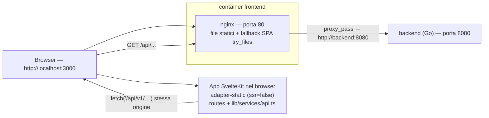

# VaultLab — Il frontend spiegato

> Questo documento spiega come funziona il frontend di VaultLab: la pagina web
> che vedi nel browser (grafici, form, pulsanti). È il compagno della guida al
> backend (`docs/BACKEND-GUIDE.it.md`) e della guida al database
> (`docs/DATABASE-GUIDE.it.md`) e non richiede conoscenze di programmazione: i
> concetti di componente, rotta e chiamata API vengono spiegati man mano.
>
> Per i lettori di lingua inglese esiste la versione
> `docs/FRONTEND-GUIDE.en.md`.
>
> **Nota**: questa guida descrive l'app **così com'è oggi**. Lo stato futuro
> dell'interfaccia (navigazione, layout, evoluzione del design system, EPIC K)
> è specificato a parte in `docs/UX-REDESIGN.it.md`; dove i due documenti
> differiscono, è la specifica di redesign a descrivere l'obiettivo.

---

## 1. Cos'è il frontend

Il frontend è l'applicazione web di VaultLab: l'utente accede, crea portafogli,
registra transazioni, aggiunge titoli e guarda i grafici (performance,
allocazione, prezzi).

Alcuni fatti sullo stato attuale:

- **Tecnologia**: SvelteKit 5 (Svelte 5 "rune"), TypeScript, Tailwind CSS e
  **ECharts** per i grafici.
- **Modello di esecuzione**: una **SPA lato client** ("single page
  application"): il server invia un guscio statico e tutto il rendering avviene
  nel browser, che recupera i dati dal backend con `fetch`.
- **Storia**: fino alla prima release il frontend era un'applicazione
  **React 19 + Vite** (react-router, axios, TanStack Query, Recharts). Quella
  app è stata **completamente sostituita** dall'app SvelteKit descritta qui; il
  codice React e le sue dipendenze non fanno più parte del repository.
- **Dove gira**: i file compilati sono serviti da **nginx** dentro il container
  `frontend`, pubblicato da docker-compose sulla porta host **3000**
  (http://localhost:3000). nginx funziona anche da **reverse proxy**: le
  richieste del browser a `/api/...` vengono inoltrate al backend Go sulla
  porta 8080.

Il frontend è "stupido di proposito": disegna pagine e grafici, ma ogni numero
(valore del portafoglio, gain/loss, ROI, allocazioni) viene calcolato dal
**backend** (vedi la guida al backend, capitoli 8 e 9) e arriva nel browser come
JSON.

---

## 2. Concetti di base

Un piccolo glossario, nello stesso spirito della guida al backend. Se conosci
già questi termini, salta al capitolo 3.

- **SPA (single page application)**: un'applicazione fatta di una sola pagina
  HTML; quando navighi, il contenuto cambia "sul posto" senza ricaricare la
  pagina.
- **Componente**: un mattoncino dell'interfaccia (una card, una tabella, un
  grafico). In Svelte un componente è un file `.svelte` che contiene HTML, CSS
  e logica.
- **Rotta / pagina**: un URL che l'app può mostrare (`/portfolios`,
  `/assets/123`, ...). In SvelteKit ogni cartella sotto `src/routes/` con un
  file `+page.svelte` è una pagina.
- **Runa**: un simbolo speciale di Svelte 5 che rende lo stato "reattivo" (l'
  interfaccia si aggiorna da sola quando i dati cambiano). Le tre più comuni
  sono `$state` (una variabile reattiva), `$derived` (un valore calcolato da
  altri) e `$effect` (codice che viene rieseguito quando cambiano le sue
  dipendenze).
- **API / endpoint**: un "numero di telefono" del backend (guida al backend,
  capitolo 2).
- **JSON**: il formato testuale usato per scambiare i dati con il backend
  (guida al backend, capitolo 2).
- **JWT / token**: la credenziale che dimostra che hai effettuato l'accesso. Il
  backend emette due token (access e refresh); il frontend li conserva nel
  `localStorage` del browser (capitolo 9).
- **localStorage**: una piccola area di memoria del browser che sopravvive ai
  ricaricamenti della pagina. VaultLab ci salva i due token.
- **Libreria grafici / ECharts**: una libreria pronta per disegnare grafici
  (a linee, a torta, ...). VaultLab usa ECharts tramite il wrapper
  `svelte-echarts`.
- **Proxy / reverse proxy**: un server (qui nginx) che riceve le richieste e le
  inoltra altrove. Il browser pensa di parlare con "il suo" server, ma `/api/...`
  viene inoltrato al backend Go.
- **CORS**: una regola di sicurezza del browser sulle chiamate a un server che
  vive su un'origine *diversa* (es. localhost:3000 → localhost:8080). Nella
  configurazione standard il browser chiama solo la propria origine (il proxy
  nginx), quindi il CORS non viene coinvolto.

Un'analogia: il **frontend è la sala di un ristorante**. Le pagine sono i
tavoli, i componenti sono i piatti e il client API è il cameriere che porta gli
ordini in cucina (il backend).

---

## 3. Come gira



I pezzi che girano (definiti in `docker-compose.yml`):

- **frontend** — la pagina web. L'immagine è costruita da `frontend/Dockerfile`
  in due fasi:
  1. `node:22-alpine` installa le dipendenze (`npm ci`) ed esegue
     `npm run build` (in `package.json` è `vite build`);
  2. `nginx:alpine` copia il risultato (`/app/build`) in
     `/usr/share/nginx/html` insieme a `frontend/nginx.conf`, in ascolto sulla
     porta 80. docker-compose la pubblica come **3000:80**.
- **backend** — l'API Go sulla porta 8080 (guida al backend). Il container
  frontend dipende da esso.

### Come funziona il build SvelteKit

- `frontend/svelte.config.js` usa **`@sveltejs/adapter-static`** con
  `fallback: 'index.html'`: un build "statico", adatto a un server che serve
  solo file (nginx). Il `fallback` lo rende una SPA senza flash: ogni URL
  sconosciuto restituisce il guscio `index.html`, che poi carica la pagina
  giusta.
- `frontend/src/routes/+layout.ts` imposta `export const ssr = false` e
  `export const prerender = false`: niente rendering lato server, niente pagine
  precompilate. Il browser riceve `index.html` + gli asset JS/CSS e l'app
  disegna tutto lato client.
- L'output del build va in `frontend/build/` (già presente nel repo).

### nginx

`frontend/nginx.conf` fa due cose:

- `location /api/` → `proxy_pass http://backend:8080;` (più gli header `Host`
  e `X-Real-IP`). Ogni chiamata API quindi esce dal browser sulla stessa
  origine (`/api/v1/...`) e raggiunge il backend Go.
- `location /` → `try_files $uri $uri/ /index.html;` — serve i file statici e
  ripiega sul guscio SPA per le rotte client-side.

### Modalità sviluppo

`make frontend-dev` esegue `cd frontend && npm run dev`: il dev server Vite
sulla **porta 5173** con hot-reload. `vite.config.ts` definisce un proxy per
tutto ciò che sta sotto `/api` → `http://backend:8080`, così le pagine possono
chiamare il backend in esecuzione come se fosse sulla stessa origine. (Il
target del proxy è il nome del servizio docker-compose, quindi funziona solo
dove `backend` è un hostname risolvibile, es. nella rete dei container.)

### CORS

Il backend imposta gli header CORS (guida al backend, capitolo 4), ma nella
configurazione standard non vengono mai usati: il browser chiama sempre
`http://localhost:3000` e nginx inoltra al backend, quindi non c'è nessuna
richiesta cross-origin. Il CORS conta solo se l'API viene chiamata direttamente
da una pagina servita altrove.

---

## 4. Struttura delle cartelle

```
frontend/
├── svelte.config.js        # adapter-static + fallback index.html
├── vite.config.ts          # porta dev 5173 + proxy /api
├── tailwind.config.js      # contenuto Tailwind: ./src/**/*.{html,js,svelte,ts}
├── postcss.config.js       # tailwindcss + autoprefixer
├── Dockerfile              # build node → serve nginx (porta 80)
├── nginx.conf              # file statici + proxy /api/ verso backend:8080
├── static/vault.svg        # favicon
└── src/
    ├── app.html            # HTML radice (bootstrap tema, meta theme-color, favicon, titolo)
    ├── app.css             # @tailwind + token semantici (:root / .dark) + base layer
    ├── app.d.ts            # namespace App di SvelteKit (segnaposto)
    ├── lib/                # codice condiviso (la "parte interessante")
    │   ├── components/     # primitive ui/, layout/ (AppShell + chrome adattivo), Toaster + wrapper ECharts
    │   ├── services/api.ts # l'unico client API (capitolo 5)
    │   ├── stores/         # auth.svelte.ts, toast.svelte.ts, theme.svelte.ts, viewport.svelte.ts (rune Svelte 5)
    │   ├── i18n/           # dizionari en.ts/it.ts + store del locale reattivo (decisione D1)
    │   ├── chartPalette.ts # palette serie + risoluzione token a runtime (dark-aware)
    │   ├── chartTheme.ts   # temi ECharts registrati per light/dark
    │   └── format.ts       # formattatori + etichette classi (capitolo 6)
    └── routes/             # le pagine
        ├── +layout.ts      # ssr=false, prerender=false
        ├── +layout.svelte  # guardia auth, AppShell, Toaster
        ├── +page.svelte    # Dashboard (/)
        ├── login/          # login + registrazione (una pagina, un toggle)
        ├── assets/         # elenco titoli + creazione (autocomplete)
        ├── assets/[id]/    # shell del dettaglio asset (K.4b): header sticky,
        │   │               #   tab; tutto il data loading + context
        │   ├── +page.svelte        #   tab Panoramica (indice): grafico
        │   │                        #   prezzi, "Dove è detenuto", dati principali
        │   ├── exposure/           #   tab Esposizione (paesi/regioni/settori)
        │   └── data/               #   tab Dati (form metadati, zona pericolosa)
        ├── portfolios/     # elenco portafogli + CRUD + import
        ├── portfolios/[id]/ # shell del dettaglio portafoglio (K.4a): header
        │                    # sticky, strip KPI, tab; tutto il data loading
        │                    # + context condiviso
        │   ├── +page.svelte        #   tab Panoramica (indice)
        │   ├── positions/          #   tab Posizioni
        │   ├── activity/           #   tab Attività (transazioni paginate
        │   │                       #   + filtri persistiti nell'URL, K.4c)
        │   ├── tx-filters.ts       #   modello filtri Attività + codec query URL
        │   └── allocation/         #   tab Allocazione
        ├── settings/       # profilo, password, whitelist valute
        └── admin/health/   # health dashboard dei prezzi — "Dati e sincronizzazione" (D7)
```

> **Non esiste una pagina `/register` separata**: la pagina di login contiene un
> toggle "Sign in / Register" ed entrambi i form sono gestiti lì (capitolo 10).

---

## 5. Il livello API

Tutto vive in un unico file: `frontend/src/lib/services/api.ts`. Incapsula
l'API HTTP del backend sotto `/api/v1`, aggiunge autenticazione e una piccola
cache GET, ed esporta i tipi TypeScript di tutte le risposte.

### La base e la funzione `request`

- `const BASE_URL = '/api/v1'`. `buildUrl(path, params)` costruisce
  `window.location.origin + '/api/v1' + path` aggiungendo i parametri query,
  quindi la richiesta è sempre **stessa origine** (nginx la inoltra, capitolo
  3).
- `request<T>(path, {method, body, params})` è l'unico punto d'ingresso:
  1. costruisce l'URL e legge la cache in memoria (capitolo sotto);
  2. aggiunge `Content-Type: application/json` e, se esiste un token in
     `localStorage` (`access_token`), l'header
     `Authorization: Bearer <token>`;
  3. chiama `fetch`;
  4. su **401** (e solo per i percorsi non-`/auth/`) prova a **rinnovare la
     sessione** (vedi sotto) e ritenta la richiesta una volta;
  5. su risposte non-OK legge `{error}` dal corpo e lancia
     `new Error(message)` con `status` HTTP allegato (le pagine usano `status`
     per riconoscere es. 404 o 409/422);
  6. un `204` restituisce `undefined`.

### Il flusso di refresh (gestione token)

Il backend emette token **access** di breve durata (15 min) e token **refresh**
di lunga durata (72 h) (guida al backend, capitolo 14). Il frontend li salva
entrambi in `localStorage` con le chiavi `access_token` e `refresh_token`.

Quando una richiesta torna con **401**:

1. il frontend legge `refresh_token` da `localStorage`;
2. chiama `POST /auth/refresh` con `{refresh_token}`;
3. se ha successo salva la **nuova coppia** in `localStorage`, aggiorna
   l'header `Authorization` e **ritenta la richiesta originale una volta**;
4. se fallisce (o c'è un errore di rete) cancella entrambi i token e fa un
   redirect "duro" a `/login` con `window.location.replace('/login')`
   (bypassando volutamente il router di SvelteKit).

### La cache GET

`api.ts` tiene una `Map` a livello di modulo delle risposte GET con TTL di
**60 secondi** (`CACHE_TTL_MS`). Perché: la SPA naviga senza ricaricare, quindi
rimontare la stessa pagina rifarebbe il fetch di endpoint pesanti (dashboard,
summary, storico) senza una cache. Le regole:

- **ogni richiesta non-GET svuota l'intera cache** — volutamente rozzo: quasi
  ogni mutazione può cambiare endpoint aggregati, e svuotare tutto è più
  sicuro che tenere traccia delle dipendenze;
- i dati in cache vengono **deep-copy** prima di essere restituiti
  (`structuredClone`, con ripiego sul round-trip JSON — che non deve mai
  rompere la richiesta), così i chiamanti non possono "avvelenare" la cache
  mutando una risposta;
- **gli errori (4xx/5xx) non vengono mai messi in cache**: vale il normale
  flusso throw/retry.

### I gruppi API e i loro endpoint

Il client esporta oggetti tipizzati per dominio. Ogni endpoint sotto è stato
verificato contro le rotte del backend (`backend/cmd/server/main.go`).

| Gruppo | Metodi | Endpoint |
|---|---|---|
| `authApi` | login, register, me, updateProfile, changePassword | `POST /auth/login`, `POST /auth/register`, `GET /users/me`, `PATCH /users/me`, `POST /users/me/password` |
| `portfolioApi` | list, create, get, update, delete | `GET /portfolios`, `POST /portfolios`, `GET/PATCH/DELETE /portfolios/{id}` |
| | summary, allocation, classAllocation, geographyAllocation, sectorAllocation, performance, performanceBuckets, roi, history | `GET /portfolios/{id}/summary`, `GET /portfolios/{id}/allocation`, `GET /portfolios/{id}/allocation/class`, `GET /portfolios/{id}/allocation/geography`, `GET /portfolios/{id}/allocation/sector`, `GET /portfolios/{id}/performance`, `GET /portfolios/{id}/performance/buckets?granularity=month|year`, `GET /portfolios/{id}/roi`, `GET /portfolios/{id}/history` |
| | dashboard, dashboardAllocation, dashboardPerformance | `GET /dashboard`, `GET /dashboard/allocation`, `GET /dashboard/performance?granularity=month|year` |
| | exportDoc, importDoc | `GET /portfolios/{id}/export`, `POST /portfolios/import` |
| `assetApi` | list, search, lookup, meta | `GET /assets`, `GET /assets/search?q=`, `GET /assets/lookup?q=`, `GET /assets/meta?ticker=` |
| | get, create, update, remove | `GET /assets/{id}`, `POST /assets`, `PATCH /assets/{id}`, `DELETE /assets/{id}` |
| | quote, fetchProfile | `GET /assets/{id}/quote`, `POST /assets/{id}/fetch-profile` |
| | exposure, saveExposure, fetchExposure, fetchETFExposure, fetchMorningstarExposure | `GET /assets/{id}/exposure`, `PUT /assets/{id}/exposure`, `POST /assets/{id}/fetch-exposure`, `POST /assets/{id}/fetch-etf-exposure`, `POST /assets/{id}/fetch-morningstar-exposure` |
| | backfillHistory, sync | `POST /assets/{id}/backfill-history`, `POST /assets/sync` |
| `transactionApi` | list, create | `GET /portfolios/{id}/transactions?limit=&offset=&type=&asset_id=&from=&to=` (EPIC I.9: restituisce l'involucro `TransactionPage` — `transactions`, `total`, `limit`/`offset` applicati; limite di default 20, max 100, ordine per data decrescente; dall'EPIC K.4c i filtri opzionali e combinabili `type` (buy/sell/dividend/split/fee), `asset_id` (uuid) e i limiti `from`/`to` `YYYY-MM-DD` inclusivi restringono le righe **e** il `total` restituito), `POST /portfolios/{id}/transactions` |
| | update, remove | `PATCH/DELETE /transactions/{id}` |
| `pricesApi` | refresh | `POST /prices/refresh` (query opzionale `portfolio_id`, restituisce il `RefreshReport`) |
| | byAsset | `GET /prices/{assetId}?full=1` |
| `settingsApi` | listCurrencies, addCurrency, deleteCurrency | `GET/POST /settings/currencies`, `DELETE /settings/currencies/{code}` |
| `api` (generico) | get/post/put/patch/delete | il client grezzo, usato dalla pagina health per `GET /health/prices` |

I tipi esportati accanto (`User`, `Portfolio`, `Asset`, `Transaction`,
`TransactionPage`, `PortfolioSummary`, `AssetHolding`, `Dashboard`,
`DashboardSummary`,
`ActiveBreakdown`, `ClosedBreakdown`, `RefreshReport`, `AssetQuote`,
`AssetExposure`, `PortfolioHistory`, `AssetPositionSeries`,
`PortfolioExportDocument`, ...) rispecchiano i modelli del backend. Nota: i
valori monetari arrivano come **stringhe** (es. `"1234.56"`) per evitare errori
di arrotondamento in virgola mobile; le pagine li convertono con `Number()`
dove serve. Da EPIC I.1 `User` porta la preferenza `base_currency` (default
`"EUR"`) e `Dashboard` aggiunge `base_currency` più l'eventuale `summary`
(`DashboardSummary`) con i totali consolidati in quella valuta. Da EPIC I.2
il summary e ogni voce di `portfolios` (`PortfolioPerformanceSummary`)
scompongono i totali nei due oggetti annidati `active` (`ActiveBreakdown`:
investito, valore, gain/loss, gain/loss % e dividendi dei soli lotti ancora
detenuti) e `closed` (`ClosedBreakdown`: investito = costo dei lotti venduti,
ricavi = ricavi netti di vendita + dividendi delle posizioni completamente
chiuse, realizzato = ricavi − investito, realizzato %) — i campi piatti sono
spariti. Da EPIC I.3 `Dashboard` non porta più le serie `history` per
portafoglio: i nuovi tipi `DashboardPerformance` / `PerformanceBucket`
alimentano il grafico "Performance" e il grafico "valore vs investito"
dell'hero (EPIC K.3a) nella dashboard tramite `dashboardPerformance(granularity)` (`GET /dashboard/performance?granularity=month|year`,
bucket `YYYY-MM` o `YYYY` nella valuta base dell'utente). Da EPIC I.8 (#87) la
**stessa** forma `DashboardPerformance` alimenta anche la card "Performance"
del dettaglio portafoglio tramite `performanceBuckets(id, granularity)`
(`GET /portfolios/{id}/performance/buckets?granularity=month|year`), nella
**valuta del portafoglio** e non in quella base. Ogni bucket porta
`return` (il rendimento TWR % del periodo, barre), `twr` (il
rendimento time-weighted cumulato %, linea), `invested` (capitale netto
investito a fine bucket) e `value` (valore di mercato a fine bucket) — i due
importi nella `currency` del payload. Da EPIC I.5 `Dashboard` porta anche
`invested_assets` (`InvestedAsset[]`): le posizioni aperte aggregate su tutti
i portafogli nella valuta base (`ticker`, `name`, `invested`, `value`,
`gain_loss`, `gain_loss_pct`, `has_price`), ordinate per valore decrescente —
 le righe con `has_price: false` portano il valore al costo, quindi il loro
P/L è 0. Dall'EPIC I.9 (#88) `transactionApi.list(id, { limit, offset })` non
restituisce più un semplice array ma l'involucro `TransactionPage`
(`transactions`, `total`, `limit`/`offset` applicati; limite di default 20,
max 100, ordine per data decrescente), che il dettaglio portafoglio pagina.
Dall'EPIC K.4c accetta anche i filtri opzionali `type`, `asset_id`, `from` e
`to` (ognuno omesso se non impostato); `total` diventa allora il conteggio
*filtrato*.

> **Nota**: `portfolioApi` espone i metodi di allocazione geografica e
> settoriale (`geographyAllocation(id)`, `sectorAllocation(id)` — serviti dal
> backend da EPIC B.6/B.7) più l'aggregato dashboard di B.8
> (`dashboardAllocation()`) — vedi il paragrafo B.8 nel capitolo 11.

---

## 6. Utility e risorse di formattazione

### `lib/format.ts`

Il modulo di formattazione unico, condiviso da tutte le pagine (non esiste una
cartella `utils/` o `metrics/` — vedi sotto):

| Export | Cosa fa |
|---|---|
| `currencySymbol(code)` | restituisce il simbolo di una valuta da una piccola tabella (`USD → $`, `EUR → €`, `GBP → £`, `CHF → CHF`, `JPY → ¥`, ...), ripiegando sul codice stesso per quelle sconosciute |
| `formatCurrency(amount, currency='USD')` | `simbolo + toLocaleString(...)` con esattamente 2 decimali, es. `$1.234,56`. Accetta `number` o `string` |
| `formatPercent(value)` | `toFixed(2) + '%'`, es. `12,34%`. Accetta `number` o `string` |
| `formatSignedPercent(value)` | come `formatPercent` ma aggiunge un `+` esplicito sui valori positivi, es. `+3,42%` / `-1,20%`. Usato nei tooltip del grafico Performance (sia il `return` di periodo sia il `twr` cumulato sono percentuali in cui il segno veicola il significato). Accetta `number` o `string` |
| `ASSET_CLASS_LABELS` | mappa delle 8 classi di asset del backend su etichette UI **italiane**: `equity → Azioni`, `bond → Obbligazioni`, `commodity → Materie prime`, `currency → Valute`, `crypto → Crypto`, `real_estate → Immobiliare`, `mixed → Misto`, `other → Altro` |

La mappa delle etichette è usata ovunque serva mostrare una classe: dentro
`ClassDonut` (le ciambelle delle classi di attività nella card "Allocazione
complessiva" della dashboard e nella sezione allocazione del dettaglio
portafoglio, che mappa da sé le chiavi del backend), e il selettore "Classe"
nel dettaglio asset.

### Calcoli di valore e metriche

Non esiste un modulo dedicato alle metriche: ogni pagina calcola i propri
valori derivati inline con le rune **`$derived`** di Svelte 5. I principali:

- **Dashboard** (`routes/+page.svelte`): lo stato della card Performance +
  del grafico dell'hero (EPIC I.3, hero da K.3a) è un `$state` `granularity`
  (default 'month') più un singolo `$state` `perf` (una sola chiamata
  `dashboardPerformance(granularity)` alimenta **entrambi** i grafici)
  ricaricato da un `$effect` a ogni cambio del selettore (un id di
  richiesta monotònico scarta le risposte obsolete); il grafico dell'hero è
  inoltre finesttrato lato client da un `$state` `heroPeriod` bucket-driven
  (D10: 1Y = ultimi 12 / 3Y = ultimi 36 / TUTTO sui bucket mensili,
  persistito in `localStorage['vaultlab-hero-period']`);
  `hasMultipleCurrencies` pilota il donut "Allocation by portfolio" (valori grezzi nascosti e nota
  "valute miste" quando i portafogli usano valute diverse — EPIC I.1);
  `glClass` sceglie la classe testo verde/rosso per un guadagno o una perdita.
- **Dettaglio portafoglio** (`routes/portfolios/[id]/+page.svelte`): lo stato
  della card "Performance" (EPIC I.8, #87) replica quello della dashboard: un
  `$state` `granularity` (default 'month') più un `$state` `perf` ricaricato da
  un `$effect` a ogni cambio del selettore (un id di richiesta monotònico
  scarta le risposte obsolete), alimentato da
  `performanceBuckets(id, granularity)`;
  `regionBarRows` / `sectorBarRows` / `countryBarRows` mappano i carichi di
  allocazione sulla forma generica `ExposureBarRow` consumata da
  `ExposureBarChart` (EPIC I.7, #86); `geoUniverseNote` /
  `sectorUniverseNote` costruiscono le didascalie di copertura "Universo
  azionario" dai `covered_value`/`excluded_value` di ciascun payload.
- **Dettaglio asset**: `chartSeries` nel tab Panoramica (`routes/assets/[id]/
  +page.svelte`) ordina le righe prezzo e `zoomStart` mappa l'intervallo
  selezionato (`RANGES`: `1M` 30 giorni, `3M` 90 giorni, `1Y` 365 giorni,
  `YTD`, `MAX` illimitato) su uno zoom in-place; i campi quote
  `change_1d/1w/1m/1y/ytd` sono renderizzati come chip delta nell'header
  della shell (K.4b, etichette `1G/1S/1M/1Y/YTD` ↔ `1D/1W/1M/1Y/YTD` via
  `t()`); `sumRegions` / `sumSectors` / `sumCountries` e i rispettivi guard
  di validità (`regionsValid` / `sectorsValid` / `countriesValid`) vivono
  nella shell dell'asset (`+layout.svelte`) accanto ai dati che validano.

---

## 7. I componenti ECharts

Tutti i grafici vivono in `frontend/src/lib/components/` e usano **ECharts 5**
tramite il wrapper `svelte-echarts` (dipendenze `echarts` e `svelte-echarts`
in `package.json`).

### Il pattern di import (tree-shaking)

Ogni componente grafico segue lo stesso schema:

```svelte
<script lang="ts">
  import type { EChartsOption } from 'echarts'
  import { Chart } from 'svelte-echarts'
  import { init, use } from 'echarts/core'
  import { LineChart } from 'echarts/charts'          // solo ciò che serve
  import { GridComponent, TooltipComponent, DataZoomComponent } from 'echarts/components'
  import { CanvasRenderer } from 'echarts/renderers'

  use([LineChart, GridComponent, TooltipComponent, DataZoomComponent, CanvasRenderer])

  let { series = [], currency = 'USD' } = $props()

  const options = $derived.by((): EChartsOption => ({ ... }))
</script>

<div class="h-[340px] w-full">
  {#key resolved()}
    <Chart {init} {options} theme={VAULTLAB_CHART_THEMES[resolved()]} />
  {/key}
</div>
```

La chiamata `use(...)` registra solo i moduli di cui il grafico ha bisogno
(bundle più piccolo); `init` (da `echarts/core`) viene passato al wrapper
`<Chart>`, che inizializza l'istanza al mount. Le opzioni sono dichiarate come
`EChartsOption` e ricalcolate con `$derived.by`, così il grafico reagisce ai
cambiamenti di `$props`.

### Grafici dark-aware

Anche i grafici seguono il tema (capitolo 8). L'helper `resolved()` dello store
del tema dice se l'app sta disegnando in chiaro o scuro; il blocco
`{#key resolved()}` forza il wrapper a **reinizializzare** il grafico quando il
tema cambia, perché `svelte-echarts` legge la prop `theme` solo una volta al
mount. Due helper lo rendono possibile:

- `lib/chartTheme.ts` registra due temi ECharts (`vaultlab-light`,
  `vaultlab-dark`) costruiti dagli stessi token del CSS (colori di assi,
  legenda, tooltip) e li espone come `VAULTLAB_CHART_THEMES`;
- `lib/chartPalette.ts` espone `resolvePalette()` (i colori serie
  `--chart-1..12`, letti dal DOM e messi in cache per tema) e
  `chartSemanticColors()` per le linee speciali (cost basis, realizzato,
  marcatori split, fetta "Other").

Le label delle torte richiedono un colore esplicito: a differenza di assi e
legenda, le label delle pie ECharts **non** ereditano il `textStyle` del tema,
quindi ogni donut imposta `label.color` dal foreground del tema e disattiva il
bordo bianco di default (altrimenti, in scuro, le label apparirebbero come testo
scuro contornato di bianco).

### I wrapper dei grafici

| Componente | Grafico | Usato per |
|---|---|---|
| `PriceChart.svelte` | **line** singola (prezzi di chiusura), asse x temporale, dataZoom `inside` + `slider` | la pagina **dettaglio asset** (B.10): storico prezzi con selettore 1M/3M/1Y/YTD/MAX. Carica sempre tutto lo storico: i selettori fanno uno **zoom in-place** (coppia `start`/`end` percentuali, `end`=100) senza ricaricare dati; uno zoom/spostamento manuale **deseleziona** il pulsante attivo e preserva la vista. Gli **split** sono disegnati come `markLine` tratteggiata viola etichettata con il rapporto (`Split 4:1`), come in `PositionChart`. Stato vuoto → "Nessun dato prezzi disponibile" |
| `PositionChart.svelte` | **tre linee**: cost basis (grigia, a scalini), market value (verde, liscia), realized (ambra) + marcatori viola per gli split | la card "Performance history" del **dettaglio portafoglio**, mantenuta come **vista secondaria** sotto la nuova card percentuale "Performance" dell'EPIC I.8 (#87): un menu a tendina passa dal portafoglio al singolo asset. Gli split sono disegnati come `markLine` tratteggiata verticale sulla linea del valore di mercato, etichettata con il rapporto (`7:1`, `4:1`) |
| `PerformanceChart.svelte` (`lib/components/domain/`) | **combo barre + linea in percentuale** su asse x a **categorie** (EPIC I.3): una barra `return` per bucket (rendimento TWR % del periodo) colorata verde/rosso secondo il segno (semantici `positive`/`negative`, `itemStyle` per barra), linea `twr` (rendimento time-weighted cumulato %) nell'ambra semantica, asse y formattato in % e tooltip `+3,42%` (`formatSignedPercent`, niente valuta), etichette dei periodi formate per granularità (`giu 2025` / `2025`), dataZoom `inside` + `slider`, legenda `Gain/Loss` / `Cumulative`, stato vuoto "No data" | la card "Performance" della **dashboard**, alimentata da `dashboardPerformance(granularity)` (`GET /dashboard/performance`, selettore mensile/annuale con `SegmentedControl` nell'intestazione della card), e — da EPIC I.8 (#87) — la card "Performance" del **dettaglio portafoglio**, alimentata da `performanceBuckets(id, granularity)` (`GET /portfolios/{id}/performance/buckets`, proprio selettore mensile/annuale, nella valuta del portafoglio). Le barre mostrano il rendimento generato dentro ogni mese/anno, la linea il TWR cumulato — sono percentuali pure, quindi il componente non riceve più la prop `currency` |
| `CapitalChart.svelte` (`lib/components/domain/`) | **due linee** sugli **stessi** bucket a categorie: `invested` (capitale netto investito, linea a scalini `end` nel grigio semantico `costBasis`) e `value` (valore di mercato, linea liscia nel verde semantico `marketValue`), tooltip in valuta con `formatCurrency(value, currency)`, dataZoom `inside` + `slider` (o solo `inside` e canvas da 240px con la prop `compact`), legenda `Invested` / `Value`, re-init theme-aware (`{#key}`), stato vuoto "No data" | il grafico valore-vs-investito dell'**hero** della dashboard da EPIC K.3a (la card autonoma "Capital invested" è stata assorbita dall'hero), alimentato dalla **stessa** chiamata `dashboardPerformance(granularity)` e dagli stessi bucket di `PerformanceChart` (importi nella **valuta base** dell'utente, `currency` del payload) e con lo stesso selettore mensile/annuale; l'hero passa `compact` e finestra i bucket lato client con i chip periodo bucket-driven (decisione D10) |
| `Sparkline.svelte` (`lib/components/domain/`) | minuscola **linea senza assi** (EPIC K.3b): niente legenda/tooltip/zoom, griglia ai bordi zero; accetta numeri semplici (asse indice nascosto) o punti `{date, value}` (`SparklinePoint`, asse **temporale** nascosto così i buchi di calendario restano veritieri — non mescolare le due forme), il verde semantico `marketValue` di default con override `color` opzionale, riempimento d'area discreto al 10% (`area`), `smooth` + `sampling: 'lttb'`, nessun hover (`silent`), strip d'altezza fissa via `heightClass` (default `h-10`); sotto i 2 punti **non renderizza nulla**; wrapper `role="img"` con `aria-label` (del chiamante, altrimenti `sparkline.trend`), re-init theme-aware (`{#key}`) | il fondo delle **card portafoglio** della **dashboard** da EPIC K.3b (spec §6.1 zona C): strip con lo storico del valore di mercato del portafoglio, alimentato da `portfolioApi.history(id)` (le stringhe `market_value` della serie mappate in punti `{date, value}`) caricato in background dopo il payload principale della dashboard; se la chiamata fallisce la card resta senza sparkline, in silenzio |
| `ExposurePie.svelte` | **ciambella** (raggio 45%–70%), palette a 12 colori, legenda mostrata solo con ≤ 6 righe, righe a peso zero filtrate; `complete={false}` la rende **aperta** quando le righe sommano < 100 (una fetta residua trasparente tiene veritieri gli angoli — niente fetta grigia "Other") | pagina dettaglio asset (donut regioni con `complete={false}` e donut settori) e le due modali esposizione (in modalità `mute`: regioni in `ExposureGeoModal`, settori in `ExposureSectorModal`). I paesi (pagina e modale geografica) sono liste a barre, mai una pie. Accetta `ExposureRow[]` (`{name, weight}`). Non è più usata nel dettaglio portafoglio: la card classi con tabella e le card `GeographyChart`/`SectorChart` sono state sostituite da `ClassDonut` + `ExposureBarChart` nell'EPIC I.7 (#86) |
| `ClassDonut.svelte` (`lib/components/domain/`) | **ciambella** delle classi di asset (EPIC I.4, stesso stile radius/palette/etichette di `ExposurePie`): righe `AssetClassSlice[]` (`{class, value, weight}`) mappate con `ASSET_CLASS_LABELS` per i nomi in chiaro, tooltip con importo (`formatCurrency`) e peso (`formatPercent`), fetta `other` in grigio spento, righe a peso zero scartate, stato vuoto "Nessuna allocazione per classi"; prop `label` opzionale per l'intestazione sopra il grafico | il pannello classi della card "Allocazione complessiva" della **dashboard**, alimentato da `dashboardAllocation().classes` (vault intero, valuta base), e — da EPIC I.7 (#86) — il pannello classi della sezione "Allocazione" del **dettaglio portafoglio**, alimentato da `classAllocation(id).classes` (valuta del portafoglio) |
| `ExposureBarChart.svelte` (`lib/components/domain/`) | **barre orizzontali** riutilizzabili (EPIC I.4) su righe generiche `{name, value, weight}[]` (`ExposureBarRow`): barre ordinate **per valore decrescente** (risortese in modo difensivo nel componente, righe non positive scartate; asse categorie `inverse`, quindi la barra più grande sta in alto), peso % stampato a fine barra, tooltip con importo (`formatCurrency(value, currency)`) e peso (`formatPercent`), asse dei valori nascosto (le barre servono solo a confrontarsi tra loro), altezza del canvas proporzionale al numero di righe, `colorFor?: (name) => string` per colore per-riga (altrimenti palette `resolvePalette` per indice), `labelFor?: (name) => string` per mappare le etichette dell'asse (l'asse mostra il nome leggibile — es. codice ISO → nome completo del paese via `countryDisplayName` — e il tooltip aggiunge il nome grezzo tra parentesi quando differisce, "United States (US)"; la colonna delle etichette si allarga a 140px quando `labelFor` è attivo), `maxVisibleRows?: number` collassa il grafico a quel numero di barre con un pulsante "Mostra tutti" che espande in place (nessun viewport con scorrimento interno — la pagina è l'unico contenitore scrollabile), `label` e `note` (didascalia muted) opzionali, stato vuoto "No data", re-init theme-aware (`{#key}`) | i pannelli regioni, settori e paesi della card "Allocazione complessiva" della **dashboard**, alimentati da `dashboardAllocation().regions` / `.sectors` / `.countries`, e — da EPIC I.7 (#86) — gli stessi tre pannelli della sezione "Allocazione" del **dettaglio portafoglio**, alimentati da `geographyAllocation(id).regions` / `sectorAllocation(id).sectors` / `geographyAllocation(id).countries` (in valuta del portafoglio); i chiamanti mappano `RegionAllocation`/`SectorAllocation`/`CountryAllocation` su `ExposureBarRow`; i paesi portano codici ISO alpha-2 renderizzati con `labelFor={countryDisplayName}` e `maxVisibleRows={10}` su entrambe le pagine — si vedono le ~10 barre maggiori e un pulsante "Mostra tutti" rivela le altre; i pannelli regioni e settori non passano nulla: etichette invariate e tutte le righe visibili — le ~10 macro-regioni non hanno mai bisogno del cap |
| `InvestmentsTable.svelte` (`lib/components/domain/`) | tabella **active/closed** condivisa (`active: ActiveBreakdown`, `closed: ClosedBreakdown`, `currency`, `title` opzionale): colonne Investito / Valore-Ricavi / Gain-Loss / % / Dividendi, righe Active e Closed, P/L firmato colorato con `pnlColorClass`, importi via `formatCurrency` | il disclosure "Dettaglio" dell'hero nella **dashboard** (valuta base, EPIC I.2, spostato in un `<details>` sotto il numero hero in EPIC K.3a) e la card KPI del **dettaglio portafoglio** (valuta portafoglio, EPIC I.6 #85) |
| `PositionTable.svelte` (`lib/components/domain/`) | tabella posizioni generica sul tipo `PositionRow` (`{assetId?, ticker, name?, qty?, cost?, value?, realized?, unrealized?, roi?, closed?, price?, priceCurrency?}`); `showCost`/`showRealized`/`showUnrealized` mostrano le colonne opzionali, `showPrice` aggiunge la colonna Price (prima di Qty, formattata con `priceCurrency`, visibile anche sulle righe chiuse), `linkAssets` collega il ticker alla pagina asset; le righe chiuse mostrano `-` su tutte le celle tranne il realizzato | la tabella Positions del **dettaglio portafoglio** (E.2) — l'accordion posizioni della **dashboard** (E.1) è stato sostituito dalla tabella consolidata "Invested assets" nell'EPIC I.5 (#82) e non usa più questo componente |
| `AllocationDonut.svelte` (`lib/components/domain/`) | ciambella theme-aware di quote `{name, value}[]` (pesi ricalcolati sul totale positivo); `showValue={false}` nasconde il valore nel tooltip (donut multi-valuta) | la card "Allocation by portfolio" della **dashboard** (E.1) |
| `AssetCombobox.svelte` (`lib/components/domain/`) | combobox filtrabile sugli asset già registrati (ticker/nome, max 8 righe); emette l'id dell'asset selezionato | la modale transazione (E.2). La ricerca ticker Yahoo per creare asset vive in `AssetSearchAutocomplete` |
| `TransactionTable.svelte` (`lib/components/domain/`) | tabella transazioni (Data/Asset/Type badge/Qty/Price/Total/Azioni) con azione di modifica allineata a destra | la card Transactions del **dettaglio portafoglio** (E.2); dall'EPIC I.9 (#88) la pagina le passa una pagina da 20 righe alla volta e mostra i pulsanti Previous/Next con l'intervallo sotto di essa |
| `AddTransactionModal.svelte` (`lib/components/domain/`) | form di aggiunta/modifica/eliminazione transazione: combobox asset, tipo (buy/sell/dividend), quantità/prezzo o importo, data, commissioni, note; validazione inline e totale live; gestisce chiamate API e toast. Dall'EPIC K.4c si presenta come `ui/Modal` da `sm` in su e come `ui/Sheet` (bottom sheet) sui telefoni (decisione D4, store `viewport`), condividendo un'unica coppia di snippet form/piè; Elimina rimuove la riga subito e mostra un toast **undo** da 5 s invece del `ConfirmDialog` (decisione D11 — l'undo re-INVIA il payload catturato, con nuovo id) | la pagina **dettaglio portafoglio** (E.2), aperta da "Add Transaction" e dall'azione di modifica della tabella |
| `SettingsTabs.svelte` (`lib/components/domain/`) | barra di tab basata su link per le subroute delle Impostazioni (Profilo / Password / Preferenze / Valute), tab attivo marcato con `aria-current="page"`; il contenitore delle pill `max-w-full flex-wrap` mantiene tutte e quattro le tab raggiungibili a larghezza telefono (bug-fix EPIC K) | tutte e quattro le pagine **Settings** (E.4) |
| `ChartTableToggle.svelte` (`lib/components/ui/`) | disclosure segmentata **Grafico ⇄ Tabella** condivisa (EPIC K.5b, spec §9.1): wrapper sottile di `SegmentedControl` legato allo stato `view` interno (`'chart' \| 'table'`, `$bindable`) del grafico che lo ospita, con etichette `Chart`/`Table` da `chartView.*`; il nome accessibile della tablist interpola il titolo proprio del grafico, se ce l'ha (`chartView.ariaNamed`, altrimenti il generico `chartView.aria`) | incorporato da `ExposureBarChart`, `ClassDonut`, `ExposurePie`, `PerformanceChart`, `CapitalChart` e `AllocationDonut` (vedi la nota "Vedi come tabella" qui sotto); i chiamanti lo nascondono con `showTableToggle={false}` dove sotto al grafico è già presente un elenco delle stesse righe |

I tooltip formattano i valori monetari con `formatCurrency` (capitolo 6), le
date con `new Date(...).toLocaleDateString()`.

#### Il toggle "Vedi come tabella" (EPIC K.5b)

Ogni wrapper di grafico con dati incorpora il `ui/ChartTableToggle`
condiviso: la card può passare a una **`<table>` accessibile delle stesse
righe già disegnate sul canvas** — il requisito WCAG "ogni grafico offre
un equivalente tabellare" (spec §9.1), che vale anche come esperienza
dati su telefono e come percorso per screen reader. Il pattern è uniforme
nei sei wrapper:

- il toggle vive **dentro il componente**, quindi ogni call site lo riceve
  gratis; `showTableToggle={false}` lo disattiva (usato nel tab Esposizione
  del dettaglio asset, dove le ciambelle elencano già ogni riga nella
  legenda sotto al grafico, e nelle due anteprime `mute` dentro le modali
  esposizione, la cui griglia di pesi editabile *è* quella tabella);
- **prima il grafico**: il rendering di default non cambia; gli stati
  vuoti hanno la precedenza sul ramo tabellare, quindi non viene mai
  resa una tabella vuota e il toggle stesso non appare senza dati;
- in vista tabella il canvas viene **smontato** (esce dall'albero di
  accessibilità e si ridisegna da capo al ritorno);
- le tabelle riusano le primitive `ui/Table`/`THead`/`TBody`/`Tr`/`Th`/`Td`
  con un `<caption>` `sr-only` (`chartView.caption`), intestazioni con
  `scope="col"`, celle numeriche allineate a destra in `tabular-nums` e
  gli stessi formattatori dei tooltip (`formatCurrency`, `formatPercent`,
  `formatSignedPercent`; la colonna del rendimento mantiene
  `pnlColorClass` come le barre verdi/rosse). Le etichette di riga
  seguono il trattamento del grafico: `ExposureBarChart` mostra il nome
  leggibile di `labelFor` con il codice grezzo tra parentesi
  ("United States (US)"), `ClassDonut` il nome di `ASSET_CLASS_LABELS`, e
  `AllocationDonut` omette la colonna dell'importo con `showValue={false}`
  (donut multi-valuta), rispecchiando il suo tooltip. Colonne per
  grafico: nome/valore/peso (barre, donut classi), nome/peso
  (`ExposurePie`), periodo/rendimento/TWR cumulativo (`PerformanceChart`),
  periodo/investito/valore (`CapitalChart`), nome/valore/peso
  (`AllocationDonut`).
- in `ExposureBarChart` il cap `maxVisibleRows` dei paesi è un controllo di
  **collasso**, non un viewport con scorrimento (bug-fix EPIC K): il grafico
  mostra le prime `maxVisibleRows` barre più un pulsante "Mostra tutti" che
  espande in place, così la pagina resta l'unico contenitore scrollabile; la
  modalità tabella elenca sempre tutte le righe. Sotto `sm` tutte e sei le
  tabelle collassano ogni riga in una griglia chiave–valore impilata (le parti
  della tabella vengono blockificate, il nome occupa tutta la larghezza, le
  celle numeriche condividono la seconda riga) così non introducono mai una
  scrollbar orizzontale a 393px; da `sm` in su la tabella classica è
  `table-fixed w-full` (il contenuto va a capo nelle celle) quindi non può mai
  superare la card su nessun browser.

`PriceChart`, `PositionChart` e le `Sparkline` delle card sono fuori dal
lotto K.5b: i primi due sono lo strumento dello storico prezzi (con
proprio selettore 1M–MAX) e la vista secondaria di supporto mantenuta
sotto la card percentuale; la sparkline è per definizione un elemento di
sola forma i cui numeri compaiono già nella card come testo. Potranno
adottare lo stesso pattern più tardi, a costo marginale zero.

### Dove vengono usati

- **Dettaglio asset (B.10, a tab da K.4b)** — `PriceChart` nel tab
  Panoramica per lo storico prezzi (con
  zoom in-place e marcatori {@code split}); `ExposurePie` nel tab
  Esposizione per la distribuzione geo/settoriale. La **modifica**
  dell'esposizione avviene in **due modali** (`ExposureGeoModal` per
  paesi + regioni, `ExposureSectorModal` per i settori), montate una sola
  volta nella shell: sulla tab
  restano solo i grafici; il pulsante "Modifica" di ciascuna card (icona
  matita) apre la propria modale con le griglie dei pesi, la
  validazione somma=100 (regioni/settori) e i salvataggi indipendenti.
- **Dettaglio portafoglio "Allocazione" (B.12/B.8, allineato alla dashboard
  nell'EPIC I.7, issue #86)** — una griglia `lg:grid-cols-2` di pannelli che
  replica la card della dashboard, in **valuta del portafoglio**: `ClassDonut`
  sugli `AssetClassSlice[]` restituiti da `portfolioApi.classAllocation`
  (chiavi mappate con `ASSET_CLASS_LABELS` dal componente stesso) più i
  pannelli `ExposureBarChart` di regioni, settori e paesi alimentati da
  `geographyAllocation(id)` (`regions` + `countries`) e
  `sectorAllocation(id)` (`sectors`), con le stesse didascalie
  equity-universe e lo stesso `maxVisibleRows={10}` per i paesi della
  dashboard. La vecchia card classi con `ExposurePie` + tabella e le card
  ciambella+tabella `GeographyChart` / `SectorChart` sono state eliminate
  (quei due componenti sono stati **rimossi** da `lib/components/domain/`,
  nessuna pagina li usava più).
- **Dashboard "Allocazione complessiva" (B.8, rinnovata in EPIC I.4)** —
  alimentata da `GET /dashboard/allocation`, che ora espone quattro dimensioni:
  `classes` (`ClassDonut`), `regions`, `sectors` e `countries` (tutti e tre
  `ExposureBarChart` — la vecchia ciambella regioni è stata sostituita
  da barre orizzontali decrescenti in #81), disposte in una
  griglia `lg:grid-cols-2` dentro la card. Le classi coprono tutto il vault;
  regioni, settori e paesi sono calcolati sull'universo **equity-only**
  (azioni sempre; ETF/fondi solo quando `asset_class` è `equity` o
  `real_estate`); bond, crypto, commodity e fondi non classificati sono
  esclusi e riportati come `covered_value` / `excluded_value`, che le barre
  della dashboard trasformano in una didascalia muted
  "Universo azionario: X% del portafoglio" (mostrata solo quando qualcosa è
  stato escluso).
- **Dashboard** — `PerformanceChart` (rendimento in %: barre + linea TWR
  cumulata) sulla card di zona B e `CapitalChart` (investito vs valore,
  variante compatta dell'hero da EPIC K.3a) nell'hero, entrambi alimentati da
  una **singola** chiamata `dashboardPerformance(granularity)` (EPIC I.3,
  selettore mensile/annuale; l'hero inoltre finestra i bucket lato
  client, decisione D10), più i widget I.4 della card "Allocazione
  complessiva" (donut classi, barre regioni/settori/paesi) e — da EPIC K.3b —
  una `Sparkline` sul fondo di ogni card portafoglio, alimentata da una
  chiamata `portfolioApi.history(id)` di background per portafoglio emessa
  dopo l'arrivo del payload della dashboard.
- **Dettaglio portafoglio** — il medesimo `PerformanceChart` condiviso nella
  card "Performance" (EPIC I.8, #87), alimentato da
  `performanceBuckets(id, granularity)` con un proprio selettore
  mensile/annuale (bucket nella valuta del portafoglio), renderizzato sopra la
  vista secondaria "Performance history" con `PositionChart` mantenuta in
  pagina.

---

## 8. Stile, design system e dark mode

La UI si basa su un piccolo design system interno introdotto nell'**EPIC D**.

### Token semantici

I colori non sono più scritti direttamente nelle pagine. `tailwind.config.js`
definisce un insieme di token di colore **semantici** — `background`,
`foreground`, la **scala di elevazione** `surface-0..3` (+ gli alias legacy
`surface` = `surface-1` e `surface-raised` = `surface-2`), `muted`,
`muted-foreground`, `border`, `input`, `ring`, `accent` (+
`accent-hover`/`accent-foreground`/`accent-text`), `positive`, `negative`,
`warning`, `info` (+ `info-foreground`, per l'indicazione di freschezza
prezzi/informativa), `overlay`, `chart-1..12`, `chart-muted`, `chart-grid` —
mappati su custom property CSS definite in `app.css` (`:root` e `.dark`).
Poiché i valori sono terne HSL composte con
`hsl(var(--token) / <alpha-value>)`, i modificatori di opacità funzionano
(`bg-accent/10`).

- **Scala di elevazione (EPIC K.1a)**: quattro superfici semantiche —
  `surface-0` (sfondo app), `surface-1` (card), `surface-2` (raised/drawer),
  `surface-3` (popover/tooltip). Il tema scuro le separa con una scala di
  luminosità di ~6–8 punti per gradino (i componenti futuri aggiungono
  hairline `border-white/6`); il tema chiaro mantiene bianchi i gradini 1–3 e
  affida la separazione alla rampa di ombre.
- Raggi: `rounded-card` / `rounded-control`; elevazione: `shadow-card` /
  `shadow-raised` / `shadow-popover`; focus coerente: la classe `.focus-ring`.
- **Token di motion (K.1a)**: durate `duration-fast` (120 ms),
  `duration-base` (200 ms), `duration-slow` (320 ms) e un'unica curva ease-out
  `ease-standard`; `app.css` disattiva transizioni e animazioni sotto
  `prefers-reduced-motion: reduce`.
- **Scala tipografica (K.1a)**: default di Tailwind più i gradini nominati
  `text-hero` (40 px semibold, per i KPI della overview) e `text-micro`
  (etichette da 11 px).
- **Font (decisione D5)**: **Inter** (UI) e **JetBrains Mono** (ticker, ISIN,
  codici) sono **self-hosted** via `@fontsource/inter` (400/500/600/700) e
  `@fontsource/jetbrains-mono` (400/500), importati in
  `routes/+layout.svelte` — nessun CDN, `font-display: swap`.
  `fontFamily.sans` inizia con Inter e `fontFamily.mono` con JetBrains Mono
  (fallback di sistema mantenuti), quindi `font-mono` applica lo stack mono
  ovunque sia usato.
- Tailwind è caricato tramite `app.css` (le tre direttive `@tailwind`) e
  PostCSS (`postcss.config.js`: `tailwindcss` + `autoprefixer`).
- `lib/chartTheme.ts` replica i token per la canvas (ECharts non risolve le
  variabili CSS), incluso `--chart-grid`: le split line degli assi sono
  dipinte con quel colore a ~8% di opacità, così i dati restano l'elemento
  più luminoso.
- `lib/ui-colors.ts` centralizza i colori testo di P&L (`pnlColorClass`,
  `totalColorClass`), prima duplicati in quattro pagine. Poiché ogni
  superficie di P&L consuma i token `positive`/`negative`, la palette CVD
  opzionale qui sotto ri-veste testi e grafici senza toccare un singolo
  componente.
- **Palette CVD (EPIC K.5c, decisione D6)**: swap opt-in della coppia
  utile/perdita dal verde/rosso a una blu/arancione per persone con
  deficit di visione dei colori (derivata Okabe–Ito; chiara
  `#0072b2`/`#c2410c`, scura `#56b4e9`/`#fb923c`, tutte con contrasto testo
  ≥ 4.5:1 nel proprio tema). `app.css` aggiunge gli override
  `html.cvd` / `html.cvd.dark` di `--positive`/`--negative` (specificità
  scelta per battere sia `:root` sia `.dark`); la classe viene dipinta prima
  del primo paint dallo script di `app.html` e mantenuta in sync da
  `lib/stores/palette.svelte.ts` (stato `palette` con `cvd`, `setCvd()`,
  storage key `vaultlab-cvd`, listener cross-tab — stesso pattern dello
  store del tema). I grafici la ricevono via `lib/chartPalette.ts`
  (`CHART_SEMANTIC_COLORS_CVD` + `chartSemanticColors()` reattiva), e
  l'unico componente che dipinge barre positive/negative —
  `PerformanceChart` — estende il suo `{#key}` con la palette, così uno
  switch la re-inizializza. Segni e glifi ▲▼ restano in ogni caso (sono la
  garanzia di indipendenza dal colore, K.1c).

### Dark mode

- **Il default è Sistema (segue l'OS, decisione D9, da K.1a)**; chiaro e
  scuro sono temi first-class, progettati allo stesso modo. L'utente può
  sovrascrivere con **Chiaro**, **Scuro** o **Sistema** dal selettore del
  tema nell'header.
- La scelta è salvata in `localStorage` (`vaultlab-theme`) ed è gestita da
  `lib/stores/theme.svelte.ts` (`theme`, `resolved()`, `setThemeMode()`,
  `DEFAULT_MODE = 'system'`); è sincronizzata tra le schede e segue i cambi
  dell'OS in modalità `system`.
- Uno script inline in `app.html` imposta la classe `.dark` **prima del primo
  paint**, risolvendo il `prefers-color-scheme` dell'OS quando non c'è nulla
  di valido salvato, così un reload non mostra mai il tema sbagliato (niente
  FOUC). `darkMode: 'class'` nella config di Tailwind fa sì che una sola
  classe cambi tutti i token. Un secondo script inline applica allo stesso
  modo la classe opzionale `cvd` da `localStorage['vaultlab-cvd']`, così
  nemmeno la palette CVD (sopra) mostra mai il verde/rosso; `html.cvd`
  deliberatamente non dipende dal tema dipinto — la coppia ha varianti
  chiara e scura.

### Primitive UI

I componenti riusabili vivono in `src/lib/components/ui/`: `Button` (varianti
primary/secondary/outline/ghost/danger/link, dimensioni, loading), `Input`,
`Textarea`, `Select`, `Field`, `Card` (+ `CardHeader`/`CardContent`), `Badge`,
`Modal`, `ConfirmDialog`, `Spinner`, `Skeleton`, `EmptyState`, le primitive
`Table` (`Table`/`THead`/`TBody`/`Tr`/`Th`/`Td`), `SegmentedControl` e
`StatCard`. Le pagine e la shell le riusano invece di duplicare markup.
`SegmentedControl` e sicuro contro l'overflow per costruzione (bug-fix EPIC K):
la riga delle pill `max-w-full flex-wrap` con segmenti `flex-auto` basati sul
contenuto, quindi le etichette lunghe vanno a capo dentro il contenitore a
larghezza telefono invece di generare scroll orizzontale; da `sm` in su la riga
inline-flex si restringe comunque alle etichette su una sola riga (aspetto
desktop invariato). Le
azioni distruttive irriducibili usano `ConfirmDialog` al posto del `confirm()`
nativo del browser (dall'EPIC K.4c le eliminazioni di transazioni sono
esclusi: le azioni reversibili passano prima dal toast undo, decisione D11 —
vedi capitolo 10).

**Fondamenta EPIC K.1c (redesign UX)**: sei nuove primitive, costruite sugli
stessi token ma ancora non adottate da nessuna pagina (arrivano con K.2–K.5):
`PnlValue` (il renderer canonico di guadagno/perdita — segno esplicito +
glifo ▲▼ + colore semantico, zero neutro, "positive/negative" solo per
screen reader; decisione D6), `AsyncCard` (stati loading/errore/vuoto/dati per
singola card, con skeleton di forma compatibile ed errore isolato su una riga
+ Retry), `PeriodChips` (selettore di periodo compatto con semantica
radiogroup e navigazione con i tasti freccia, da posizionare sul grafico),
`Drawer` (drawer di ispezione laterale destro, focus-trap + Esc/backdrop +
ripristino; D4 a ≥ `lg`), `Sheet` (bottom sheet con handle di trascinamento,
stessa API; D4 a < `lg`) e `Tabs` (tablist ARIA di `<a>` reali con focus
roving, per i sottopagine-entità di K.4). Il focus-trap condiviso delle
overlay e le transizioni sui token di motion sono estratti in
`ui/focus-trap.ts` e `ui/transitions.ts` (le esistenti `Modal`/`MobileDrawer`
mantengono per ora le loro ricette inline, a zero regressioni).

### La shell dell'app

`src/lib/components/layout/` contiene la **shell adattiva** (EPIC D.3,
ristrutturata in EPIC K.2 secondo la spec UX §5.1–5.2). Le tre classi di
dispositivi sono guidate da `lib/stores/viewport.svelte.ts`, un piccolo store
reattivo su `matchMedia` che espone `isPhone` (< 640), `isTablet` (640–1023) e
`isDesktop` (≥ 1024); le classi CSS della shell usano i confini `sm`/`lg` di
Tailwind (gli stessi 640/1024px), quindi stato JS e CSS non divergono mai.

- **Desktop (≥ `lg`)** — invariata: `AppShell` (radice, `h-dvh` + skip-link)
  rende la `Sidebar` espandibile (240px ⇄ rail di icone da 64px, stato
  persistito in `localStorage['vaultlab-sidebar']`), l'`AppHeader` sticky con il
  toggle di collassamento e lo `UserMenu` nel footer della sidebar.
- **Tablet (`sm`–`lg`)** — la stessa sidebar forzata a **rail di icone da
  64px** (`AppShell` passa `collapsed={true}`; la preferenza di espansione
  persistita vale solo da `lg` in su). Nessun hamburger e nessuna barra
  inferiore: la navigazione (main, Dati e sincronizzazione, Impostazioni) e il
  menu utente nel footer del rail restano raggiungibili attraverso il rail;
  l'header conserva solo il trigger del pannello comandi e il selettore tema.
- **Telefono (< `sm`)** — nessuna sidebar: una `BottomNav` fissa (Panoramica ·
  Portafogli · Asset · Altro, decisione D2) più un `Fab` ancorato sopra di essa
  che apre la `QuickActionSheet` (Aggiungi transazione → al portafoglio unico
  quando è univoco, altrimenti a `/portfolios`; Aggiungi asset → `/assets`;
  Aggiorna prezzi → `POST /prices/refresh` con toast di esito; *Inserisci
  prezzo* è lo slot riservato di EPIC J.1, disabilitato con "In arrivo"). La
  voce "Altro" apre il `MobileDrawer` riconvertito (focus trap + Esc/backdrop +
  chiusura alla navigazione, tutti mantenuti), che rende ancora la navigazione
  `Sidebar`; tema e account restano nell'header. A `<main>` viene riservato uno
  spazio extra in basso e la barra rispetta `env(safe-area-inset-bottom)`;
  ogni target di tocco è ≥ 44px.
- **Header condensante** (tutte le misure): la shell misura lo scroll del
  contenitore scrollabile principale e commuta `condensed` oltre una soglia di
  16px; pubblica quindi l'altezza live della barra come proprietà custom
  `--app-header-h` sulla colonna scrollabile (espansa `3.5rem` = 56px,
  condensata `2.75rem` = 44px). `AppHeader` si dimensiona con
  `h-[var(--app-header-h)]` (transizione CSS sull'altezza, neutralizzata dalla
  regola globale `prefers-reduced-motion` in `app.css`) e gli header sticky
  delle shell entità (dettaglio portafoglio/asset) si impilano a
  `top-[var(--app-header-h)]` (con una `transition-[top]` analoga) così restano
  adiacenti alla barra e non lasciano una striscia scoperta mentre si condensa
  (bug-fix EPIC K). Il default vive nel `:root` di `app.css`.
- La voce Admin si chiama **"Dati e sincronizzazione"** (`nav.dataSync`,
  decisione D7) e vive in un unico punto di configurazione `adminItems` dentro
  `SidebarNav` (la route `/admin/health` non cambia), così potrà essere
  spostata in un menu Amministrazione senza una revisione diffusa.
- **Pannello comandi (EPIC K.5a, spec §8.1)** — `layout/CommandPalette.svelte`
  è montato una sola volta nell'`AppShell`, sul tier dei modali (z-40, sotto i
  toast a z-50). L'accordo ⌘K/Ctrl+K è un handler `<svelte:window>` dentro il
  componente (registrato solo dentro il gate di autenticazione, quindi il
  Login non ne è toccato); l'`AppHeader` ospita il trigger a ogni misura —
  solo icona sotto `lg` (l'accesso alla ricerca sui telefoni: nessun quinto
  elemento nella bottom nav) e pill etichettato con l'accordo della piattaforma
  (`⌘K`/`Ctrl K`) da `lg` in su. Lo stato aperto `$bindable` è di proprietà
  della shell; Esc, il click sul backdrop e i cambi di rotta chiudono il
  pannello, e il `ui/focus-trap.ts` condiviso riporta sempre il focus al
  trigger. Dialog → un solo input `role="combobox"`
  (`aria-expanded`/`aria-controls`/`aria-activedescendant`, l'input è
  l'unico tab stop; le opzioni sono righe `role="option"` deliberatamente non
  focusabili, pattern APG) su una `role="listbox"` raggruppata con tre sezioni
  `role="group"` rese solo se non vuote: **Vai a** (Panoramica, Portafogli,
  Asset, Dati e sincronizzazione, Impostazioni + le quattro sottosezioni, poi
  ogni portafoglio da `portfolioApi.list()`), **Asset** (gli asset registrati
  da `assetApi.list()` — nome più hint col ticker — seguiti da una riga live
  "Cerca su Yahoo …" alimentata da un `assetApi.lookup()` con debounce di
  300 ms da 2 caratteri in su; la selezione naviga semplicemente a `/assets`,
  la creazione resta fuori scope) e **Azioni** (Aggiungi transazione — la
  stessa scorciatoia a portafoglio unico del `Fab` —, Aggiorna prezzi —
  `pricesApi.refresh()` + i toast `quickActions.*` —, Cambia tema — cicla
  chiaro → scuro → sistema sullo store del tema —, Attiva/disattiva palette
  CVD — `setCvd` — e Mostra/nascondi barra laterale, solo su desktop, che
  pilota lo stato `collapsed` della shell). La corrispondenza è un matcher
  locale senza dipendenze (prefisso > sottostringa > sottosequenza su un
  haystack minuscolo `label + hint + keywords`); una riga "Nessun risultato"
  copre lo stato vuoto. Le liste si caricano in modo pigro solo all'apertura
  (cap di 8 per sezione dinamica a query vuota) — la cache GET di 60 s in
  `services/api.ts` assorbe le riaperture ravvicinate e ogni mutazione la
  invalida, quindi il pannello si autoaggiorna senza hook dedicati; gli error
  restano silenziosi e le sezioni statiche rimangono utili. Tastiera: ↑/↓ con
  wrap, Home/End, Invio (con guardia IME) esegue la riga attiva, Esc chiude;
  la riga attiva segue lo scroll con `scrollIntoView({ block: 'nearest' })`.
  Il motion è un solo fade del backdrop (`backdropFade()`, 0 ms con
  `prefers-reduced-motion`). Tutta la copy passa dal gruppo dizionario
  `commandPalette.*`; destinazioni e azioni riusano le chiavi `nav.*`,
  `settingsTabs.*`, `quickActions.*`, `theme.*` e `preferences.palette*`
  esistenti, e le sezioni dinamiche anticipano negli hint lo stato target dei
  toggle (tema successivo, variante di palette).

`ScopeSwitcher` e `FreshnessStamp` (elencati nella spec sotto K.2) sono arrivati
con l'hero dell'Overview in **K.3a**, come componenti `domain/`: consumano il
payload della dashboard, non lo stato della shell. L'intera shell ha
sostituito il vecchio `Layout.svelte` fisso.

### Icone, toast e lingua

- **Icone**: `lucide-svelte`. Esempi: `LayoutDashboard`, `Briefcase`,
  `Banknote`, `Settings`, `LogOut`, `PanelLeft` (shell app); `Plus`, `Trash2`,
  `Pencil`, `Download`, `Upload`, `Search`, `Loader2`, `EllipsisVertical`,
  `X`, `ExternalLink`, `Activity` (pagine); `CheckCircle2`, `XCircle`,
  `AlertTriangle` (toast).
- **Toast**: un piccolo store a rune in `lib/stores/toast.svelte.ts`
  (`toast.success/error/warning`, più `toast.dismiss`) aggiunge elementi che si
  chiudono da soli dopo 3,5 s (4,5 s per i warning); `lib/components/Toaster.svelte`
  mostra la pila fissa in alto a destra con card **theme-aware**
  (`surface-raised`), icone semantiche, pulsante di chiusura e `aria-live`
  (`role="alert"` per gli errori). Dall'EPIC K.4c ogni chiamata accetta anche
  un oggetto opzioni `{ duration?, action? }`; una `action`
  (`{ label, onclick }`) mostra un pulsante inline raggiungibile da tastiera
  nella card che esegue il handler e chiude il toast — il meccanismo dietro
  l'**undo** dell'eliminazione transazione (decisione D11). `<Toaster />` è
  montato una volta in `routes/+layout.svelte`, quindi ogni pagina può fare
  toast.
- **Responsive / mobile-first**: flex e grid si adattano per breakpoint
  (`flex flex-col gap-4 md:flex-row`, `grid grid-cols-2 md:grid-cols-4`,
  `sm:grid-cols-2 lg:grid-cols-3`, `md:grid-cols-3 lg:grid-cols-6`), le tabelle
  lunghe sono avvolte in `overflow-x-auto`, e la shell è adattiva: rail di
  icone sui tablet, bottom nav + Fab per le azioni rapide sui telefoni (vedi
  "La shell dell'app" sopra).
- **App-wide**: `app.html` parte con `lang="it"` (il default dell'i18n —
  vedi la nota lingua sotto — e aggiornato a runtime dal locale
  persistito), la favicon `/vault.svg`, i meta `theme-color` chiaro/scuro
  e il bootstrap del tema pre-paint; background/foreground del body ora
  arrivano dai token via `app.css`.
- **Nota sulla lingua (i18n da EPIC K.1b, decisione D1)**: le traduzioni
  girano su un layer leggerissimo senza dipendenze esterne in
  `src/lib/i18n/`. Lo store a rune `index.svelte.ts` esporta
  `SUPPORTED_LOCALES` (`['it', 'en']`), `DEFAULT_LOCALE = 'it'`, il
  `locale` reattivo (`locale.current`), `setLocale()` (valida, persiste in
  `localStorage['vaultlab-locale']`, sincronizza `<html lang>`, listener
  cross-tab — rispecchia lo store del tema) e `t(key, params)` che legge il
  locale reattivo così i componenti si ri-renderizzano al cambio; i
  segnaposto `{name}` sono interpolati da `params`. I dizionari sono
  oggetti annidati a due livelli — `en.ts` è la forma canonica
  (`Dictionary`), `it.ts` è verificato con `satisfies Dictionary` quindi
  una chiave mancante/in più fa fallire la build; le chiavi vengono
  appiattite in lookup dot-joined (`nav.dashboard`) e tipizzate come
  unione `MessageKey`, così anche i siti di chiamata `t()` sono controllati
  alla compile-time. Ordine di ricerca: locale attivo → inglese
  (fallback) → la chiave stessa, con warning su console solo in dev (mai
  un'eccezione). **La migrazione è progressiva**: K.1b ha tradotto la
  navigation della shell (`SidebarNav`, etichette di
  `AppHeader`/`UserMenu`/`ThemeToggle`, `SettingsTabs`, `MobileDrawer`,
  skip link) più la nuova pagina **Impostazioni → Preferenze**; il lotto di
  bug-fix EPIC K ha poi spostato su `t()` **tutte le stringhe legate
  all'allocazione** — le superfici allocazione/esposizione di dashboard,
  portafoglio e asset (nuovi gruppi `allocation.*`, `exposure.*`), gli stati
  vuoti dei grafici, le etichette `Valore:`/`Peso:` dei tooltip e i nomi di
  serie di riserva (`chartView.noData`/`noDistribution`/
  `noClassAllocation`/`noAllocation`/`seriesExposure`/
  `seriesClassAllocation`) e etichetta+descrizione di `ProvenanceBadge`
  (`provenance.*`), tutti strutturalmente identici in `en.ts`/`it.ts`; le
  altre pagine mantengono la storica copia mista inglese/italiano ("cambio
  mancante", "Aggiorna da Yahoo", le etichette dei campi delle modali di
  esposizione, le card "Performance"/"Invested assets" di dashboard e
  portafoglio, … — anche i formattatori del capitolo 6 seguono lo stesso mix)
  fino alla rispettiva passata nelle fasi successive.

---

## 9. Autenticazione e sessione

### `lib/stores/auth.svelte.ts`

Uno store a rune che contiene `auth.user` e `auth.isLoading`:

- `initAuth()` — legge `access_token` da `localStorage` e, se presente, lo
  valida con `GET /users/me` (riempiendo `auth.user`). Al fallimento cancella
  entrambi i token. Chiamato una volta dal layout radice al mount.
- `login(email, password)` — `POST /auth/login`, salva la **coppia** in
  `localStorage`, imposta `auth.user`, poi
  `window.location.replace('/')` (un reload completo, voluto).
- `register(...)` — `POST /auth/register`. **Non** effettua il login: la pagina
  di login mostra "Registered! You can now log in." e torna al form di
  accesso.
- `logout()` — cancella entrambi i token, `auth.user = null` e
  `window.location.replace('/login')`.
- `updateProfile(name, email, baseCurrency?)` — `PATCH /users/me` e aggiorna
  `auth.user`. `base_currency` finisce nel body solo se passato
  (EPIC I.1); omesso significa "mantieni il valore salvato".

### Il layout radice (`routes/+layout.svelte`)

- finché `auth.isLoading` mostra uno spinner;
- quando lo stato è pronto: gli utenti non autenticati su qualsiasi pagina
  tranne `/login` vengono reindirizzati con `goto('/login', { replaceState:
  true })`; gli utenti autenticati su `/login` vengono mandati a `/`;
- per gli utenti autenticati disegna la shell responsive
  (`lib/components/layout/AppShell.svelte`, capitolo 8) attorno al contenuto
  della pagina;
- monta `<Toaster />`;
- una volta per caricamento di pagina (flag `synced`) chiama
  `assetApi.sync()` (`POST /assets/sync`) — la task in background del backend
  che fa il backfill di storico e split per gli asset che ne sono privi. Gli
  errori vengono ignorati: le singole pagine fanno il backfill di ciò che
  serve.

### Archiviazione dei token e refresh

- Chiavi: `localStorage.access_token` e `localStorage.refresh_token`.
- L'header Bearer e la logica 401 → refresh → retry vivono in `api.ts`
  (capitolo 5).
- Al fallimento del refresh l'app non resta mai in uno stato "a metà login":
  cancella i token e reindirizza "duro" a `/login`.

### Il refresh prezzi di sessione

La dashboard, il dettaglio portafoglio e il dettaglio asset usano un flag a
livello di modulo (`sessionRefreshed`) così da chiamare, **una volta per
sessione**, `pricesApi.refresh()` e poi rifare il fetch dei dati. Il
`RefreshReport` restituito guida i toast di avviso:

- `rate_limited` → "Yahoo Finance ha limitato le richieste: alcuni prezzi non
  aggiornati";
- altrimenti, se `issues.length > 0` → "N aggiornamenti prezzi non riusciti
  (Yahoo)".

La dashboard conserva inoltre `finished_at`, `rate_limited` e
`issues.length` dal report: `finished_at` guida lo **`FreshnessStamp`**
("Prezzi alle HH:MM") accanto al valore dell'hero, e l'esito rate-limit/issues
alimenta un chip azionabile nella **`DataQualityStrip`** (EPIC K.3a, spec
§8.5). La riga "Prices updated: …" dell'header che mostrava il timestamp è
stata assorbita nello freshness stamp.

Questo mantiene l'UI funzionante quando viene aperta come deep-link senza
passare dalla dashboard.

---

## 10. Le pagine, una per una

### `/` — Dashboard (`routes/+page.svelte`)

Endpoint chiamati: `portfolioApi.dashboard()` e
`portfolioApi.dashboardPerformance(granularity)`, poi il `pricesApi.refresh()`
di sessione + una dashboard fresca e un refill delle performance (una sola
chiamata che alimenta sia il grafico "valore vs investito" dell'hero sia la
card Performance). Le uniche chiamate aggiuntive sono gli storici delle
sparkline di K.3b: quando il payload della dashboard arriva, partono in
parallelo e in background uno `portfolioApi.history(id)` GET per portafoglio
(non bloccanti, silenziose in caso di errore — vedi le card portafogli qui
sotto). Lo scope switcher e la checklist di primo avvio usano dati già
presenti nel payload di `dashboard()`.

**Ricostruita attorno al modello hero in EPIC K.3a** (spec di ridisegno
§6.1 zone A–B, decisioni D3/D8/D10); le zone C–E (card portafogli,
allocazione complessiva, asset investiti) mantengono struttura e dati
dell'EPIC I, con le card portafogli che guadagnano una strip sparkline dello
storico del valore in K.3b (spec §6.1 zona C).

- **Header**: titolo "Dashboard" e **`ScopeSwitcher`** (decisione D3,
  `domain/ScopeSwitcher.svelte`): un `<select>` nativo costruito sulla
  ricetta `ui/Select` che elenca "Tutti i portafogli (Vault)" (valore vuoto,
  la pagina corrente) e una opzione per portafoglio prese dal payload.
  Selezionare un portafoglio **naviga** — `goto()` verso `/portfolios/{id}`,
  la stessa analisi a scope portafoglio — è navigazione di secondo livello,
  non un filtro sui dati di questa pagina. Renderizzato solo quando il vault
  ha portafogli.
- **`DataQualityStrip`** (nuovo, `domain/DataQualityStrip.svelte`; spec
  §6.1/§8.5): sottile riga di chip-link su fondo warning sopra l'hero,
  renderizzata solo quando qualcosa è azionabile. Oggi consuma
  `summary.fx_missing_count` / `summary.fx_missing_value` — "{amount}
  esclusi — cambio mancante ({count} posizioni)", con link a
  `/settings/currencies` — più l'esito del refresh prezzi di sessione
  (rate-limit / N aggiornamenti falliti / refresh fallito, tutti con link a
  `/admin/health`). I chip "settori/paesi mancanti" e "prezzi obsoleti"
  abbozzati nella spec **non sono renderizzati deliberatamente**: quei
  contatori non fanno parte del tipo `Dashboard`; un commento nel componente
  li segna come futura richiesta al backend.
- **Zona A — card hero** (sostituisce la vecchia tabella Investments in
  cima): quando la risposta porta `summary`, la pagina si apre con **un solo
  numero hero** — `summary.active.value` (valore di mercato netto delle
  posizioni aperte) via `formatCurrency` nella **valuta base** dell'utente,
  renderizzato con il token tipografico `text-hero` di K.1a e
  `tabular-nums` — sotto un'unica riga P/L firmata costruita con due
  `PnlValue` di K.1c (`summary.active.gain_loss` come valuta +
  `gain_loss_pct` come percentuale; segno + ▲▼ + colore, D6) con didascalia
  "complessivo". Seguono i chip secondari muted: **Realizzato**
  (`summary.closed.realized`, via `PnlValue`), **Dividendi**
  (`summary.active.dividends`) e **Investito** (`summary.active.invested`).
  La vecchia riga "Prices updated: …" dell'header è sostituita dal compatto
  **`FreshnessStamp`** (nuovo, `domain/FreshnessStamp.svelte`) sotto i chip:
  "Prezzi alle HH:MM" dal `finished_at` del refresh di sessione, in tono
  muted normale e colorato di `--info` quando l'esito è parziale (rate-limit
  e fetch fallite mantengono i toast e compaiono anche nella strip qualità);
  mentre il refresh è in volo mostra una glifo rotante (`role="status"`). La
  semantica del refresh una-volta-per-sessione resta invariata. Infine la
  condivisa **`InvestmentsTable`** (componente e dati invariati: righe
  Active/Closed in valuta base) è spostata in un **`<details>` "Dettaglio"**
  a divulgazione progressiva sotto i chip, così il riepilogo resta
  raggiungibile senza dominare la pagina.
- **Grafico hero** (colonna di destra su desktop, impilato sotto il numero
  sui telefoni): le serie **valore vs investito** — `CapitalChart` alimentato
  dagli **stessi** bucket `dashboardPerformance` della card Performance, nella
  nuova variante opt-in `compact` (canvas da 240px, zoom rotella/trascina
  senza slider; la geometria delle card autonome resta invariata senza
  `compact`). Una riga di `PeriodChips` (K.1c) **finestra i bucket lato
  client** secondo la decisione **D10**: con bucket mensili offre `1Y`
  (ultimi 12 bucket) / `3Y` (ultimi 36) / `TUTTO`; con bucket annuali vale
  solo `TUTTO` e la riga di chip si nasconde da sola. Le opzioni derivano
  dalla `granularity` effettiva del payload (non dallo stato del selettore) e
  il periodo usato resta in `localStorage['vaultlab-hero-period']` (§8.2). I
  range giornalieri veri 1M/3M restano un fast-follow di K.3 (serie
  giornaliera del vault, richiesta backend).
- **Zona B — card Performance** (EPIC I.3, mantenuta): riga di intestazione
  con titolo e `SegmentedControl` ("Monthly" / "Annual") legato allo stato
  `granularity`, e sotto `PerformanceChart` alimentato da
  `dashboardPerformance(granularity)`: una barra `return` verde/rosso per
  bucket (rendimento TWR % del periodo) più la linea `twr` cumulativa,
  entrambe formattate in percentuale (`+3,42%`). La chiamata è isolata (se
  fallisce resta lo stato vuoto "No data"), viene ricaricata a ogni cambio di
  selettore e **alimenta anche il grafico hero** — un'unica richiesta
  `dashboardPerformance` guida entrambi i grafici. In caricamento mostra uno
  `Spinner`. La card condivide ora la griglia a 2 colonne `lg` con il donut
  "Allocation by portfolio"; la vecchia card autonoma **Capital invested è
  stata rimossa** (il suo contenuto vive nell'hero).
- Card **Allocazione complessiva** (layout EPIC I.4): una griglia
  `lg:grid-cols-2` di quattro pannelli alimentata da `dashboardAllocation()`
  (`GET /dashboard/allocation`, aggregato nella valuta base dell'utente su
  tutti i portafogli — era USD prima dell'EPIC I.1): **Classi di attività**
  (`ClassDonut` su `classes`, tutto il vault) e le barre orizzontali
  **Regioni**, **Settori** e **Paesi**, solo equity (`ExposureBarChart`
  su `regions` / `sectors` / `countries` — da #81 anche le regioni sono barre,
  e le vecchie card ciambella+tabella `GeographyChart` / `SectorChart` sono
  state definitivamente rimosse nell'EPIC I.7 (#86), quando il dettaglio
  portafoglio ha adottato questo stesso layout; le righe delle regioni riportano il nome della macro-regione
  invariato; le righe dei paesi portano codici ISO alpha-2
  ma sono etichettate con il **nome completo del paese** tramite
  `labelFor={countryDisplayName}` — i codici sconosciuti ripiegano sul codice
  grezzo — e il tooltip aggiunge il codice tra parentesi, es. "United States
  (US)"; il pannello paesi passa anche `maxVisibleRows={10}`, quindi si vedono
  le ~10 barre maggiori e un pulsante "Mostra tutti" rivela le altre, mentre i pannelli
  regioni e settori restano senza limite con nomi invariati — le ~10
  macro-regioni e i settori GICS entrano sempre). I pannelli a
  barre passano un `colorFor` che mette in grigio la fetta aggregata `Other`,
  come nelle ciambelle. Tutti e tre i pannelli equity a barre ricevono i
  metadati di copertura
  `covered_value`/`excluded_value` tramite la didascalia muted "Universo azionario: X% del portafoglio"
  (prop `note`, solo quando ci sono holding non azionarie escluse); se
  l'endpoint fallisce la card mostra "Allocazione non
  disponibile" (la chiamata è isolata, non blocca la pagina).
- Donut **Allocation by portfolio** (`AllocationDonut`), etichettata nella
  valuta base quando disponibile; da K.3a condivide la griglia a 2 colonne di
  zona B con la card Performance.
- Card **Portfolios** (nome, valuta, valore attivo + gain/loss colorato con
  `pnlColorClass`, numero di asset) da `portfolios[].active`; da EPIC I.2 una
  seconda riga compatta aggiunge il breakdown closed del singolo portafoglio
  ("Closed: investito · ricavi · realizzato", con i ricavi che includono già
  i dividendi delle posizioni completamente chiuse), renderizzata solo se il
  portafoglio ha effettivamente venduto lotti (`hasClosedActivity`, cioè
  `closed.invested ≠ 0`), in tono muted e con il realizzato colorato via
  `pnlColorClass`. Da EPIC K.3b ogni card si chiude con una **`Sparkline`**
  in fondo (spec §6.1 zona C) con lo storico del valore di mercato del
  portafoglio: quando il payload della dashboard arriva, la pagina emette in
  **parallelo e in background** uno `portfolioApi.history(id)` per ogni
  portafoglio — le card si renderizzano subito e le sparkline arrivano quando
  le risposte landano (le stringhe `market_value` della serie diventano punti
  `{date, value}` su un asse temporale nascosto). Un contatore di round
  monotònico (last-write-wins) impedisce a una risposta obsoleta di arrivare
  dopo un round più recente, e la store chiave-per-id fa sì che una risposta
  non possa mai agganciarsi alla card sbagliata; una chiamata fallita lascia
  in silenzio la card senza strip (dato decorativo — niente toast, nessuno
  spazio riservato). A scala familiare N GET parallele sono accettabili (la
  cache GET da 60s deduplica anche il round post-refresh); un endpoint
  batchato per lo storico del vault è il fast-follow backend registrato se
  il numero cresce.
- Card **Invested assets** (EPIC I.5, #82 — sostituisce i vecchi accordion
  espandibili per portafoglio e le loro `PositionTable`): un'unica `Card` con
  una tabella su `dashboard().invested_assets`, una riga per ogni asset
  **aperto** aggregato su tutti i portafogli nella **valuta base**
  dell'utente. Colonne: **Asset** (ticker collegato a `/assets/{id}` con nome
  su una seconda riga muted), **Investito**, **Valore**, **Gain/Loss**,
  **P/L %**; colonne numeriche allineate a destra in `tabular-nums`
  (`Th`/`Td align="right"`, stesse primitive e stile della tabella Investments),
  celle P/L firmate colorate con `pnlColorClass` e righe nell'ordine del
  backend (valore decrescente, nessun riordino lato client). Gli asset senza
  prezzo (`has_price: false`) portano il valore al costo — mostrano un piccolo
  badge muted **no price** accanto al ticker il cui tooltip spiega che il P/L
  è 0 perché non c'è prezzo disponibile. Con payload vuoto la card renderizza
  un `EmptyState` tratteggiato ("No invested assets yet").
- **Vault vuoto**: il semplice `EmptyState` "No portfolios yet" è sostituito
  in K.3a dalla **checklist guidata di primo avvio** (decisione D8, nuovo
  `domain/FirstRunChecklist.svelte`): un'unica `Card` la cui **lista
  ordinata** accessibile accompagna ① crea un portafoglio → ② aggiungi un
  asset → ③ registra una transazione, ogni passo collegato alla pagina dove
  avviene l'azione (`/portfolios`, `/assets`, `/portfolios` — le
  transazioni vivono dentro un portafoglio; la sheet FAB copre il percorso
  ≤2 tocchi su mobile). I passi mostrano lo stato done/current/pending
  (badge accento, ✓, testo sr-only), derivato **solo** dal payload della
  dashboard (portafogli / asset investiti / importi investiti per
  portafoglio — nessuna chiamata extra). La card scompare da sola appena il
  vault ha portafogli, perché il branch del dashboard normale li richiede.

### `/login` — Sign in / Register (`routes/login/+page.svelte`)

Una sola card centrata con un toggle tra **Sign in** e **Register**
(`isRegister`). La registrazione chiede nome + email + password e, al
successo, mostra un toast e torna al Sign in; il login chiama `store.login()`
che fa un redirect "duro" a `/`.

### `/portfolios` — Portafogli (`routes/portfolios/+page.svelte`)

Endpoint chiamati: `portfolioApi.list()`, `settingsApi.listCurrencies()`.

- Griglia di card dei portafogli (nome, valuta, descrizione, elimina).
- Form **Create Portfolio** (nome, descrizione, valuta scelta dalla whitelist).
- **Import**: input file nascosto → analizza un documento di export JSON
  (richiede `version === 1`), mostra un'anteprima (nome/valuta/numero di
  transazioni/range date) e importa in modalità **"new"** (con un nome scelto)
  o **"overwrite"** (su un portafoglio esistente); dopo un import riuscito
  chiama `assetApi.sync()` così gli asset importati ricevono il backfill dello
  storico.
- L'**Export** vive nella pagina di dettaglio (nel menu `⋯` dell'header, sotto).

### `/portfolios/[id]` — Dettaglio portafoglio (sotto-route a tab, EPIC K.4a)

Struttura (spec di redesign §4.2/§6.2): il vecchio unico pagina lunga è
diviso in una shell condivisa `routes/portfolios/[id]/+layout.svelte` +
quattro tab profondamente linkabili, ognuna una propria route —
**Panoramica** `+page.svelte` (indice), **Posizioni**
`positions/+page.svelte`, **Attività** `activity/+page.svelte` e
**Allocazione** `allocation/+page.svelte`. Le tab sono URL reali, non stato
locale: condivisibili e salvabil, il pulsante indietro funziona e aprire
direttamente `/portfolios/7/activity` carica comunque i dati della shell e
mostra la tab Attività nello stato attivo. Le azioni sul portafoglio
(export, import, eliminazione) vivono nel menu `⋯` dell'header, non in una
quinta tab.

Condivisione dei dati: **il layout possiede ogni fetch** ed espone lo stato
reattivo + le azioni (paginazione, aggiungi/modifica transazione) alle tab
tramite un **context** tipizzato di Svelte 5 (`context.ts`: `createContext` +
`PortfolioPageContext`). I membri di stato sono getter che fanno da proxy al
`$state` del layout, quindi le tab li osservano come fossero propri; le tab
non rifetchano mai, derivano soltanto i dati di vista (righe posizioni, barre
di esposizione, note di copertura) dai payload condivisi. Il layout resta
montato tra una tab e l'altra: header, dati e finestra di transazioni
sopravvivono alla navigazione.

Endpoint chiamati: `portfolioApi.get`, `.summary`,
`.performanceBuckets`, `.history`, `.classAllocation`, `.geographyAllocation`,
`.sectorAllocation`, `transactionApi.list(id, { limit, offset, type?, asset_id?,
from?, to? })`, `transactionApi.create` (undo), `assetApi.list`, poi il
`pricesApi.refresh(id)` di sessione + summary fresco + refill dei bucket di
performance; l'header aggiunge `portfolioApi.exportDoc`,
`.delete` (menu ⋯) e riusa `ImportPortfolioModal` (import → refill completo
della shell, transazioni riportate alla prima pagina).

L'header sticky della shell (impilato a `top-[var(--app-header-h)]`, con margini/padding
negativi che rispecchiano il `px-4 lg:px-6` / `pt-4 lg:pt-6` responsivo di `<main>`):

- Riga identità: link indietro a `/portfolios`, nome del portafoglio +
  valuta (e descrizione se presente), l'azione primaria `[+ Transazione]`
  (apre il modal, disponibile su ogni tab) e il menu `⋯`: **Esporta**
  (`portfolioApi.exportDoc(id)` → download del file JSON
  `vault-lab-<nome>.json` — invariato), **Importa** ed **Elimina** (dialogo
  di conferma → API → toast → ritorno alla lista). All'import modal viene
  dato *questo* portafoglio come unico target di sovrascrittura (il picker
  completo resta nella pagina lista) e l'opzione "crea come nuovo" rimane.
- Strip KPI (spec §6.2 "valore + P/L sempre visibili"): numero principale
  `summary.active.value` in valuta portafoglio, P/L firmato con due
  `PnlValue` (D6) e chip muted investito / realizzato / dividendi — la
  stessa composizione della zona A dell'hero vault (K.3a), in versione
  portafoglio.
- Barra `ui/Tabs` (K.1c): Panoramica / Posizioni / Attività / Allocazione,
  stato attivo derivato dalla route, scorribile orizzontalmente sui
  telefoni; etichette e copia dell'header/menu passano da `t()`
  (`portfolio.*`, D1).

TAB **Panoramica** (i widget che la vecchia pagina impilava, tolti posizioni
e transazioni, migrate alle rispettive tab):

- Card KPI: la condivisa `InvestmentsTable` (roll-up Active/Closed da
  `summary.active` / `summary.closed`, in valuta portafoglio) più una riga
  attenuata con il numero di asset (EPIC I.6 #85).
- Card **Performance** (EPIC I.8 #87): la performance percentuale del
  portafoglio, che riusa il `PerformanceChart` condiviso (barre `return`
  verdi/rosse + linea `twr` cumulata, entrambe percentuali). Una riga di
  intestazione contiene il titolo e un `SegmentedControl` ("Monthly" /
  "Annual") la cui coppia getter/setter pilota lo `$state` `granularity` di
  proprietà del layout; i bucket arrivano da
  `performanceBuckets(id, granularity)`
  (`GET /portfolios/{id}/performance/buckets`, nella **valuta del
  portafoglio**). Replica il ciclo di vita della card della dashboard: fetch
  al mount (default `month`), refill a ogni cambio del selettore con id di
  richiesta monotònico (le risposte obsolete vengono scartate), `Spinner` in
  caricamento e stato vuoto "No data" del grafico in caso di errore. Il
  fetch vive nel layout perché il `pricesApi.refresh(id)` di sessione e ogni
  mutazione di transazioni rifetchano i bucket da qualunque tab sia aperta
  (E.9).
- **Performance history** (vista secondaria, mantenuta sotto la nuova card
  dall'EPIC I.8 #87): `PositionChart` con un menu a tendina per passare dal
  portafoglio al singolo asset (gli split sono disegnati sul grafico); la
  selezione è stato locale della tab.
- **Digest allocazione** (nuovo in K.4a): la `ClassDonut` sul payload
  condiviso delle classi (con il fallback "non disponibile" quando quello
  endpoint fallisce) più un link all'Allocazione completa.

TAB **Posizioni**: la tabella completa delle holding (`summary.holdings`,
ticker che linka a `/assets/{id}`, posizioni chiuse con badge "Closed" e
`-`) con le stesse colonne/prop di prima e la stessa riga "No positions"
quando è vuota.

TAB **Attività**: tabella paginata (data, asset, badge del tipo, quantità,
prezzo, totale), 20 righe per pagina (`txPage`/`txLimit`/`txOffset`/`txTotal`
— EPIC I.9 #88, ora di proprietà del layout, così la finestra corrente
sopravvive ai cambi di tab): la finestra viene caricata con
`transactionApi.list(id, { limit, offset, ...filtri })` e il piè di pagina sotto la
tabella — la stessa disposizione Previous/Next + intervallo "1–20 of 137"
della pagina health admin — ricarica solo le transazioni, mai l'intera
pagina. **Filtri (EPIC K.4c, spec §6.2/§8.2)**: la riga di filtri sopra la
tabella — `ui/PeriodChips` per il tipo (Tutte / Acquisto / Vendita /
Dividendo / Split / Commissione), un `ui/Select` sugli asset registrati nel
portafoglio (da `summary.holdings`, incluse le posizioni chiuse) e input
nativi `Dal`/`Al` per l'intervallo di date — è **stato dell'URL**: la query
è l'unica fonte di verità, il layout la interpreta (`tx-filters.ts`) e ogni
fetch delle transazioni la rispetta, quindi `total` ed etichetta intervallo
sono il conteggio *filtrato*. Cambiare filtro (`ctx.setTxFilters` →
`goto(..., { replaceState, keepFocus, noScroll })`, stessa convenzione della
navigazione da tastiera di `ui/Tabs`) riporta la finestra alla prima pagina
filtrata e ricarica solo quella; la vista è condivisibile, sopravvive a
reload e deep link (`/portfolios/7/activity?type=sell&asset=<id>&from=YYYY-MM-DD&to=YYYY-MM-DD`)
e a indietro/avanti, e lasciare la tab (href semplici, senza query) la
azzera. Un pulsante ghost **Cancella filtri** compare quando un filtro è
attivo, e un risultato filtrato vuoto confermato dal server sostituisce
tabella e piè di pagina con un `EmptyState` con la stessa azione. Etichette
dei filtri e copy clear/vuoto passano da `t()` (`activity.*`, D1). Form di
aggiunta/modifica per **buy / sell / dividend** (il
dividendo chiede l'importo totale invece di quantità × prezzo; la quantità
viene inviata come `1`) — dall'EPIC K.4c il form si apre come il classico
`ui/Modal` da `sm` in su e come `ui/Sheet` (bottom sheet) sui telefoni
(decisione D4, store `viewport`; stessi campi/validazione/totale live) e
l'eliminazione è **basata su undo** (decisione D11): Elimina rimuove subito
la riga e il toast di successo porta un'azione "Annulla" da 5 s che
ricrea la transazione via `transactionApi.create` col payload catturato
(nuovo id — accettabile su scala familiare), senza più `ConfirmDialog`;
`ConfirmDialog` resta per eliminazione di portafoglio/asset. Il modal è montato una
volta nel layout. Dopo ogni mutazione (undo incluso) vengono rifetchati la pagina CORRENTE
delle transazioni **con i filtri attivi** (col totale; se cancellando l'ultima riga dell'ultima
pagina la finestra resta vuota, si retrocede di una pagina con l'offset
clampato al totale appena ricevuto), il summary, lo storico, i bucket della
card Performance e le allocazioni (il percorso condiviso `reloadAfterMutation`
del layout).

TAB **Allocazione** (EPIC I.7 #86, replica la card "Allocazione complessiva"
della dashboard): una griglia `lg:grid-cols-2` di pannelli nella **valuta del
portafoglio** — **Classi di attività** (`ClassDonut` su `classAllocation()`,
chiavi delle classi mappate con `ASSET_CLASS_LABELS` dal componente) e le
barre orizzontali **Settori**, **Regioni** e **Paesi**, solo equity
(`ExposureBarChart` sui `sectors` di `sectorAllocation()` e sui `regions` +
`countries` di `geographyAllocation()` — il pannello paesi usa
`labelFor={countryDisplayName}` e `maxVisibleRows={10}`, esattamente come la
dashboard). I pannelli equity ricevono i metadati di copertura
`covered_value`/`excluded_value` e mostrano la didascalia "Universo
azionario: X% del portafoglio" quando ci sono holding non azionarie escluse.
Ogni endpoint è isolato nel suo try/catch: in caso di errore i suoi pannelli
mostrano "non disponibile" senza bloccare la sezione né il resto della
pagina.

### `/assets` — Asset (`routes/assets/+page.svelte`)

Endpoint chiamati: `assetApi.list()`, `settingsApi.listCurrencies()`.

- Tabella dei titoli (ticker → link al dettaglio, nome, tipo, valuta, paese,
  elimina).
- **Add Asset**: campo ticker con **autocomplete** — mentre digiti (da 2
  caratteri, debounce 350 ms) chiama `assetApi.lookup(q)`
  (`GET /assets/lookup?q=`) e mostra un menu di suggerimenti; selezionandone
  uno, il form viene arricchito con `assetApi.meta(ticker)`
  (`GET /assets/meta?ticker=`). Creazione → `assetApi.create()`.

### `/assets/[id]` — Dettaglio asset (sotto-route a tab, EPIC K.4b)

Struttura (spec redesign §4.2/§6.3): la vecchia pagina unica (1137 righe) è
divisa in una shell condivisa `routes/assets/[id]/+layout.svelte` + tre tab
deep-linkable, ciascuna una rotta propria — **Panoramica** `+page.svelte`
(indice), **Esposizione** `exposure/+page.svelte` e **Dati**
`data/+page.svelte`. Le tab sono URL reali, non stato locale: condivisibili
e salvabili, il pulsante indietro funziona, e aprire direttamente
`/assets/7/exposure` carica comunque i dati della shell e rende attiva la
tab Esposizione.

Condivisione dei dati: il **layout possiede ogni fetch e mutazione** ed
espone lo stato reattivo + le azioni (PATCH metadati, refresh Yahoo,
backfill, eliminazione, apertura delle modali di edit) alle pagine tab
tramite un **context** tipizzato Svelte 5 (`context.ts`: `createContext` +
`AssetPageContext`). I membri di stato sono getter che fanno proxy al
`$state` del layout, quindi le tab li tracciano come propri; le tab non
rifetchano mai nulla e ri-derivano solo i dati di vista (serie del grafico,
liste di esposizione da display, tabella "Dove è detenuto"). Le modali di
edit `ExposureGeoModal`/`ExposureSectorModal` e il `ConfirmDialog` di
eliminazione sono montate **una sola volta nella shell** (stesso contratto
del modal transazioni di K.4a), così le liste di edit `$bindable` in working
copy restano `$state` nativi del layout; la tab Esposizione le apre tramite
`openGeoModal`/`openSectorModal`, che ripristinano liste e badge di
provenienza dall'`exposure` salvata prima di ogni apertura. Gli helper puri
di normalizzazione delle liste (`positiveCountries`/`withoutOther`/
`sectorsList`/`capAtHundred`/`roundWeight`, comportamento invariato) sono
trasferiti in `exposure-utils.ts` accanto alle rotte, condivisi da shell e tab.

Endpoint chiamati: `assetApi.get`, `.quote`, `pricesApi.byAsset(id)`,
`assetApi.exposure(id)`, `assetApi.splits(id)`, poi il
`pricesApi.refresh()` di sessione + quote/prezzi freschi — tutto invariato;
**nuova** la chiamata isolata, non bloccante e silenziosa in caso di errore
`portfolioApi.dashboard()` dietro "Dove è detenuto" (sotto). Le tab non
aggiungono alcun endpoint che la vecchia pagina non chiamasse:
`assetApi.update`/`.meta`/`.backfillHistory`/`.remove` (ora anche per
l'eliminazione) e il set PUT/prefill/derive dell'esposizione vivono nella
shell.

L'header sticky della shell (impilato a `top-[var(--app-header-h)]`, con margini/padding
negativi che rispecchiano il `px-4 lg:px-6` / `pt-4 lg:pt-6` responsivo di `<main>`):

- Riga identità: link indietro a `/assets`, ticker (font mono, D5) + nome,
  i chip di identità **tipo · classe · valuta · exchange**
  (`ASSET_TYPE_LABELS` e `ASSET_CLASS_LABELS` da `lib/format.ts`) e il chip
  legacy "nessun sync automatico" per fonti prezzo non-Yahoo; a destra il
  menu `⋯` delle azioni — **Aggiorna da Yahoo** (`assetApi.meta(ticker)`
  aggiorna nome/tipo/valuta/exchange; l'override manuale di `asset_class`
  vince sempre — il refresh non sovrascrive mai una classe diversa da
  `other`/vuota), **Backfill storico completo** (`assetApi.backfillHistory(id)`
  poi un `pricesApi.byAsset(id)` fresco — la cache GET del client è già stata
  svuotata dalla POST) ed **Elimina asset** (dialog di conferma → API → toast
  → ritorno a `/assets`) — le stesse azioni e spinner di busy rispecchiati
  nella zona pericolosa del tab Dati.
- Strip quote: la vecchia card "Metriche quote" promossa nell'header sempre
  visibile — ultima chiusura in primo piano nella valuta **dell'asset**, le
  variazioni 1G/1S/1M/1Y/YTD come chip compatti firmati (`PnlValue`, D6) e
  la data dell'ultimo prezzo ("Aggiornato il {date}"); "Nessun dato prezzo"
  quando la quote è vuota. Un 404 in caricamento reindirizza comunque a
  `/assets`.
- Barra `ui/Tabs` (K.1c): Panoramica / Esposizione / Dati, stato attivo
  derivato dalla rotta, scroll orizzontale sul telefono; etichette delle
  tab, link indietro, menu e i testi dei nuovi blocchi passano da `t()`
  (`asset.*`, D1). La copy delle card che precede il dizionario resta
  invariata (migrazione progressiva).

TAB **Panoramica**:

- **Storico prezzo**: `PriceChart` con il selettore 1M/3M/1Y/YTD/MAX (zoom
  in-place + marcatori di split, comportamento invariato); la selezione
  dell'intervallo è stato locale di questa card (prezzi e splits arrivano
  dal context, quindi il refresh di sessione e ogni backfill aggiornano il
  grafico in place).
- **Dove è detenuto** (NUOVO, spec §4.2 decisione 5): una riga per ogni
  portafoglio che attualmente detiene questo asset — nome che linka a
  `/portfolios/{id}`, quantità, costo, valore e il guadagno/perdita firmato
  + ROI nella valuta dell'asset — derivato lato client dagli `assets` per
  portafoglio di `GET /dashboard` (`portfolioApi.dashboard()`,
  `PortfolioAssets[] → AssetPerformance[]` filtrati a questo id, posizioni
  chiuse escluse), senza alcun nuovo endpoint. Il fetch è isolato e non
  blocca mai la pagina: in attesa il blocco non renderizza nulla; un errore
  lo degrada a una nota muted "non disponibile"; un risultato vuoto mostra
  la riga "Non è detenuto in nessun portafoglio".
- **Dati principali**: griglia di identità sola lettura (ISIN in mono, tipo,
  classe, valuta, exchange, fonte prezzo); la modifica vive nel tab Dati.

TAB **Dati**: la vecchia card "Caratteristiche" come form dei metadati —
stessi campi (Ticker, ISIN, Nome, Tipo, Valuta, Exchange, Classe, selettore
**Fonte prezzo** `price_source`), stesso dirty-save (`hasChanges` abilita
"Salva modifiche"; il PATCH, il `form` `$state` condiviso e la sincronzza
`form.isin` dei prefills vivono nel layout, quindi le modifiche non salvate
sopravvivono ai cambi di tab); la **zona pericolosa** che rispecchia le
azioni `⋯` dell'header; e gli slot riservati EPIC J, muti e senza
comportamento — inserimento prezzo manuale (J.1) e attributi obbligazionari
(J.2) come segnaposto "In arrivo" (`quickActions.comingSoon`).

TAB **Esposizione** — i widget che la vecchia pagina impilava sotto il form
metadati, invariati in struttura e comportamento:

- **Distribuzione geografica** e **Distribuzione settoriale** sono **due card
  separate** (split dopo B.13/B.14, con l'arrivo dei paesi). L'editing avviene
  **solo nelle modali**; la tab mantiene la presentazione. Le card renderizzano
  sempre l'**esposizione salvata** (`displayCountries` / `displayRegions` /
  `displaySectors`, derivati dallo stato `exposure` della shell caricato/salvato via API) —
  modifiche non salvate e anteprime di prefill non compaiono mai sulle card e non
  sopravvivono nemmeno alla chiusura della modale: ogni pulsante **Modifica**
  ripristina le liste di edit e i badge di provenienza della propria modale dai
  dati salvati in `exposure` prima di aprirla (`openGeoModal` /
  `openSectorModal`), quindi riaprendo si vedono sempre i dati persistiti e le
  modifiche non salvate della sessione precedente vengono scartate:
  - La **card geografica** raggruppa due box affiancati: **Paesi** — una
    **lista a barre orizzontali dei primi 15 paesi** (peso > 0, ordinati desc,
    barra scalata sul peso maggiore, nomi amichevoli da `lib/countryNames.ts`)
    — e **Regioni** — donut `ExposurePie` **aperto** (`complete={false}`: con
    totale < 100 resta un vero varco, la fetta grigia "Other / Not Classified"
    è filtrata via) con la sua legenda sotto. Il suo
    "Modifica" apre **`ExposureGeoModal`**.
  - La **card settoriale** mostra il donut `ExposurePie` dei settori con la
    legenda sotto; il suo "Modifica" apre **`ExposureSectorModal`**.
  - **`ExposureGeoModal`** (redesign paesi-first) ha **due colonne**
    (`lg:grid-cols-2`): **Paesi a sinistra**, **Regioni a destra** (impilati
    paesi-primo su mobile).
    - **Box Paesi**: parte come **lista vuota** (non la tabella zero-filled da
      ~89 righe). Ogni riga è `codice ISO · nome · barra orizzontale · input
      peso · elimina`, ordinata per peso **desc** (riordinata su add/remove/blur,
      mai mentre si digita — la barra si anima live così le righe non saltano).
      Il colore della barra segue la palette della card per rango. Un select
      nativo + "Aggiungi" inserisce un codice canonico non ancora presente (il
      focus passa al suo input peso). La lista è **flessibile**
      (`min-h-0 flex-1 overflow-y-auto`): cresce fino a riempire il box così il
      footer "Totale" e il pulsante Salva restano in fondo, allineati al box
      regioni, e con molti paesi scorre dentro la sua area invece di allargare
      la modale. Il footer mostra "Totale X%" + barra di
      progresso; **il salvataggio è disabilitato se la somma supera 100** (sotto
      100 è ammesso). Una nota segnala il residuo non attribuito e ricorda che
      le regioni **non** vengono ricalcolate al salvataggio: si aggiornano solo
      con "Calcola da paesi" nel box regioni. **Nessun donut** in questo box.
    - **Box Regioni**: **tabella fissa delle 10 regioni canoniche** (niente
      add/remove, riga "Other / Not Classified" esclusa — filtrata alla pagina,
      non entra mai in `regionsEdit`), ogni riga con quadratino colore, nome e
      input peso, accanto a un **donut muto APERTO** (`mute complete={false}`:
      il totale < 100 lascia un varco reale invece della fetta grigia Other).
      Footer come i paesi; **salvataggio disabilitato se la somma supera 100**
      (sotto 100 è valido — sostituisce la vecchia regola `100 ± 0,5`).
    - **Badge di provenienza**: l'header di ogni box mostra una pillola
      `ProvenanceBadge` (puntino colorato + etichetta, con la data
      dell'ultimo aggiornamento quando la dimensione è persistita — es.
      "da Morningstar (2026-09-05)") con la fonte dei dati — `manuale`,
      `da JustETF`, `da Morningstar` / `da Morningstar (regioni ufficiali)`,
      `calcolato dai paesi`, `da JustETF via paesi`. Prefill/derive impostano
      il badge; **ogni modifica manuale lo riporta a "manuale"**. La
      provenienza è ora **persistita per dimensione** dal backend
      (`GET/PUT /assets/{id}/exposure` rispondono con `provenance.{countries,
      regions, sectors}` = `{source, updated_at}` solo per le dimensioni
      persistite), quindi i badge — con la loro data — sopravvivono al reload.
      Le risposte di fetch/prefill non includono provenienza (le anteprime
      non sono persistite): subito dopo un prefill o una modifica manuale il
      badge mostra **solo l'etichetta**, e la data compare quando la
      dimensione viene di nuovo salvata.
  - **`ExposureSectorModal`** ha la tabella dei settori, validata a 100 ± 0,5
    (invariata — i settori richiedono ancora il totale esatto). Nell'header
    mostra la stessa pillola `ProvenanceBadge` dei box geografici, guidata da
    `sectorsSource` + `sectorsUpdatedAt` della shell (`da JustETF`, `da Yahoo`,
    `da Morningstar`, `manuale`): ogni prefill dei settori imposta il badge
    (solo etichetta, niente data — l'anteprima non è persistita), la prima
    modifica manuale dei pesi lo riporta a "manuale" (via `onSectorsDirty`,
    azzerando anche la data) e il salvataggio persiste la fonte con una
    `updated_at` fresca che il badge mostra a ogni reload. I
    pesi di prefill/caricamento vengono arrotondati a 2 decimali e i totali
    leggermente sopra 100 corretti all'import tramite `sectorsList` (che
    avvolge `roundWeight` + `capAtHundred`, vedi la nota sulla normalizzazione
    sotto), così il rumore di virgola dei provider (es. `21,26815…` di Yahoo)
    non inonda né la tabella né i totali.
  - I pulsanti di **prefill vivono solo nelle modali**, accanto al titolo di
    ciascuna parte (icone-favicon boxate con tooltip), posizionati dove nascono
    i dati. Sono **anteprime non persistite**: ognuno scrive solo nelle liste di
    edit della modale (`countriesEdit` / `regionsEdit` / `sectorsEdit`) —
    `exposure` (e quindi le card) continua a mostrare i dati salvati finché non
    premi il pulsante **Salva** corrispondente:
    - **paesi** (`ExposureGeoModal`): **"Prefill JustETF"** (`fetchETFExposure`,
      applica solo `countries` — JustETF fornisce la lista paesi) e
      **"Prefill Morningstar"** (`fetchMorningstarExposure`, popola `countries`
      e, nell'implementazione attuale, aggiorna anche `sectors`);
    - **regioni** (`ExposureGeoModal`): **"Calcola da paesi"**
      (`assetApi.deriveRegions` → `POST /assets/{id}/exposure/derive`, calcola
      le regioni dai paesi correnti senza salvare) e **"Prefill Morningstar"**
      (`fetchMorningstarExposure`, applica solo le **regioni ufficiali
      Morningstar** — non più derivate);
    - settori (`ExposureSectorModal`): **"Prefill JustETF"**
      (`fetchETFExposure`, applica solo `sectors`), **"Prefill Yahoo"**
      (`fetchExposure`, i `topHoldings` Yahoo, applica solo `sectors`) e
      **"Prefill Morningstar"** (`fetchMorningstarExposure`, applica solo
      `sectors`, solo ETF come JustETF; l'endpoint è cachato per ISIN, quindi
      se paesi/regioni sono già stati letti la chiamata è immediata).
  La **palette dei colori è condivisa**
  (`$lib/chartPalette.ts`): i quadratini colorati prima di ogni nome usano
  `colorForRow`, che restituisce esattamente il colore della fetta nel chart,
  quindi quadratino e grafico combaciano sempre. I grafici nelle modali sono
  **muti** (`mute` su `ExposurePie`: nessuna etichetta di valore né tooltip
  sulle fette).
  Il salvataggio invia **solo la dimensione modificata con la sua fonte di
  provenienza** (`PUT /assets/{id}/exposure` con `{countries,
  countries_source}` o `{regions, regions_source}` — omettere una chiave
  lascia l'altra intatta; una dimensione inviata senza fonte diventa `manual`
  lato backend), poi ricarica la risposta canonica, che rinfresca `exposure`
  (le card), risincronizza le liste di edit della modale e aggiorna il badge
  di provenienza della dimensione salvata con l'`updated_at` persistita:
  dopo un salvataggio card e modale tornano coerenti. Salvare i
  paesi **non ricalcola più le regioni lato server**: le regioni memorizzate
  tornano invariate e il badge di provenienza delle regioni non viene
  toccato — le regioni si ricalcolano solo cliccando **"Calcola da paesi"**
  nel box regioni. L'helper condiviso
  `withoutOther` (`exposure-utils.ts`)
  scarta la riga "Other / Not Classified" dalla risposta regioni prima di
  alimentarla alla UI; il server la riaggiunge internamente così le regioni
  persistite sommano ancora a 100 per l'aggregazione del portafoglio. La
  tab renderizza le card esposizione solo quando l'asset è azionabile per l'universo
  equity (`exposureApplicable`: stock, oppure etf/mutual_fund con
  `asset_class` `equity`/`real_estate`); altrimenti mostra il banner che
  spiega che la distribuzione vale solo per gli asset azionari.
- **Prefill da Yahoo** — `assetApi.fetchExposure(id)`
  (`POST /assets/{id}/fetch-exposure`, i pesi settoriali `topHoldings` di
  Yahoo) precompila la tabella dei settori **dentro la modale**: è un'anteprima
  non persistita, la card dei settori mostra i dati salvati finché non premi
  Salva.
- **Prefill da Morningstar (B.14)** — `assetApi.fetchMorningstarExposure(id)`
  (`POST /assets/{id}/fetch-morningstar-exposure`): recupera l'esposizione
  paesi e settori da Morningstar (tramite il python-service, resolver custom con
  bootstrap Chromium headless) e la **mostra in anteprima** nella lista paesi
  della modale geografica e nella lista settori della modale settoriale;
  **nulla viene persistito** — ogni dimensione viene salvata solo premendo il
  proprio pulsante Salva. Visibile solo per asset di tipo ETF (stessa regola di
  "Carica da JustETF").
- **Carica da JustETF** — `assetApi.fetchETFExposure(id)`
  (`POST /assets/{id}/fetch-etf-exposure`): recupera dal microservizio
  JustETF la distribuzione geografica (paesi → macro-regioni canoniche, e
  da B.13 i paesi raw) e i settori GICS, **precompilando in anteprima non
  persistita le liste di edit della modale** (il salvataggio avviene solo con i
  pulsanti Salva); visibile solo per asset di tipo ETF
  (`asset.type !== 'etf'` ⇒ pulsante disabilitato). Sincronizza inoltre l'ISIN
  risolto dal backend nel campo ISIN del form (l'ISIN è comunque persistito
  lato server dal fetch).
- **Normalizzazione all'import (totali leggermente sopra 100)** — alcuni
  provider (es. JustETF su LYSX.DE) pubblicano pesi già arrotondati a 2
  decimali la cui somma è 100,01: il backend accetta fino a **100,5**
  (`weightSumMax100`), ma il guard UI blocca qualsiasi valore sopra 100 e
  l'import non sarebbe salvabile. Invece di alzare la soglia, la shell
  **normalizza all'import**: `capAtHundred` (applicato in fondo a
  `positiveCountries` / `withoutOther`, quindi su ogni prefill, derivazione di
  regioni e reload canonico) prende i totali in **(100, 100,5]** e sottrae
  l'eccesso dalla **voce a peso maggiore**, così la lista somma esattamente
  100 (a pari merito vince la prima; i pesi restano stringhe a 2 decimali).
  Totali ≤ 100 sono un no-op (load/save/display invariati); totali > 100,5
  sono un'anomalia provider reale e restano invariati, così il guard continua
   a segnalarli. **Le modifiche manuali che sforano 100 non passano da questi
   helper e restano bloccate** dal guard. Anche i settori ricevono la stessa
   correzione all'import: ogni assegnazione di settori (caricamento pagina,
   prefill del provider e reload canonico dopo il salvataggio) passa da
   `sectorsList`, che prima arrotonda ogni peso a 2 decimali e poi applica
   `capAtHundred`; le modifiche manuali sui settori bypassano l'helper e
   restano governate dal guard settori (100 ± 0,5).

### `/settings` — Impostazioni (`routes/settings/+page.svelte`)

Endpoint chiamati: `settingsApi.listCurrencies()`, `updateProfile()`,
`authApi.changePassword()`. La barra `SettingsTabs` naviga le quattro
sezioni (Profilo · Password · **Preferenze** · Valute) e le sue etichette
sono tradotte tramite il layer i18n (capitolo 8).

- **Profile** (nome/email/**valuta base**) e **Change password**
  (`POST /users/me/password` con `current_password` + `new_password`,
  verifica lato frontend che le due nuove coincidano). Il selettore di valuta
  base (EPIC I.1) è un dropdown `CurrencySelect` alimentato da `settingsApi
  .listCurrencies()` (la whitelist abilitata), inizializzato da
  `auth.user.base_currency` (fallback `EUR`) e salvato con
  `updateProfile(name, email, baseCurrency)`; pilota il riepilogo e la
  conversione dello storico della dashboard (capitolo 10).
- **Preferenze** (`routes/settings/preferences/+page.svelte`, EPIC K.1b):
  la prima pagina completamente tradotta. Tema **Chiaro/Scuro/Sistema** con
  una `SegmentedControl` collegata allo store del tema (default Sistema,
  decisione D9), **palette utile/perdita Verde/Rosso / Blu/Arancione** —
  etichette `preferences.palette*` corte così il controllo non può uscire dalla
  card a larghezza telefono (bug-fix EPIC K); il pannello comandi le riusa come
  hint dello stato di destinazione e `preferences.paletteHint` porta la
  spiegazione estesa — con una seconda
  `SegmentedControl` collegata allo store della palette (`setCvd` /
  `palette.cvd`, decisione D6, EPIC K.5c — si applica subito, persiste in
  `localStorage['vaultlab-cvd']`, i grafici si re-inizializzano allo
  switch) e **lingua** dell'interfaccia (Italiano/English, default
  italiano, decisione D1) con una `Select` collegata a `setLocale` in
  `lib/i18n/`. Tutte si applicano subito e persistono in `localStorage`
  (niente pulsante di salvataggio); cambiando lingua la navigation della
  shell si ri-renderizza sul posto. Il tab si trova tra Password (=
  Sicurezza) e Valute, nell'ordine di sezioni della spec UX-redesign.
- **Valute gestite**: il CRUD della whitelist valute — aggiungi un codice di 3
  lettere (un 422 dal backend significa che Yahoo non ha la conversione
  USD→codice e il frontend mostra un messaggio dedicato; 409 = già presente),
  elimina con conferma (409 = in uso o protetta). I simboli sono renderizzati
  con `currencySymbol()`.

### `/admin/health` — Price Sync Health (`routes/admin/health/+page.svelte`)

> Dalla EPIC K.2 (decisione D7) la voce di navigazione si chiama **Dati e
> sincronizzazione**; la route e la pagina restano invariate.

L'unica pagina che usa il **client generico**: `api.get('/health/prices?period=today|24h|100')`
(stessa origine `/api/v1/health/prices`). Un selettore di periodo (Today / Last
24h / Last 100) limita il riepilogo, che il backend calcola dalla tabella
`health_events` sulla finestra scelta (non si azzera più al riavvio). Mostra 4
card di riepilogo (Success Rate, Total Successes, Total Failures, Rate Limited)
e una tabella paginata degli eventi recenti (timestamp, tipo, badge dello stato,
codice, messaggio, durata; 50 per pagina con Previous/Next e indicazione
dell'intervallo), con un pulsante "Refresh Now".

---

## 11. Note e punti aperti

- **B.8 è implementata (issue #14), estesa dall'EPIC I.4 (issue #81) e
  dall'EPIC I.7 (issue #86)** — i
  widget di allocazione sono in questa release:
  - `portfolioApi` espone `geographyAllocation(id)` /
    `sectorAllocation(id)` (`GET /portfolios/{id}/allocation/geography` e
    `/allocation/sector`: somme pesate, zero-filled, sulle 10 macro-regioni
    (allineate a Morningstar da B.14) e sugli 11 settori GICS, entrambe + `Other`) e `dashboardAllocation()`
    (`GET /dashboard/allocation`, le stesse righe aggregate su tutti i
    portafogli nella valuta base dell'utente da EPIC I.1, prima in USD). Da
    I.4 l'aggregato dashboard restituisce anche `classes` (bucket per classe
    di asset su **tutte** le holding, ordinati per valore decrescente) e
    `countries` (bucket per paese non nulli con codice ISO alpha-2, stesso
    ordine); da I.7 anche `geographyAllocation(id)` per-portafoglio porta
    `countries` (stessa semantica equity-only, in valuta del portafoglio). Le
    interfacce di risposta stanno accanto a
    `PortfolioClassAllocation` in `api.ts` (`RegionAllocation`,
    `SectorAllocation`, `CountryAllocation`, `PortfolioGeographyAllocation`,
    `PortfolioSectorAllocation`, `DashboardAllocation`);
  - `GeographyChart` / `SectorChart` (`lib/components/domain/`) disegnavano un
    donut a 12 colori (`radius: ['45%','70%']`, legenda quando ≤ 6 righe non
    vuote) affiancato dalla tabella delle righe complete (le righe a peso zero
    restavano in tabella ma non venivano disegnate); il tooltip mostrava il
    valore formattato nella valuta del portafoglio e il peso, e la fetta
    `Other` era evidenziata in grigio spento — entrambi i componenti sono
    stati **rimossi nell'EPIC I.7 (#86)**, quando il dettaglio portafoglio è
    passato alle barre condivise;
  - `ClassDonut` e `ExposureBarChart` (I.4, stessa cartella) disegnano le due
    nuove dimensioni — il donut classi riusa lo stile pie di `ExposurePie`
    con i nomi di `ASSET_CLASS_LABELS` e l'`Other` in grigio; le barre
    orizzontali sono generiche (`ExposureBarRow[]`) e risorted in modo
    difensivo per valore. Le barre paesi mostrano il **nome completo del
    paese** (`labelFor={countryDisplayName}` sui codici ISO, con ripiego sul
    codice grezzo; il tooltip aggiunge il codice, "United States (US)") e si
     collassano a ~10 barre di default con un pulsante "Mostra tutti"
     (`maxVisibleRows={10}`);
     le barre regioni e settori restano invariate e senza limite (le regioni
     della dashboard sono passate dalla vecchia ciambella `GeographyChart` a
     queste barre in #81, e il dettaglio portafoglio l'ha seguito su regioni,
     settori e paesi in #86);
   - la card
     "Allocazione complessiva" della dashboard è la griglia I.4
     `lg:grid-cols-2` (donut classi, barre regioni, barre settori, barre
     paesi — il donut regioni è diventato barre `ExposureBarChart` in #81)
     alimentata da `GET /dashboard/allocation`; nell'EPIC I.7 (#86) la
     sezione "Allocazione" del dettaglio portafoglio è diventata la **stessa
     griglia** (donut classi + barre regioni, settori e paesi in valuta del
     portafoglio), sostituendo la vecchia card "Allocazione per classi"
     (`ExposurePie` + tabella) e le card `GeographyChart` / `SectorChart`
     affiancate (`md:flex-row`);
- **B.13/B.14 esposizione paesi + Morningstar (issues #58/#59)** — il tipo
  `AssetExposure` ora ha **tre dimensioni**: `countries`, `regions` e
  `sectors`. La pagina asset detail è stata riorganizzata: l'unica card
  "Distribuzione" è diventata **due card** — **Distribuzione geografica** (top
  15 paesi a barre + pie regioni) e **Distribuzione settoriale** (pie settori)
  — e la `ExposureModal` è stata divisa in **`ExposureGeoModal`** (regioni +
  paesi) e **`ExposureSectorModal`** (settori). Nella modale geografica
  l'utente può aggiungere/rimuovere paesi dalla
  lista ISO canonica (`lib/countryNames.ts` fornisce i nomi paese amichevoli)
  e modificarne i pesi; il salvataggio invia solo la dimensione modificata.
  I pulsanti di prefill stanno per sezione: paesi → **JustETF** (paesi) e
  **Morningstar** (paesi [+ settori]); regioni → **"Calcola da paesi"**
  (`POST /assets/{id}/exposure/derive`, deriva le regioni dai paesi correnti
  senza salvare) e **"Prefill Morningstar"** (regioni ufficiali Morningstar).
  Le regioni canoniche sono state allineate alla tassonomia Morningstar
  (UK / Japan / Australasia separate; TW/KR → Asia Developed). Un successivo
  redesign paesi-first della modale geografica l'ha resa a due colonne (Paesi a
  sinistra, Regioni a destra) con lista paesi a partenza vuota (righe a barre,
  add/remove, niente donut), tabella fissa delle 10 regioni con "Other / Not
  Classified" rimossa e donut **aperto** (`complete={false}`) sotto il 100%,
  validazione di salvataggio ≤100 e **badge di provenienza** (manuale / da
  JustETF / da Morningstar / calcolato dai paesi), ora persistiti per
  dimensione dal backend e mostrati con la data dell'ultimo aggiornamento
  (es. "da Morningstar (2026-09-05)").
- **Universo equity-only (follow-up B.8)** — le allocazioni geo/settoriali
  coprono solo le holding azionarie (azioni sempre; ETF/fondi solo quando
  `asset_class` è `equity` o `real_estate`). Bond, crypto, commodity e fondi
  non classificati sono esclusi ed esposti come `covered_value` /
  `excluded_value` sulle risposte geography/sector/dashboard; le barre di
  allocazione (quelle della dashboard I.4 e, da I.7/#86, anche quelle del
  dettaglio portafoglio) espongono la stessa informazione come didascalia
  muted "Universo azionario: X% del portafoglio" (prop `note`) — la nota più
  lunga "Copre il X% del portafoglio…" delle card `GeographyChart` /
  `SectorChart` non esiste più, i componenti sono stati rimossi; e la pagina
  asset dettaglio mostra le card di distribuzione solo
  per gli asset azionari azionabili (banner informativo altrimenti);
- **Non esiste una pagina `/register` separata**: la registrazione è un toggle
  dentro `/login`.
- **Niente inserimento manuale dei prezzi nella UI**: i prezzi arrivano solo da
  Yahoo (il refresh di sessione, il worker, o l'azione "Backfill storico
  completo").
- **L'export/import JSON esiste** (documento versione 1, modalità new /
  overwrite); l'import CSV no.
- **Il form transazioni offre buy/sell/dividend**: l'API e il tipo
  `Transaction` includono anche `split` e `fee`, ma la UI può creare solo quei
  tre tipi (può comunque visualizzarli e modificarli).
- **Le stringhe UI sono miste inglese/italiano** — capitolo 8.
- **La cache GET è rozza di proposito** (TTL 60 s, invalidazione totale a ogni
  mutazione): dopo un salvataggio la lettura successiva rifà il fetch. Gli
  errori non vengono mai messi in cache.
- **Il CORS è configurato sul backend ma non viene usato** nella configurazione
  standard, perché il browser parla solo con nginx (stessa origine).
- **Le pagine descritte in questa guida sono lo stato attuale**: la dashboard
  ora include i widget di allocazione di B.8 (card "Allocazione complessiva",
  vedi il paragrafo B.8 qui sopra), e la vecchia descrizione del frontend in
  epoca React (React 19 / axios / Recharts) è obsoleta.