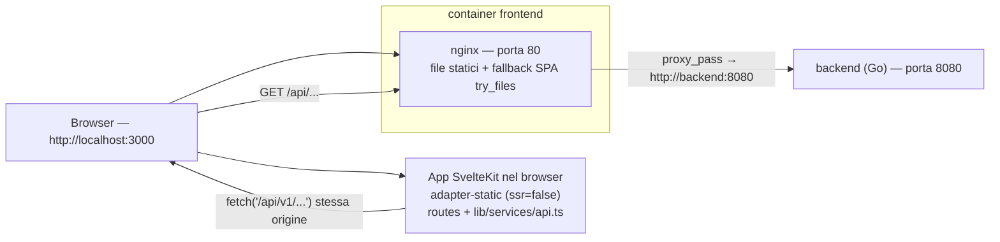

# VaultLab — Il frontend spiegato

> Questo documento spiega come funziona il frontend di VaultLab: la pagina web
> che vedi nel browser (grafici, form, pulsanti). È il compagno della guida al
> backend (`docs/BACKEND-GUIDE.it.md`) e della guida al database
> (`docs/DATABASE-GUIDE.it.md`) e non richiede conoscenze di programmazione: i
> concetti di componente, rotta e chiamata API vengono spiegati man mano.
>
> Per i lettori di lingua inglese esiste la versione
> `docs/FRONTEND-GUIDE.en.md`.

---

## 1. Cos'è il frontend

Il frontend è l'applicazione web di VaultLab: l'utente accede, crea portafogli,
registra transazioni, aggiunge titoli e guarda i grafici (performance,
allocazione, prezzi).

Alcuni fatti sullo stato attuale:

- **Tecnologia**: SvelteKit 5 (Svelte 5 "rune"), TypeScript, Tailwind CSS e
  **ECharts** per i grafici.
- **Modello di esecuzione**: una **SPA lato client** ("single page
  application"): il server invia un guscio statico e tutto il rendering avviene
  nel browser, che recupera i dati dal backend con `fetch`.
- **Storia**: fino alla prima release il frontend era un'applicazione
  **React 19 + Vite** (react-router, axios, TanStack Query, Recharts). Quella
  app è stata **completamente sostituita** dall'app SvelteKit descritta qui; il
  codice React e le sue dipendenze non fanno più parte del repository.
- **Dove gira**: i file compilati sono serviti da **nginx** dentro il container
  `frontend`, pubblicato da docker-compose sulla porta host **3000**
  (http://localhost:3000). nginx funziona anche da **reverse proxy**: le
  richieste del browser a `/api/...` vengono inoltrate al backend Go sulla
  porta 8080.

Il frontend è "stupido di proposito": disegna pagine e grafici, ma ogni numero
(valore del portafoglio, gain/loss, ROI, allocazioni) viene calcolato dal
**backend** (vedi la guida al backend, capitoli 8 e 9) e arriva nel browser come
JSON.

---

## 2. Concetti di base

Un piccolo glossario, nello stesso spirito della guida al backend. Se conosci
già questi termini, salta al capitolo 3.

- **SPA (single page application)**: un'applicazione fatta di una sola pagina
  HTML; quando navighi, il contenuto cambia "sul posto" senza ricaricare la
  pagina.
- **Componente**: un mattoncino dell'interfaccia (una card, una tabella, un
  grafico). In Svelte un componente è un file `.svelte` che contiene HTML, CSS
  e logica.
- **Rotta / pagina**: un URL che l'app può mostrare (`/portfolios`,
  `/assets/123`, ...). In SvelteKit ogni cartella sotto `src/routes/` con un
  file `+page.svelte` è una pagina.
- **Runa**: un simbolo speciale di Svelte 5 che rende lo stato "reattivo" (l'
  interfaccia si aggiorna da sola quando i dati cambiano). Le tre più comuni
  sono `$state` (una variabile reattiva), `$derived` (un valore calcolato da
  altri) e `$effect` (codice che viene rieseguito quando cambiano le sue
  dipendenze).
- **API / endpoint**: un "numero di telefono" del backend (guida al backend,
  capitolo 2).
- **JSON**: il formato testuale usato per scambiare i dati con il backend
  (guida al backend, capitolo 2).
- **JWT / token**: la credenziale che dimostra che hai effettuato l'accesso. Il
  backend emette due token (access e refresh); il frontend li conserva nel
  `localStorage` del browser (capitolo 9).
- **localStorage**: una piccola area di memoria del browser che sopravvive ai
  ricaricamenti della pagina. VaultLab ci salva i due token.
- **Libreria grafici / ECharts**: una libreria pronta per disegnare grafici
  (a linee, a torta, ...). VaultLab usa ECharts tramite il wrapper
  `svelte-echarts`.
- **Proxy / reverse proxy**: un server (qui nginx) che riceve le richieste e le
  inoltra altrove. Il browser pensa di parlare con "il suo" server, ma `/api/...`
  viene inoltrato al backend Go.
- **CORS**: una regola di sicurezza del browser sulle chiamate a un server che
  vive su un'origine *diversa* (es. localhost:3000 → localhost:8080). Nella
  configurazione standard il browser chiama solo la propria origine (il proxy
  nginx), quindi il CORS non viene coinvolto.

Un'analogia: il **frontend è la sala di un ristorante**. Le pagine sono i
tavoli, i componenti sono i piatti e il client API è il cameriere che porta gli
ordini in cucina (il backend).

---

## 3. Come gira



I pezzi che girano (definiti in `docker-compose.yml`):

- **frontend** — la pagina web. L'immagine è costruita da `frontend/Dockerfile`
  in due fasi:
  1. `node:22-alpine` installa le dipendenze (`npm ci`) ed esegue
     `npm run build` (in `package.json` è `vite build`);
  2. `nginx:alpine` copia il risultato (`/app/build`) in
     `/usr/share/nginx/html` insieme a `frontend/nginx.conf`, in ascolto sulla
     porta 80. docker-compose la pubblica come **3000:80**.
- **backend** — l'API Go sulla porta 8080 (guida al backend). Il container
  frontend dipende da esso.

### Come funziona il build SvelteKit

- `frontend/svelte.config.js` usa **`@sveltejs/adapter-static`** con
  `fallback: 'index.html'`: un build "statico", adatto a un server che serve
  solo file (nginx). Il `fallback` lo rende una SPA senza flash: ogni URL
  sconosciuto restituisce il guscio `index.html`, che poi carica la pagina
  giusta.
- `frontend/src/routes/+layout.ts` imposta `export const ssr = false` e
  `export const prerender = false`: niente rendering lato server, niente pagine
  precompilate. Il browser riceve `index.html` + gli asset JS/CSS e l'app
  disegna tutto lato client.
- L'output del build va in `frontend/build/` (già presente nel repo).

### nginx

`frontend/nginx.conf` fa due cose:

- `location /api/` → `proxy_pass http://backend:8080;` (più gli header `Host`
  e `X-Real-IP`). Ogni chiamata API quindi esce dal browser sulla stessa
  origine (`/api/v1/...`) e raggiunge il backend Go.
- `location /` → `try_files $uri $uri/ /index.html;` — serve i file statici e
  ripiega sul guscio SPA per le rotte client-side.

### Modalità sviluppo

`make frontend-dev` esegue `cd frontend && npm run dev`: il dev server Vite
sulla **porta 5173** con hot-reload. `vite.config.ts` definisce un proxy per
tutto ciò che sta sotto `/api` → `http://backend:8080`, così le pagine possono
chiamare il backend in esecuzione come se fosse sulla stessa origine. (Il
target del proxy è il nome del servizio docker-compose, quindi funziona solo
dove `backend` è un hostname risolvibile, es. nella rete dei container.)

### CORS

Il backend imposta gli header CORS (guida al backend, capitolo 4), ma nella
configurazione standard non vengono mai usati: il browser chiama sempre
`http://localhost:3000` e nginx inoltra al backend, quindi non c'è nessuna
richiesta cross-origin. Il CORS conta solo se l'API viene chiamata direttamente
da una pagina servita altrove.

---

## 4. Struttura delle cartelle

```
frontend/
├── svelte.config.js        # adapter-static + fallback index.html
├── vite.config.ts          # porta dev 5173 + proxy /api
├── tailwind.config.js      # contenuto Tailwind: ./src/**/*.{html,js,svelte,ts}
├── postcss.config.js       # tailwindcss + autoprefixer
├── Dockerfile              # build node → serve nginx (porta 80)
├── nginx.conf              # file statici + proxy /api/ verso backend:8080
├── static/vault.svg        # favicon
└── src/
    ├── app.html            # HTML radice (bootstrap tema, meta theme-color, favicon, titolo)
    ├── app.css             # @tailwind + token semantici (:root / .dark) + base layer
    ├── app.d.ts            # namespace App di SvelteKit (segnaposto)
    ├── lib/                # codice condiviso (la "parte interessante")
    │   ├── components/     # primitive ui/, layout/ (AppShell), Toaster + wrapper ECharts
    │   ├── services/api.ts # l'unico client API (capitolo 5)
    │   ├── stores/         # auth.svelte.ts, toast.svelte.ts, theme.svelte.ts (rune Svelte 5)
    │   ├── chartPalette.ts # palette serie + risoluzione token a runtime (dark-aware)
    │   ├── chartTheme.ts   # temi ECharts registrati per light/dark
    │   └── format.ts       # formattatori + etichette classi (capitolo 6)
    └── routes/             # le pagine
        ├── +layout.ts      # ssr=false, prerender=false
        ├── +layout.svelte  # guardia auth, AppShell, Toaster
        ├── +page.svelte    # Dashboard (/)
        ├── login/          # login + registrazione (una pagina, un toggle)
        ├── assets/         # elenco titoli + creazione (autocomplete)
        ├── assets/[id]/    # dettaglio asset (B.10)
        ├── portfolios/     # elenco portafogli + CRUD + import
        ├── portfolios/[id]/ # dettaglio portafoglio (transazioni, grafici)
        ├── settings/       # profilo, password, whitelist valute
        └── admin/health/   # health dashboard dei prezzi (area admin)
```

> **Non esiste una pagina `/register` separata**: la pagina di login contiene un
> toggle "Sign in / Register" ed entrambi i form sono gestiti lì (capitolo 10).

---

## 5. Il livello API

Tutto vive in un unico file: `frontend/src/lib/services/api.ts`. Incapsula
l'API HTTP del backend sotto `/api/v1`, aggiunge autenticazione e una piccola
cache GET, ed esporta i tipi TypeScript di tutte le risposte.

### La base e la funzione `request`

- `const BASE_URL = '/api/v1'`. `buildUrl(path, params)` costruisce
  `window.location.origin + '/api/v1' + path` aggiungendo i parametri query,
  quindi la richiesta è sempre **stessa origine** (nginx la inoltra, capitolo
  3).
- `request<T>(path, {method, body, params})` è l'unico punto d'ingresso:
  1. costruisce l'URL e legge la cache in memoria (capitolo sotto);
  2. aggiunge `Content-Type: application/json` e, se esiste un token in
     `localStorage` (`access_token`), l'header
     `Authorization: Bearer <token>`;
  3. chiama `fetch`;
  4. su **401** (e solo per i percorsi non-`/auth/`) prova a **rinnovare la
     sessione** (vedi sotto) e ritenta la richiesta una volta;
  5. su risposte non-OK legge `{error}` dal corpo e lancia
     `new Error(message)` con `status` HTTP allegato (le pagine usano `status`
     per riconoscere es. 404 o 409/422);
  6. un `204` restituisce `undefined`.

### Il flusso di refresh (gestione token)

Il backend emette token **access** di breve durata (15 min) e token **refresh**
di lunga durata (72 h) (guida al backend, capitolo 14). Il frontend li salva
entrambi in `localStorage` con le chiavi `access_token` e `refresh_token`.

Quando una richiesta torna con **401**:

1. il frontend legge `refresh_token` da `localStorage`;
2. chiama `POST /auth/refresh` con `{refresh_token}`;
3. se ha successo salva la **nuova coppia** in `localStorage`, aggiorna
   l'header `Authorization` e **ritenta la richiesta originale una volta**;
4. se fallisce (o c'è un errore di rete) cancella entrambi i token e fa un
   redirect "duro" a `/login` con `window.location.replace('/login')`
   (bypassando volutamente il router di SvelteKit).

### La cache GET

`api.ts` tiene una `Map` a livello di modulo delle risposte GET con TTL di
**60 secondi** (`CACHE_TTL_MS`). Perché: la SPA naviga senza ricaricare, quindi
rimontare la stessa pagina rifarebbe il fetch di endpoint pesanti (dashboard,
summary, storico) senza una cache. Le regole:

- **ogni richiesta non-GET svuota l'intera cache** — volutamente rozzo: quasi
  ogni mutazione può cambiare endpoint aggregati, e svuotare tutto è più
  sicuro che tenere traccia delle dipendenze;
- i dati in cache vengono **deep-copy** prima di essere restituiti
  (`structuredClone`, con ripiego sul round-trip JSON — che non deve mai
  rompere la richiesta), così i chiamanti non possono "avvelenare" la cache
  mutando una risposta;
- **gli errori (4xx/5xx) non vengono mai messi in cache**: vale il normale
  flusso throw/retry.

### I gruppi API e i loro endpoint

Il client esporta oggetti tipizzati per dominio. Ogni endpoint sotto è stato
verificato contro le rotte del backend (`backend/cmd/server/main.go`).

| Gruppo | Metodi | Endpoint |
|---|---|---|
| `authApi` | login, register, me, updateProfile, changePassword | `POST /auth/login`, `POST /auth/register`, `GET /users/me`, `PATCH /users/me`, `POST /users/me/password` |
| `portfolioApi` | list, create, get, update, delete | `GET /portfolios`, `POST /portfolios`, `GET/PATCH/DELETE /portfolios/{id}` |
| | summary, allocation, classAllocation, geographyAllocation, sectorAllocation, performance, performanceBuckets, roi, history | `GET /portfolios/{id}/summary`, `GET /portfolios/{id}/allocation`, `GET /portfolios/{id}/allocation/class`, `GET /portfolios/{id}/allocation/geography`, `GET /portfolios/{id}/allocation/sector`, `GET /portfolios/{id}/performance`, `GET /portfolios/{id}/performance/buckets?granularity=month|year`, `GET /portfolios/{id}/roi`, `GET /portfolios/{id}/history` |
| | dashboard, dashboardAllocation, dashboardPerformance | `GET /dashboard`, `GET /dashboard/allocation`, `GET /dashboard/performance?granularity=month|year` |
| | exportDoc, importDoc | `GET /portfolios/{id}/export`, `POST /portfolios/import` |
| `assetApi` | list, search, lookup, meta | `GET /assets`, `GET /assets/search?q=`, `GET /assets/lookup?q=`, `GET /assets/meta?ticker=` |
| | get, create, update, remove | `GET /assets/{id}`, `POST /assets`, `PATCH /assets/{id}`, `DELETE /assets/{id}` |
| | quote, fetchProfile | `GET /assets/{id}/quote`, `POST /assets/{id}/fetch-profile` |
| | exposure, saveExposure, fetchExposure, fetchETFExposure, fetchMorningstarExposure | `GET /assets/{id}/exposure`, `PUT /assets/{id}/exposure`, `POST /assets/{id}/fetch-exposure`, `POST /assets/{id}/fetch-etf-exposure`, `POST /assets/{id}/fetch-morningstar-exposure` |
| | backfillHistory, sync | `POST /assets/{id}/backfill-history`, `POST /assets/sync` |
| `transactionApi` | list, create | `GET /portfolios/{id}/transactions?limit=&offset=` (EPIC I.9: restituisce l'involucro `TransactionPage` — `transactions`, `total`, `limit`/`offset` applicati; limite di default 20, max 100, ordine per data decrescente), `POST /portfolios/{id}/transactions` |
| | update, remove | `PATCH/DELETE /transactions/{id}` |
| `pricesApi` | refresh | `POST /prices/refresh` (query opzionale `portfolio_id`, restituisce il `RefreshReport`) |
| | byAsset | `GET /prices/{assetId}?full=1` |
| `settingsApi` | listCurrencies, addCurrency, deleteCurrency | `GET/POST /settings/currencies`, `DELETE /settings/currencies/{code}` |
| `api` (generico) | get/post/put/patch/delete | il client grezzo, usato dalla pagina health per `GET /health/prices` |

I tipi esportati accanto (`User`, `Portfolio`, `Asset`, `Transaction`,
`TransactionPage`, `PortfolioSummary`, `AssetHolding`, `Dashboard`,
`DashboardSummary`,
`ActiveBreakdown`, `ClosedBreakdown`, `RefreshReport`, `AssetQuote`,
`AssetExposure`, `PortfolioHistory`, `AssetPositionSeries`,
`PortfolioExportDocument`, ...) rispecchiano i modelli del backend. Nota: i
valori monetari arrivano come **stringhe** (es. `"1234.56"`) per evitare errori
di arrotondamento in virgola mobile; le pagine li convertono con `Number()`
dove serve. Da EPIC I.1 `User` porta la preferenza `base_currency` (default
`"EUR"`) e `Dashboard` aggiunge `base_currency` più l'eventuale `summary`
(`DashboardSummary`) con i totali consolidati in quella valuta. Da EPIC I.2
il summary e ogni voce di `portfolios` (`PortfolioPerformanceSummary`)
scompongono i totali nei due oggetti annidati `active` (`ActiveBreakdown`:
investito, valore, gain/loss, gain/loss % e dividendi dei soli lotti ancora
detenuti) e `closed` (`ClosedBreakdown`: investito = costo dei lotti venduti,
ricavi = ricavi netti di vendita + dividendi delle posizioni completamente
chiuse, realizzato = ricavi − investito, realizzato %) — i campi piatti sono
spariti. Da EPIC I.3 `Dashboard` non porta più le serie `history` per
portafoglio: i nuovi tipi `DashboardPerformance` / `PerformanceBucket`
alimentano i grafici "Performance" e "Capital invested" della dashboard
tramite `dashboardPerformance(granularity)` (`GET /dashboard/performance?granularity=month|year`,
bucket `YYYY-MM` o `YYYY` nella valuta base dell'utente). Da EPIC I.8 (#87) la
**stessa** forma `DashboardPerformance` alimenta anche la card "Performance"
del dettaglio portafoglio tramite `performanceBuckets(id, granularity)`
(`GET /portfolios/{id}/performance/buckets?granularity=month|year`), nella
**valuta del portafoglio** e non in quella base. Ogni bucket porta
`return` (il rendimento TWR % del periodo, barre), `twr` (il
rendimento time-weighted cumulato %, linea), `invested` (capitale netto
investito a fine bucket) e `value` (valore di mercato a fine bucket) — i due
importi nella `currency` del payload. Da EPIC I.5 `Dashboard` porta anche
`invested_assets` (`InvestedAsset[]`): le posizioni aperte aggregate su tutti
i portafogli nella valuta base (`ticker`, `name`, `invested`, `value`,
`gain_loss`, `gain_loss_pct`, `has_price`), ordinate per valore decrescente —
 le righe con `has_price: false` portano il valore al costo, quindi il loro
P/L è 0. Dall'EPIC I.9 (#88) `transactionApi.list(id, { limit, offset })` non
restituisce più un semplice array ma l'involucro `TransactionPage`
(`transactions`, `total`, `limit`/`offset` applicati; limite di default 20,
max 100, ordine per data decrescente), che il dettaglio portafoglio pagina.

> **Nota**: `portfolioApi` espone i metodi di allocazione geografica e
> settoriale (`geographyAllocation(id)`, `sectorAllocation(id)` — serviti dal
> backend da EPIC B.6/B.7) più l'aggregato dashboard di B.8
> (`dashboardAllocation()`) — vedi il paragrafo B.8 nel capitolo 11.

---

## 6. Utility e risorse di formattazione

### `lib/format.ts`

Il modulo di formattazione unico, condiviso da tutte le pagine (non esiste una
cartella `utils/` o `metrics/` — vedi sotto):

| Export | Cosa fa |
|---|---|
| `currencySymbol(code)` | restituisce il simbolo di una valuta da una piccola tabella (`USD → $`, `EUR → €`, `GBP → £`, `CHF → CHF`, `JPY → ¥`, ...), ripiegando sul codice stesso per quelle sconosciute |
| `formatCurrency(amount, currency='USD')` | `simbolo + toLocaleString(...)` con esattamente 2 decimali, es. `$1.234,56`. Accetta `number` o `string` |
| `formatPercent(value)` | `toFixed(2) + '%'`, es. `12,34%`. Accetta `number` o `string` |
| `formatSignedPercent(value)` | come `formatPercent` ma aggiunge un `+` esplicito sui valori positivi, es. `+3,42%` / `-1,20%`. Usato nei tooltip del grafico Performance (sia il `return` di periodo sia il `twr` cumulato sono percentuali in cui il segno veicola il significato). Accetta `number` o `string` |
| `ASSET_CLASS_LABELS` | mappa delle 8 classi di asset del backend su etichette UI **italiane**: `equity → Azioni`, `bond → Obbligazioni`, `commodity → Materie prime`, `currency → Valute`, `crypto → Crypto`, `real_estate → Immobiliare`, `mixed → Misto`, `other → Altro` |

La mappa delle etichette è usata ovunque serva mostrare una classe: dentro
`ClassDonut` (le ciambelle delle classi di attività nella card "Allocazione
complessiva" della dashboard e nella sezione allocazione del dettaglio
portafoglio, che mappa da sé le chiavi del backend), e il selettore "Classe"
nel dettaglio asset.

### Calcoli di valore e metriche

Non esiste un modulo dedicato alle metriche: ogni pagina calcola i propri
valori derivati inline con le rune **`$derived`** di Svelte 5. I principali:

- **Dashboard** (`routes/+page.svelte`): lo stato delle card Performance +
  Capital invested (EPIC I.3) è un `$state` `granularity` (default 'month')
  più un singolo `$state` `perf` (una sola chiamata
  `dashboardPerformance(granularity)` alimenta **entrambi** i grafici)
  ricaricato da un `$effect` a ogni cambio del selettore (un id di
  richiesta monotònico scarta le risposte obsolete); `hasMultipleCurrencies`
  pilota il donut "Allocation by portfolio" (valori grezzi nascosti e nota
  "valute miste" quando i portafogli usano valute diverse — EPIC I.1);
  `glClass` sceglie la classe testo verde/rosso per un guadagno o una perdita.
- **Dettaglio portafoglio** (`routes/portfolios/[id]/+page.svelte`): lo stato
  della card "Performance" (EPIC I.8, #87) replica quello della dashboard: un
  `$state` `granularity` (default 'month') più un `$state` `perf` ricaricato da
  un `$effect` a ogni cambio del selettore (un id di richiesta monotònico
  scarta le risposte obsolete), alimentato da
  `performanceBuckets(id, granularity)`;
  `regionBarRows` / `sectorBarRows` / `countryBarRows` mappano i carichi di
  allocazione sulla forma generica `ExposureBarRow` consumata da
  `ExposureBarChart` (EPIC I.7, #86); `geoUniverseNote` /
  `sectorUniverseNote` costruiscono le didascalie di copertura "Universo
  azionario" dai `covered_value`/`excluded_value` di ciascun payload.
- **Dettaglio asset** (`routes/assets/[id]/+page.svelte`): `chartSeries`
  filtra le righe prezzo in base all'intervallo selezionato (`RANGES`: `1M`
  30 giorni, `3M` 90 giorni, `1Y` 365 giorni, `MAX` illimitato) e le ordina per
  data; `METRICS` mappa i campi quote `change_1d/1w/1m/1y/ytd` sulle etichette
  `1G/1S/1M/1Y/YTD`; `sumRegions` / `sumSectors` validano che i pesi
  dell'esposizione sommino a 100 (±0,5, `regionsValid` / `sectorsValid`).

---

## 7. I componenti ECharts

Tutti i grafici vivono in `frontend/src/lib/components/` e usano **ECharts 5**
tramite il wrapper `svelte-echarts` (dipendenze `echarts` e `svelte-echarts`
in `package.json`).

### Il pattern di import (tree-shaking)

Ogni componente grafico segue lo stesso schema:

```svelte
<script lang="ts">
  import type { EChartsOption } from 'echarts'
  import { Chart } from 'svelte-echarts'
  import { init, use } from 'echarts/core'
  import { LineChart } from 'echarts/charts'          // solo ciò che serve
  import { GridComponent, TooltipComponent, DataZoomComponent } from 'echarts/components'
  import { CanvasRenderer } from 'echarts/renderers'

  use([LineChart, GridComponent, TooltipComponent, DataZoomComponent, CanvasRenderer])

  let { series = [], currency = 'USD' } = $props()

  const options = $derived.by((): EChartsOption => ({ ... }))
</script>

<div class="h-[340px] w-full">
  {#key resolved()}
    <Chart {init} {options} theme={VAULTLAB_CHART_THEMES[resolved()]} />
  {/key}
</div>
```

La chiamata `use(...)` registra solo i moduli di cui il grafico ha bisogno
(bundle più piccolo); `init` (da `echarts/core`) viene passato al wrapper
`<Chart>`, che inizializza l'istanza al mount. Le opzioni sono dichiarate come
`EChartsOption` e ricalcolate con `$derived.by`, così il grafico reagisce ai
cambiamenti di `$props`.

### Grafici dark-aware

Anche i grafici seguono il tema (capitolo 8). L'helper `resolved()` dello store
del tema dice se l'app sta disegnando in chiaro o scuro; il blocco
`{#key resolved()}` forza il wrapper a **reinizializzare** il grafico quando il
tema cambia, perché `svelte-echarts` legge la prop `theme` solo una volta al
mount. Due helper lo rendono possibile:

- `lib/chartTheme.ts` registra due temi ECharts (`vaultlab-light`,
  `vaultlab-dark`) costruiti dagli stessi token del CSS (colori di assi,
  legenda, tooltip) e li espone come `VAULTLAB_CHART_THEMES`;
- `lib/chartPalette.ts` espone `resolvePalette()` (i colori serie
  `--chart-1..12`, letti dal DOM e messi in cache per tema) e
  `chartSemanticColors()` per le linee speciali (cost basis, realizzato,
  marcatori split, fetta "Other").

Le label delle torte richiedono un colore esplicito: a differenza di assi e
legenda, le label delle pie ECharts **non** ereditano il `textStyle` del tema,
quindi ogni donut imposta `label.color` dal foreground del tema e disattiva il
bordo bianco di default (altrimenti, in scuro, le label apparirebbero come testo
scuro contornato di bianco).

### I wrapper dei grafici

| Componente | Grafico | Usato per |
|---|---|---|
| `PriceChart.svelte` | **line** singola (prezzi di chiusura), asse x temporale, dataZoom `inside` + `slider` | la pagina **dettaglio asset** (B.10): storico prezzi con selettore 1M/3M/1Y/YTD/MAX. Carica sempre tutto lo storico: i selettori fanno uno **zoom in-place** (coppia `start`/`end` percentuali, `end`=100) senza ricaricare dati; uno zoom/spostamento manuale **deseleziona** il pulsante attivo e preserva la vista. Gli **split** sono disegnati come `markLine` tratteggiata viola etichettata con il rapporto (`Split 4:1`), come in `PositionChart`. Stato vuoto → "Nessun dato prezzi disponibile" |
| `PositionChart.svelte` | **tre linee**: cost basis (grigia, a scalini), market value (verde, liscia), realized (ambra) + marcatori viola per gli split | la card "Performance history" del **dettaglio portafoglio**, mantenuta come **vista secondaria** sotto la nuova card percentuale "Performance" dell'EPIC I.8 (#87): un menu a tendina passa dal portafoglio al singolo asset. Gli split sono disegnati come `markLine` tratteggiata verticale sulla linea del valore di mercato, etichettata con il rapporto (`7:1`, `4:1`) |
| `PerformanceChart.svelte` (`lib/components/domain/`) | **combo barre + linea in percentuale** su asse x a **categorie** (EPIC I.3): una barra `return` per bucket (rendimento TWR % del periodo) colorata verde/rosso secondo il segno (semantici `positive`/`negative`, `itemStyle` per barra), linea `twr` (rendimento time-weighted cumulato %) nell'ambra semantica, asse y formattato in % e tooltip `+3,42%` (`formatSignedPercent`, niente valuta), etichette dei periodi formate per granularità (`giu 2025` / `2025`), dataZoom `inside` + `slider`, legenda `Gain/Loss` / `Cumulative`, stato vuoto "No data" | la card "Performance" della **dashboard**, alimentata da `dashboardPerformance(granularity)` (`GET /dashboard/performance`, selettore mensile/annuale con `SegmentedControl` nell'intestazione della card), e — da EPIC I.8 (#87) — la card "Performance" del **dettaglio portafoglio**, alimentata da `performanceBuckets(id, granularity)` (`GET /portfolios/{id}/performance/buckets`, proprio selettore mensile/annuale, nella valuta del portafoglio). Le barre mostrano il rendimento generato dentro ogni mese/anno, la linea il TWR cumulato — sono percentuali pure, quindi il componente non riceve più la prop `currency` |
| `CapitalChart.svelte` (`lib/components/domain/`) | **due linee** sugli **stessi** bucket a categorie: `invested` (capitale netto investito, linea a scalini `end` nel grigio semantico `costBasis`) e `value` (valore di mercato, linea liscia nel verde semantico `marketValue`), tooltip in valuta con `formatCurrency(value, currency)`, dataZoom `inside` + `slider`, legenda `Invested` / `Value`, re-init theme-aware (`{#key}`), stato vuoto "No data" | la card "Capital invested" della **dashboard**, alimentata dalla **stessa** chiamata `dashboardPerformance(granularity)` e dagli stessi bucket di `PerformanceChart` (importi nella **valuta base** dell'utente, `currency` del payload) e con lo stesso selettore mensile/annuale |
| `ExposurePie.svelte` | **ciambella** (raggio 45%–70%), palette a 12 colori, legenda mostrata solo con ≤ 6 righe, righe a peso zero filtrate; `complete={false}` la rende **aperta** quando le righe sommano < 100 (una fetta residua trasparente tiene veritieri gli angoli — niente fetta grigia "Other") | pagina dettaglio asset (donut regioni con `complete={false}` e donut settori) e le due modali esposizione (in modalità `mute`: regioni in `ExposureGeoModal`, settori in `ExposureSectorModal`). I paesi (pagina e modale geografica) sono liste a barre, mai una pie. Accetta `ExposureRow[]` (`{name, weight}`). Non è più usata nel dettaglio portafoglio: la card classi con tabella e le card `GeographyChart`/`SectorChart` sono state sostituite da `ClassDonut` + `ExposureBarChart` nell'EPIC I.7 (#86) |
| `ClassDonut.svelte` (`lib/components/domain/`) | **ciambella** delle classi di asset (EPIC I.4, stesso stile radius/palette/etichette di `ExposurePie`): righe `AssetClassSlice[]` (`{class, value, weight}`) mappate con `ASSET_CLASS_LABELS` per i nomi in chiaro, tooltip con importo (`formatCurrency`) e peso (`formatPercent`), fetta `other` in grigio spento, righe a peso zero scartate, stato vuoto "Nessuna allocazione per classi"; prop `label` opzionale per l'intestazione sopra il grafico | il pannello classi della card "Allocazione complessiva" della **dashboard**, alimentato da `dashboardAllocation().classes` (vault intero, valuta base), e — da EPIC I.7 (#86) — il pannello classi della sezione "Allocazione" del **dettaglio portafoglio**, alimentato da `classAllocation(id).classes` (valuta del portafoglio) |
| `ExposureBarChart.svelte` (`lib/components/domain/`) | **barre orizzontali** riutilizzabili (EPIC I.4) su righe generiche `{name, value, weight}[]` (`ExposureBarRow`): barre ordinate **per valore decrescente** (risortese in modo difensivo nel componente, righe non positive scartate; asse categorie `inverse`, quindi la barra più grande sta in alto), peso % stampato a fine barra, tooltip con importo (`formatCurrency(value, currency)`) e peso (`formatPercent`), asse dei valori nascosto (le barre servono solo a confrontarsi tra loro), altezza del canvas proporzionale al numero di righe, `colorFor?: (name) => string` per colore per-riga (altrimenti palette `resolvePalette` per indice), `labelFor?: (name) => string` per mappare le etichette dell'asse (l'asse mostra il nome leggibile — es. codice ISO → nome completo del paese via `countryDisplayName` — e il tooltip aggiunge il nome grezzo tra parentesi quando differisce, "United States (US)"; la colonna delle etichette si allarga a 140px quando `labelFor` è attivo), `maxVisibleRows?: number` limita l'area visibile a quel numero di righe con un viewport `overflow-y-auto` mentre il canvas mantiene l'altezza completa (tutte le righe scorrevoli), `label` e `note` (didascalia muted) opzionali, stato vuoto "No data", re-init theme-aware (`{#key}`) | i pannelli regioni, settori e paesi della card "Allocazione complessiva" della **dashboard**, alimentati da `dashboardAllocation().regions` / `.sectors` / `.countries`, e — da EPIC I.7 (#86) — gli stessi tre pannelli della sezione "Allocazione" del **dettaglio portafoglio**, alimentati da `geographyAllocation(id).regions` / `sectorAllocation(id).sectors` / `geographyAllocation(id).countries` (in valuta del portafoglio); i chiamanti mappano `RegionAllocation`/`SectorAllocation`/`CountryAllocation` su `ExposureBarRow`; i paesi portano codici ISO alpha-2 renderizzati con `labelFor={countryDisplayName}` e `maxVisibleRows={10}` su entrambe le pagine — si vedono le ~10 barre maggiori, le altre scorrono in verticale; i pannelli regioni e settori non passano nulla: etichette invariate e tutte le righe visibili — le ~10 macro-regioni non hanno mai bisogno del cap |
| `InvestmentsTable.svelte` (`lib/components/domain/`) | tabella **active/closed** condivisa (`active: ActiveBreakdown`, `closed: ClosedBreakdown`, `currency`, `title` opzionale): colonne Investito / Valore-Ricavi / Gain-Loss / % / Dividendi, righe Active e Closed, P/L firmato colorato con `pnlColorClass`, importi via `formatCurrency` | la card **Investments** della **dashboard** (valuta base, EPIC I.2) e la card KPI del **dettaglio portafoglio** (valuta portafoglio, EPIC I.6 #85) |
| `PositionTable.svelte` (`lib/components/domain/`) | tabella posizioni generica sul tipo `PositionRow` (`{assetId?, ticker, name?, qty?, cost?, value?, realized?, unrealized?, roi?, closed?, price?, priceCurrency?}`); `showCost`/`showRealized`/`showUnrealized` mostrano le colonne opzionali, `showPrice` aggiunge la colonna Price (prima di Qty, formattata con `priceCurrency`, visibile anche sulle righe chiuse), `linkAssets` collega il ticker alla pagina asset; le righe chiuse mostrano `-` su tutte le celle tranne il realizzato | la tabella Positions del **dettaglio portafoglio** (E.2) — l'accordion posizioni della **dashboard** (E.1) è stato sostituito dalla tabella consolidata "Invested assets" nell'EPIC I.5 (#82) e non usa più questo componente |
| `AllocationDonut.svelte` (`lib/components/domain/`) | ciambella theme-aware di quote `{name, value}[]` (pesi ricalcolati sul totale positivo); `showValue={false}` nasconde il valore nel tooltip (donut multi-valuta) | la card "Allocation by portfolio" della **dashboard** (E.1) |
| `AssetCombobox.svelte` (`lib/components/domain/`) | combobox filtrabile sugli asset già registrati (ticker/nome, max 8 righe); emette l'id dell'asset selezionato | la modale transazione (E.2). La ricerca ticker Yahoo per creare asset vive in `AssetSearchAutocomplete` |
| `TransactionTable.svelte` (`lib/components/domain/`) | tabella transazioni (Data/Asset/Type badge/Qty/Price/Total/Azioni) con azione di modifica allineata a destra | la card Transactions del **dettaglio portafoglio** (E.2); dall'EPIC I.9 (#88) la pagina le passa una pagina da 20 righe alla volta e mostra i pulsanti Previous/Next con l'intervallo sotto di essa |
| `AddTransactionModal.svelte` (`lib/components/domain/`) | finestra di aggiunta/modifica/eliminazione transazione: combobox asset, tipo (buy/sell/dividend), quantità/prezzo o importo, data, commissioni, note; validazione inline e totale live; gestisce chiamate API, toast e conferma di eliminazione | la pagina **dettaglio portafoglio** (E.2), aperta da "Add Transaction" e dall'azione di modifica della tabella |
| `SettingsTabs.svelte` (`lib/components/domain/`) | barra di tab basata su link per le subroute delle Impostazioni (Profile / Password / Currencies / Health), tab attivo marcato con `aria-current="page"` | tutte e quattro le pagine **Settings** (E.4) |

I tooltip formattano i valori monetari con `formatCurrency` (capitolo 6), le
date con `new Date(...).toLocaleDateString()`.

### Dove vengono usati

- **Dettaglio asset (B.10)** — `PriceChart` per lo storico prezzi (con
  zoom in-place e marcatori {@code split}); `ExposurePie` per la
  distribuzione geo/settoriale. La **modifica**
  dell'esposizione avviene in **due modali** (`ExposureGeoModal` per
  paesi + regioni, `ExposureSectorModal` per i settori): sulla pagina
  restano solo i grafici; il pulsante "Modifica" di ciascuna card (icona
  matita) apre la propria modale con le griglie dei pesi, la
  validazione somma=100 (regioni/settori) e i salvataggi indipendenti.
- **Dettaglio portafoglio "Allocazione" (B.12/B.8, allineato alla dashboard
  nell'EPIC I.7, issue #86)** — una griglia `lg:grid-cols-2` di pannelli che
  replica la card della dashboard, in **valuta del portafoglio**: `ClassDonut`
  sugli `AssetClassSlice[]` restituiti da `portfolioApi.classAllocation`
  (chiavi mappate con `ASSET_CLASS_LABELS` dal componente stesso) più i
  pannelli `ExposureBarChart` di regioni, settori e paesi alimentati da
  `geographyAllocation(id)` (`regions` + `countries`) e
  `sectorAllocation(id)` (`sectors`), con le stesse didascalie
  equity-universe e lo stesso `maxVisibleRows={10}` per i paesi della
  dashboard. La vecchia card classi con `ExposurePie` + tabella e le card
  ciambella+tabella `GeographyChart` / `SectorChart` sono state eliminate
  (quei due componenti sono stati **rimossi** da `lib/components/domain/`,
  nessuna pagina li usava più).
- **Dashboard "Allocazione complessiva" (B.8, rinnovata in EPIC I.4)** —
  alimentata da `GET /dashboard/allocation`, che ora espone quattro dimensioni:
  `classes` (`ClassDonut`), `regions`, `sectors` e `countries` (tutti e tre
  `ExposureBarChart` — la vecchia ciambella regioni è stata sostituita
  da barre orizzontali decrescenti in #81), disposte in una
  griglia `lg:grid-cols-2` dentro la card. Le classi coprono tutto il vault;
  regioni, settori e paesi sono calcolati sull'universo **equity-only**
  (azioni sempre; ETF/fondi solo quando `asset_class` è `equity` o
  `real_estate`); bond, crypto, commodity e fondi non classificati sono
  esclusi e riportati come `covered_value` / `excluded_value`, che le barre
  della dashboard trasformano in una didascalia muted
  "Universo azionario: X% del portafoglio" (mostrata solo quando qualcosa è
  stato escluso).
- **Dashboard** — `PerformanceChart` (rendimento in %: barre + linea TWR
  cumulata) e `CapitalChart` (investito vs valore) alimentati da una **singola**
  chiamata `dashboardPerformance(granularity)` (EPIC I.3, selettore
  mensile/annuale), più i widget I.4 della card "Allocazione complessiva"
  (donut classi, barre regioni/settori/paesi).
- **Dettaglio portafoglio** — il medesimo `PerformanceChart` condiviso nella
  card "Performance" (EPIC I.8, #87), alimentato da
  `performanceBuckets(id, granularity)` con un proprio selettore
  mensile/annuale (bucket nella valuta del portafoglio), renderizzato sopra la
  vista secondaria "Performance history" con `PositionChart` mantenuta in
  pagina.

---

## 8. Stile, design system e dark mode

La UI si basa su un piccolo design system interno introdotto nell'**EPIC D**.

### Token semantici

I colori non sono più scritti direttamente nelle pagine. `tailwind.config.js`
definisce un insieme di token di colore **semantici** — `background`,
`foreground`, `surface`, `surface-raised`, `muted`, `muted-foreground`,
`border`, `input`, `ring`, `accent` (+ `accent-hover`/`accent-foreground`/
`accent-text`), `positive`, `negative`, `warning`, `overlay`, `chart-1..12`,
`chart-muted` — mappati su custom property CSS definite in `app.css` (`:root` e
`.dark`). Poiché i valori sono terne HSL composte con
`hsl(var(--token) / <alpha-value>)`, i modificatori di opacità funzionano
(`bg-accent/10`).

- Raggi: `rounded-card` / `rounded-control`; elevazione: `shadow-card` /
  `shadow-raised`; focus coerente: la classe `.focus-ring`.
- Tailwind è caricato tramite `app.css` (le tre direttive `@tailwind`) e
  PostCSS (`postcss.config.js`: `tailwindcss` + `autoprefixer`).
- `lib/ui-colors.ts` centralizza i colori testo di P&L (`pnlColorClass`,
  `totalColorClass`), prima duplicati in quattro pagine.

### Dark mode

- **Lo scuro è il default**; l'utente può scegliere **Chiaro**, **Scuro** o
  **Sistema** (segue l'OS) dal selettore del tema nell'header.
- La scelta è salvata in `localStorage` (`vaultlab-theme`) ed è gestita da
  `lib/stores/theme.svelte.ts` (`theme`, `resolved()`, `setThemeMode()`); è
  sincronizzata tra le schede e segue i cambi dell'OS in modalità `system`.
- Uno script inline in `app.html` imposta la classe `.dark` **prima del primo
  paint**, così un reload in scuro non mostra mai un lampo bianco (niente FOUC).
  `darkMode: 'class'` nella config di Tailwind fa sì che una sola classe cambi
  tutti i token.

### Primitive UI

I componenti riusabili vivono in `src/lib/components/ui/`: `Button` (varianti
primary/secondary/outline/ghost/danger/link, dimensioni, loading), `Input`,
`Textarea`, `Select`, `Field`, `Card` (+ `CardHeader`/`CardContent`), `Badge`,
`Modal`, `ConfirmDialog`, `Spinner`, `Skeleton`, `EmptyState`, le primitive
`Table` (`Table`/`THead`/`TBody`/`Tr`/`Th`/`Td`), `SegmentedControl` e
`StatCard`. Le pagine e la shell le riusano invece di duplicare markup. Le
azioni distruttive usano `ConfirmDialog` al posto del `confirm()` nativo del
browser.

### La shell dell'app

`src/lib/components/layout/` contiene la shell responsive: `AppShell` (la
radice, `h-dvh` + skip-link), `Sidebar` (collassabile a rail di sole icone; lo
stato è persistito in `localStorage['vaultlab-sidebar']`), `SidebarNav` (voce
attiva derivata dall'URL), `AppHeader` (sticky, con selettore tema e menu
utente), `UserMenu`, `ThemeToggle` e `MobileDrawer` (sotto `lg`: off-canvas con
overlay, focus trap e ripristino). Ha sostituito il vecchio `Layout.svelte`
fisso.

### Icone, toast e lingua

- **Icone**: `lucide-svelte`. Esempi: `LayoutDashboard`, `Briefcase`,
  `Banknote`, `Settings`, `LogOut`, `PanelLeft` (shell app); `Plus`, `Trash2`,
  `Pencil`, `Download`, `Upload`, `Search`, `Loader2`, `EllipsisVertical`,
  `X`, `ExternalLink`, `Activity` (pagine); `CheckCircle2`, `XCircle`,
  `AlertTriangle` (toast).
- **Toast**: un piccolo store a rune in `lib/stores/toast.svelte.ts`
  (`toast.success/error/warning`, più `toast.dismiss`) aggiunge elementi che si
  chiudono da soli dopo 3,5 s (4,5 s per i warning); `lib/components/Toaster.svelte`
  mostra la pila fissa in alto a destra con card **theme-aware**
  (`surface-raised`), icone semantiche, pulsante di chiusura e `aria-live`
  (`role="alert"` per gli errori). `<Toaster />` è montato una volta in
  `routes/+layout.svelte`, quindi ogni pagina può fare toast.
- **Responsive / mobile-first**: flex e grid si adattano per breakpoint
  (`flex flex-col gap-4 md:flex-row`, `grid grid-cols-2 md:grid-cols-4`,
  `sm:grid-cols-2 lg:grid-cols-3`, `md:grid-cols-3 lg:grid-cols-6`), le tabelle
  lunghe sono avvolte in `overflow-x-auto`, e sotto `lg` la shell diventa un
  drawer mobile.
- **App-wide**: `app.html` mantiene `lang="en"` e la favicon `/vault.svg`,
  imposta i meta `theme-color` chiaro/scuro ed esegue il bootstrap del tema
  pre-paint; background/foreground del body ora arrivano dai token via
  `app.css`.
- **Nota sulla lingua**: la UI è volutamente mista inglese/italiano — la
  maggior parte dei titoli è in inglese, mentre diverse etichette, stati vuoti
  e messaggi di toast sono in italiano ("cambio mancante", "Nessuna allocazione
  per classi", "Aggiorna da Yahoo", "Salva modifiche", ...). Riflette la lingua
  attuale del prodotto; anche i formattatori del capitolo 6 seguono lo stesso
  mix.

---

## 9. Autenticazione e sessione

### `lib/stores/auth.svelte.ts`

Uno store a rune che contiene `auth.user` e `auth.isLoading`:

- `initAuth()` — legge `access_token` da `localStorage` e, se presente, lo
  valida con `GET /users/me` (riempiendo `auth.user`). Al fallimento cancella
  entrambi i token. Chiamato una volta dal layout radice al mount.
- `login(email, password)` — `POST /auth/login`, salva la **coppia** in
  `localStorage`, imposta `auth.user`, poi
  `window.location.replace('/')` (un reload completo, voluto).
- `register(...)` — `POST /auth/register`. **Non** effettua il login: la pagina
  di login mostra "Registered! You can now log in." e torna al form di
  accesso.
- `logout()` — cancella entrambi i token, `auth.user = null` e
  `window.location.replace('/login')`.
- `updateProfile(name, email, baseCurrency?)` — `PATCH /users/me` e aggiorna
  `auth.user`. `base_currency` finisce nel body solo se passato
  (EPIC I.1); omesso significa "mantieni il valore salvato".

### Il layout radice (`routes/+layout.svelte`)

- finché `auth.isLoading` mostra uno spinner;
- quando lo stato è pronto: gli utenti non autenticati su qualsiasi pagina
  tranne `/login` vengono reindirizzati con `goto('/login', { replaceState:
  true })`; gli utenti autenticati su `/login` vengono mandati a `/`;
- per gli utenti autenticati disegna la shell responsive
  (`lib/components/layout/AppShell.svelte`, capitolo 8) attorno al contenuto
  della pagina;
- monta `<Toaster />`;
- una volta per caricamento di pagina (flag `synced`) chiama
  `assetApi.sync()` (`POST /assets/sync`) — la task in background del backend
  che fa il backfill di storico e split per gli asset che ne sono privi. Gli
  errori vengono ignorati: le singole pagine fanno il backfill di ciò che
  serve.

### Archiviazione dei token e refresh

- Chiavi: `localStorage.access_token` e `localStorage.refresh_token`.
- L'header Bearer e la logica 401 → refresh → retry vivono in `api.ts`
  (capitolo 5).
- Al fallimento del refresh l'app non resta mai in uno stato "a metà login":
  cancella i token e reindirizza "duro" a `/login`.

### Il refresh prezzi di sessione

La dashboard, il dettaglio portafoglio e il dettaglio asset usano un flag a
livello di modulo (`sessionRefreshed`) così da chiamare, **una volta per
sessione**, `pricesApi.refresh()` e poi rifare il fetch dei dati. Il
`RefreshReport` restituito guida i toast di avviso:

- `rate_limited` → "Yahoo Finance ha limitato le richieste: alcuni prezzi non
  aggiornati";
- altrimenti, se `issues.length > 0` → "N aggiornamenti prezzi non riusciti
  (Yahoo)".

La dashboard conserva inoltre `finished_at` dal report per mostrare la riga
"Prices updated: …" nell'header.

Questo mantiene l'UI funzionante quando viene aperta come deep-link senza
passare dalla dashboard.

---

## 10. Le pagine, una per una

### `/` — Dashboard (`routes/+page.svelte`)

Endpoint chiamati: `portfolioApi.dashboard()` e
`portfolioApi.dashboardPerformance(granularity)`, poi il `pricesApi.refresh()`
di sessione + una dashboard fresca e un refill delle performance (una sola
chiamata che alimenta sia la card Performance sia la card Capital invested).

- **Card Investments** (EPIC I.1, split active/closed da EPIC I.2): quando la
  risposta porta `summary`, il blocco in cima mostra i totali consolidati
  convertiti nella **valuta base** dell'utente (`base_currency` del payload)
  tramite il componente condiviso `InvestmentsTable` (riusato anche dal
  dettaglio portafoglio, EPIC I.6 #85): un'unica `Card` intitolata
  **Investments** che contiene una tabella con
  header condiviso e una riga per gruppo di breakdown: **Active** (Investito /
  Valore / Gain/Loss + % / Dividendi, da `summary.active` — i dividendi delle
  posizioni ancora aperte) e **Closed** (Investito / Ricavi / Realizzato + %,
  da `summary.closed` — i dividendi delle posizioni completamente chiuse sono
  già ricompresi nei `proceeds` dal backend, quindi la cella Dividendi mostra
  un trattino lungo). Gli importi passano da `formatCurrency`, le percentuali
  da `formatPercent`; ogni cella P/L firmata (gain/loss, realizzato e le due
  colonne %) è colorata con `pnlColorClass`. La tabella riusa le primitive
  `Table`/`Th`/`Td` con colonne numeriche allineate a destra in
  `tabular-nums`.
- Card **Performance** (EPIC I.3, sostituisce la vecchia "Portfolio History"):
  riga di intestazione con titolo e `SegmentedControl` ("Monthly" / "Annual")
  legato allo stato `granularity`, e sotto `PerformanceChart` alimentato da
  `dashboardPerformance(granularity)`: una barra `return` verde/rosso per bucket
  (rendimento TWR % del periodo) più la linea `twr` cumulativa,
  entrambe formattate in percentuale (`+3,42%`). La chiamata è isolata (se
  fallisce resta lo stato vuoto "No data"), viene ricaricata a ogni cambio di
  selettore e **alimenta anche la card Capital invested** sotto — un'unica
  richiesta `dashboardPerformance` guida entrambi i grafici. In caricamento
  mostra uno `Spinner`.
- Card **Capital invested**: intestazione con solo il titolo (nessun
  controllo — segue il medesimo stato `granularity` della card Performance) e
  `CapitalChart` alimentato dagli **stessi** `perf.buckets`: linea `invested`
  (grigia a scalini) contro `value` (verde liscia) nella **valuta base**
  dell'utente (`formatCurrency` nei tooltip). Mostra lo stesso `Spinner` di
  caricamento. Le due card (Performance + Capital invested) occupano la griglia
  a 2 colonne; la donut "Allocation by portfolio" scende ora su una riga a
  larghezza intera sotto di esse.
- Card **Allocazione complessiva** (layout EPIC I.4): una griglia
  `lg:grid-cols-2` di quattro pannelli alimentata da `dashboardAllocation()`
  (`GET /dashboard/allocation`, aggregato nella valuta base dell'utente su
  tutti i portafogli — era USD prima dell'EPIC I.1): **Classi di attività**
  (`ClassDonut` su `classes`, tutto il vault) e le barre orizzontali
  **Regioni**, **Settori** e **Paesi**, solo equity (`ExposureBarChart`
  su `regions` / `sectors` / `countries` — da #81 anche le regioni sono barre,
  e le vecchie card ciambella+tabella `GeographyChart` / `SectorChart` sono
  state definitivamente rimosse nell'EPIC I.7 (#86), quando il dettaglio
  portafoglio ha adottato questo stesso layout; le righe delle regioni riportano il nome della macro-regione
  invariato; le righe dei paesi portano codici ISO alpha-2
  ma sono etichettate con il **nome completo del paese** tramite
  `labelFor={countryDisplayName}` — i codici sconosciuti ripiegano sul codice
  grezzo — e il tooltip aggiunge il codice tra parentesi, es. "United States
  (US)"; il pannello paesi passa anche `maxVisibleRows={10}`, quindi si vedono
  le ~10 barre maggiori e le altre scorrono in verticale, mentre i pannelli
  regioni e settori restano senza limite con nomi invariati — le ~10
  macro-regioni e i settori GICS entrano sempre). I pannelli a
  barre passano un `colorFor` che mette in grigio la fetta aggregata `Other`,
  come nelle ciambelle. Tutti e tre i pannelli equity a barre ricevono i
  metadati di copertura
  `covered_value`/`excluded_value` tramite la didascalia muted "Universo azionario: X% del portafoglio"
  (prop `note`, solo quando ci sono holding non azionarie escluse); se
  l'endpoint fallisce la card mostra "Allocazione non
  disponibile" (la chiamata è isolata, non blocca la pagina).
- Donut **Allocation by portfolio** (`AllocationDonut`), etichettata nella
  valuta base quando disponibile.
- Card **Portfolios** (nome, valuta, valore attivo + gain/loss colorato con
  `pnlColorClass`, numero di asset) da `portfolios[].active`; da EPIC I.2 una
  seconda riga compatta aggiunge il breakdown closed del singolo portafoglio
  ("Closed: investito · ricavi · realizzato", con i ricavi che includono già
  i dividendi delle posizioni completamente chiuse), renderizzata solo se il
  portafoglio ha effettivamente venduto lotti (`hasClosedActivity`, cioè
  `closed.invested ≠ 0`), in tono muted e con il realizzato colorato via
  `pnlColorClass`.
- Card **Invested assets** (EPIC I.5, #82 — sostituisce i vecchi accordion
  espandibili per portafoglio e le loro `PositionTable`): un'unica `Card` con
  una tabella su `dashboard().invested_assets`, una riga per ogni asset
  **aperto** aggregato su tutti i portafogli nella **valuta base**
  dell'utente. Colonne: **Asset** (ticker collegato a `/assets/{id}` con nome
  su una seconda riga muted), **Investito**, **Valore**, **Gain/Loss**,
  **P/L %**; colonne numeriche allineate a destra in `tabular-nums`
  (`Th`/`Td align="right"`, stesse primitive e stile della card Investments),
  celle P/L firmate colorate con `pnlColorClass` e righe nell'ordine del
  backend (valore decrescente, nessun riordino lato client). Gli asset senza
  prezzo (`has_price: false`) portano il valore al costo — mostrano un piccolo
  badge muted **no price** accanto al ticker il cui tooltip spiega che il P/L
  è 0 perché non c'è prezzo disponibile. Con payload vuoto la card renderizza
  un `EmptyState` tratteggiato ("No invested assets yet").
- Stato vuoto: "Create your first portfolio" → `/portfolios`.

### `/login` — Sign in / Register (`routes/login/+page.svelte`)

Una sola card centrata con un toggle tra **Sign in** e **Register**
(`isRegister`). La registrazione chiede nome + email + password e, al
successo, mostra un toast e torna al Sign in; il login chiama `store.login()`
che fa un redirect "duro" a `/`.

### `/portfolios` — Portafogli (`routes/portfolios/+page.svelte`)

Endpoint chiamati: `portfolioApi.list()`, `settingsApi.listCurrencies()`.

- Griglia di card dei portafogli (nome, valuta, descrizione, elimina).
- Form **Create Portfolio** (nome, descrizione, valuta scelta dalla whitelist).
- **Import**: input file nascosto → analizza un documento di export JSON
  (richiede `version === 1`), mostra un'anteprima (nome/valuta/numero di
  transazioni/range date) e importa in modalità **"new"** (con un nome scelto)
  o **"overwrite"** (su un portafoglio esistente); dopo un import riuscito
  chiama `assetApi.sync()` così gli asset importati ricevono il backfill dello
  storico.
- **Export** vive nella pagina di dettaglio (sotto).

### `/portfolios/[id]` — Dettaglio portafoglio (`routes/portfolios/[id]/+page.svelte`)

Endpoint chiamati: `portfolioApi.get`, `.summary`, `.performanceBuckets`,
`.history`, `.classAllocation`, `.geographyAllocation`, `.sectorAllocation`,
`transactionApi.list(id, { limit, offset })`, `assetApi.list`, poi il
`pricesApi.refresh(id)` di sessione + summary fresco + refill dei bucket di
performance.

- KPI: la `InvestmentsTable` condivisa (roll-up Active/Closed da `summary.active`
  / `summary.closed`, in valuta portafoglio) più una riga attenuata con il numero
  di asset (EPIC I.6 #85; sostituisce le vecchie `StatCard`
  Valore/Realizzato/Gain-Loss/Asset).
- Tabella **Positions** (`summary.holdings`, ticker che linka a
  `/assets/{id}`, posizioni chiuse con badge "Closed" e `-`).
- Card **Performance** (EPIC I.8, #87): la performance percentuale del
  portafoglio, che riusa il `PerformanceChart` condiviso (barre `return`
  verdi/rosse + linea `twr` cumulata, entrambe percentuali). Una riga di
  intestazione contiene il titolo e un `SegmentedControl` ("Monthly" /
  "Annual") legato a uno `$state` `granularity`; i bucket arrivano da
  `performanceBuckets(id, granularity)`
  (`GET /portfolios/{id}/performance/buckets`, nella **valuta del
  portafoglio**). Replica il ciclo di vita della card della dashboard: fetch
  al mount (default `month`), refill a ogni cambio del selettore con id di
  richiesta monotònico (le risposte obsolete vengono scartate), `Spinner` in
  caricamento e stato vuoto "No data" del grafico in caso di errore. Viene
  aggiornata anche dopo il `pricesApi.refresh(id)` di sessione e dopo ogni
  mutazione di transazioni (la POST svuota la cache GET e i nuovi flussi
  spostano i bucket).
- **Performance history** (vista secondaria, mantenuta sotto la nuova card
  dall'EPIC I.8 #87): `PositionChart` con un menu a tendina per passare dal
  portafoglio al singolo asset (gli split sono disegnati sul grafico).
- **Allocazione** (EPIC I.7 #86, replica la card "Allocazione complessiva"
  della dashboard): una griglia `lg:grid-cols-2` di pannelli nella **valuta
  del portafoglio** — **Classi di attività** (`ClassDonut` su
  `classAllocation()`, chiavi delle classi mappate con `ASSET_CLASS_LABELS`
  dal componente) e le barre orizzontali **Settori**, **Regioni** e **Paesi**,
  solo equity (`ExposureBarChart` sui `sectors` di `sectorAllocation()` e sui
  `regions` + `countries` di `geographyAllocation()` — il pannello paesi usa
  `labelFor={countryDisplayName}` e `maxVisibleRows={10}`, esattamente come la
  dashboard). I pannelli equity ricevono i metadati di copertura
  `covered_value`/`excluded_value` e mostrano la didascalia "Universo
  azionario: X% del portafoglio" quando ci sono holding non azionarie
  escluse. Ogni endpoint è isolato nel suo try/catch: in caso di errore i suoi
  pannelli mostrano "non disponibile" senza bloccare la sezione né il resto
  della pagina (sostituisce la vecchia card ciambella `ExposurePie` + tabella
  "Allocazione per classi" e le card `GeographyChart` / `SectorChart`
  affiancate).
- **Transazioni**: tabella paginata (data, asset, badge del tipo, quantità,
  prezzo, totale), 20 righe per pagina (`$state` `txPage`/`txLimit`/`txOffset`
  /`txTotal`, EPIC I.9 #88): la finestra viene caricata con
  `transactionApi.list(id, { limit, offset })` e il piè di pagina sotto la
  tabella — la stessa disposizione Previous/Next + intervallo "1–20 of 137"
  della pagina health admin — ricarica solo le transazioni, mai l'intera
  pagina. Form di aggiunta/modifica per **buy / sell / dividend** (il
  dividendo chiede l'importo totale invece di quantità × prezzo; la quantità
  viene inviata come `1`), eliminazione con conferma. Dopo ogni mutazione
  vengono rifetchati la pagina CORRENTE delle transazioni (col totale; se
  cancellando l'ultima riga dell'ultima pagina la finestra resta vuota, si
  retrocede di una pagina con l'offset clampato al totale appena ricevuto),
  il summary, lo storico, i bucket della card Performance e le allocazioni.
- **Export**: `portfolioApi.exportDoc(id)` → download del file JSON
  (`vault-lab-<nome>.json`).

### `/assets` — Asset (`routes/assets/+page.svelte`)

Endpoint chiamati: `assetApi.list()`, `settingsApi.listCurrencies()`.

- Tabella dei titoli (ticker → link al dettaglio, nome, tipo, valuta, paese,
  elimina).
- **Add Asset**: campo ticker con **autocomplete** — mentre digiti (da 2
  caratteri, debounce 350 ms) chiama `assetApi.lookup(q)`
  (`GET /assets/lookup?q=`) e mostra un menu di suggerimenti; selezionandone
  uno, il form viene arricchito con `assetApi.meta(ticker)`
  (`GET /assets/meta?ticker=`). Creazione → `assetApi.create()`.

### `/assets/[id]` — Dettaglio asset (`routes/assets/[id]/+page.svelte`)

Endpoint chiamati: `assetApi.get`, `.quote`, `pricesApi.byAsset(id)`,
`assetApi.exposure(id)`, poi il `pricesApi.refresh()` di sessione + quote/prezzi
freschi.

- **Caratteristiche**: Ticker, ISIN, Nome, Tipo, Valuta, Exchange e Classe
  (`ASSET_CLASS_LABELS`) modificabili. `hasChanges` abilita "Salva modifiche"
  (`PATCH /assets/{id}`; l'override manuale di `asset_class` vince sempre — il
  refresh da Yahoo non sovrascrive mai una classe diversa da `other`/vuota).
- Il menu "⋮" ha due azioni:
  - **Aggiorna da Yahoo** — `assetApi.meta(ticker)` per aggiornare
    nome/tipo/valuta/exchange (e la classe solo se attualmente vuota/`other`);
  - **Backfill storico completo** — `assetApi.backfillHistory(id)`, poi un
    `pricesApi.byAsset(id)` fresco (la cache GET del client è già stata
    svuotata dalla POST).
- **Metriche quote**: "Ultima chiusura" + le 5 variazioni percentuali
  (1G/1S/1M/1Y/YTD) da `AssetQuote`, colorate verde/grigio/rosso; un 404 in
  caricamento reindirizza a `/assets`.
- **Storico prezzo**: `PriceChart` con il selettore 1M/3M/1Y/YTD/MAX (zoom in-place).
- **Distribuzione geografica** e **Distribuzione settoriale** sono **due card
  separate** (split dopo B.13/B.14, con l'arrivo dei paesi). L'editing avviene
  **solo nelle modali**; la pagina mantiene la presentazione. Le card renderizzano
  sempre l'**esposizione salvata** (`displayCountries` / `displayRegions` /
  `displaySectors`, derivati dallo stato `exposure` caricato/salvato via API) —
  modifiche non salvate e anteprime di prefill non compaiono mai sulle card e non
  sopravvivono nemmeno alla chiusura della modale: ogni pulsante **Modifica**
  ripristina le liste di edit e i badge di provenienza della propria modale dai
  dati salvati in `exposure` prima di aprirla (`openGeoModal` /
  `openSectorModal`), quindi riaprendo si vedono sempre i dati persistiti e le
  modifiche non salvate della sessione precedente vengono scartate:
  - La **card geografica** raggruppa due box affiancati: **Paesi** — una
    **lista a barre orizzontali dei primi 15 paesi** (peso > 0, ordinati desc,
    barra scalata sul peso maggiore, nomi amichevoli da `lib/countryNames.ts`)
    — e **Regioni** — donut `ExposurePie` **aperto** (`complete={false}`: con
    totale < 100 resta un vero varco, la fetta grigia "Other / Not Classified"
    è filtrata via) con la sua legenda sotto. Il suo
    "Modifica" apre **`ExposureGeoModal`**.
  - La **card settoriale** mostra il donut `ExposurePie` dei settori con la
    legenda sotto; il suo "Modifica" apre **`ExposureSectorModal`**.
  - **`ExposureGeoModal`** (redesign paesi-first) ha **due colonne**
    (`lg:grid-cols-2`): **Paesi a sinistra**, **Regioni a destra** (impilati
    paesi-primo su mobile).
    - **Box Paesi**: parte come **lista vuota** (non la tabella zero-filled da
      ~89 righe). Ogni riga è `codice ISO · nome · barra orizzontale · input
      peso · elimina`, ordinata per peso **desc** (riordinata su add/remove/blur,
      mai mentre si digita — la barra si anima live così le righe non saltano).
      Il colore della barra segue la palette della card per rango. Un select
      nativo + "Aggiungi" inserisce un codice canonico non ancora presente (il
      focus passa al suo input peso). La lista è **flessibile**
      (`min-h-0 flex-1 overflow-y-auto`): cresce fino a riempire il box così il
      footer "Totale" e il pulsante Salva restano in fondo, allineati al box
      regioni, e con molti paesi scorre dentro la sua area invece di allargare
      la modale. Il footer mostra "Totale X%" + barra di
      progresso; **il salvataggio è disabilitato se la somma supera 100** (sotto
      100 è ammesso). Una nota segnala il residuo non attribuito e ricorda che
      le regioni **non** vengono ricalcolate al salvataggio: si aggiornano solo
      con "Calcola da paesi" nel box regioni. **Nessun donut** in questo box.
    - **Box Regioni**: **tabella fissa delle 10 regioni canoniche** (niente
      add/remove, riga "Other / Not Classified" esclusa — filtrata alla pagina,
      non entra mai in `regionsEdit`), ogni riga con quadratino colore, nome e
      input peso, accanto a un **donut muto APERTO** (`mute complete={false}`:
      il totale < 100 lascia un varco reale invece della fetta grigia Other).
      Footer come i paesi; **salvataggio disabilitato se la somma supera 100**
      (sotto 100 è valido — sostituisce la vecchia regola `100 ± 0,5`).
    - **Badge di provenienza**: l'header di ogni box mostra una pillola
      `ProvenanceBadge` (puntino colorato + etichetta, con la data
      dell'ultimo aggiornamento quando la dimensione è persistita — es.
      "da Morningstar (2026-09-05)") con la fonte dei dati — `manuale`,
      `da JustETF`, `da Morningstar` / `da Morningstar (regioni ufficiali)`,
      `calcolato dai paesi`, `da JustETF via paesi`. Prefill/derive impostano
      il badge; **ogni modifica manuale lo riporta a "manuale"**. La
      provenienza è ora **persistita per dimensione** dal backend
      (`GET/PUT /assets/{id}/exposure` rispondono con `provenance.{countries,
      regions, sectors}` = `{source, updated_at}` solo per le dimensioni
      persistite), quindi i badge — con la loro data — sopravvivono al reload.
      Le risposte di fetch/prefill non includono provenienza (le anteprime
      non sono persistite): subito dopo un prefill o una modifica manuale il
      badge mostra **solo l'etichetta**, e la data compare quando la
      dimensione viene di nuovo salvata.
  - **`ExposureSectorModal`** ha la tabella dei settori, validata a 100 ± 0,5
    (invariata — i settori richiedono ancora il totale esatto). Nell'header
    mostra la stessa pillola `ProvenanceBadge` dei box geografici, guidata da
    `sectorsSource` + `sectorsUpdatedAt` di pagina (`da JustETF`, `da Yahoo`,
    `da Morningstar`, `manuale`): ogni prefill dei settori imposta il badge
    (solo etichetta, niente data — l'anteprima non è persistita), la prima
    modifica manuale dei pesi lo riporta a "manuale" (via `onSectorsDirty`,
    azzerando anche la data) e il salvataggio persiste la fonte con una
    `updated_at` fresca che il badge mostra a ogni reload. I
    pesi di prefill/caricamento vengono arrotondati a 2 decimali e i totali
    leggermente sopra 100 corretti all'import tramite `sectorsList` (che
    avvolge `roundWeight` + `capAtHundred`, vedi la nota sulla normalizzazione
    sotto), così il rumore di virgola dei provider (es. `21,26815…` di Yahoo)
    non inonda né la tabella né i totali.
  - I pulsanti di **prefill vivono solo nelle modali**, accanto al titolo di
    ciascuna parte (icone-favicon boxate con tooltip), posizionati dove nascono
    i dati. Sono **anteprime non persistite**: ognuno scrive solo nelle liste di
    edit della modale (`countriesEdit` / `regionsEdit` / `sectorsEdit`) —
    `exposure` (e quindi le card) continua a mostrare i dati salvati finché non
    premi il pulsante **Salva** corrispondente:
    - **paesi** (`ExposureGeoModal`): **"Prefill JustETF"** (`fetchETFExposure`,
      applica solo `countries` — JustETF fornisce la lista paesi) e
      **"Prefill Morningstar"** (`fetchMorningstarExposure`, popola `countries`
      e, nell'implementazione attuale, aggiorna anche `sectors`);
    - **regioni** (`ExposureGeoModal`): **"Calcola da paesi"**
      (`assetApi.deriveRegions` → `POST /assets/{id}/exposure/derive`, calcola
      le regioni dai paesi correnti senza salvare) e **"Prefill Morningstar"**
      (`fetchMorningstarExposure`, applica solo le **regioni ufficiali
      Morningstar** — non più derivate);
    - settori (`ExposureSectorModal`): **"Prefill JustETF"**
      (`fetchETFExposure`, applica solo `sectors`), **"Prefill Yahoo"**
      (`fetchExposure`, i `topHoldings` Yahoo, applica solo `sectors`) e
      **"Prefill Morningstar"** (`fetchMorningstarExposure`, applica solo
      `sectors`, solo ETF come JustETF; l'endpoint è cachato per ISIN, quindi
      se paesi/regioni sono già stati letti la chiamata è immediata).
  La **palette dei colori è condivisa**
  (`$lib/chartPalette.ts`): i quadratini colorati prima di ogni nome usano
  `colorForRow`, che restituisce esattamente il colore della fetta nel chart,
  quindi quadratino e grafico combaciano sempre. I grafici nelle modali sono
  **muti** (`mute` su `ExposurePie`: nessuna etichetta di valore né tooltip
  sulle fette).
  Il salvataggio invia **solo la dimensione modificata con la sua fonte di
  provenienza** (`PUT /assets/{id}/exposure` con `{countries,
  countries_source}` o `{regions, regions_source}` — omettere una chiave
  lascia l'altra intatta; una dimensione inviata senza fonte diventa `manual`
  lato backend), poi ricarica la risposta canonica, che rinfresca `exposure`
  (le card), risincronizza le liste di edit della modale e aggiorna il badge
  di provenienza della dimensione salvata con l'`updated_at` persistita:
  dopo un salvataggio card e modale tornano coerenti. Salvare i
  paesi **non ricalcola più le regioni lato server**: le regioni memorizzate
  tornano invariate e il badge di provenienza delle regioni non viene
  toccato — le regioni si ricalcolano solo cliccando **"Calcola da paesi"**
  nel box regioni. La pagina
  scarta la riga "Other / Not Classified" dalla risposta regioni prima di
  alimentarla alla UI; il server la riaggiunge internamente così le regioni
  persistite sommano ancora a 100 per l'aggregazione del portafoglio. La
  sezione è renderizzata solo quando l'asset è azionabile per l'universo
  equity (`exposureApplicable`: stock, oppure etf/mutual_fund con
  `asset_class` `equity`/`real_estate`); altrimenti compare un banner che
  spiega che la distribuzione vale solo per gli asset azionari.
- **Prefill da Yahoo** — `assetApi.fetchExposure(id)`
  (`POST /assets/{id}/fetch-exposure`, i pesi settoriali `topHoldings` di
  Yahoo) precompila la tabella dei settori **dentro la modale**: è un'anteprima
  non persistita, la card dei settori mostra i dati salvati finché non premi
  Salva.
- **Prefill da Morningstar (B.14)** — `assetApi.fetchMorningstarExposure(id)`
  (`POST /assets/{id}/fetch-morningstar-exposure`): recupera l'esposizione
  paesi e settori da Morningstar (tramite il python-service, resolver custom con
  bootstrap Chromium headless) e la **mostra in anteprima** nella lista paesi
  della modale geografica e nella lista settori della modale settoriale;
  **nulla viene persistito** — ogni dimensione viene salvata solo premendo il
  proprio pulsante Salva. Visibile solo per asset di tipo ETF (stessa regola di
  "Carica da JustETF").
- **Carica da JustETF** — `assetApi.fetchETFExposure(id)`
  (`POST /assets/{id}/fetch-etf-exposure`): recupera dal microservizio
  JustETF la distribuzione geografica (paesi → macro-regioni canoniche, e
  da B.13 i paesi raw) e i settori GICS, **precompilando in anteprima non
  persistita le liste di edit della modale** (il salvataggio avviene solo con i
  pulsanti Salva); visibile solo per asset di tipo ETF
  (`asset.type !== 'etf'` ⇒ pulsante disabilitato). Sincronizza inoltre l'ISIN
  risolto dal backend nel campo ISIN del form (l'ISIN è comunque persistito
  lato server dal fetch).
- **Normalizzazione all'import (totali leggermente sopra 100)** — alcuni
  provider (es. JustETF su LYSX.DE) pubblicano pesi già arrotondati a 2
  decimali la cui somma è 100,01: il backend accetta fino a **100,5**
  (`weightSumMax100`), ma il guard UI blocca qualsiasi valore sopra 100 e
  l'import non sarebbe salvabile. Invece di alzare la soglia, la pagina
  **normalizza all'import**: `capAtHundred` (applicato in fondo a
  `positiveCountries` / `withoutOther`, quindi su ogni prefill, derivazione di
  regioni e reload canonico) prende i totali in **(100, 100,5]** e sottrae
  l'eccesso dalla **voce a peso maggiore**, così la lista somma esattamente
  100 (a pari merito vince la prima; i pesi restano stringhe a 2 decimali).
  Totali ≤ 100 sono un no-op (load/save/display invariati); totali > 100,5
  sono un'anomalia provider reale e restano invariati, così il guard continua
   a segnalarli. **Le modifiche manuali che sforano 100 non passano da questi
   helper e restano bloccate** dal guard. Anche i settori ricevono la stessa
   correzione all'import: ogni assegnazione di settori (caricamento pagina,
   prefill del provider e reload canonico dopo il salvataggio) passa da
   `sectorsList`, che prima arrotonda ogni peso a 2 decimali e poi applica
   `capAtHundred`; le modifiche manuali sui settori bypassano l'helper e
   restano governate dal guard settori (100 ± 0,5).

### `/settings` — Impostazioni (`routes/settings/+page.svelte`)

Endpoint chiamati: `settingsApi.listCurrencies()`, `updateProfile()`,
`authApi.changePassword()`.

- **Profile** (nome/email/**valuta base**) e **Change password**
  (`POST /users/me/password` con `current_password` + `new_password`,
  verifica lato frontend che le due nuove coincidano). Il selettore di valuta
  base (EPIC I.1) è un dropdown `CurrencySelect` alimentato da `settingsApi
  .listCurrencies()` (la whitelist abilitata), inizializzato da
  `auth.user.base_currency` (fallback `EUR`) e salvato con
  `updateProfile(name, email, baseCurrency)`; pilota il riepilogo e la
  conversione dello storico della dashboard (capitolo 10).
- **Valute gestite**: il CRUD della whitelist valute — aggiungi un codice di 3
  lettere (un 422 dal backend significa che Yahoo non ha la conversione
  USD→codice e il frontend mostra un messaggio dedicato; 409 = già presente),
  elimina con conferma (409 = in uso o protetta). I simboli sono renderizzati
  con `currencySymbol()`.

### `/admin/health` — Price Sync Health (`routes/admin/health/+page.svelte`)

L'unica pagina che usa il **client generico**: `api.get('/health/prices?period=today|24h|100')`
(stessa origine `/api/v1/health/prices`). Un selettore di periodo (Today / Last
24h / Last 100) limita il riepilogo, che il backend calcola dalla tabella
`health_events` sulla finestra scelta (non si azzera più al riavvio). Mostra 4
card di riepilogo (Success Rate, Total Successes, Total Failures, Rate Limited)
e una tabella paginata degli eventi recenti (timestamp, tipo, badge dello stato,
codice, messaggio, durata; 50 per pagina con Previous/Next e indicazione
dell'intervallo), con un pulsante "Refresh Now".

---

## 11. Note e punti aperti

- **B.8 è implementata (issue #14), estesa dall'EPIC I.4 (issue #81) e
  dall'EPIC I.7 (issue #86)** — i
  widget di allocazione sono in questa release:
  - `portfolioApi` espone `geographyAllocation(id)` /
    `sectorAllocation(id)` (`GET /portfolios/{id}/allocation/geography` e
    `/allocation/sector`: somme pesate, zero-filled, sulle 10 macro-regioni
    (allineate a Morningstar da B.14) e sugli 11 settori GICS, entrambe + `Other`) e `dashboardAllocation()`
    (`GET /dashboard/allocation`, le stesse righe aggregate su tutti i
    portafogli nella valuta base dell'utente da EPIC I.1, prima in USD). Da
    I.4 l'aggregato dashboard restituisce anche `classes` (bucket per classe
    di asset su **tutte** le holding, ordinati per valore decrescente) e
    `countries` (bucket per paese non nulli con codice ISO alpha-2, stesso
    ordine); da I.7 anche `geographyAllocation(id)` per-portafoglio porta
    `countries` (stessa semantica equity-only, in valuta del portafoglio). Le
    interfacce di risposta stanno accanto a
    `PortfolioClassAllocation` in `api.ts` (`RegionAllocation`,
    `SectorAllocation`, `CountryAllocation`, `PortfolioGeographyAllocation`,
    `PortfolioSectorAllocation`, `DashboardAllocation`);
  - `GeographyChart` / `SectorChart` (`lib/components/domain/`) disegnavano un
    donut a 12 colori (`radius: ['45%','70%']`, legenda quando ≤ 6 righe non
    vuote) affiancato dalla tabella delle righe complete (le righe a peso zero
    restavano in tabella ma non venivano disegnate); il tooltip mostrava il
    valore formattato nella valuta del portafoglio e il peso, e la fetta
    `Other` era evidenziata in grigio spento — entrambi i componenti sono
    stati **rimossi nell'EPIC I.7 (#86)**, quando il dettaglio portafoglio è
    passato alle barre condivise;
  - `ClassDonut` e `ExposureBarChart` (I.4, stessa cartella) disegnano le due
    nuove dimensioni — il donut classi riusa lo stile pie di `ExposurePie`
    con i nomi di `ASSET_CLASS_LABELS` e l'`Other` in grigio; le barre
    orizzontali sono generiche (`ExposureBarRow[]`) e risorted in modo
    difensivo per valore. Le barre paesi mostrano il **nome completo del
    paese** (`labelFor={countryDisplayName}` sui codici ISO, con ripiego sul
    codice grezzo; il tooltip aggiunge il codice, "United States (US)") e sono
     limitate a ~10 righe visibili con scroll verticale (`maxVisibleRows={10}`);
     le barre regioni e settori restano invariate e senza limite (le regioni
     della dashboard sono passate dalla vecchia ciambella `GeographyChart` a
     queste barre in #81, e il dettaglio portafoglio l'ha seguito su regioni,
     settori e paesi in #86);
   - la card
     "Allocazione complessiva" della dashboard è la griglia I.4
     `lg:grid-cols-2` (donut classi, barre regioni, barre settori, barre
     paesi — il donut regioni è diventato barre `ExposureBarChart` in #81)
     alimentata da `GET /dashboard/allocation`; nell'EPIC I.7 (#86) la
     sezione "Allocazione" del dettaglio portafoglio è diventata la **stessa
     griglia** (donut classi + barre regioni, settori e paesi in valuta del
     portafoglio), sostituendo la vecchia card "Allocazione per classi"
     (`ExposurePie` + tabella) e le card `GeographyChart` / `SectorChart`
     affiancate (`md:flex-row`);
- **B.13/B.14 esposizione paesi + Morningstar (issues #58/#59)** — il tipo
  `AssetExposure` ora ha **tre dimensioni**: `countries`, `regions` e
  `sectors`. La pagina asset detail è stata riorganizzata: l'unica card
  "Distribuzione" è diventata **due card** — **Distribuzione geografica** (top
  15 paesi a barre + pie regioni) e **Distribuzione settoriale** (pie settori)
  — e la `ExposureModal` è stata divisa in **`ExposureGeoModal`** (regioni +
  paesi) e **`ExposureSectorModal`** (settori). Nella modale geografica
  l'utente può aggiungere/rimuovere paesi dalla
  lista ISO canonica (`lib/countryNames.ts` fornisce i nomi paese amichevoli)
  e modificarne i pesi; il salvataggio invia solo la dimensione modificata.
  I pulsanti di prefill stanno per sezione: paesi → **JustETF** (paesi) e
  **Morningstar** (paesi [+ settori]); regioni → **"Calcola da paesi"**
  (`POST /assets/{id}/exposure/derive`, deriva le regioni dai paesi correnti
  senza salvare) e **"Prefill Morningstar"** (regioni ufficiali Morningstar).
  Le regioni canoniche sono state allineate alla tassonomia Morningstar
  (UK / Japan / Australasia separate; TW/KR → Asia Developed). Un successivo
  redesign paesi-first della modale geografica l'ha resa a due colonne (Paesi a
  sinistra, Regioni a destra) con lista paesi a partenza vuota (righe a barre,
  add/remove, niente donut), tabella fissa delle 10 regioni con "Other / Not
  Classified" rimossa e donut **aperto** (`complete={false}`) sotto il 100%,
  validazione di salvataggio ≤100 e **badge di provenienza** (manuale / da
  JustETF / da Morningstar / calcolato dai paesi), ora persistiti per
  dimensione dal backend e mostrati con la data dell'ultimo aggiornamento
  (es. "da Morningstar (2026-09-05)").
- **Universo equity-only (follow-up B.8)** — le allocazioni geo/settoriali
  coprono solo le holding azionarie (azioni sempre; ETF/fondi solo quando
  `asset_class` è `equity` o `real_estate`). Bond, crypto, commodity e fondi
  non classificati sono esclusi ed esposti come `covered_value` /
  `excluded_value` sulle risposte geography/sector/dashboard; le barre di
  allocazione (quelle della dashboard I.4 e, da I.7/#86, anche quelle del
  dettaglio portafoglio) espongono la stessa informazione come didascalia
  muted "Universo azionario: X% del portafoglio" (prop `note`) — la nota più
  lunga "Copre il X% del portafoglio…" delle card `GeographyChart` /
  `SectorChart` non esiste più, i componenti sono stati rimossi; e la pagina
  asset dettaglio mostra le card di distribuzione solo
  per gli asset azionari azionabili (banner informativo altrimenti);
- **Non esiste una pagina `/register` separata**: la registrazione è un toggle
  dentro `/login`.
- **Niente inserimento manuale dei prezzi nella UI**: i prezzi arrivano solo da
  Yahoo (il refresh di sessione, il worker, o l'azione "Backfill storico
  completo").
- **L'export/import JSON esiste** (documento versione 1, modalità new /
  overwrite); l'import CSV no.
- **Il form transazioni offre buy/sell/dividend**: l'API e il tipo
  `Transaction` includono anche `split` e `fee`, ma la UI può creare solo quei
  tre tipi (può comunque visualizzarli e modificarli).
- **Le stringhe UI sono miste inglese/italiano** — capitolo 8.
- **La cache GET è rozza di proposito** (TTL 60 s, invalidazione totale a ogni
  mutazione): dopo un salvataggio la lettura successiva rifà il fetch. Gli
  errori non vengono mai messi in cache.
- **Il CORS è configurato sul backend ma non viene usato** nella configurazione
  standard, perché il browser parla solo con nginx (stessa origine).
- **Le pagine descritte in questa guida sono lo stato attuale**: la dashboard
  ora include i widget di allocazione di B.8 (card "Allocazione complessiva",
  vedi il paragrafo B.8 qui sopra), e la vecchia descrizione del frontend in
  epoca React (React 19 / axios / Recharts) è obsoleta.