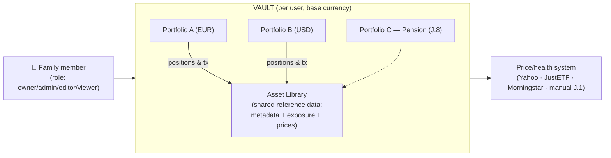
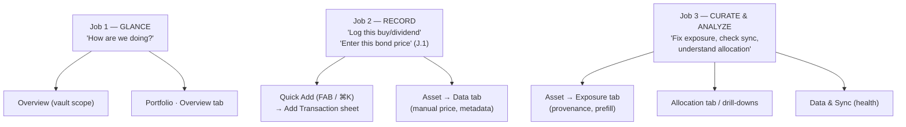
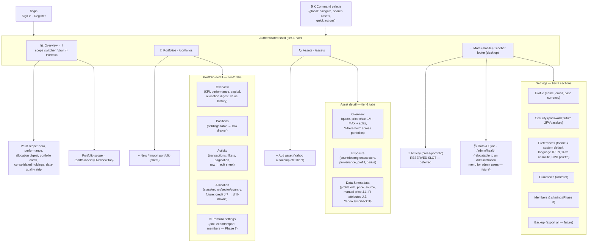
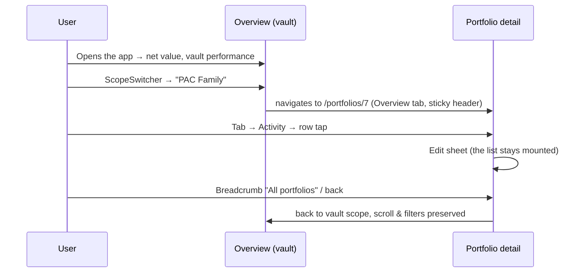
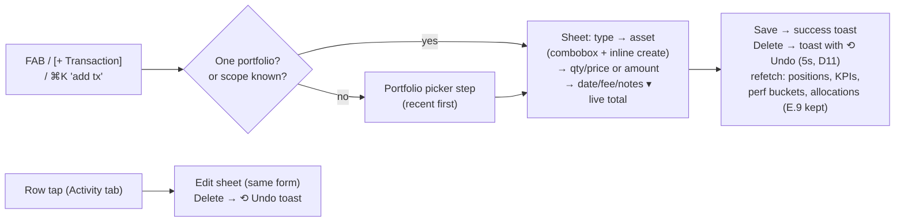
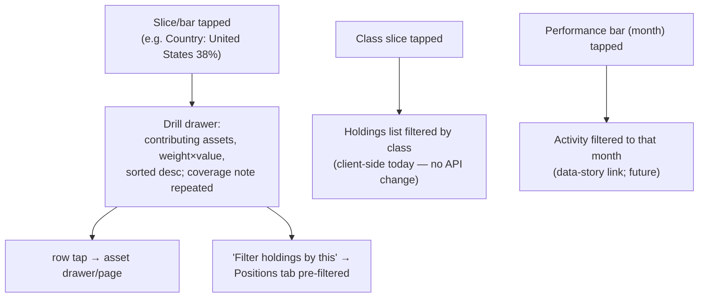
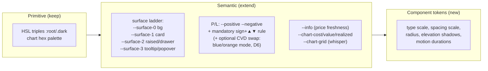
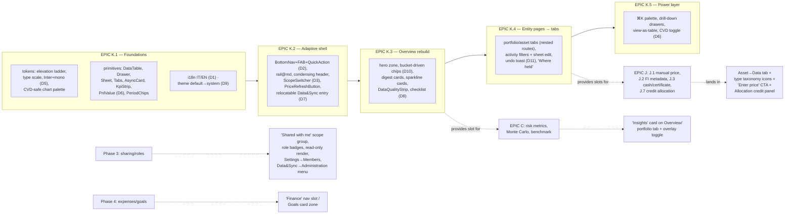

# VaultLab — UX Redesign Specification

> This document describes the UX/UI redesign specification of VaultLab: the
> interface architecture, the navigation model, the responsive strategy, the
> per-screen layouts, the evolution of the design system, the interaction
> patterns and the phased implementation roadmap (**EPIC K**) for a modern,
> self-hosted personal investment tracker usable on desktop, tablet and mobile.
>
> The analysis deliberately covers the app's **functionalities only** (what it
> does) and abstracts from the current visual implementation: the existing
> screen layouts are treated as fully replaceable, while the design-token
> foundation built in EPIC D is a base to **extend**, not to discard. This is
> the design companion of the frontend guide (`docs/FRONTEND-GUIDE.en.md`),
> which describes the app as it is today; where the two differ, this
> specification describes the intended future state. Grounding sources:
> `STATUS.md`, `PLAN.md`, `docs/FRONTEND-GUIDE.en.md`,
> `frontend/src/routes/**`, `frontend/src/lib/**`. The decisions recorded in
> chapter 11 are final and are reflected throughout the document.
>
> For Italian readers there is the version `docs/UX-REDESIGN.it.md`.

---

## 1. Scope and goals

**Purpose.** Define a modern interface architecture for VaultLab — a
self-hosted, privacy-first, multi-user investment tracker for family use —
usable on PC, tablet and mobile, and give the `frontend` agent an unambiguous,
phased implementation specification (EPIC K, chapters 10–11).

**Method.**

- Analyze the **functionalities only** (what the app does), verified against
  the repository (`STATUS.md`, `docs/FRONTEND-GUIDE.en.md`,
  `frontend/src/routes/**`, `frontend/src/lib/**`).
- Abstract deliberately from the current visual implementation: the current
  layout of every screen is considered **replaceable**; the EPIC D semantic
  tokens are instead a foundation to extend.
- Compare with 2026 practice for financial dashboards: *glanceable finance*
  (one hero metric), *ordered data density* (progressive disclosure), data
  tools that are *dark-first* with a genuine light pass, *drawer over page*
  for inspection, bottom navigation on mobile, WCAG 2.2 AA as the floor.

**Non-goals / explicit exclusions.** No code in this document. Not adopted
(to avoid chasing trends): drag-and-drop widget dashboards, celebratory
animations, AI-generated summaries, passkeys/WebAuthn (only a reserved UI
slot), heavy component libraries or closed design tools — Tailwind and the
existing `ui/` primitives remain the implementation base.

**Status.** The decisions taken are recorded in chapter 11 and are already
reflected in the rest of the document (some supersede current behavior, e.g.
the default theme). The points still deferred are in chapter 12.

---

## 2. Functional inventory (verified)

What the product does today, independently of the screens:

| Domain | Capabilities |
|---|---|
| **Identity** | Login + registration (single page), JWT with refresh, multi-user, **base currency** per user |
| **Vault analytics** | Consolidated KPIs (active vs closed: invested, value, gain/loss, realized, dividends); TWR performance buckets (monthly/annual, bars + cumulative line); capital invested vs value (per bucket); allocation by **class / region / sector / country** (equity-only universe with coverage note); allocation per portfolio; consolidated open positions across portfolios (`invested_assets`); FX-missing accounting |
| **Portfolios** | CRUD; per-portfolio currency; JSON export/import (new/overwrite); summary (active/closed); TWR buckets; value history chart (portfolio or single asset, with splits); positions table; paginated transactions (20/page) |
| **Transactions** | buy/sell/dividend can be created from the UI (split/fee exist in the API, display/edit only); asset combobox; live total; edit/delete with confirm; pagination; refetch of everything affected after a mutation (E.9) |
| **Assets** | Library shared across portfolios; CRUD; Yahoo lookup/autocomplete; metadata (ticker, ISIN, name, type, currency, exchange, `asset_class`, `price_source` yahoo/manual/none); price chart with in-place zoom (1M/3M/1Y/YTD/MAX) + split markers; quote metrics (1D/1W/1M/1Y/YTD); **3-dimensional exposure** (countries, regions aligned to Morningstar, GICS sectors) with per-dimension **provenance** (manual/JustETF/Morningstar/derived, persisted and dated); non-persistent prefill previews (JustETF/Morningstar/Yahoo); regions derived from countries; Yahoo meta refresh + full history backfill |
| **Prices** | Refresh once per session (triggered by the shell on any page); rate-limit/failure toasts; clickable "Prices as of" control in the header + global DataQualityStrip; background worker |
| **Ops/health** | Price sync health: period selector (Today/24h/last-100), 4 summary metrics, paginated event log, "Refresh now" |
| **Settings** | Profile (name/email/base currency), password, currency whitelist CRUD, theme (light/dark/system), toasts |
| **Known next scope** | **EPIC J**: manual price entry in the UI (J.1), fixed-income metadata — maturity/coupon/issuer (J.2), types `cash` + `certificate` (J.3), opt-in FI exposure (J.4), deposit interest accrual (J.5), bond metrics duration/YTM (J.6), **credit-rating allocation** (J.7), pension wrappers (J.8). **EPIC C**: Sharpe, max drawdown, volatility, regression, Monte Carlo. **Phase 3**: portfolio sharing/roles. **Phase 4**: expenses, budget, goals. Pending: cash/deposits–withdrawals (#101), CSV import, autocomplete in the transaction form |

**Missing functionalities to design for now** (absent features, reserved
slots): global search, cross-portfolio activity feed, benchmark comparison,
notifications/alerts, manual prices, undo.

---

## 3. UX strategy and mental model

### 3.1 The mental model: one Vault → many Portfolios → one shared Asset library → a journal of Transactions



Every screen must make the user's current **scope** obvious: *am I looking at
the whole vault or at one portfolio?* Today the dashboard and the portfolio
detail duplicate ~80% of the analytics components (`InvestmentsTable`,
`PerformanceChart`, `ClassDonut`, `ExposureBarChart`) with different data
sources. That duplication is the clearest signal that **analytics is one
surface parameterized by scope**, not two pages.

### 3.2 Guiding philosophies

| Philosophy | What it means here | Why it fits VaultLab |
|---|---|---|
| **Glanceable finance / one hero metric** (Role–Metric–Density–Action) | Every screen opens with the *one number* the user came for. Overview → **net market value + unrealized P/L**; portfolio → its value; asset → last price + change | A family tool is opened much more often for 10-second checks ("how are we doing?") than for analysis sessions. The hero must be unmistakable and above the fold on every device |
| **Progressive density (data story)** | Layer 1: hero number → Layer 2: trend chart + KPI strip → Layer 3: allocation story → Layer 4: complete tables/holdings → Layer 5: raw drill-down (drawer) | 2026 practice has rehabilitated density, but *ordered*. The family "power user" needs layers 4–5; the other members stop at 1–2. The same screen serves both without configuration |
| **Scope-based task IA** | Primary navigation = *objects* (Overview, Portfolios, Assets); analytics parameterized by scope; tasks (add transaction, add asset, refresh prices) are **global quick actions**, always ≤ 1 tap (FAB / ⌘K) | The three most frequent jobs are: ① glance, ② record a transaction, ③ fix/curate data. The IA must make ② reachable from anywhere and ③ first-class |
| **3-tier navigation** | Tier 1 global nav (shell) → Tier 2 contextual nav (scope switcher + entity tabs) → Tier 3 in-view controls (period chips, granularity, filters, table sort) | Deep features (exposure editing, health events) stay discoverable without polluting the glance layer. Each tier has a distinct, consistent visual treatment |
| **Drawer/sheet over page for inspection** | Clicking a row (transaction, position, asset) opens a right-side **drawer** (≥ `lg`, ~520px) or a **bottom sheet** (< `lg`): the list stays mounted, filters and scroll preserved. Full pages remain only for the entities' "home" | The dominant pattern in 2026 data tools. Preserves context — essential when paginating through 137 transactions (decision D4) |
| **Theme: system default, two real themes** | Default = **follow the system**; light and dark are equal citizens (each component designed and verified in both); dark stays available and is the effective default on systems set to dark | Family use alternates daytime/nighttime checks; the elevation ladder via surface lightness works in both modes (decision D9) |
| **Trust through structural honesty** | Provenance badges (already a gem), price freshness ("as of …"), FX-missing and equity-coverage notes *inline where the number is*, chart coverage captions, friction (confirm) on destructive actions, undo where reversible | Privacy-first self-hosted users are data-skeptical by nature. The existing provenance system is a differentiator vs commercial trackers: elevate it to a coherent **Data Quality** language |
| **Mobile-first layouts, desktop-first analysis** | Every screen is designed first at 360px (single column, card-ified tables, bottom nav + FAB), then *enhanced* for tablet/desktop (multi-column grids, real tables, drawers, hover) | Family usage: quick checks and transaction entry happen on the phone; the monthly review on the PC. Both are first-class, with different jobs |
| **Accessibility as a constraint, not a feature** | WCAG 2.2 AA; P/L never by color alone (sign + ▲▼ always); focus-visible everywhere; trap + restore in drawers/sheets; table equivalents for charts; 44px targets; reduced-motion | Multi-generational family audience; better engineering discipline for a data tool |

### 3.3 The three jobs, and the screens that serve them



---

## 4. Information architecture

### 4.1 Sitemap



### 4.2 Key IA decisions

1. **Scope switcher = navigation, not a filter** (decision D3). A
   `ScopeSwitcher` in the Overview header lists "All portfolios (Vault)" plus
   every portfolio (later a "Shared with me" group). Selecting a portfolio
   **navigates** to `/portfolios/:id` (Overview tab). The URLs stay
   deep-linkable; the analytics components are unified behind a single
   `AnalyticsScope` contract (`vault | portfolio`) fed by the corresponding
   endpoints. This removes the dashboard/detail duplication and teaches the
   mental model.
2. **Tabs are nested routes, not local state.**
   `/portfolios/[id]/(tabs)/positions`, `.../activity`, `.../allocation`,
   `.../settings` (SvelteKit route groups + a shared `+layout.svelte` that
   renders the sticky header + tab bar). Benefits: shareable/bookmarkable
   tabs, per-tab data loading, working back button (crucial on mobile), the
   header stays mounted while tabs swap.
3. **"Activity" is promoted to a tab** of the portfolio. The vault-level
   consolidated feed (`/activity`) is a **reserved slot** in "More"
   (deferred, chapter 12): the backend scopes transactions per portfolio, so
   the consolidated endpoint is a small addition — a big visibility win for
   the family ("what did everyone do this month?").
4. **Health becomes "Data & Sync"** and stays a **separate nav entry** for
   now (decision D7): it is a maintenance surface (Job 3), visited rarely,
   not a peer of Portfolios/Assets. The entry is defined **once** in the nav
   configuration so it can be **relocated later** into an *Administration*
   menu shown to admin users (debug/logging surface), when Phase 3 roles
   land. The route remains `/admin/health` until then.
5. **Asset detail gains a "Where held" block** (Overview tab): the library is
   shared, so "which portfolios hold VWCE, at what qty/cost" is a natural,
   currently missing question (the data exists via `invested_assets`).
6. **Phase-4 reservation**: when expenses/budget/goals arrive they become a
   4th tier-1 item ("Finance") or a Goals card zone on the Overview; the
   bottom nav's "More" slot absorbs growth without restructuring.

### 4.3 Vault ↔ portfolio context switching



---

## 5. Responsive/adaptive strategy

### 5.1 Breakpoints

Mobile-first authoring; Tailwind default breakpoints with **role
assignments**:

| Range | Class | Shell | Tables | Charts | Navigation |
|---|---|---|---|---|---|
| < 640 (`sm`) | **Phone** — glance + record | Single column, 16px gutters | **Card-ified rows** (collapse; never horizontal-scroll a 6-column table) | Full width, shorter (220–260px), compact legend, tap-crosshair tooltips | **Bottom nav** (4 destinations + More sheet) + **FAB** (D2) |
| 640–1023 (`md`–`lg`) | **Tablet** — light analysis | Single content column, 24px gutters; 2-up grids | Real tables, non-essential columns hidden (`hidden md:table-cell`) | 2-up grids, ~300px tall | **Icon rail** (64px, always collapsed) + FAB |
| ≥ 1024 (`lg`) | **Desktop** — full analysis | Expandable sidebar (240/64) + content max-width ~1440 centered | Full tables, sticky headers, sortable, row-hover actions | 2–4-up grids, 340–380px | Sidebar + ⌘K palette |

Rules of thumb: **"collapse, don't shrink"** for tables on mobile; charts lose
axis detail before they lose size; **every gesture has a visible equivalent
control** (accessibility); **sticky summary header on all sizes** (condenses
on scroll).

### 5.2 The adaptive shell

```
DESKTOP >=1024                         TABLET 640-1023              MOBILE <640
┌───────────────┬───────────────────┐  ┌─────┬───────────────────┐  ┌──────────────────────────┐
│ VaultLab      │ header (sticky)   │  │     │ header (sticky)   │  │  header KPI (sticky)     │
│               │ ScopeSwitcher     │  │     │ KPI strip         │  │  hero -> compact         │
├───────────────┼───────────────────┤  ├─────┼───────────────────┤  ├──────────────────────────┤
│ Overview      │                   │  │ [O] │                   │  │                          │
│ Portfolios    │      content      │  │ [P] │     content       │  │        content           │
│ Assets        │ (grids 2-4 up,    │  │ [A] │ (grids 2-up)      │  │  (single column,         │
│ More          │  max-w 1440)      │  │     │                   │  │   card-ified rows)       │
│               │                   │  │ [^] │                   │  │                          │
│ user / theme  │                   │  │     │                   │  ├──────────────────────────┤
│ footer        │                   │  │     │                   │  │  [O] [P] [A] [+] [..]    │
└───────────────┴───────────────────┘  └─────┴───────────────────┘  └──────────────────────────┘
sidebar collapsible->rail   rail = collapsed sidebar   bottom nav (D2);
(state persisted - exists)  (same component, `md:rail`)  hamburger -> More sheet
```

**Mobile bottom nav (decision D2)**: `Overview · Portfolios · Assets ·
[FAB ⊕] · More`. The FAB opens an **action sheet**: *Add transaction* (→ pick
a portfolio if more than one → form sheet), *Add asset*, *Refresh prices*,
*Enter price* (J.1). The FAB is the single most important mobile control:
recording a transaction must be ≤ 2 taps from anywhere. The "More" sheet
contains: Activity (reserved slot), Data & Sync, Settings, theme toggle, sign
out. The current `MobileDrawer` hamburger is **demoted** to this sheet;
`AppShell` gains the rail behavior at `md` and keeps the expandable sidebar at
`lg` (collapse state persisted, as today).

### 5.3 Data-dense table adaptation (one component, three renders)

```
DESKTOP
┌─────────┬────────────┬────────────┬─────────────┬─────────┬───┐
│ Asset   │ Invested v │ Value      │ Gain/Loss   │ P/L %   │ ..│
├─────────┼────────────┼────────────┼─────────────┼─────────┼───┤
│ VWCE.DE │ 12,400.00  │ 14,980.22  │ ^ +2,580.22 │ ^ +20.8%│   │
└─────────┴────────────┴────────────┴─────────────┴─────────┴───┘

MOBILE
┌────────────────────────────────────────┐
│ VWCE.DE                 EUR 14,980.22  │
│ Vanguard FTSE All-World                │
│ ^ +2,580.22 (+20.8%)    inv 12,400     │
└────────────────────────────────────────┘
  tap -> drawer (>= lg) / bottom sheet (< lg)

TABLET
  real <table>; the Invested and action columns are hidden behind `md:`
  variants; numeric cells stay right-aligned + tabular-nums (kept rule).
```

---

## 6. Per-screen layout proposals

### 6.1 Overview (vault scope) — `/`

**UX goal**: answer in < 3 seconds "how much do we have and is it going
well?", then invite the story (performance → allocation → holdings). **Above
the fold**: hero + KPI strip + chart; everything else is scroll or drill-down.

```
┌───────────────────────────────────────────────────────────────────────────────────┐
│ STICKY HEADER (condenses on scroll)                                               │
│ All portfolios v  (ScopeSwitcher)     [Cmd+K Search...]  (r) 14:32  user  o       │
├───────────────────────────────────────────────────────────────────────────────────┤
│ ! data-quality strip (only when fx_missing / stale / missing_sector > 0)          │
├───────────────────────────────────────────────────────────────────────────────────┤
│ A - HERO                                                                          │
│  Net value                                 ┌─────────────────────────────┐        │
│                                            │ value vs invested           │        │
│  EUR 148,930.22       <- 36-44px, tabular  │ area chart                  │        │
│  ^ +12,410.05 (+9.08%) all-time            │ buckets: 1Y 3Y ALL          │        │
│  inv 136,520                               └─────────────────────────────┘        │
│  chips: [Realized +2,140] [Dividends 890]                                         │
│  [Breakdown v -> Active/Closed table]                                             │
│ B - PERFORMANCE (TWR story)                                                       │
│  ┌───────────────────────────────┐   ┌───────────────────────────────────┐        │
│  │ ## bars: bucket TWR %         │   │ Allocation digest                 │        │
│  │ -- cumulative TWR line        │   │ o Classes donut   [See all ->]    │        │
│  │ [Monthly|Annual]              │   │ Top-3 regions / sectors           │        │
│  └───────────────────────────────┘   │ equity coverage note              │        │
│                                      └───────────────────────────────────┘        │
├─ below the fold ──────────────────────────────────────────────────────────────────┤
│ C - PORTFOLIOS (cards with sparkline; horizontal snap-scroll on mobile)           │
│   [ PAC Family EUR98k ^+8% ~ ]  [ Trading USD30k v-2% ~ ]  [ + New ]              │
│ D - HOLDINGS (consolidated invested_assets; sortable; row -> drawer)              │
│ E - RECENT ACTIVITY (last 5 tx - reserved slot until /activity exists)            │
└───────────────────────────────────────────────────────────────────────────────────┘
```

```
MOBILE <640
┌────────────────────────────┐    Notes vs today:                              
│ All portfolios v   (r) o   │    - Hero = ONE number (net value), not the     
│ -----------------------    │      Active/Closed table; the table becomes a   
│  Net value                 │      "Breakdown v" disclosure under the strip.  
│  EUR 148,930.22            │    - Condensed sticky header keeps net value +  
│  ^ +12,410 (+9.08%)        │      P/L% visible while scrolling.              
│  inv 136,520 real +2,140   │    - Period chips BUCKET-DRIVEN (D10): monthly  
│ -----------------------    │      buckets -> 1Y/3Y; annual -> ALL. True daily
│  [ value vs invested ]     │      1M/3M need a daily vault-series endpoint.  
│  buckets: 1Y 3Y ALL        │    - Portfolio cards gain sparklines (the       
│  Performance [M|A]         │      per-portfolio history endpoint exists).    
│  Allocation  o -> all      │    - First-run checklist (D8) replaces the plain
│  [O] PAC Family 98k ^8%    │      EmptyState on a fresh vault.               
│  [O] Trading   30k v-2%    │                                                 
│  Holdings (card rows)...   │                                                 
│ -----------------------    │                                                 
│ [+] FAB   [O][P][A][..]    │                                                 
└────────────────────────────┘                                                 
```

Additional decisions for this screen:

- **First-run checklist (D8)**: a guided 3-step card — ① create a portfolio →
  ② add an asset → ③ record a transaction — each step deep-links to the
  relevant surface/sheet, with progress state; it disappears when complete
  (or via "Hide").
- **Data-quality strip** appears only when actionable (FX missing, stale
  prices, missing sectors/countries); every chip links to the fixing surface
  (asset Data tab, currency settings, refresh).

**Loading**: shape-matched skeletons per card (`AsyncCard`), never a
full-page spinner. **Empty**: the first-run checklist. **Error**: per-card
one-line cause + Retry; a global stale-prices strip when the session refresh
fails (rate-limit warnings keep their toast).

### 6.2 Portfolio detail — `/portfolios/:id` (tabs)

```
┌───────────────────────────────────────────────────────────────────────────────────┐
│ <- All portfolios / PAC Family (EUR)          [+ Transaction] [..]                │  <- sticky; .. = edit, export, import, delete, (members)
│  EUR 98,412.55  ^ +8,120 (+8.99%)  inv 90,292 real +1,204 div 310                 │
│ ─────────────────────────────────────────────────────────────────                 │
│ [ Overview | Positions | Activity | Allocation | * ]                              │  <- tier-2 tabs
├───────────────────────────────────────────────────────────────────────────────────┤
│ TAB Overview:  Investments breakdown (Active/Closed card)                         │
│                Performance (TWR bars+line, M|A) + Capital (invested vs value)     │
│                Allocation digest (classes o + top regions/sectors -> tab)         │
│                Value history (PositionChart, portfolio/asset selector)            │
│ TAB Positions: full holdings table (qty, cost, price, value, realized, ROI)       │
│                closed positions collapsed in a "Closed (4)" disclosure            │
│                row tap -> drawer: asset summary + tx history for this asset       │
│ TAB Activity:  filter chips [All|Buy|Sell|Dividend] [asset v] [date range]        │
│                table/card list, paginated; row tap -> edit sheet; undo toast      │
│ TAB Allocation: classes o + regions/sectors/countries bars (equity note),         │
│                future: credit ratings (J.7); every slice/bar -> drill drawer      │
└───────────────────────────────────────────────────────────────────────────────────┘
```

Mobile: the tabs become a horizontally scrollable segmented bar under the
sticky KPI header (value + P/L always visible); `[+ Transaction]` collapses
into the **context-aware FAB** (on this route its primary action is *Add
transaction to PAC Family*). Positions/Activity use the card-row pattern; the
edit form is a **bottom sheet**: type segmented control (Buy/Sell/Dividend;
+ Coupon when EPIC J lands), asset combobox with inline "create asset", live
total, fees/notes behind a "More fields ▾" progressive disclosure.

### 6.3 Asset detail — `/assets/:id` (tabs)

```
┌───────────────────────────────────────────────────────────────────────────────────┐
│ <- Assets / VWCE.DE  [ETF | equity | EUR | XETRA]            [.. sync]            │  <- sticky header: identity chips + quote metrics
│  EUR 118.42  ^ +1.2% 1D  [1W +0.4] [1M +2.1] [1Y +14.8] [YTD +9.2]                │
│ ─────────────────────────────────────────────────────────────────                 │
│ [ Overview | Exposure | Data ]                                                    │  <- tier-2 tabs
├───────────────────────────────────────────────────────────────────────────────────┤
│ Overview: PriceChart (1M 3M 1Y YTD MAX, splits, in-place zoom)                    │
│           "Where held" - portfolio / qty / cost / value rows (NEW)                │
│           quick-facts grid (ISIN, type, class, currency, exchange, source)        │
│ Exposure: [equity-universe banner when not applicable]                            │
│           Countries bars (top 15) | Regions open-donut | Sectors donut            │
│           each panel: ProvenanceBadge ("Morningstar 2026-09-05") + [Edit]         │
│           Edit -> existing two-modal flow (logic kept; restyled as sheets         │
│           on mobile, side-by-side panes on desktop - countries-first)             │
│ Data:     Metadata form (today's "Caratteristiche", dirty-save)                   │
│           price_source (yahoo|manual|none) + MANUAL PRICE ENTRY (J.1):            │
│             date+price form + history of manual entries                           │
│           FI attributes panel (J.2: issuer, maturity, coupon; J.6: YTM)           │
│           Danger zone: Yahoo refresh meta / backfill history / delete asset       │
└───────────────────────────────────────────────────────────────────────────────────┘
```

Rationale: today metadata editing, charts and exposure share one long page.
The tabs separate the three jobs (watch the price / curate the exposure / fix
the data) and give EPIC J a **designed home** (the Data tab: manual price
J.1, FI attributes J.2/J.6, types J.3) without another redesign. Provenance
badges stay exactly where they are (per-panel headers), made **interactive**:
tap → popover with source, date, and what a prefill would change. The
`no price` badge gains an inline "Enter price" CTA once J.1 ships.

### 6.4 Transactions (Activity tab) — the record flow



Filters persist per portfolio in the URL query (`?type=sell&asset=12`) —
shareable and back-button-safe. Pagination: keep Prev/Next + range on
desktop; infinite scroll optional on mobile only. **Undo over confirm
(D11)**: deleting a transaction shows a toast with a 5-second ⟲ Undo action
(delete + recreate is fine at family scale); `ConfirmDialog` remains for
irreducible destructive actions (delete portfolio/asset, import overwrite) —
friction stays where the stakes are.

### 6.5 Allocation and drill-downs (vault + portfolio + asset)

One component family, three scopes. The **drill-down** is the new capability:



Class drill-down is client-side today (holdings + `asset_class`); the
country/region/sector drill-down needs per-asset contributions (backend ask,
chapter 10, phase K.5). When J.7 lands, credit ratings become a fifth
allocation dimension with the same drill-down contract.

### 6.6 Settings, Data & Sync, Login

```
SETTINGS                                        DATA & SYNC (ex /admin/health)
┌─────────────┬─────────────────────────────┐   ┌────────────────────────────────┐
│ Profile     │  Preferences                │   │ period [Today|24h|100]  (r)    │
│ Security    │  Theme [System v] (D9)      │   │ #### 4 metric tiles            │
│ Preferences │  Language [Italiano v] (D1) │   │ event log: card rows mobile,   │
│ Currencies  │  P/L palette [Green/Red v]  │   │ table desktop, paginated       │
│ Members (P3)│    (+ CVD blue/orange, D6)  │   │ [Refresh prices now]           │
│ Backup (fut)│  Values [% vs absolute]     │   └────────────────────────────────┘
└─────────────┴─────────────────────────────┘                                     
```

Settings sections: **Profile** (name, email, base currency — drives all vault
totals) · **Security** (password; 2FA/passkey reserved slot) · **Preferences**
(theme with *System* default — D9; language, IT default with EN fallback —
D1; CVD palette toggle — D6; % vs absolute display; density — deferred) ·
**Currencies** (whitelist) · **Members & sharing** (Phase 3) · **Backup**
(future export-all).

**Data & Sync** keeps its own nav entry for now (D7), designed to be
relocated into an *Administration* menu for admin users later.

**Login**: keep the single centered card (right for a family homelab; no
split-screen marketing panel): brand mark + "VaultLab — your private
investment lab", `Sign in | Register` segmented control (exists), inline
validation (exists), show/hide password toggle (add), per-field error
mapping, subtle theme-aware backdrop. Future slot: a passkey button under the
password fields.

---

## 7. Design system and visual language

### 7.1 Token model (extend EPIC D — do not rebuild)



### 7.2 Token table

| Token group | Proposal | Notes |
|---|---|---|
| **Elevation** | 4-step surface ladder (bg < card < raised/drawer < popover); dark steps ~6–8 lightness points apart + `border-white/6` hairlines; light mode mirrors via shadow-card/raised | Two steps (today) are not enough in dark — panels bleed together. Single highest-impact visual upgrade |
| **Typography** | Scale: hero 36–44 (`font-semibold`, tabular) · h1 24 · h2 18 · body 14 · caption 12 · micro 11. **Two families (D5)**: UI sans = **Inter**, mono = **JetBrains Mono / IBM Plex Mono** for tickers, ISINs, event-log codes, health numbers — both **self-hosted** via `@fontsource` (no CDN, privacy-first), preloaded, `font-display: swap` | The sans/mono split is the "tool, not marketing page" signal; `tabular-nums` on every amount (existing rule, kept) |
| **Spacing** | 4px base; gutters 16 (mobile) / 24 (desktop); card padding 16; section rhythm 24–32; content max-width 1440 | Codified as per-component `gap-*` conventions, not per page |
| **P/L color (D6)** | Keep green/red (non-negotiable finance convention) **never alone**: `pnlColorClass` becomes a `PnlValue` component rendering **signed value + ▲▼ glyph + color**; optional Preferences toggle swaps to a CVD palette (blue ▲ / orange ▼) | ~8% of men are colorblind; a family app spans generations. Cheap once tokens exist |
| **Chart palette** | Re-tune `--chart-1..12` to a CVD-considerate categorical set with consistent perceptual lightness in **both** themes (Observable-10 / Paul-Tol derived); muted grey for `Other` (exists); gridlines ~8% opacity; data is the brightest element | The current 12-color rainbow has uneven luminance (lime vs indigo) — slices compete arbitrarily |
| **Motion** | 3 durations (120ms confirm, 200ms surface, 320ms drawer/sheet), one ease-out curve; `prefers-reduced-motion` disables all; count-up only on the hero value | Motion explains, never entertains |
| **Radius/shape** | Keep `rounded-card` (12–16) / `rounded-control` (8); sheets: top-rounded 20, full width on mobile | Already tokenized |

### 7.3 Theme (decision D9)

The default becomes **follow system** (changed from dark-forced): the theme
store's initial mode is `system`; light and dark are **equal citizens** —
every new component must be designed and audited in both (contrast, elevation
ladder, chart gridlines and labels). Dark remains available in the selector
and is the effective default on systems configured dark; the pre-paint
anti-FOUC bootstrap resolves the OS `prefers-color-scheme` when no explicit
preference is stored.

### 7.4 Internationalization (decision D1)

A lightweight, dictionary-based i18n layer is introduced in **K.1**:
**IT default**, **EN fallback**, per-user language preference (Preferences).
Every new string from K.1 on ships in both languages; the existing mixed
EN/IT copy migrates progressively (page-by-page sweeps). Implementation stays
light: a dictionary module + a reactive locale store; no heavy framework
unless the `frontend` agent finds `sveltekit-i18n`/Paraglide cheaper to
maintain.

### 7.5 Component map (current → proposed)

| Keep / evolve | New (create under `frontend/src/lib/components/`) |
|---|---|
| `ui/*` primitives (Button, Card, Modal → restyled as the Dialog/Sheet base, Table primitives, SegmentedControl, StatCard, Badge, EmptyState, Skeleton, Spinner, ConfirmDialog) — solid: extend, don't replace | **Shell**: `layout/BottomNav.svelte`, `layout/Fab.svelte` + `QuickActionSheet.svelte`, `layout/ScopeSwitcher.svelte`, `AppShell` evolved (rail @md, condensing header), `CommandPalette.svelte` |
| Charts (`PerformanceChart`, `CapitalChart`, `ClassDonut`, `ExposureBarChart`, `ExposurePie`, `PriceChart`, `PositionChart`, `AllocationDonut`) — keep ECharts + tree-shaking; restyle to the new palette/gridline rules | **Data**: `ui/DataTable.svelte` (responsive collapse, sort, sticky head, row-tap), `ui/Drawer.svelte` (right drawer ≥lg: trap, Esc, restore), `ui/Sheet.svelte` (bottom sheet <lg), `ui/Tabs.svelte` (route-linked, ARIA), `ui/AsyncCard.svelte` (loading/error/empty/data + retry), `ui/KpiStrip.svelte` (sticky, condensing), `ui/PnlValue.svelte` (sign+arrow+color, D6), `ui/PeriodChips.svelte`, `ui/FilterChips.svelte`, `ui/Sparkline.svelte` |
| Domain modals (`AddTransactionModal` → sheet form, `ExposureGeo/SectorModal` logic kept + restyle, `CreatePortfolio/Asset`, `Import`) | **Quality**: `DataQualityStrip.svelte` (global, under the header), `PriceRefreshButton.svelte` ("prices as of …", header, clickable), `ProvenanceBadge` evolved (tap → popover) |
| `format.ts`, `ui-colors.ts`, stores (`auth`, `toast`, `theme`), 60s GET cache | **Stores/i18n**: `lib/i18n/` dictionaries + locale store (D1), `scope` store (last scope for the switcher), `command` store (palette), toast gains an **action slot** (Undo, D11), theme store default → `system` (D9) |

---

## 8. Interaction patterns

1. **⌘K / Ctrl+K command palette** (desktop) + search icon on mobile (→
   full-screen search sheet). Sections: *Go to* (pages, portfolios, settings),
   *Assets* (registered first, then a live "Search Yahoo for …" row reusing
   `assetApi.lookup`), *Actions* (Add transaction, New portfolio, Refresh
   prices, Toggle theme, Export current portfolio). Fuzzy match,
   keyboard-first, `aria-haspopup="listbox"`. The power-user layer that lets
   the visible nav stay minimal (phase K.5).
2. **Filters & period selectors**: period chips live *on the chart*, adjacent
   — never inside a menu; granularity (Monthly/Annual) stays a
   `SegmentedControl` in the card header; Activity filters are URL-persisted
   chips; the last-used period persists per scope in `localStorage`.
3. **Drill-down drawers** (§6.5): every allocation slice/bar and every table
   row is an entry point; the drawer keeps the parent mounted (state
   preservation) and offers "open full page" as an explicit escape hatch.
4. **Empty / loading / error**: shape-matched skeletons per card; `AsyncCard`
   error state = one-line cause + Retry, isolated (never blank the page —
   today's per-endpoint isolation is right, give it a face); empty states =
   one verb + muted explanation; first run = the guided checklist (D8).
5. **Data-quality & provenance affordances**: a vault-level
   `DataQualityStrip`, shown only when actionable ("€1,204 excluded — missing
   FX (2 assets)", "3 assets without sector", "prices stale 26h"), each chip
   linking to the fixing surface; a `PriceRefreshButton` in the app header
   ("prices as of 14:32 ⟳", clickable to refresh) with the strip rendered
   globally under the header; provenance badges on every exposure panel (tap → source +
   date popover); `no price` badge → "Enter price" inline CTA once J.1 ships.
6. **Undo over confirm** (D11): transaction delete → toast with ⟲ Undo (5s);
   `ConfirmDialog` only for destructive/irreducible actions (portfolio/asset
   delete, import overwrite). Friction stays where the stakes are.
7. **Mobile gestures** (progressive enhancements, never the only path):
   pull-to-refresh on Overview/portfolio (= price refresh + refetch),
   swipe-left on an Activity row → Edit, horizontal snap-scroll on the
   portfolio carousel. Every gesture has a visible button equivalent.
8. **Session price-refresh UX**: keep the once-per-session semantics, but
   replace toast-only feedback with the freshness stamp plus, on failure, a
   persistent stale strip ("Prices stale — last success 2h ago ⟳ Retry");
   toasts remain for rate-limit warnings.

---

## 9. Accessibility and performance

### 9.1 Accessibility (WCAG 2.2 AA as the floor)

- **Contrast**: all text ≥ 4.5:1 (re-audit `muted-foreground` in both themes
  — the light theme is now a first-class default via system preference, D9);
  chart labels/legends ≥ 3:1; gridlines exempt (decorative, ≤ 8% opacity).
- **Color independence (D6)**: sign + ▲▼ always via `PnlValue`; donut slices
  labeled with amount **and** % (no mental math); optional CVD palette.
- **Keyboard**: complete flows for palette/drawers/sheets/tabs (focus trap +
  restore — reuse the `MobileDrawer` implementation); visible `focus-ring`
  (exists); skip link (exists); tabs = `role="tablist"` with arrow keys;
  route-backed tabs preserve back-button semantics.
- **Charts**: every chart card offers a "View as table" disclosure rendering
  the underlying buckets/rows (doubles as the mobile data experience and the
  screen-reader experience) + an `aria-label` summary ("Cumulative TWR +9.1%
  over 24 months"); touch tooltips via `triggerOn: 'click|mousemove'`.
- **Motor/vision**: ≥ 44×44 touch targets; `prefers-reduced-motion` honored;
  rem-based type (200% zoom reflow); toasts `aria-live` (exists); inline form
  errors bound with `aria-describedby` (exists — keep).

### 9.2 Performance

- **Route-level code splitting** for chart-heavy modules: dynamic `import()`
  of the ECharts wrappers inside the tab layouts, so Login and list pages
  paint without the ~300KB ECharts chunk — the biggest initial-load win.
- **Zero CLS**: skeletons matched to final geometry; self-hosted fonts (D5)
  preloaded, `font-display: swap`, max 2 files.
- Keep the **60s GET cache**, add a *stale-while-revalidate feel*: serve the
  cached dashboard instantly, refetch in background, subtle "updating…" dot
  on the freshness stamp (perceived speed > raw speed).
- **Sparklines**: one tiny inline series per portfolio card (existing history
  endpoint, downsampled client-side; the `sampling: 'lttb'` pattern is
  already in use).
- **Long lists**: pagination suffices at family scale; virtualize only if
  Activity adopts infinite scroll past ~500 rows.
- **No new runtime dependencies** beyond the `@fontsource` packages and
  (K.5) a ~4KB fuzzy matcher for the palette; everything else is Tailwind +
  existing ECharts.

---

## 10. Phased roadmap (EPIC K)



| Phase | Content | Backend asks (for the `backend` agent) |
|---|---|---|
| **K.1 Foundations** | Token extensions (elevation ladder, type scale, Inter+mono self-hosted — D5, CVD-considerate chart palette); primitives (DataTable, Drawer/Sheet — D4, Tabs, AsyncCard, KpiStrip, PnlValue — D6, PeriodChips); **i18n layer IT/EN — D1**; **theme default → system — D9** | none |
| **K.2 Adaptive shell** | BottomNav + FAB + QuickActionSheet (D2), rail @md, condensing sticky header, ScopeSwitcher (D3), PriceRefreshButton (header, global); nav config with the **relocatable** "Data & Sync" entry (D7) | none |
| **K.3 Overview rebuild** | Hero zone, bucket-driven period chips (D10), allocation digest, sparkline portfolio cards, DataQualityStrip (global, shell), first-run checklist (D8) | *(fast-follow)* daily vault series for true 1M/3M ranges (D10) |
| **K.4 Entity tabs** | Nested-route tabs for portfolio/asset; Activity filters (URL state); sheet forms; undo toast (D11); "Where held" | holdings-by-portfolio for an asset (derivable from existing endpoints; a small consolidation endpoint is a nice-to-have) |
| **K.5 Power layer** | ⌘K palette, drill-down drawers, charts view-as-table, CVD palette toggle (D6) | allocation drill contributions (`dim` + `key` → contributing assets) |
| **EPIC J integration** | Manual price form + entry history (J.1) with "Enter price" CTAs; FI attributes panel (J.2; J.6 metrics display); type taxonomy with icons incl. `cash`/`certificate` (J.3); credit-rating panel in the Allocation tab (J.7) | already scoped in EPIC J |
| **EPIC C integration** | "Insights" card (Sharpe, volatility, max drawdown), Monte Carlo projection chart, benchmark overlay toggle (details deferred — chapter 12) | EPIC C endpoints |
| **Phase 3/4** | "Shared with me" scope group, role badges, read-only rendering, Settings → Members; **Data & Sync relocated into an Administration menu** (D7); "Finance" nav slot / Goals zone | `portfolio_shares` |

**MVP cut** (if time-boxed): K.1 + K.2 + K.3 + K.4 limited to
Positions/Activity — the app already feels like a 2026 product; K.5 and the
drill-downs are the polish tier.

**SvelteKit/Tailwind implications (no code here)**: route groups
`/portfolios/[id]/(tabs)/*` and `/assets/[id]/(tabs)/*` with shared
`+layout.svelte` (sticky header + Tabs rendered once; tab pages load their own
data); `lib/i18n/` dictionaries + locale store; `@fontsource` dependencies +
preload links in `app.html`; the Tailwind config gains the surface ladder,
font families and motion tokens; `app.css` gains the ladder + mono utilities;
the theme store's initial mode becomes `system` (the anti-FOUC bootstrap
resolves `prefers-color-scheme` when no preference is stored); chart wrappers
are lazily imported from the tab layouts; `format.ts` gains the arrow-glyph
helper used by `PnlValue`; `toast.svelte.ts` gains the action slot (Undo).
Per AGENTS.md, every EPIC K PR syncs the docs: `docs/FRONTEND-GUIDE.en/it.md`
(chapters 7/8/10), `STATUS.md`, `docs/RELEASE-NOTES.en/it.md` (user-facing
lines), and **both versions of this specification**.

---

## 11. Recorded decisions

| # | Decision | Detail | Phase |
|---|---|---|---|
| **D1** | UI language | Lightweight i18n IT + EN; **default IT**, EN fallback; per-user preference in Settings → Preferences | K.1 |
| **D2** | Mobile navigation | **Bottom nav** with 4 destinations (Overview, Portfolios, Assets, More) + **FAB** + "More" sheet; the hamburger drawer is demoted to the More sheet | K.2 |
| **D3** | Scope switcher | **Navigates** between `/` (vault) and `/portfolios/:id`; it is not a filter on one mega-page | K.2 |
| **D4** | Row inspection | Right-side **drawer** ≥ `lg`; **bottom sheet** < `lg`; full pages remain only for the entities' homes (portfolio, asset) | K.1 primitives / K.4 adoption |
| **D5** | Fonts | **Inter** (UI) + a **mono** (tickers/ISINs/codes), self-hosted via `@fontsource` (OFL), no CDN; preload + `font-display: swap` | K.1 |
| **D6** | P/L accessibility | **Always** sign + arrow glyph + color (`PnlValue`), **plus** an optional CVD palette toggle (blue ▲ / orange ▼) in Preferences | K.1 glyph / K.5 toggle |
| **D7** | Health page | Renamed **"Data & Sync"**, kept as a **separate nav entry** for now; in the future it moves into an **Administration menu** for admin users (debug/logging surface). The entry is defined once in the nav config so it can be relocated without rework | K.2 (entry) / Phase 3 (relocation) |
| **D8** | First run | **Guided checklist** on the Overview: create portfolio → add asset → record transaction; auto-hides when complete | K.3 |
| **D9** | Theme | **Default = follow system** (supersedes dark-forced); light and dark are equal citizens; dark remains available and is the effective default on systems set to dark | K.1 |
| **D10** | Hero chart ranges | **Bucket-driven** (monthly/annual) for now — chips 1Y/3Y on monthly buckets, ALL on annual; a **daily vault-series endpoint is a fast-follow** to enable true 1M/3M | K.3 + backend fast-follow |
| **D11** | Undo | **Undo toast (5s)** on transaction delete; `ConfirmDialog` remains for portfolio/asset deletes and import-overwrite | K.4 |

Deferred or reserved items (deliberately **not** decisions) are listed in
chapter 12.

---

## 12. Open questions still deferred

| Item | Status | What remains to be decided |
|---|---|---|
| Consolidated cross-portfolio **Activity feed** (`/activity`) | Reserved slot in "More"; zone E on the Overview | Timing (standalone now vs together with Phase 3 sharing); shape of the consolidated endpoint |
| **Benchmark overlay** on performance (EPIC C) | Reserved slot (Insights card + overlay toggle on the chart) | Which index(es); whether the benchmark is a registered tracking asset (pure frontend) or needs Yahoo index quotes; FX handling of the index series vs the user's base currency |
| **Density toggle** (comfortable/compact tables) | Skipped for the MVP | Revisit only if the holdings table grows past ~30 rows |
| **Notifications / price alerts** | Known gap; no committed slot | Whether to adopt them at all; surface (header bell vs none) |
| **Passkey / 2FA** | Reserved slot (login button, Settings → Security) | Whether WebAuthn is in scope for a family homelab |

---

*This specification is maintained alongside the code: every EPIC K PR updates
the affected chapters — in both language versions — per the AGENTS.md
documentation-sync rule. Prepared by the VaultLab UX/UI design expert;
implementation is delegated to the `frontend` subagent phase by phase, with
backend asks routed to `backend`.*
