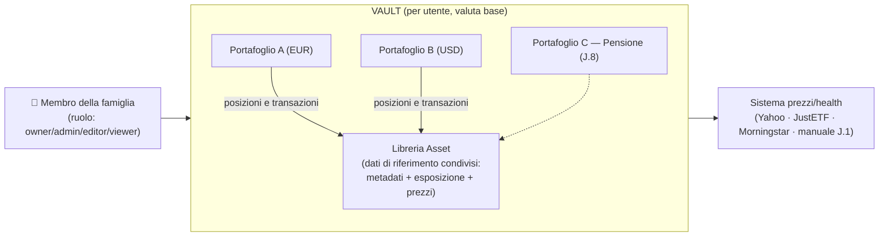
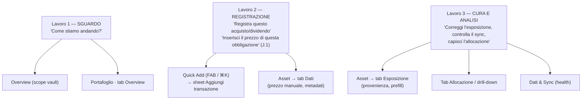
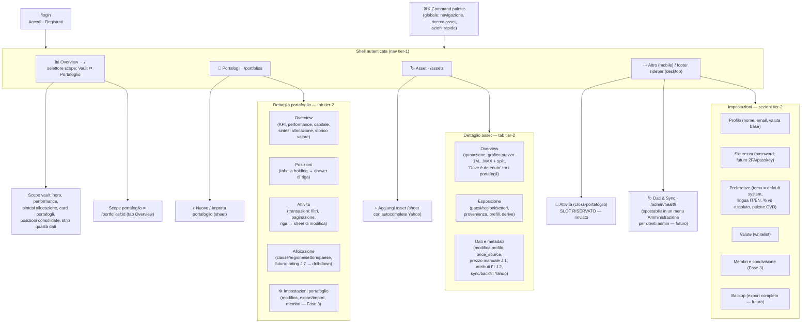
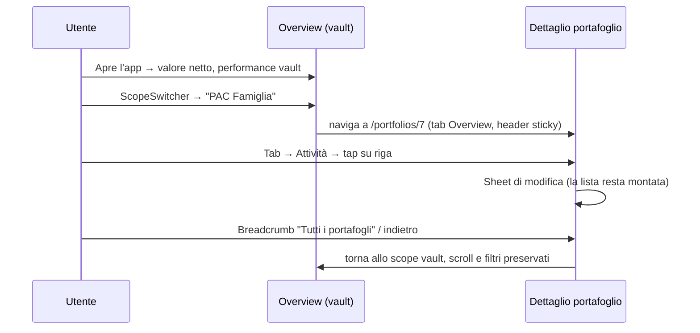
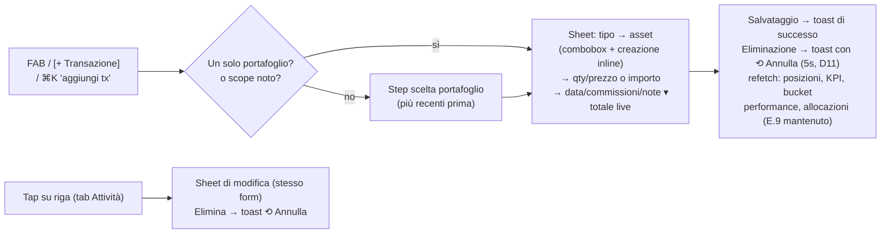
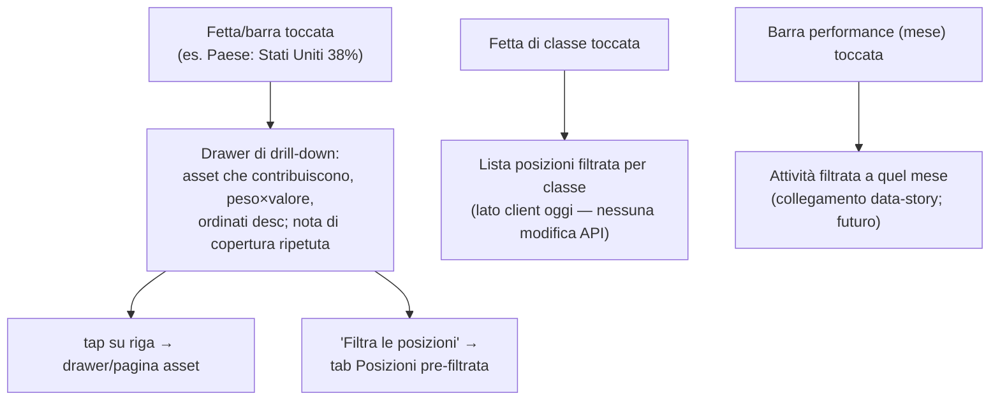
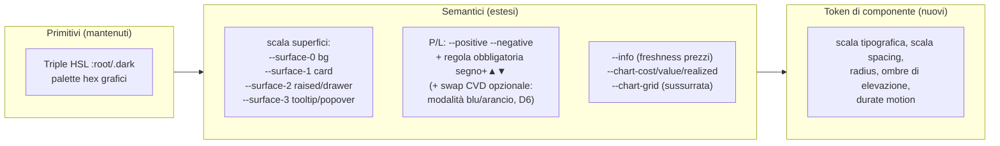
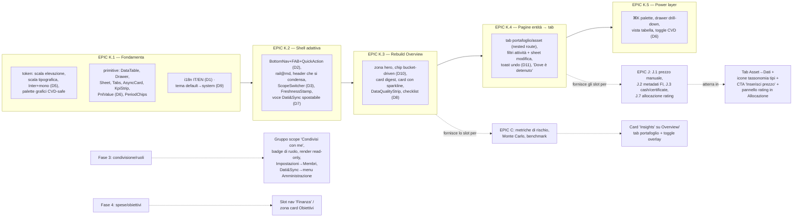

# VaultLab — Specifica di redesign UX

> Questo documento descrive la specifica di redesign UX/UI di VaultLab:
> l'architettura delle interfacce, il modello di navigazione, la strategia
> responsive, i layout per schermata, l'evoluzione del design system, i
> pattern di interazione e la roadmap di implementazione a fasi (**EPIC K**)
> per un tracker di investimenti personali moderno, self-hosted e utilizzabile
> su desktop, tablet e mobile.
>
> L'analisi copre volutamente **solo le funzionalità** dell'app (cosa fa) e
> prescinde dall'implementazione visiva attuale: i layout esistenti delle
> schermate sono considerati interamente sostituibili, mentre la fondazione di
> design token costruita nell'EPIC D è una base da **estendere**, non da
> scartare. È il companion di design della guida al frontend
> (`docs/FRONTEND-GUIDE.it.md`), che descrive l'app com'è oggi; dove le due
> differiscono, questa specifica descrive lo stato futuro desiderato. Fonti:
> `STATUS.md`, `PLAN.md`, `docs/FRONTEND-GUIDE.it.md`,
> `frontend/src/routes/**`, `frontend/src/lib/**`. Le decisioni registrate nel
> capitolo 11 sono definitive e sono riflesse in tutto il documento.
>
> Per i lettori di lingua inglese esiste la versione `docs/UX-REDESIGN.en.md`.

---

## 1. Perimetro e obiettivi

**Scopo.** Definire un'architettura di interfaccia moderna per VaultLab — un
tracker di investimenti self-hosted, privacy-first e multi-utente per uso
familiare — utilizzabile su PC, tablet e mobile, e fornire all'agente
`frontend` una specifica di implementazione non ambigua e a fasi (EPIC K,
capitoli 10–11).

**Metodo.**

- Analizzare **solo le funzionalità** (cosa fa l'app), verificate sul
  repository (`STATUS.md`, `docs/FRONTEND-GUIDE.it.md`,
  `frontend/src/routes/**`, `frontend/src/lib/**`).
- Astrarre deliberatamente dall'implementazione visiva attuale: il layout
  corrente di ogni schermata è considerato **sostituibile**; i token semantici
  dell'EPIC D sono invece una fondazione da estendere.
- Confronto con la pratica 2026 dei dashboard finanziari: *glanceable finance*
  (una metrica hero), *densità ordinata* (progressive disclosure), tool dati
  *dark-first* con un tema chiaro reale, *drawer over page* per l'ispezione,
  bottom navigation su mobile, WCAG 2.2 AA come pavimento.

**Non-obiettivi / esclusioni esplicite.** Nessun codice in questo documento.
Non adottati (per evitare mode passeggere): dashboard con widget
drag-and-drop, animazioni celebrative, riassunti generati da AI,
passkey/WebAuthn (solo uno slot UI riservato), librerie di componenti pesanti
o tool di design chiusi — Tailwind e le primitive `ui/` esistenti restano la
base di implementazione.

**Stato.** Le decisioni prese sono registrate nel capitolo 11 e sono già
riflesse nel resto del documento (alcune superano il comportamento attuale,
es. il tema di default). I punti ancora rinviati sono nel capitolo 12.

---

## 2. Inventario funzionale (verificato)

Cosa fa oggi il prodotto, indipendentemente dalle schermate:

| Dominio | Capacità |
|---|---|
| **Identità** | Login + registrazione (pagina singola), JWT con refresh, multi-utente, **valuta base** per utente |
| **Analytics del vault** | KPI consolidati (attivo vs chiuso: investito, valore, gain/loss, realized, dividendi); bucket di performance TWR (mensili/annuali, barre + linea cumulata); capitale investito vs valore (per bucket); allocazione per **classe / regione / settore / paese** (universo equity-only con nota di copertura); allocazione per portafoglio; posizioni aperte consolidate tra portafogli (`invested_assets`); contabilità degli FX mancanti |
| **Portafogli** | CRUD; valuta per portafoglio; export/import JSON (nuovo/sovrascrittura); summary (attivo/chiuso); bucket TWR; grafico dello storico valore (portafoglio o singolo asset, con split); tabella posizioni; transazioni paginate (20/pagina) |
| **Transazioni** | buy/sell/dividend creabili dalla UI (split/fee esistono nelle API, solo visualizzazione/modifica); combobox asset; totale live; modifica/eliminazione con conferma; paginazione; refetch di tutto ciò che è coinvolto dopo una mutazione (E.9) |
| **Asset** | Libreria condivisa tra portafogli; CRUD; lookup/autocomplete Yahoo; metadati (ticker, ISIN, nome, tipo, valuta, exchange, `asset_class`, `price_source` yahoo/manual/none); grafico prezzi con zoom in-place (1M/3M/1Y/YTD/MAX) + marcatori di split; metriche di quotazione (1G/1S/1M/1Y/YTD); **esposizione a 3 dimensioni** (paesi, regioni allineate a Morningstar, settori GICS) con **provenienza** per dimensione (manuale/JustETF/Morningstar/derivata, persistita e datata); anteprime di prefill non persistenti (JustETF/Morningstar/Yahoo); regioni derivate dai paesi; refresh meta da Yahoo + backfill storico completo |
| **Prezzi** | Refresh una volta per sessione (per famiglia di pagine); toast su rate-limit/fallimenti; timestamp "Prices updated"; worker in background |
| **Ops/health** | Health del sync prezzi: selettore periodo (Oggi/24h/ultimi-100), 4 metriche di sintesi, log eventi paginato, "Refresh now" |
| **Impostazioni** | Profilo (nome/email/valuta base), password, CRUD whitelist valute, tema (light/dark/system), toast |
| **Scope futuro noto** | **EPIC J**: inserimento prezzo manuale in UI (J.1), metadati fixed income — scadenza/cedola/emittente (J.2), tipi `cash` + `certificate` (J.3), esposizione FI opt-in (J.4), maturazione interessi conti deposito (J.5), metriche bond duration/YTM (J.6), **allocazione per merito di credito** (J.7), wrapper pensionistici (J.8). **EPIC C**: Sharpe, max drawdown, volatilità, regressione, Monte Carlo. **Fase 3**: condivisione portafogli/ruoli. **Fase 4**: spese, budget, obiettivi. In sospeso: capitale disponibile/versamenti-prelievi (#101), import CSV, autocomplete nel form transazioni |

**Funzionalità mancanti da progettare ora** (feature assenti, slot
riservati): ricerca globale, activity feed cross-portafoglio, confronto con
benchmark, notifiche/alert, prezzi manuali, undo.

---

## 3. Strategia UX e modello mentale

### 3.1 Il modello mentale: un Vault → molti Portafogli → una libreria Asset condivisa → un giornale di Transazioni



Ogni schermata deve rendere ovvio lo **scope** corrente dell'utente: *sto
guardando l'intero vault o un singolo portafoglio?* Oggi la dashboard e il
dettaglio portafoglio duplicano ~80% dei componenti analytics
(`InvestmentsTable`, `PerformanceChart`, `ClassDonut`, `ExposureBarChart`)
con fonti dati diverse. Quella duplicazione è il segnale più chiaro che
**l'analytics è un'unica superficie parametrizzata per scope**, non due
pagine.

### 3.2 Filosofie guida

| Filosofia | Cosa significa qui | Perché si adatta a VaultLab |
|---|---|---|
| **Glanceable finance / una metrica hero** (Role–Metric–Density–Action) | Ogni schermata apre con *l'unico numero* per cui l'utente è venuto. Overview → **valore di mercato netto + P/L non realizzato**; portafoglio → il suo valore; asset → ultimo prezzo + variazione | Un tool familiare viene aperto molto più spesso per controlli da 10 secondi ("come stiamo andando?") che per sessioni di analisi. L'hero deve essere inequivocabile e sopra la piega su ogni dispositivo |
| **Densità progressiva (data story)** | Livello 1: numero hero → Livello 2: grafico di trend + strip KPI → Livello 3: storia dell'allocazione → Livello 4: tabelle/posizioni complete → Livello 5: drill-down grezzi (drawer) | La pratica 2026 ha riabilitato la densità, ma *ordinata*. Il "power user" di famiglia ha bisogno dei livelli 4–5; gli altri si fermano a 1–2. La stessa schermata serve entrambi senza configurazione |
| **IA task-oriented basata sullo scope** | Navigazione primaria = *oggetti* (Overview, Portafogli, Asset); analytics parametrizzata per scope; i compiti (aggiungi transazione, aggiungi asset, aggiorna prezzi) sono **azioni rapide globali**, sempre ≤ 1 tap (FAB / ⌘K) | I tre lavori più frequenti sono: ① dare uno sguardo, ② registrare una transazione, ③ correggere/curare i dati. L'IA deve rendere ② raggiungibile da ovunque e ③ di prima classe |
| **Navigazione a 3 livelli** | Livello 1 nav globale (shell) → Livello 2 nav contestuale (scope switcher + tab delle entità) → Livello 3 controlli in-view (chip periodo, granularità, filtri, ordinamento tabelle) | Le feature profonde (modifica esposizione, eventi health) restano scopribili senza inquinare il livello glance. Ogni livello ha un trattamento visivo distinto e coerente |
| **Drawer/sheet al posto della pagina per l'ispezione** | Cliccando una riga (transazione, posizione, asset) si apre un **drawer** laterale destro (≥ `lg`, ~520px) o un **bottom sheet** (< `lg`): la lista resta montata, filtri e scroll preservati. Le pagine complete restano solo per la "home" delle entità | Il pattern dominante nei tool dati 2026. Preserva il contesto — essenziale quando si paginano 137 transazioni (decisione D4) |
| **Tema: default di sistema, due temi reali** | Default = **segui il sistema**; chiaro e scuro sono cittadini uguali (ogni componente progettato e verificato in entrambi); lo scuro resta disponibile ed è il default effettivo sui sistemi impostati scuri | L'uso familiare alterna controlli diurni/notturni; la scala di elevazione via luminosità delle superfici funziona in entrambe le modalità (decisione D9) |
| **Fiducia attraverso l'onestà strutturale** | Badge di provenienza (già una perla), freshness dei prezzi ("al …"), note FX-missing e copertura equity *inline dove c'è il numero*, caption di copertura sui grafici, attrito (conferma) sulle azioni distruttive, undo dove reversibile | Gli utenti self-hosted privacy-first sono scettici sui dati per natura. Il sistema di provenienza esistente è un differenziatore vs i tracker commerciali: elevarlo a linguaggio coerente di **Data Quality** |
| **Layout mobile-first, analisi desktop-first** | Ogni schermata è progettata prima a 360px (colonna singola, tabelle card-ified, bottom nav + FAB), poi *potenziata* per tablet/desktop (grid multi-colonna, tabelle reali, drawer, hover) | Uso familiare: controlli rapidi e inserimento transazioni avvengono sul telefono; la revisione mensile sul PC. Entrambi first-class, con lavori diversi |
| **Accessibilità come vincolo, non come feature** | WCAG 2.2 AA; P/L mai solo a colori (segno + ▲▼ sempre); focus-visible ovunque; trap + restore in drawer/sheet; equivalenti tabellari per i grafici; target 44px; reduced-motion | Pubblico familiare multigenerazionale; migliore disciplina ingegneristica per un tool dati |

### 3.3 I tre lavori, e le schermate che li servono



---

## 4. Architettura dell'informazione

### 4.1 Sitemap



### 4.2 Decisioni chiave di IA

1. **Scope switcher = navigazione, non filtro** (decisione D3). Uno
   `ScopeSwitcher` nell'header dell'Overview elenca "Tutti i portafogli
   (Vault)" più ogni portafoglio (in seguito un gruppo "Condivisi con me").
   Selezionando un portafoglio **naviga** a `/portfolios/:id` (tab Overview).
   Gli URL restano deep-linkable; i componenti analytics sono unificati dietro
   un unico contratto `AnalyticsScope` (`vault | portfolio`) alimentato dagli
   endpoint corrispondenti. Questo rimuove la duplicazione
   dashboard/dettaglio e insegna il modello mentale.
2. **Le tab sono nested route, non stato locale.**
   `/portfolios/[id]/(tabs)/positions`, `.../activity`, `.../allocation`,
   `.../settings` (route group di SvelteKit + un `+layout.svelte` condiviso
   che renderizza l'header sticky + la tab bar). Vantaggi: tab
   condivisibili/salvabili, caricamento dati per tab, pulsante indietro
   funzionante (cruciale su mobile), header che resta montato al cambio tab.
3. **"Attività" è promossa a tab** del portafoglio. Il feed consolidato a
   livello vault (`/activity`) è uno **slot riservato** in "Altro" (rinviato,
   capitolo 12): il backend scope delle transazioni è per-portafoglio, quindi
   l'endpoint consolidato è una piccola aggiunta — una grande vittoria di
   visibilità per la famiglia ("cosa hanno fatto tutti questo mese?").
4. **Health diventa "Dati & Sync"** e resta una **voce di nav separata** per
   ora (decisione D7): è una superficie di manutenzione (Lavoro 3), visitata
   di rado, non un pari di Portafogli/Asset. La voce è definita **una sola
   volta** nella configurazione della nav così da poter essere **spostata in
   seguito** in un menu *Amministrazione* mostrato agli utenti admin
   (superficie di debug/logging), quando arriveranno i ruoli della Fase 3. La
   rotta resta `/admin/health` fino ad allora.
5. **Il dettaglio asset guadagna un blocco "Dove è detenuto"** (tab
   Overview): la libreria è condivisa, quindi "quali portafogli detengono
   VWCE, a quale qty/costo" è una domanda naturale oggi mancante (i dati
   esistono via `invested_assets`).
6. **Riserva Fase-4**: quando arriveranno spese/budget/obiettivi diventeranno
   una 4ª voce tier-1 ("Finanza") o una zona card Obiettivi sull'Overview; lo
   slot "Altro" della bottom nav assorbe la crescita senza ristrutturazioni.

### 4.3 Cambio di contesto vault ↔ portafoglio



---

## 5. Strategia responsive/adattiva

### 5.1 Breakpoint

Authoring mobile-first; breakpoint default di Tailwind con **assegnazione di
ruoli**:

| Range | Classe | Shell | Tabelle | Grafici | Navigazione |
|---|---|---|---|---|---|
| < 640 (`sm`) | **Phone** — sguardo + registrazione | Colonna singola, gutter 16px | **Righe card-ified** (collapse; mai scroll orizzontale di una tabella a 6 colonne) | Larghezza piena, più bassi (220–260px), legenda compatta, tooltip tap-crosshair | **Bottom nav** (4 destinazioni + sheet Altro) + **FAB** (D2) |
| 640–1023 (`md`–`lg`) | **Tablet** — analisi leggera | Colonna contenuto singola, gutter 24px; grid 2-up | Tabelle reali, colonne non essenziali nascoste (`hidden md:table-cell`) | Grid 2-up, alti ~300px | **Icon rail** (64px, sempre collassata) + FAB |
| ≥ 1024 (`lg`) | **Desktop** — analisi completa | Sidebar espandibile (240/64) + contenuto max-width ~1440 centrato | Tabelle complete, header sticky, ordinabili, azioni row-hover | Grid 2–4-up, 340–380px | Sidebar + palette ⌘K |

Regole pratiche: **"collassa, non rimpicciolire"** per le tabelle su mobile;
i grafici perdono dettaglio degli assi prima di perdere dimensione; **ogni
gesture ha un controllo equivalente visibile** (accessibilità); **header di
sintesi sticky su tutte le dimensioni** (si condensa allo scroll).

### 5.2 La shell adattiva

```
DESKTOP >=1024                         TABLET 640-1023              MOBILE <640
┌───────────────┬───────────────────┐  ┌─────┬───────────────────┐  ┌──────────────────────────┐
│ VaultLab      │ header sticky     │  │     │ header sticky     │  │  header KPI (fisso)      │
│               │ ScopeSwitcher     │  │     │ strip KPI         │  │  hero -> compatto        │
├───────────────┼───────────────────┤  ├─────┼───────────────────┤  ├──────────────────────────┤
│ Overview      │                   │  │ [O] │                   │  │                          │
│ Portfolios    │      contenuto    │  │ [P] │     contenuto     │  │        contenuto         │
│ Assets        │ (griglie 2-4,     │  │ [A] │ (griglie 2-up)    │  │  (colonna singola,       │
│ More          │  max-w 1440)      │  │     │                   │  │   righe card)            │
│               │                   │  │ [^] │                   │  │                          │
│ utente / tema │                   │  │     │                   │  ├──────────────────────────┤
│ footer        │                   │  │     │                   │  │  [O] [P] [A] [+] [..]    │
└───────────────┴───────────────────┘  └─────┴───────────────────┘  └──────────────────────────┘
sidebar collassabile->rail   rail = sidebar collassata   bottom nav (D2);
(stato persistito - esiste) (stesso componente, `md:rail`) hamburger -> sheet Altro
```

**Bottom nav mobile (decisione D2)**: `Overview · Portafogli · Asset ·
[FAB ⊕] · Altro`. Il FAB apre un **action sheet**: *Aggiungi transazione* (→
scegli un portafoglio se più di uno → sheet form), *Aggiungi asset*,
*Aggiorna prezzi*, *Inserisci prezzo* (J.1). Il FAB è il singolo controllo
mobile più importante: registrare una transazione deve essere ≤ 2 tap da
ovunque. Lo sheet "Altro" contiene: Attività (slot riservato), Dati & Sync,
Impostazioni, toggle tema, esci. L'hamburger `MobileDrawer` attuale è
**declassato** a questo sheet; `AppShell` guadagna il comportamento rail a
`md` e mantiene la sidebar espandibile a `lg` (stato di collasso persistito,
come oggi).

### 5.3 Adattamento delle tabelle data-dense (un componente, tre render)

```
DESKTOP
┌─────────┬────────────┬────────────┬─────────────┬─────────┬───┐
│ Asset   │ Invested v │ Value      │ Gain/Loss   │ P/L %   │ ..│
├─────────┼────────────┼────────────┼─────────────┼─────────┼───┤
│ VWCE.DE │ 12,400.00  │ 14,980.22  │ ^ +2,580.22 │ ^ +20.8%│   │
└─────────┴────────────┴────────────┴─────────────┴─────────┴───┘

MOBILE
┌────────────────────────────────────────┐
│ VWCE.DE                 EUR 14,980.22  │
│ Vanguard FTSE All-World                │
│ ^ +2,580.22 (+20.8%)    inv 12,400     │
└────────────────────────────────────────┘
  tap -> drawer (>= lg) / bottom sheet (< lg)

TABLET
  vera <table>; le colonne Invested e azioni sono nascoste dietro le
  varianti `md:`; le celle numeriche restano right-aligned + tabular-nums (regola mantenuta).
```

---

## 6. Proposte di layout per schermata

### 6.1 Overview (scope vault) — `/`

**Obiettivo UX**: rispondere in < 3 secondi a "quanto abbiamo e sta andando
bene?", poi invitare alla storia (performance → allocazione → posizioni).
**Sopra la piega**: hero + strip KPI + grafico; tutto il resto è scroll o
drill-down.

```
┌───────────────────────────────────────────────────────────────────────────────────┐
│ HEADER STICKY (si condensa allo scroll)                                           │
│ Tutti i portafogli v (ScopeSwitcher) [Cmd+K Cerca...] (r) 14:32 utente o          │
├───────────────────────────────────────────────────────────────────────────────────┤
│ ! striscia data-quality (solo se fx_missing / stale / missing_sector > 0)         │
├───────────────────────────────────────────────────────────────────────────────────┤
│ A - HERO                                                                          │
│  Valore netto                               ┌─────────────────────────────┐       │
│                                             │ valore vs investito         │       │
│  EUR 148,930.22       <- 36-44px, tabular   │ grafico ad area             │       │
│  ^ +12,410.05 (+9.08%) da sempre            │ bucket: 1Y 3Y ALL           │       │
│  inv 136,520                                └─────────────────────────────┘       │
│  chip: [Realizzato +2,140] [Dividendi 890]                                        │
│  [Breakdown v -> tabella Active/Closed]                                           │
│ B - PERFORMANCE (TWR story)                                                       │
│  ┌───────────────────────────────┐   ┌───────────────────────────────────┐        │
│  │ ## bars: bucket TWR %         │   │ Digest allocazione                │        │
│  │ -- cumulative TWR line        │   │ o Donut classi   [Vedi tutto ->]  │        │
│  │ [Monthly|Annual]              │   │ Top-3 regioni / settori           │        │
│  └───────────────────────────────┘   │ nota copertura azionaria          │        │
│                                      └───────────────────────────────────┘        │
├─ sotto la piega ──────────────────────────────────────────────────────────────────┤
│ C - PORTAFOGLI (card con sparkline; snap-scroll orizzontale su mobile)            │
│   [ PAC Family EUR98k ^+8% ~ ]  [ Trading USD30k v-2% ~ ]  [ + New ]              │
│ D - HOLDINGS (invested_assets consolidati; ordinabili; riga -> drawer)            │
│ E - ATTIVITA' RECENTE (ultime 5 tx - slot riservato finche' /activity non esiste) │
└───────────────────────────────────────────────────────────────────────────────────┘
```

```
MOBILE <640
┌────────────────────────────┐    Note rispetto a oggi:                            
│ Tutti i portafogli v (r) o │    - Hero = UN numero (valore netto), non la        
│ -----------------------    │      tabella Active/Closed; la tabella diventa un   
│  Valore netto              │      disclosure "Breakdown v" sotto la strip.       
│  EUR 148,930.22            │    - L'header sticky condensato tiene valore +      
│  ^ +12,410 (+9.08%)        │      P/L% visibili durante lo scroll.               
│  inv 136,520 real +2,140   │    - Chip periodo BUCKET-DRIVEN (D10): bucket       
│ -----------------------    │      mensili -> 1Y/3Y; annuali -> ALL. I veri       
│  [ valore vs investito ]   │      1M/3M richiedono un endpoint serie giornaliera.
│  bucket: 1Y 3Y ALL         │    - Le card portafoglio guadagnano sparkline (l'   
│  Performance [M|A]         │      endpoint history per portafoglio esiste).      
│  Allocazione o -> tutto    │    - La checklist first-run (D8) sostituisce l'     
│  [O] PAC Family 98k ^8%    │      EmptyState su un vault nuovo.                  
│  [O] Trading   30k v-2%    │                                                     
│  Holdings (righe card)...  │                                                     
│ -----------------------    │                                                     
│ [+] FAB   [O][P][A][..]    │                                                     
└────────────────────────────┘                                                     
```

Decisioni aggiuntive per questa schermata:

- **Checklist di primo utilizzo (D8)**: una card guidata in 3 passi — ① crea
  un portafoglio → ② aggiungi un asset → ③ registra una transazione — ogni
  passo con deep-link alla superficie/sheet pertinente, con stato di
  avanzamento; scompare al completamento (o via "Nascondi").
- **Strip qualità dati** mostrata solo quando azionabile (FX mancanti, prezzi
  stale, settori/paesi mancanti); ogni chip collega alla superficie di
  correzione (tab Dati dell'asset, impostazioni valute, refresh).

**Loading**: skeleton shape-matched per card (`AsyncCard`), mai uno spinner a
pagina intera. **Vuoto**: la checklist di primo utilizzo. **Errore**: causa su
una riga per card + Riprova; strip globale prezzi-stale quando il refresh di
sessione fallisce (gli avvisi di rate-limit mantengono il toast).

### 6.2 Dettaglio portafoglio — `/portfolios/:id` (tab)

```
┌───────────────────────────────────────────────────────────────────────────────────┐
│ <- All portfolios / PAC Family (EUR)          [+ Transaction] [..]                │  <- sticky; .. = modifica, export, import, elimina, (membri)
│  EUR 98,412.55  ^ +8,120 (+8.99%)  inv 90,292 real +1,204 div 310                 │
│ ─────────────────────────────────────────────────────────────────                 │
│ [ Overview | Posizioni | Attività | Allocazione | * ]                             │  <- tab tier-2
├───────────────────────────────────────────────────────────────────────────────────┤
│ TAB Overview:  Dettaglio investimenti (card Attivo/Chiuso)                        │
│                Performance (barre+linea TWR, M|A) + Capitale (inv. vs valore)     │
│                Sintesi allocazione (classi o + top regioni/settori -> tab)        │
│                Storico valore (PositionChart, selettore portafoglio/asset)        │
│ TAB Posizioni: tabella holding completa (qty, costo, prezzo, valore, real., ROI)  │
│                posizioni chiuse collassate in "Chiuse (4)"                        │
│                tap su riga -> drawer: sintesi asset + storico tx dell'asset       │
│ TAB Attività:  chip filtro [Tutte|Buy|Sell|Dividend] [asset v] [date]             │
│                lista tabella/card, paginata; tap riga -> sheet; toast undo        │
│ TAB Allocazione: classi o + barre regioni/settori/paesi (nota equity),            │
│                futuro: rating di credito (J.7); ogni fetta/barra -> drawer        │
└───────────────────────────────────────────────────────────────────────────────────┘
```

Mobile: le tab diventano una barra segmentata scorrevole orizzontalmente
sotto l'header KPI sticky (valore + P/L sempre visibili); `[+ Transazione]`
collassa nel **FAB context-aware** (su questa rotta l'azione primaria è
*Aggiungi transazione a PAC Famiglia*). Posizioni/Attività usano il pattern a
righe-card; il form di modifica è un **bottom sheet**: segmented control del
tipo (Buy/Sell/Dividend; + Cedola quando atterra l'EPIC J), combobox asset con
"crea asset" inline, totale live, commissioni/note dietro una disclosure
progressiva "Altri campi ▾".

### 6.3 Dettaglio asset — `/assets/:id` (tab)

```
┌───────────────────────────────────────────────────────────────────────────────────┐
│ <- Assets / VWCE.DE  [ETF | equity | EUR | XETRA]            [.. sync]            │  <- header sticky: chip identità + metriche quote
│  EUR 118.42  ^ +1.2% 1D  [1W +0.4] [1M +2.1] [1Y +14.8] [YTD +9.2]                │
│ ─────────────────────────────────────────────────────────────────                 │
│ [ Overview | Esposizione | Dati ]                                                 │  <- tab tier-2
├───────────────────────────────────────────────────────────────────────────────────┤
│ Overview: PriceChart (1M 3M 1Y YTD MAX, splits, in-place zoom)                    │
│           "Dove è detenuto" - righe portafoglio / qty / costo / valore (NUOVO)    │
│           griglia fatti rapidi (ISIN, tipo, classe, valuta, exchange, fonte)      │
│ Esposizione: [banner universo equity quando non applicabile]                      │
│           Barre paesi (top 15) | donut regioni aperto | donut settori             │
│           ogni pannello: ProvenanceBadge ("Morningstar 2026-09-05") + [Mod.]      │
│           Modifica -> flusso a due modali esistente (logica mantenuta; restyle a  │
│           sheet su mobile, pannelli affiancati su desktop - paesi per primi)      │
│ Dati:     Form metadati (le "Caratteristiche" di oggi, dirty-save)                │
│           price_source (yahoo|manual|none) + INSERIMENTO PREZZO MANUALE (J.1):    │
│             form data+prezzo + storico degli inserimenti manuali                  │
│           pannello attributi FI (J.2: emittente, scadenza, cedola; J.6: YTM)      │
│           Danger zone: refresh meta Yahoo / backfill storico / elimina asset      │
└───────────────────────────────────────────────────────────────────────────────────┘
```

Motivazione: oggi modifica metadati, grafici ed esposizione condividono
un'unica lunga pagina. Le tab separano i tre lavori (guardare il prezzo /
curare l'esposizione / correggere i dati) e danno all'EPIC J una **casa
progettata** (la tab Dati: prezzo manuale J.1, attributi FI J.2/J.6, tipi
J.3) senza un altro redesign. I badge di provenienza restano esattamente dove
sono (header per-pannello), resi **interattivi**: tap → popover con fonte,
data e cosa cambierebbe un prefill. Il badge `no price` guadagna una CTA
inline "Inserisci prezzo" quando J.1 sarà rilasciata.

### 6.4 Transazioni (tab Attività) — il flusso di registrazione



I filtri persistono per portafoglio nella query dell'URL
(`?type=sell&asset=12`) — condivisibili e sicuri col pulsante indietro.
Paginazione: mantenere Prev/Next + range su desktop; infinite scroll opzionale
solo su mobile. **Undo al posto della conferma (D11)**: eliminando una
transazione appare un toast con azione ⟲ Annulla per 5 secondi (elimina +
ricrea è accettabile su scala familiare); il `ConfirmDialog` resta per le
azioni distruttive irriducibili (elimina portafoglio/asset, import con
sovra-scrittura) — l'attrito resta dove la posta è alta.

### 6.5 Allocazione e drill-down (vault + portafoglio + asset)

Una famiglia di componenti, tre scope. Il **drill-down** è la nuova capacità:



Il drill-down per classe è lato client già oggi (holding + `asset_class`); il
drill-down paese/regione/settore richiede i contributi per-asset (richiesta
backend, capitolo 10, fase K.5). Quando J.7 atterrerà, i rating di credito
diventeranno una quinta dimensione di allocazione con lo stesso contratto di
drill-down.

### 6.6 Impostazioni, Dati & Sync, Login

```
IMPOSTAZIONI                                    DATI & SYNC (ex admin/health)
┌─────────────┬─────────────────────────────┐   ┌────────────────────────────────┐
│ Profilo     │  Preferenze                 │   │ periodo [Oggi|24h|100]  (r)    │
│ Sicurezza   │  Tema [Sistema v] (D9)      │   │ #### 4 tile metriche           │
│ Preferenze  │  Lingua [Italiano v] (D1)   │   │ log eventi: righe card mobile, │
│ Valute      │  Palette P/L [Verde/Rosso v]│   │ tabella desktop, paginato      │
│ Membri (F3) │    (+ CVD blu/arancio, D6)  │   │ [Aggiorna prezzi ora]          │
│ Backup (fut)│  Valori [% vs assoluto]     │   └────────────────────────────────┘
└─────────────┴─────────────────────────────┘                                     
```

Sezioni delle impostazioni: **Profilo** (nome, email, valuta base — guida
tutti i totali del vault) · **Sicurezza** (password; slot riservato
2FA/passkey) · **Preferenze** (tema con default *Sistema* — D9; lingua,
default IT con fallback EN — D1; toggle palette CVD — D6; visualizzazione %
vs assoluto; densità — rinviata) · **Valute** (whitelist) · **Membri e
condivisione** (Fase 3) · **Backup** (export completo, futuro).

**Dati & Sync** mantiene per ora una propria voce di nav (D7), progettata per
essere spostata in seguito in un menu *Amministrazione* per gli utenti admin.

**Login**: mantenere l'unica card centrata (giusta per un homelab familiare;
niente pannello marketing split-screen): logo + "VaultLab — il tuo lab
privato di investimenti", segmented control `Accedi | Registrati` (esiste),
validazione inline (esiste), toggle mostra/nascondi password (da aggiungere),
mappatura errori per campo, backdrop sobrio theme-aware. Slot futuro: un
pulsante passkey sotto i campi password.

---

## 7. Design system e linguaggio visivo

### 7.1 Modello dei token (estendere l'EPIC D — non ricostruire)



### 7.2 Tabella dei token

| Gruppo token | Proposta | Note |
|---|---|---|
| **Elevazione** | Scala di superfici a 4 gradini (bg < card < raised/drawer < popover); gradini scuri distanti ~6–8 punti di luminosità + hairline `border-white/6`; il tema chiaro rispecchia via shadow-card/raised | Due gradini (oggi) non bastano in dark — i pannelli si fondono. Il singolo upgrade visivo a più alto impatto |
| **Tipografia** | Scala: hero 36–44 (`font-semibold`, tabular) · h1 24 · h2 18 · body 14 · caption 12 · micro 11. **Due famiglie (D5)**: sans UI = **Inter**, mono = **JetBrains Mono / IBM Plex Mono** per ticker, ISIN, codici del log eventi, numeri health — entrambe **self-hosted** via `@fontsource` (no CDN, privacy-first), precaricate, `font-display: swap` | Lo split sans/mono è il segnale "tool, non pagina marketing"; `tabular-nums` su ogni importo (regola esistente, mantenuta) |
| **Spacing** | Base 4px; gutter 16 (mobile) / 24 (desktop); padding card 16; ritmo sezioni 24–32; max-width contenuto 1440 | Codificato come convenzioni `gap-*` per componente, non per pagina |
| **Colori P/L (D6)** | Mantenere verde/rosso (convenzione finanziaria non negoziabile) **mai da soli**: `pnlColorClass` diventa un componente `PnlValue` che renderizza **valore con segno + glifo ▲▼ + colore**; toggle opzionale in Preferenze passa a una palette CVD (blu ▲ / arancio ▼) | ~8% degli uomini è colorblind; un'app familiare copre più generazioni. Economico una volta che i token esistono |
| **Palette grafici** | Ri-tarare `--chart-1..12` su un set categorico CVD-considerate con luminosità percettiva coerente in **entrambi** i temi (derivato da Observable-10 / Paul-Tol); grigio muted per `Other` (esiste); griglie ~8% di opacità; i dati sono l'elemento più brillante | L'attuale arcobaleno a 12 colori ha luminosità disomogenea (lime vs indaco) — le fette competono arbitrariamente |
| **Motion** | 3 durate (120ms conferma, 200ms superfici, 320ms drawer/sheet), una curva ease-out; `prefers-reduced-motion` disabilita tutto; count-up solo sul valore hero | Il motion spiega, non intrattiene |
| **Radius/forme** | Mantenere `rounded-card` (12–16) / `rounded-control` (8); sheet: top-rounded 20, larghezza piena su mobile | Già tokenizzato |

### 7.3 Tema (decisione D9)

Il default diventa **segui il sistema** (cambiato rispetto al dark forzato):
la modalità iniziale del theme store è `system`; chiaro e scuro sono
**cittadini uguali** — ogni nuovo componente deve essere progettato e
verificato in entrambi (contrasto, scala di elevazione, griglie ed etichette
dei grafici). Lo scuro resta disponibile nel selettore ed è il default
effettivo sui sistemi configurati scuri; il bootstrap anti-FOUC pre-paint
risolve il `prefers-color-scheme` dell'OS quando nessuna preferenza esplicita
è memorizzata.

### 7.4 Internazionalizzazione (decisione D1)

Un livello i18n leggero, basato su dizionari, è introdotto in **K.1**:
**default IT**, **fallback EN**, preferenza lingua per utente (Preferenze).
Ogni nuova stringa da K.1 in poi è fornita in entrambe le lingue; i testi
misti EN/IT esistenti migrano progressivamente (sweep pagina per pagina).
L'implementazione resta leggera: un modulo dizionario + uno store reattivo
del locale; nessun framework pesante a meno che l'agente `frontend` non
trovi `sveltekit-i18n`/Paraglide più economico da mantenere.

### 7.5 Mappa dei componenti (attuale → proposto)

| Mantenere / evolvere | Nuovo (creare in `frontend/src/lib/components/`) |
|---|---|
| Primitive `ui/*` (Button, Card, Modal → restyling come base Dialog/Sheet, primitive Table, SegmentedControl, StatCard, Badge, EmptyState, Skeleton, Spinner, ConfirmDialog) — solide: estendere, non sostituire | **Shell**: `layout/BottomNav.svelte`, `layout/Fab.svelte` + `QuickActionSheet.svelte`, `layout/ScopeSwitcher.svelte`, `AppShell` evoluta (rail @md, header che si condensa), `CommandPalette.svelte` |
| Grafici (`PerformanceChart`, `CapitalChart`, `ClassDonut`, `ExposureBarChart`, `ExposurePie`, `PriceChart`, `PositionChart`, `AllocationDonut`) — mantenere ECharts + tree-shaking; restyling secondo le nuove regole di palette/griglie | **Dati**: `ui/DataTable.svelte` (collapse responsive, ordinamento, head sticky, row-tap), `ui/Drawer.svelte` (drawer destro ≥lg: trap, Esc, restore), `ui/Sheet.svelte` (bottom sheet <lg), `ui/Tabs.svelte` (collegate alle rotte, ARIA), `ui/AsyncCard.svelte` (loading/errore/vuoto/dati + retry), `ui/KpiStrip.svelte` (sticky, condensabile), `ui/PnlValue.svelte` (segno+freccia+colore, D6), `ui/PeriodChips.svelte`, `ui/FilterChips.svelte`, `ui/Sparkline.svelte` |
| Modali di dominio (`AddTransactionModal` → form sheet, logica di `ExposureGeo/SectorModal` mantenuta + restyling, `CreatePortfolio/Asset`, `Import`) | **Qualità**: `DataQualityStrip.svelte`, `FreshnessStamp.svelte` ("prezzi al …"), `ProvenanceBadge` evoluto (tap → popover) |
| `format.ts`, `ui-colors.ts`, store (`auth`, `toast`, `theme`), cache GET 60s | **Store/i18n**: dizionari `lib/i18n/` + store locale (D1), store `scope` (ultimo scope per lo switcher), store `command` (palette), toast con **action slot** (Undo, D11), theme store default → `system` (D9) |

---

## 8. Pattern di interazione

1. **Command palette ⌘K / Ctrl+K** (desktop) + icona search su mobile (→
   sheet di ricerca a schermo intero). Sezioni: *Vai a* (pagine, portafogli,
   impostazioni), *Asset* (prima i registrati, poi una riga live "Cerca su
   Yahoo per …" che riusa `assetApi.lookup`), *Azioni* (Aggiungi transazione,
   Nuovo portafoglio, Aggiorna prezzi, Cambia tema, Esporta portafoglio
   corrente). Fuzzy match, keyboard-first, `aria-haspopup="listbox"`. Il
   livello power-user che permette alla nav visibile di restare minima
   (fase K.5).
2. **Filtri e selettori di periodo**: le chip del periodo vivono *sul
   grafico*, adiacenti — mai dentro un menu; la granularità (Mensile/Annuale)
   resta un `SegmentedControl` nell'header della card; i filtri dell'Attività
   sono chip persistite nell'URL; l'ultimo periodo usato persiste per scope in
   `localStorage`.
3. **Drawer di drill-down** (§6.5): ogni fetta/barra di allocazione e ogni
   riga di tabella è un punto d'ingresso; il drawer mantiene montato il
   genitore (preservazione dello stato) e offre "apri pagina completa" come
   via d'uscita esplicita.
4. **Vuoto / loading / errore**: skeleton shape-matched per card; stato di
   errore `AsyncCard` = causa su una riga + Riprova, isolato (mai blank della
   pagina — l'isolamento per-endpoint di oggi è corretto, dargli un volto);
   stati vuoti = un verbo + spiegazione muted; primo utilizzo = la checklist
   guidata (D8).
5. **Affordance di qualità dati e provenienza**: una `DataQualityStrip` a
   livello vault, mostrata solo quando azionabile ("€1,204 esclusi — FX
   mancante (2 asset)", "3 asset senza settore", "prezzi stale da 26h"), ogni
   chip collegato alla superficie di correzione; `FreshnessStamp` accanto
   all'hero ("prezzi al 14:32 ⟳"); badge di provenienza su ogni pannello di
   esposizione (tap → popover fonte + data); badge `no price` → CTA inline
   "Inserisci prezzo" quando J.1 sarà rilasciata.
6. **Undo al posto della conferma** (D11): elimina transazione → toast con ⟲
   Annulla (5s); `ConfirmDialog` solo per azioni distruttive/irriducibili
   (elimina portafoglio/asset, import con sovra-scrittura). L'attrito resta
   dove la posta è alta.
7. **Gesture mobile** (miglioramenti progressivi, mai l'unico percorso):
   pull-to-refresh su Overview/portafoglio (= refresh prezzi + refetch),
   swipe-left su una riga dell'Attività → Modifica, snap-scroll orizzontale
   sul carosello portafogli. Ogni gesture ha un equivalente pulsante visibile.
8. **UX del refresh prezzi di sessione**: mantenere la semantica
   una-volta-per-sessione, ma sostituire il feedback solo-toast con il
   freshness stamp più, in caso di fallimento, una strip stale persistente
   ("Prezzi stale — ultimo successo 2h fa ⟳ Riprova"); i toast restano per
   gli avvisi di rate-limit.

---

## 9. Accessibilità e prestazioni

### 9.1 Accessibilità (WCAG 2.2 AA come pavimento)

- **Contrasto**: tutto il testo ≥ 4.5:1 (ri-verificare `muted-foreground` in
  entrambi i temi — il tema chiaro è ora un default di prima classe via
  preferenza di sistema, D9); etichette/legende dei grafici ≥ 3:1; griglie
  esenti (decorative, ≤ 8% di opacità).
- **Indipendenza dal colore (D6)**: segno + ▲▼ sempre via `PnlValue`; fette
  dei donut etichettate con importo **e** % (niente calcoli a mente); palette
  CVD opzionale.
- **Tastiera**: flussi completi per palette/drawer/sheet/tab (focus trap +
  restore — riusare l'implementazione del `MobileDrawer`); `focus-ring`
  visibile (esiste); skip link (esiste); tab = `role="tablist"` con frecce;
  le tab backed da rotte preservano la semantica del pulsante indietro.
- **Grafici**: ogni card grafico offre una disclosure "Vedi come tabella"
  che renderizza bucket/righe sottostanti (doppia funzione: esperienza dati
  mobile ed esperienza screen-reader) + un riassunto `aria-label` ("TWR
  cumulata +9.1% su 24 mesi"); tooltip touch via
  `triggerOn: 'click|mousemove'`.
- **Motricità/vista**: target touch ≥ 44×44; `prefers-reduced-motion`
  rispettato; tipografia in rem (reflow con zoom 200%); toast `aria-live`
  (esiste); errori inline dei form vincolati con `aria-describedby` (esiste —
  mantenere).

### 9.2 Prestazioni

- **Code splitting a livello di rotta** per i moduli chart-heavy: `import()`
  dinamico dei wrapper ECharts dentro i layout delle tab, così Login e le
  pagine lista vengono renderizzate senza il chunk ECharts da ~300KB — la
  più grande vittoria sul carico iniziale.
- **Zero CLS**: skeleton corrispondenti alla geometria finale; font
  self-hosted (D5) precaricati, `font-display: swap`, max 2 file.
- Mantenere la **cache GET 60s**, aggiungere un *feel
  stale-while-revalidate*: servire la dashboard cacheata istantaneamente,
  refetch in background, puntino discreto "aggiornamento…" sul freshness
  stamp (velocità percepita > velocità grezza).
- **Sparkline**: una piccola serie inline per card portafoglio (endpoint
  history esistente, downsample lato client; il pattern `sampling: 'lttb'` è
  già in uso).
- **Liste lunghe**: la paginazione basta su scala familiare; virtualizzare
  solo se l'Attività adotterà l'infinite scroll oltre ~500 righe.
- **Nessuna nuova dipendenza runtime** oltre ai pacchetti `@fontsource` e
  (K.5) un fuzzy matcher da ~4KB per la palette; tutto il resto è Tailwind +
  ECharts esistente.

---

## 10. Roadmap a fasi (EPIC K)



| Fase | Contenuto | Richieste backend (per l'agente `backend`) |
|---|---|---|
| **K.1 Fondamenta** | Estensioni token (scala di elevazione, scala tipografica, Inter+mono self-hosted — D5, palette grafici CVD-considerate); primitive (DataTable, Drawer/Sheet — D4, Tabs, AsyncCard, KpiStrip, PnlValue — D6, PeriodChips); **layer i18n IT/EN — D1**; **tema default → system — D9** | nessuna |
| **K.2 Shell adattiva** | BottomNav + FAB + QuickActionSheet (D2), rail @md, header sticky che si condensa, ScopeSwitcher (D3), FreshnessStamp; config nav con la voce **spostabile** "Dati & Sync" (D7) | nessuna |
| **K.3 Rebuild Overview** | Zona hero, chip periodo bucket-driven (D10), sintesi allocazione, card portafogli con sparkline, DataQualityStrip, checklist primo utilizzo (D8) | *(fast-follow)* serie vault giornaliera per range 1M/3M veri (D10) |
| **K.4 Tab delle entità** | Tab a nested route per portafoglio/asset; filtri Attività (stato URL); form sheet; toast undo (D11); "Dove è detenuto" | holding-per-portafoglio di un asset (derivabile dagli endpoint esistenti; un piccolo endpoint di consolidamento è un nice-to-have) |
| **K.5 Power layer** | Palette ⌘K, drawer di drill-down, vista tabella dei grafici, toggle palette CVD (D6) | contributi drill allocazione (`dim` + `key` → asset che contribuiscono) |
| **Integrazione EPIC J** | Form prezzo manuale + storico inserimenti (J.1) con CTA "Inserisci prezzo"; pannello attributi FI (J.2; display metriche J.6); tassonomia tipi con icone incl. `cash`/`certificate` (J.3); pannello rating di credito nella tab Allocazione (J.7) | già nello scope dell'EPIC J |
| **Integrazione EPIC C** | Card "Insights" (Sharpe, volatilità, max drawdown), grafico di proiezione Monte Carlo, toggle overlay benchmark (dettagli rinviati — capitolo 12) | endpoint EPIC C |
| **Fase 3/4** | Gruppo scope "Condivisi con me", badge di ruolo, rendering read-only, Impostazioni → Membri; **Dati & Sync spostato in un menu Amministrazione** (D7); slot nav "Finanza" / zona Obiettivi | `portfolio_shares` |

**Taglio MVP** (se a tempo): K.1 + K.2 + K.3 + K.4 limitata a
Posizioni/Attività — l'app risulta già un prodotto 2026; K.5 e i drill-down
sono il livello di rifinitura.

**Implicazioni SvelteKit/Tailwind (nessun codice qui)**: route group
`/portfolios/[id]/(tabs)/*` e `/assets/[id]/(tabs)/*` con `+layout.svelte`
condiviso (header sticky + Tabs renderizzate una volta; le pagine tab
caricano i propri dati); dizionari `lib/i18n/` + store locale; dipendenze
`@fontsource` + link di preload in `app.html`; la config Tailwind guadagna la
scala di superfici, le famiglie di font e i token motion; `app.css` guadagna
la scala + le utility mono; la modalità iniziale del theme store diventa
`system` (il bootstrap anti-FOUC risolve `prefers-color-scheme` quando nessuna
preferenza è memorizzata); i wrapper dei grafici sono importati in lazy dai
layout delle tab; `format.ts` guadagna l'helper per il glifo freccia usato da
`PnlValue`; `toast.svelte.ts` guadagna l'action slot (Undo). Per AGENTS.md,
ogni PR dell'EPIC K sincronizza i docs: `docs/FRONTEND-GUIDE.en/it.md`
(capitoli 7/8/10), `STATUS.md`, `docs/RELEASE-NOTES.en/it.md` (righe
user-facing), ed **entrambe le versioni di questa specifica**.

---

## 11. Decisioni registrate

| # | Decisione | Dettaglio | Fase |
|---|---|---|---|
| **D1** | Lingua UI | i18n leggero IT + EN; **default IT**, fallback EN; preferenza per utente in Impostazioni → Preferenze | K.1 |
| **D2** | Navigazione mobile | **Bottom nav** con 4 destinazioni (Overview, Portafogli, Asset, Altro) + **FAB** + sheet "Altro"; il drawer hamburger è declassato allo sheet Altro | K.2 |
| **D3** | Scope switcher | **Naviga** tra `/` (vault) e `/portfolios/:id`; non è un filtro su una mega-pagina | K.2 |
| **D4** | Ispezione di riga | **Drawer** laterale destro ≥ `lg`; **bottom sheet** < `lg`; le pagine complete restano solo per la home delle entità (portafoglio, asset) | K.1 primitive / K.4 adozione |
| **D5** | Font | **Inter** (UI) + un **mono** (ticker/ISIN/codici), self-hosted via `@fontsource` (OFL), no CDN; preload + `font-display: swap` | K.1 |
| **D6** | Accessibilità P/L | **Sempre** segno + glifo freccia + colore (`PnlValue`), **più** un toggle opzionale di palette CVD (blu ▲ / arancio ▼) in Preferenze | K.1 glifo / K.5 toggle |
| **D7** | Pagina Health | Rinominata **"Dati & Sync"**, mantenuta come **voce di nav separata** per ora; in futuro si sposta in un **menu Amministrazione** per utenti admin (superficie di debug/logging). La voce è definita una volta nella config nav così da essere spostabile senza rilavorazioni | K.2 (voce) / Fase 3 (spostamento) |
| **D8** | Primo utilizzo | **Checklist guidata** sull'Overview: crea portafoglio → aggiungi asset → registra transazione; si nasconde automaticamente al completamento | K.3 |
| **D9** | Tema | **Default = segui il sistema** (supera il dark forzato); chiaro e scuro cittadini uguali; lo scuro resta disponibile ed è il default effettivo sui sistemi impostati scuri | K.1 |
| **D10** | Range del grafico hero | **Bucket-driven** (mensile/annuale) per ora — chip 1Y/3Y sui bucket mensili, ALL sugli annuali; un **endpoint serie vault giornaliera è un fast-follow** per abilitare 1M/3M veri | K.3 + fast-follow backend |
| **D11** | Undo | **Toast undo (5s)** sull'eliminazione di una transazione; il `ConfirmDialog` resta per eliminazione portafoglio/asset e import con sovra-scrittura | K.4 |

Gli elementi rinviati o riservati (deliberatamente **non** decisioni) sono
elencati nel capitolo 12.

---

## 12. Domande aperte ancora rinviate

| Elemento | Stato | Cosa resta da decidere |
|---|---|---|
| **Activity feed** consolidato cross-portafoglio (`/activity`) | Slot riservato in "Altro"; zona E sull'Overview | Tempistica (standalone ora vs insieme alla condivisione Fase 3); forma dell'endpoint consolidato |
| **Overlay benchmark** sulla performance (EPIC C) | Slot riservato (card Insights + toggle overlay sul grafico) | Quale/i indice/i; se il benchmark è un asset di tracking registrato (puramente frontend) o richiede le quotazioni indice di Yahoo; gestione FX della serie dell'indice vs la valuta base dell'utente |
| **Toggle densità** (tabelle comode/compatte) | Saltato per l'MVP | Rivedere solo se la tabella delle posizioni cresce oltre ~30 righe |
| **Notifiche / alert di prezzo** | Gap noto; nessuno slot impegnato | Se adottarle del tutto; superficie (campanella nell'header vs nessuna) |
| **Passkey / 2FA** | Slot riservato (pulsante login, Impostazioni → Sicurezza) | Se il WebAuthn è nello scope per un homelab familiare |

---

*Questa specifica è mantenuta insieme al codice: ogni PR dell'EPIC K aggiorna
i capitoli coinvolti — in entrambe le versioni linguistiche — secondo la
regola di sincronizzazione dei documenti di AGENTS.md. Preparata dall'esperto
UX/UI di VaultLab; l'implementazione è delegata al subagent `frontend` fase
per fase, con le richieste backend instradate a `backend`.*
